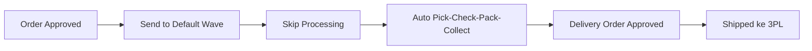

# Skip Processing — Panduan Pengguna

**Siapa yang baca panduan ini:** warehouse ops, fulfillment lead, support  
**Menu di sistem:** Omni → Skip Processing

---

## 1. Apa Itu & Kenapa Penting

Skip Processing membuat sistem **menyelesaikan sendiri** tahap gudang (picking → checking → packing → collecting) sampai order **shipped** ke kurir — tanpa kamu mengerjakan tiap menu tahap secara manual.

Pakai ini saat banyak order sudah di Default Wave dan ingin dipercepat sampai keluar gudang.

---

## 2. Overview Flow & Proses Bisnis

### Rantai proses

**Versi teks:**

1. Order di-approve lalu **dikirim ke Default Wave** (Unassign Wave atau Skip Wave Process).
2. Di **Skip Processing**, pilih order dan jalankan skip.
3. Sistem otomatis menyelesaikan tahap gudang berurutan.
4. Order masuk Delivery Order dan di-approve → status **Shipped**.

🎬 [Interactive demo akan ditambahkan di sini]

### Status tahap (warna icon)

| Warna | Artinya |
|-------|---------|
| Abu-abu | Belum / draft |
| Kuning/oranye | Sedang dikerjakan |
| Hijau | Selesai / approved |

Kalau order sudah dikerjakan sebagian secara manual, skip **melanjutkan** dari tahap berikutnya — tidak selalu dari picking.

---

## 3. Sebelum Mulai (Flow Sebelum)

Pastikan:

- Order sudah **Send to Default Wave**.
- Struktur lokasi proses gudang (pick/check/pack/ship/3PL) sudah lengkap.
- Shipper sudah terikat gudang 3PL.
- Tidak ada picking/checking/packing manual yang masih berjalan untuk order yang sama.
- Kamu login di **company pemilik** order.

🎬 [Interactive demo akan ditambahkan di sini]

---

## 4. Setelah Selesai (Flow Sesudah)

- Order sukses → **Shipped**; bisa dipantau di log (Success + nomor DO).
- Order gagal → buka Log Data → Failed → baca pesan → **Retry** (lanjut dari tahap terakhir sukses).
- Setelah shipped, kendala kirim lanjut di **Failed Ship** jika relevan.

🎬 [Interactive demo akan ditambahkan di sini]

---

## 5. Yang Perlu Diperhatikan

- Kalau order **belum** di Default Wave, order tidak muncul di list ini.
- Jangan spam klik Skip — sistem mengunci order agar tidak dobel proses.
- Sukses di hitungan batch = sampai **Shipped**, bukan hanya selesai picking.
- Order di Delivery Order yang berisi banyak order lain bisa ditolak skip.
- Progress bisa lama untuk batch besar — pantau kolom **Skip Progress**.
- Menu ini **bukan** tempat Generate Pick List biasa atau cetak resi (itu Order Process / Waves).

---

## 6. Langkah-Langkah (Step by Step)

1. Buka **Omni → Skip Processing**.
2. (Opsional) sesuaikan filter; default Data Owner = company kamu.
3. Centang satu atau banyak order.
4. Klik **Skip Processing** di toolbar.
5. Pantau **Skip Progress** sampai 100% / icon hijau.
6. Buka **Log Data** untuk cek batch: sukses vs gagal.
7. Untuk yang gagal: buka detail Failed → baca pesan → **Retry**.

🎬 [Interactive demo akan ditambahkan di sini]

---

## 7. Tips & Hal yang Sering Bikin Bingung

- **Tidak muncul di list** — kirim ke Default Wave dulu.
- **Error in progress** — selesaikan dulu pekerjaan manual di PL/CL/Packing.
- **Not Authorized** — company login salah.
- **Gagal di tengah** — cek log: sering karena lokasi virtual kurang atau shipper belum ikat 3PL.
- **Skip Wave Process vs sini** — Skip Wave = pintu upload/batch; menu ini = pilih manual yang sudah di wave.
- **Processed tapi “bukan sukses”** — seharusnya tiap order masuk Success atau Failed; kalau hilang, laporkan bug.

---

## 8. Referensi

| Butuh | Buka |
|-------|------|
| Aturan & gap QA | [requirement.md](./requirement.md) |
| Troubleshooting | [knowledge-base.md](./knowledge-base.md) |
| API, jobs, locks | [technical.md](./technical.md) |

**Related menus:** [Unassign Wave](../omni-unassign-wave/) · [Skip Wave Process](../omni-skip-wave-process/) · [Waves Management](../omni-waves-management/) · [Order Process](../omni-process-summary/) · Delivery Order · Failed Ship
