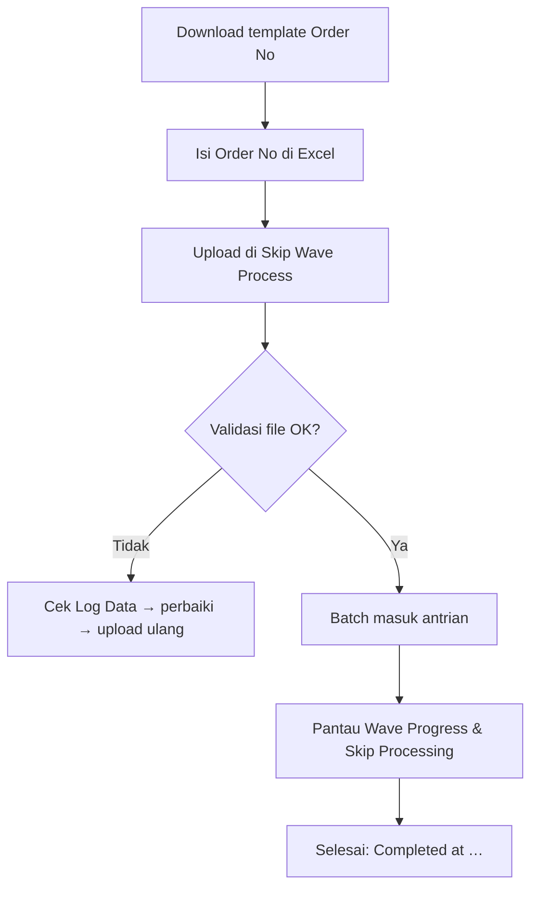

# Skip Wave Process — Knowledge Base (Operator)

**Audience:** Warehouse Operation / Fulfillment Lead, Support  
**Route:** `/omni/skip-wave-process`

---

## 1. Apa itu Skip Wave Process?

Menu ini untuk **upload daftar order** (Excel) agar sistem otomatis:

1. Mengirim order ke Default Wave, **dan**
2. Melanjutkan proses gudang sampai **shipped** (picking → checking → packing → collecting → Delivery Order)

Tanpa bolak-balik menu Unassign Wave dan Skip Processing.

---

## 2. Kapan dipakai?

| ✅ Pakai jika | ❌ Jangan harapkan jika |
|---------------|-------------------------|
| Banyak order approved yang belum masuk Default Wave | Order sudah di-wave / sudah shipped |
| Mau proses sampai shipped dalam satu batch | Ada 1 baris salah di file — **seluruh file gagal** (harus diperbaiki dulu) |
| Siap menunggu antrian jika ada batch lain yang sedang jalan | Mau pilih order dari list (menu ini khusus upload) |

---

## 3. Alur kerja standar

**Keterangan langkah:**

- **Template:** hanya 1 kolom — **Order No** (boleh kode internal atau kode platform).
- **Maksimal 1.000 order** per file.
- **All-or-nothing:** satu baris gagal = seluruh file tidak diproses. Perbaiki lalu upload ulang **seluruh** file.
- **Antrian:** boleh upload banyak file; sistem proses **satu batch** sampai selesai baru batch berikutnya.
- **Progress:** Wave Progress = sudah masuk Default Wave; Skip Processing = sudah sampai Shipped.
- **Tidak ada tombol Retry** di menu ini untuk batch gagal — perbaikan = upload ulang (retry otomatis hanya di belakang layar untuk error teknis sementara).

---

## 4. Istilah penting

| Istilah | Arti awam |
|---------|-----------|
| All-or-nothing | Satu data salah → semua di file ikut gagal |
| In Queue / Pending / Processing / Completed | Menunggu · dipilih sistem · sedang jalan · selesai |
| Batch Code | Kode satu kali upload (`SW-…`) |
| Wave Progress | Berapa order sudah masuk Default Wave |
| Skip Processing (kolom) | Berapa order sudah sampai Shipped |
| Lock | Sistem menahan agar order sama tidak diproses dua batch sekaligus |

---

## 5. Log Data

Toolbar **Log Data** membuka riwayat import:

- **Total Order Processed** `{sudah divalidasi}/{total file}` — klik untuk lihat per Order No (Success/Failed + pesan).
- **File Name** bisa didownload **maks 24 jam** sejak upload.
- Batch yang gagal validasi biasanya **tidak** muncul di list utama — cek di Log Data.

---

## 6. Troubleshooting

| Gejala | Penyebab umum | Solusi |
|--------|---------------|--------|
| Seluruh batch gagal padahal cuma 1 salah | All-or-nothing | Buka modal detail, perbaiki baris Failed, upload ulang seluruh file |
| Total Processed < total file | Validasi masih jalan | Tunggu sampai angka sama |
| Lama di Pending | Ada batch lain masih Processing | Tunggu batch aktif selesai (bisa dari company lain) |
| File tidak bisa didownload | Lewat 24 jam | Simpan salinan file sendiri sejak awal |
| Order tidak muncul di batch aktif | Sudah lanjut / sudah Shipped | Cek progress Shipped / Failed Ship |

---

## 7. FAQ

**Q: Beda dengan Skip Processing?**  
A: Skip Processing = pilih order yang **sudah** di Default Wave dari list. Skip Wave Process = **upload** order yang belum di-wave, lalu otomatis sampai shipped.

**Q: Beda dengan Unassign Wave?**  
A: Unassign Wave hanya sampai Default Wave. Menu ini lanjut otomatis ke skip sampai shipped.

**Q: Waves Management ikut?**  
A: Tidak — setelah masuk Default Wave langsung lanjut skip processing (bypass distribusi wave khusus).
