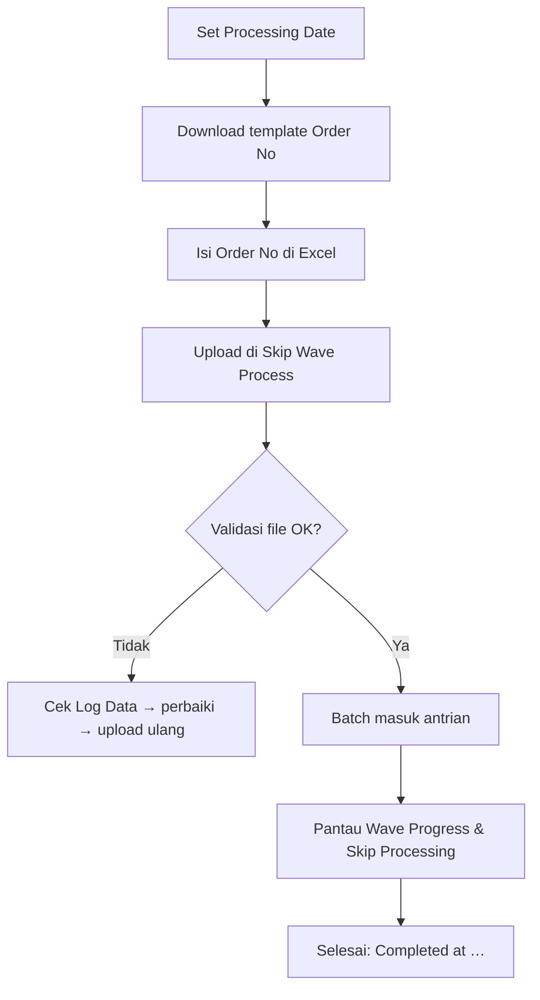

# Skip Wave Process — Knowledge Base (Operator)

**Audience:** Warehouse Operation / Fulfillment Lead, Support  
**Route:** `/omni/skip-wave-process`

---

## 1. Apa itu Skip Wave Process?

Menu ini untuk **upload daftar order** (Excel) agar sistem otomatis:

1. Mengirim order ke Default Wave, **dan**
2. Melanjutkan proses gudang sampai **shipped** (picking → checking → packing → collecting → Delivery Order)

Tanpa bolak-balik menu Unassign Wave dan Skip Processing.

---

## 2. Kapan dipakai?

| ✅ Pakai jika | ❌ Jangan harapkan jika |
|---------------|-------------------------|
| Banyak order approved yang belum masuk Default Wave | Order sudah di-wave / sudah shipped |
| Mau proses sampai shipped dalam satu batch | Ada 1 baris salah di file — **seluruh file gagal** di Import (harus diperbaiki dulu) |
| Siap menunggu antrian jika ada batch lain yang sedang jalan | Mau pilih order dari list (menu ini khusus upload) |

---

## 3. Alur kerja standar

```mermaid
flowchart TD
    A["Set Processing Date"] --> B["Download template Order No"]
    B --> C["Isi Order No di Excel"]
    C --> D["Upload di Skip Wave Process"]
    D --> E{"Validasi file OK?"}
    E -->|Tidak| F["Cek Log Data → perbaiki → upload ulang"]
    E -->|Ya| G["Batch masuk antrian"]
    G --> H["Pantau Wave Progress & Skip Processing"]
    H --> I["Selesai: Completed at …"]
```

**Keterangan langkah:**

- **Processing Date:** tanggal & jam yang dipakai sistem untuk **seluruh** proses batch (kirim wave → pick → check → pack → collect → ship, termasuk pergerakan stok). Ada di pojok kiri atas. **Kalau dikosongkan**, sistem memakai **waktu sekarang** (tanggal + jam saat upload — bukan jam 23:59:59). Nilai sama dengan menu Unassign Wave (satu company).
- **Template:** hanya 1 kolom — **Order No** (boleh kode internal atau kode platform).
- **File:** `xlsx` / `xls` / `csv`. Ukuran file mengikuti limit server (tidak ada batas khusus di menu). Maksimal **1.000 order** per file.
- **All-or-nothing (Import):** satu baris gagal screening = seluruh file tidak diproses ke datalist. Perbaiki lalu upload ulang **seluruh** file.
- **Antrian:** boleh upload banyak file; sistem proses **satu batch** sampai selesai baru batch berikutnya.
- **Progress:** Wave Progress = sudah masuk Default Wave; Skip Processing = sudah sampai Shipped.
- **Tidak ada tombol Retry** untuk batch gagal validasi import — perbaikan = upload ulang.
- **Redispatch:** kalau progress sudah hampir selesai tetapi status batch masih “Processing” lama (diam lebih dari 60 menit), gunakan **Redispatch**.
- **Setelah Completed:** sistem masih bisa sibuk menghitung stok / sync marketplace di belakang layar — itu normal.

---

## 4. Processing Date

Field date-time di **pojok kiri atas** halaman Skip Wave Process.

| Aturan | Artinya untuk operator |
|--------|------------------------|
| Satu tanggal untuk seluruh order di upload | Tidak set per Order No di Excel |
| Shared dengan Unassign Wave | Ubah di sini = ikut di menu itu |
| Field kosong | Saat upload, sistem pakai **waktu sekarang** (tanggal + jam) |
| Setelah diisi & disimpan | Sistem mengingat pilihan terakhir |
| Order lebih baru dari Processing Date | Import bisa **sukses**, tetapi order **gagal di Wave** — naikkan Processing Date lalu upload ulang |
| Tidak bisa simpan | Periode akuntansi tanggal itu sudah ditutup / tanggal di masa depan |

---

## 5. Istilah penting

| Istilah | Arti awam |
|---------|-----------|
| All-or-nothing | Satu data salah di Import → semua di file ikut gagal screening |
| In Queue / Pending / Processing / Completed | Menunggu · dipilih sistem · sedang jalan · selesai |
| Batch Code | Kode satu kali upload (`SW-…`) |
| Wave Progress | Berapa order sudah masuk Default Wave |
| Skip Processing (kolom) | Berapa order sudah sampai Shipped |
| Import Failed vs Wave Failed | Screening file gagal vs order gagal saat kirim ke wave (bisa beda penyebab) |
| Lock | Sistem menahan agar order sama tidak diproses dua batch sekaligus |

---

## 6. Log Data

Toolbar **Log Data** membuka riwayat:

### Import Logs

- **Total Order Processed** `{sudah divalidasi}/{total file}` — klik untuk lihat per Order No (Success/Failed + pesan).
- **Status Success** = semua baris lolos screening → batch muncul di list utama.
- **Status Failed** = ada baris bermasalah → batch **tidak** muncul di list utama; perbaiki file.
- **File Name** bisa didownload **maks 24 jam** sejak upload.
- Contoh pesan screening: Order not found · Duplicate · different company · Invalid transaction status · Invalid wave status · lock batch lain.

### Audit Log

Riwayat perubahan data user (termasuk ubah Processing Date).

---

## 7. Troubleshooting

| Gejala | Penyebab umum | Solusi |
|--------|---------------|--------|
| Seluruh batch gagal padahal cuma 1 salah | All-or-nothing Import | Buka modal detail, perbaiki baris Failed, upload ulang seluruh file |
| Import Success tapi Wave Failed (pesan Processing Date) | Trx date order lebih baru dari Processing Date | Naikkan Processing Date ≥ trx date order, lalu upload ulang |
| Total Processed < total file | Validasi masih jalan | Tunggu sampai angka sama |
| Lama di Pending / In Queue | Ada batch lain masih Processing | Tunggu batch aktif selesai (bisa dari company lain) |
| Progress hampir penuh, status masih Processing lama | Penutup otomatis batch tidak jalan | Diam > 60 menit → **Redispatch**; jika gagal, eskalasi Support/DevOps |
| Layar Completed tapi sistem masih lambat | Pekerjaan hitung stok / sync masih mengantre | Jeda upload batch besar berikutnya |
| File tidak bisa didownload | Lewat 24 jam | Simpan salinan file sendiri sejak awal |
| Tidak bisa ubah Processing Date | Periode akuntansi tertutup / tanggal future | Pilih tanggal di periode terbuka, tidak di masa depan |
| Order lama gagal padahal stok baru ada | Tanggal processing masih sebelum stok ready | Set **Processing Date** ke tanggal stok ready lalu upload ulang |

---

## 8. FAQ

**Q: Beda dengan Skip Processing?**  
A: Skip Processing = pilih order yang **sudah** di Default Wave dari list. Skip Wave Process = **upload** order yang belum di-wave, lalu otomatis sampai shipped.

**Q: Beda dengan Unassign Wave?**  
A: Unassign Wave hanya sampai Default Wave. Menu ini lanjut otomatis ke skip sampai shipped. Keduanya share **Processing Date**.

**Q: Waves Management ikut?**  
A: Tidak — setelah masuk Default Wave langsung lanjut skip processing.

**Q: Processing Date diubah kolega — kenapa ikut berubah?**  
A: Nilai per company, bukan per user.

**Q: Field Processing Date kosong — jamnya jadi apa?**  
A: Sistem pakai **waktu sekarang** saat upload (tanggal + jam), bukan 23:59:59.

**Q: Progress penuh tapi status batch tidak Completed?**  
A: Coba **Redispatch** setelah batch diam lebih dari 60 menit.

**Q: Ada panduan antrean job untuk Support/DevOps?**  
A: Ya — lihat dokumentasi [Horizon Jobs — Skip Wave pipeline](../horizon-jobs/pipelines/skip-wave-process.md) atau [Horizon Jobs KB](../horizon-jobs/knowledge-base.md).
