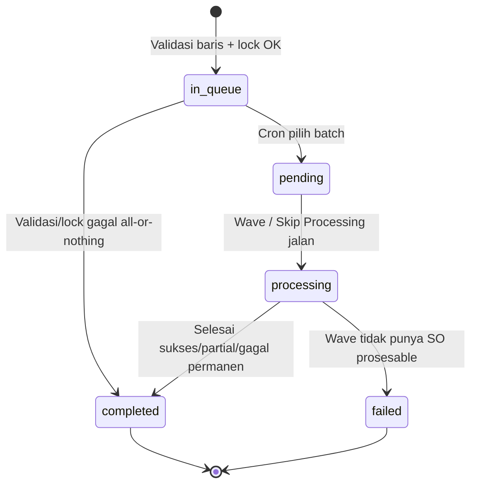
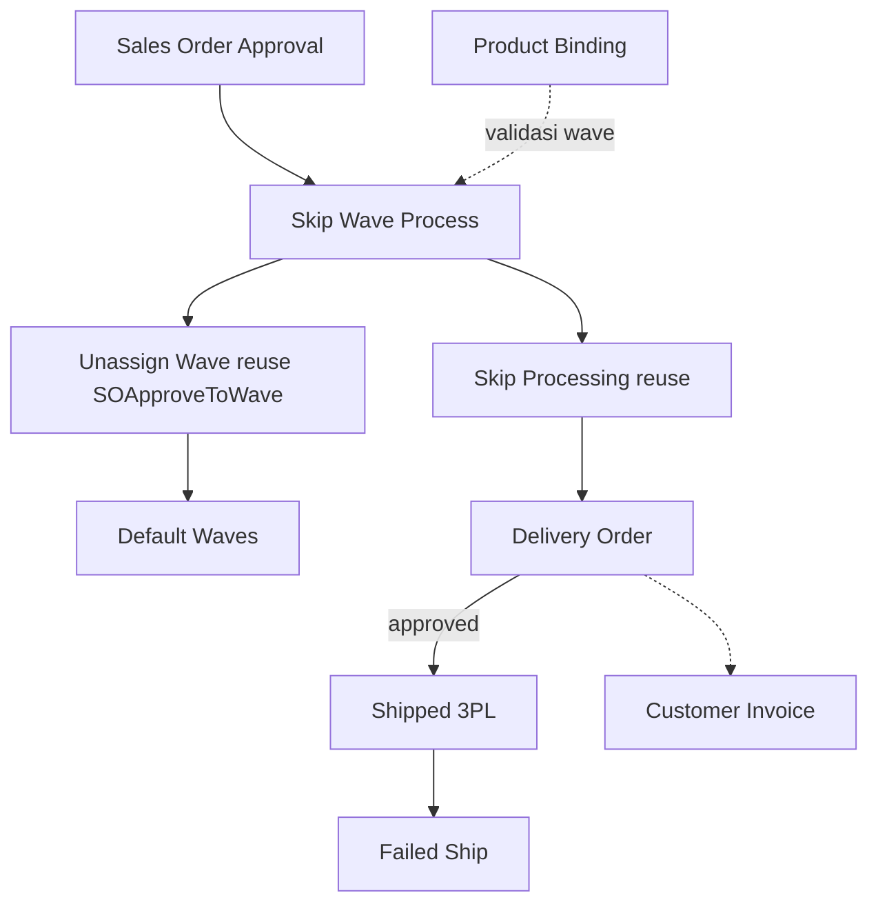

# Skip Wave Process — Requirement Documentation

**Modul:** SupplyChain / OmniChannel  
**Prefix:** `SW-` (Skip Wave gaps)  
**Audience:** PM, Warehouse Ops, QA  
**UI route:** `/omni/skip-wave-process`  
**SoT:** `skip-wave-process-sot.md` v1.0 (20 Jul 2026)

Related: [Unassign Wave](../omni-unassign-wave/requirement.md) · [Skip Processing](../omni-skip-processing/requirement.md)

---

## 0. Metadata & Changelog

| Version | Date | Author | Changes |
|---------|------|--------|---------|
| 1.0 | 2026-07-20 | QA - Yemima | Initial 5-file dari SoT v1.0 + verifikasi ImportJob/cron/gaps SW-01…05 |

---

## 1. Ringkasan Eksekutif

Skip Wave Process adalah menu **upload Excel** yang menggabungkan **Send to Default Wave** (setara Unassign Wave) dan **Skip Processing** (picking → checking → packing → collecting → DO Approved / Shipped) dalam satu batch. Operator cukup upload daftar Order No — tidak perlu bolak-balik dua menu untuk ratusan–ribuan order.

| Kebutuhan | Jawaban |
|-----------|---------|
| Bulk send wave + skip sampai shipped | Satu upload → pipeline 2 fase |
| Pantau batch | Datalist Wave Progress / Skip Processing + ETA |
| Audit import | Log Data + modal detail per Order No |
| Cegah race antar batch | Sequenced queue + lock per SO |

### 1.1 Rantai proses

---

## 2. Prasyarat

| Prasyarat | Sumber | Catatan |
|-----------|--------|---------|
| Excel template header `Order No` | Template Import | 1 kolom saja |
| Status approved atau processed | Sales Order | Selain itu ditolak baris |
| `unassign_wave_status` ∈ {not in queue, in queue} | SO / Unassign Wave | Sudah processed tidak eligible |
| Milik company login | Sales Order | — |
| Order No unik dalam file | File | Duplikat ditolak |
| WH virtual tree lengkap + shipper↔3PL | Master / Binding | Prasyarat fase Skip Processing |
| Tidak ada batch SW lain `pending`/`processing` | Skip Wave Process | Batch baru menunggu — GAP-SW-02 scope global |

---

## 3. Siklus Status (batch)

| Status | Kondisi | UI |
|--------|---------|-----|
| **In Queue** | Lolos validasi + lock; menunggu cron | Tidak ada aksi manual |
| **Pending** | Dipilih cron (tidak ada batch aktif lain) | — |
| **Processing** | Fase wave/processing async | Progress count + ETA realtime |
| **Completed** | Terminal (sukses/partial/gagal import) | “Completed at” timestamp |
| **Failed** | Terminal — wave tidak menemukan SO | Cek Log Data |

Status per-order di upload detail (Success/Failed) = label hasil, bukan FSM batch.

---

## 4. Datalist

### 4.1 Utama (`is_eligible = 1`)

| Kolom | Keterangan |
|-------|------------|
| Batch Code | `SW-…` + subline status / progress % / ETA |
| Total Order | Expected dari file (baris − header) |
| Wave Progress | `{processed}/{total}` klikable → log Unassign Wave (`WV-`) |
| Wave Details | Success / Failed / Retried |
| Skip Processing | `{shipped}/{total}` klikable → log Skip Processing (`SP-`) |
| Processing Details | Picked…Shipped Success/Failed + Total DO |
| Created By / At | Upload user & waktu |

### 4.2 Fitur

Global Search · Column Show/Hide · Export advanced · **Import** (download template + upload).

### 4.3 Log Data — Import Logs

| Kolom | Keterangan |
|-------|------------|
| Batch Code | `SW-…` |
| Total Order Processed | `{actual}/{expected}` klikable → modal detail |
| Status | Failed jika ada detail failed; Success jika semua sukses |
| Message | Ringkasan import |
| File Name | Download max 24 jam |
| Uploaded By / At | — |

**Modal detail:** judul `Skip Wave Process Details (…): {batch}` · kartu Total/Success/Failed · kolom Order No \| Trx Date · Status · Message. Search + Export di slideover.

---

## 5. Form & Field

Bukan form transaksi — upload saja.

| Field | Wajib? | Validasi | Catatan |
|-------|--------|----------|---------|
| File Import | Ya | xlsx/xls/csv; header Order No; ≥1 data; ≤1000 baris | Template 1 kolom |
| Order No (isi file) | Ya | Found, unik, company, approved/processed, wave unassigned | Banyak baris |

---

## 6. How It Works

### 6.1 Stage 1 — Import & validasi

Upload → pre-check file (sync) → `SkipWaveProcessImportJob` (async): validasi baris (exist, duplikat, company, tx status, wave status) → tulis detail → all-or-nothing → lock SO → set `is_eligible`.

Validasi bisnis Unassign Wave (bundle, stock, binding, COA, harga) jalan di **fase wave**, bukan stage 1 — GAP-SW-01.

**All-or-nothing:** 1 baris gagal → seluruh batch `completed`, tidak dispatch stage 2.

### 6.2 Antrian batch

Upload banyak file OK; eksekusi **1 batch aktif** (`pending`/`processing`) pada satu waktu. Berikutnya mulai setelah completed. Scope AS-IS **global** lintas company — GAP-SW-02.

Cron `skip-wave:dispatch` tiap menit memicu `SkipWaveProcessJob` untuk `in_queue` + eligible. ImportJob **tidak** langsung dispatch wave.

### 6.3 Stage 2 — Wave + Skip Processing

1. Send to Default Wave (`SOApproveToWave`, log `WV-`)  
2. Picking → Checking → Packing → Collecting (grouping shipper)  
3. DO per kelompok shipper → approve → Shipped (`SP-` logs)

Reuse job/log Unassign Wave + Skip Processing. Waves Management **dilewati** (langsung processing setelah Default Wave).

### 6.4 Trx date transfer

**AS-IS:** basis waktu eksekusi + interval 10 detik antar dokumen.  
**TO-BE:** basis trx date order + 10 menit, interval 10 detik tetap — GAP-SW-05.

---

## 7. Validasi

### 7.1 File (F1–F4)

Empty/invalid · header ≠ Order No · no data rows · >1000 rows — pesan lihat SoT §7.1 / katalog technical.

### 7.2 Per baris (R1–R5)

Not found · Duplicate · Different company · Invalid tx status · Invalid wave status (Must be Unassigned).

### 7.3 All-or-nothing (AO1–AO2)

Baris gagal ATAU lock conflict → batch completed, tidak stage 2; lock dilepas jika conflict.

### 7.4 Antrian (Q1–Q2)

Ada batch aktif → baru tetap `in_queue`. Tidak ada → tertua eligible mulai.

### 7.5 Stage 2 (ringkas)

WH virtual kurang · shipper tanpa 3PL · PL/CL/Packing in progress · Void — ikut aturan Skip Processing.

---

## 8. Relasi Menu Lain

| Menu | Peran |
|------|-------|
| Unassign Wave / Skip Processing | Reuse job + log |
| Waves Management | Bypass distribusi |
| Binding / Product Binding | Prasyarat stage 2 / wave |
| Delivery Order / Failed Ship / CI | Hilir |

---

## 9. Gap Registry

| ID | Deskripsi | Status |
|----|-----------|--------|
| GAP-SW-01 | Bisnis harap partial continue; AS-IS all-or-nothing | Open |
| GAP-SW-02 | Antrian global lintas company | Open |
| GAP-SW-03 | Sequencing batch sudah ada | Resolved |
| GAP-SW-04 | Completed At + ETA sudah ada | Resolved |
| GAP-SW-05 | Trx date transfer masih basis eksekusi, bukan order+10m | Open |

---

## 10. FAQ

**Q: 1 Order No salah = seluruh gagal?** Ya — all-or-nothing; perbaiki + upload ulang.  
**Q: Upload banyak file?** Boleh; diproses berurutan.  
**Q: Total Order Processed < total file?** Validasi background masih jalan.  
**Q: Download file?** Max 24 jam.  
**Q: Lama pending?** Ada batch aktif lain (mungkin company lain — GAP-SW-02).  
**Q: Shipped bermasalah?** Lanjut Failed Ship.

---

## 11. Changelog (file)

| Version | Date | Changes |
|---------|------|---------|
| 1.0 | 2026-07-20 | Dari SoT v1.0 ke qa-docs-standard |
