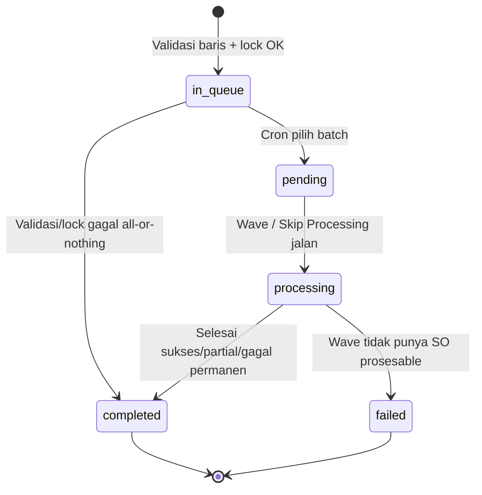
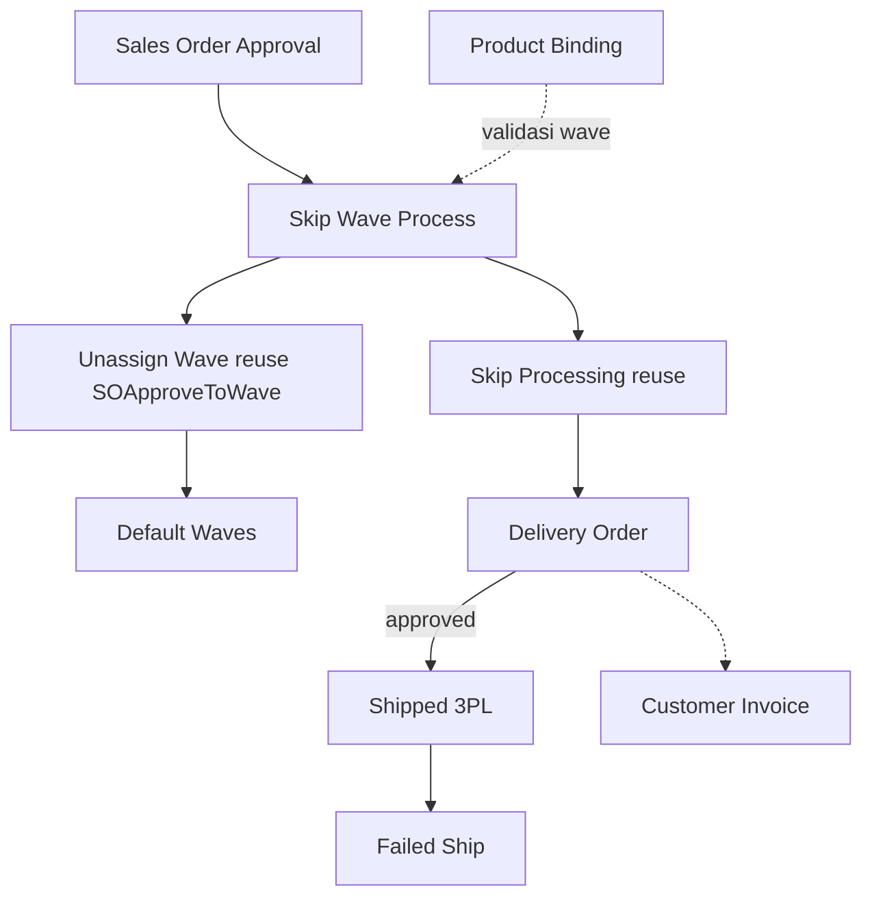

# Skip Wave Process — Requirement Documentation

**Modul:** SupplyChain / OmniChannel  
**Prefix:** `SW-` (Skip Wave gaps)  
**Audience:** PM, Warehouse Ops, QA  
**UI route:** `/omni/skip-wave-process`  
**SoT:** `skip-wave-process-sot.md` v1.0 (20 Jul 2026)

Related: [Unassign Wave](../omni-unassign-wave/requirement.md) · [Skip Processing](../omni-skip-processing/requirement.md) · [Horizon Jobs — Skip Wave pipeline](../horizon-jobs/pipelines/skip-wave-process.md)

---

## 0. Metadata & Changelog

| Version | Date | Author | Changes |
|---------|------|--------|---------|
| 1.4 | 2026-09-28 | QA - Yemima | Processing Date AS-IS: arti trx/stock, default kosong=`now()`, order trx > date = gagal Wave (bukan Import); export columns; file size = limit server |
| 1.2 | 2026-09-20 | QA - Yemima | Rujuk Horizon jobs pipeline; status macet / Redispatch; DO inline; kurangi nama class di How It Works |
| 1.1 | 2026-07-28 | QA - Yemima | TO-BE Processing Order Date per company (shared Unassign Wave); supersede GAP-SW-05 order+10m |
| 1.0 | 2026-07-20 | QA - Yemima | Initial 5-file dari SoT v1.0 + verifikasi ImportJob/cron/gaps SW-01…05 |

---

## 1. Ringkasan Eksekutif

Skip Wave Process adalah menu **upload Excel** yang menggabungkan **Send to Default Wave** (setara Unassign Wave) dan **Skip Processing** (picking → checking → packing → collecting → DO Approved / Shipped) dalam satu batch. Operator cukup upload daftar Order No — tidak perlu bolak-balik dua menu untuk ratusan–ribuan order.

| Kebutuhan | Jawaban |
|-----------|---------|
| Bulk send wave + skip sampai shipped | Satu upload → pipeline 2 fase |
| Pantau batch | Datalist Wave Progress / Skip Processing + ETA |
| Audit import | Log Data + modal detail per Order No |
| Cegah race antar batch | Sequenced queue + lock per SO |

### 1.1 Rantai proses

```mermaid
flowchart LR
    Upload[Upload Excel Order No] --> Stage1[Validasi Eligibility]
    Stage1 --> Wave[Send to Default Wave]
    Wave --> Processing[Skip Processing]
    Processing --> DO[Delivery Order Approved]
    DO --> Shipped[Status Shipped]
```

---

## 2. Prasyarat

| Prasyarat | Sumber | Catatan |
|-----------|--------|---------|
| Excel template header `Order No` | Template Import | 1 kolom saja |
| Status approved atau processed | Sales Order | Selain itu ditolak baris |
| `unassign_wave_status` ∈ {not in queue, in queue} | SO / Unassign Wave | Sudah processed tidak eligible |
| Milik company login | Sales Order | — |
| Order No unik dalam file | File | Duplikat ditolak |
| WH virtual tree lengkap + shipper↔3PL | Master / Binding | Prasyarat fase Skip Processing |
| Tidak ada batch SW lain `pending`/`processing` | Skip Wave Process | Batch baru menunggu — GAP-SW-02 scope global |

---

## 3. Siklus Status (batch)

```mermaid
stateDiagram-v2
    [*] --> in_queue: Validasi baris + lock OK
    in_queue --> completed: Validasi/lock gagal all-or-nothing
    in_queue --> pending: Cron pilih batch
    pending --> processing: Wave / Skip Processing jalan
    processing --> completed: Selesai sukses/partial/gagal permanen
    processing --> failed: Wave tidak punya SO prosesable
    failed --> [*]
    completed --> [*]
```

| Status | Kondisi | UI |
|--------|---------|-----|
| **In Queue** | Lolos validasi + lock; menunggu cron | Tidak ada aksi manual |
| **Pending** | Dipilih cron (tidak ada batch aktif lain) | — |
| **Processing** | Fase wave/processing async | Progress count + ETA realtime |
| **Completed** | Terminal (sukses/partial/gagal import) | “Completed at” timestamp |
| **Failed** | Terminal — wave tidak menemukan SO | Cek Log Data |

Status per-order di upload detail (Success/Failed) = label hasil, bukan FSM batch.

---

## 4. Datalist

### 4.1 Utama (`is_eligible = 1`)

| Kolom | Keterangan |
|-------|------------|
| Batch Code | `SW-…` + subline status / progress % / ETA |
| Total Order | Expected dari file (baris − header) |
| Wave Progress | `{processed}/{total}` klikable → log Unassign Wave (`WV-`) |
| Wave Details | Success / Failed / Retried |
| Skip Processing | `{shipped}/{total}` klikable → log Skip Processing (`SP-`) |
| Processing Details | Picked…Shipped Success/Failed + Total DO |
| Created By / At | Upload user & waktu |

### 4.2 Fitur

| Fitur | Perilaku |
|-------|----------|
| **Processing Date** | Date-time picker di **pojok kiri atas**. Shared per company dengan Unassign Wave (dan tampil readonly di Skip Processing). Lihat §5.1 |
| Global Search · Column Show/Hide | Standar |
| **Export** | Export baris datalist eligible. Kolom Excel: `BATCH CODE` · `TOTAL ORDERS` · `ORDERS` · `WAVE PROGRESS (%)` · `PROCESSING PROGRESS (%)` · `PICKED` + ref · `CHECKED` + ref · `PACKED` + ref · `COLLECTED` + ref · `SHIPPED` + ref · `TOTAL DO` · `DO NUMBERS` · `CREATED BY` · `CREATED AT` |
| **Import** | Download template (1 kolom **Order No**) + upload `xlsx` / `xls` / `csv`. **Tidak ada** batas ukuran file di validasi menu — mengikuti limit server/PHP. Maks **1.000** baris data |

### 4.3 Log Data — Import Logs

| Kolom | Keterangan |
|-------|------------|
| Batch Code | `SW-…` — dipakai fase berikutnya jika screening sukses |
| Total Order Processed | `{actual}/{expected}` klikable → modal detail per Order No |
| Status | **Failed** jika ≥1 baris gagal screening; **Success** jika semua valid |
| Message | Ringkasan grouping: Success / Failed partial count + arahkan ke detail; lock conflict; incomplete count |
| File Name | Re-download max **24 jam** sejak upload |
| Uploaded By / At | User & waktu upload |

**All-or-nothing:** jika screening gagal, batch **tidak** muncul di datalist utama (`is_eligible=false`) — revisi file lalu upload ulang.

**Modal detail:** judul `Skip Wave Process Details (…): {batch}` · kartu Total/Success/Failed · kolom Order No \| Trx Date · Status · Message. Search + Export di slideover.

**Tab Audit Log:** riwayat perubahan (termasuk ubah Processing Date company).

---

## 5. Form & Field

Bukan form transaksi order — upload + setting tanggal processing.

| Field | Wajib? | Validasi | Catatan |
|-------|--------|----------|---------|
| **Processing Date** | Opsional di UI (boleh clear) | Date-time valid; tidak future; fiscal period open | Per company; shared Unassign Wave — §5.1. Kosong saat upload → sistem pakai **`now()`** (tanggal **dan** jam saat itu) |
| File Import | Ya | xlsx/xls/csv; header Order No; ≥1 data; ≤1000 baris | Ukuran file: **tidak** dibatasi di validasi menu |
| Order No (isi file) | Ya | Found, unik, company, approved/processed, wave unassigned | Banyak baris |

### 5.1 Processing Date (AS-IS)

| Aturan | Detail |
|--------|--------|
| Scope | Per company; **satu nilai** untuk Skip Wave Process, Unassign Wave, dan tampilan readonly Skip Processing |
| UI | Pojok kiri atas list; placeholder *Default to current time*; boleh clear |
| Jika kosong / belum di-set | Saat upload batch, `processing_date` batch = **`now()`** — **tanggal dan jam saat ini**, bukan jam 23:59:59 |
| Persist | Setelah user simpan nilai → dipakai upload berikutnya sampai diubah/di-clear lagi |
| Pemakaian | **Semua** order di batch memakai tanggal batch ini untuk kirim wave + pick/check/pack/collect/ship (termasuk pergerakan stok) — **bukan** tanggal order individual di Excel |
| Order trx **lebih baru** dari Processing Date | **Bukan** ditolak di Import Logs. Order bisa Import Success & masuk datalist, lalu **gagal di fase Wave** dengan pesan: *The Processing Date must be on or after the Sales Order transaction date.* (lihat Wave Progress / log `WV-`) |
| Fiscal | Tolak simpan setting jika period closed/locked |

**Contoh (stok terlambat):** Order trx 27 Jul, stok ready 28 Jul → set Processing Date = 28 Jul (atau setelahnya) → upload → batch bisa lanjut.

**Contoh (order lebih baru dari Processing Date):** Processing Date = 20 Sep 10:00, Order No dengan trx 28 Sep → Import bisa Success → Wave Failed untuk order itu (bukan Import Failed).

---

## 6. How It Works

### 6.1 Stage 1 — Import & validasi

Upload → pre-check file (sinkron di request) → **job import** (async): validasi baris (exist, duplikat, company, tx status, wave status) → tulis detail → all-or-nothing → kunci order → set eligible.

Validasi bisnis Unassign Wave (bundle, stock, binding, COA, harga) jalan di **fase wave**, bukan stage 1 — GAP-SW-01.

**All-or-nothing:** 1 baris gagal → seluruh batch `completed`, tidak lanjut stage 2.

### 6.2 Antrian batch

Upload banyak file OK; eksekusi **1 batch aktif** (`pending`/`processing`) pada satu waktu. Berikutnya mulai setelah completed. Scope AS-IS **global** lintas company — GAP-SW-02.

Scheduler tiap menit memicu **orkestrator wave** untuk batch `in_queue` + eligible. Job import **tidak** langsung memicu wave.

### 6.3 Stage 2 — Wave + Skip Processing

1. Kirim ke Default Wave (**satu pekerjaan antrean per order**, log `WV-`)  
2. Picking → Checking → Packing → Collecting  
3. **Shipping / DO:** buat + approve Delivery Order **inline** per order di tahap shipping (bukan fase job create/approve DO terpisah yang aktif) → Shipped (log `SP-`)

Reuse jalur Unassign Wave + Skip Processing. Waves Management **dilewati** (langsung processing setelah Default Wave).

Detail fan-out Horizon (primary ≈ 1.102 job / 1.000 order, job turunan, path DO lama tidak aktif): [horizon-jobs/pipelines/skip-wave-process.md](../horizon-jobs/pipelines/skip-wave-process.md).

### 6.3a Status macet & Redispatch

Jika progress Wave / Skip Processing sudah hampir penuh tetapi status batch tetap `processing` lama, gerbang (§6.2) menahan seluruh antrean. AS-IS: tombol **Redispatch** tersedia bila batch diam lebih dari **60 menit** (lanjut fase yang belum selesai). Penutup normal bergantung callback antrean grup — lihat pipeline Horizon § Failure / Observasi.

### 6.4 Tanggal processing (Processing Date)

| Era | Perilaku |
|-----|----------|
| Lama (sebelum improvement) | Sebagian path basis eksekusi / `now`; PL skip process memakai `SO.transaction_date + 10 menit`; cascade dokumen berikutnya `+10 detik` |
| GAP-SW-05 (superseded) | Basis order + 10 menit — **digantikan** |
| **AS-IS sekarang** | Basis = **Processing Date** batch (dari setting company saat upload, atau **`now()`** jika setting kosong). Interval **+10 detik** antar dokumen transfer dalam rantai skip **tetap**. Order trx > Processing Date → gagal di **Wave** (POD3), bukan Import |

---

## 7. Validasi

### 7.1 File (F1–F4)

Empty/invalid · header ≠ Order No · no data rows · >1000 rows — pesan lihat SoT §7.1 / katalog technical.

### 7.2 Per baris (R1–R5)

Not found · Duplicate · Different company · Invalid tx status · Invalid wave status (Must be Unassigned).

### 7.3 All-or-nothing (AO1–AO2)

Baris gagal ATAU lock conflict → batch completed, tidak stage 2; lock dilepas jika conflict.

### 7.4 Antrian (Q1–Q2)

Ada batch aktif → baru tetap `in_queue`. Tidak ada → tertua eligible mulai.

### 7.5 Stage 2 (ringkas)

WH virtual kurang · shipper tanpa 3PL · PL/CL/Packing in progress · Void — ikut aturan Skip Processing. Tanggal processing = company Processing Order Date.

### 7.6 Processing Date (POD1–POD3)

| # | Kondisi | Behavior |
|---|---------|----------|
| POD1 | Simpan tanggal di fiscal closed/locked / future | Tolak; nilai lama tetap |
| POD2 | Stage 2 send/skip | Semua SO batch pakai `processing_date` batch (dari setting atau `now()` saat upload) |
| POD3 | SO `transaction_date` > Processing Date batch | Import tetap bisa Success; **gagal di Wave** (bukan status Import Failed) |

---

## 8. Relasi Menu Lain

```mermaid
flowchart TB
    SOApprove[Sales Order Approval] --> SkipWave[Skip Wave Process]
    SkipWave --> UW[Unassign Wave reuse SOApproveToWave]
    UW --> DefaultWave[Default Waves]
    SkipWave --> SP[Skip Processing reuse]
    SP --> DO[Delivery Order]
    DO -->|approved| SHIP[Shipped 3PL]
    SHIP --> FS[Failed Ship]
    ProductBinding[Product Binding] -.validasi wave.-> SkipWave
    DO -.-> CI[Customer Invoice]
```

| Menu | Peran |
|------|-------|
| Unassign Wave / Skip Processing | Reuse job + log |
| Waves Management | Bypass distribusi |
| Binding / Product Binding | Prasyarat stage 2 / wave |
| Delivery Order / Failed Ship / CI | Hilir |

---

## 9. Gap Registry

| ID | Deskripsi | Status |
|----|-----------|--------|
| GAP-SW-01 | Bisnis harap partial continue; AS-IS all-or-nothing | Open |
| GAP-SW-02 | Antrian global lintas company | Open |
| GAP-SW-03 | Sequencing batch sudah ada | Resolved |
| GAP-SW-04 | Completed At + ETA sudah ada | Resolved |
| GAP-SW-05 | Trx date transfer order+10m | **Superseded** oleh Processing Order Date (§5.1 / §6.4) |

---

## 10. FAQ

**Q: 1 Order No salah = seluruh gagal?** Ya — all-or-nothing; perbaiki + upload ulang.  
**Q: Upload banyak file?** Boleh; diproses berurutan.  
**Q: Total Order Processed < total file?** Validasi background masih jalan.  
**Q: Download file?** Max 24 jam.  
**Q: Lama pending?** Ada batch aktif lain (mungkin company lain — GAP-SW-02).  
**Q: Progress penuh tapi status masih Processing?** Kemungkinan penutup batch tidak jalan — coba **Redispatch** jika diam lebih dari 60 menit; detail di [horizon-jobs pipeline](../horizon-jobs/pipelines/skip-wave-process.md).  
**Q: Completed di layar tapi server masih sibuk?** Job turunan (stok/audit/sync) bisa masih mengantre setelah status completed.  
**Q: Shipped bermasalah?** Lanjut Failed Ship.  
**Q: Processing Date ikut Unassign Wave?** Ya — satu setting per company.  
**Q: Field Processing Date kosong?** Saat upload, sistem pakai **waktu sekarang** (`now()`), termasuk jam — bukan 23:59:59.  
**Q: Order stok terlambat dari tanggal order?** Set Processing Date ke tanggal stok ready, lalu upload.  
**Q: Order trx lebih baru dari Processing Date — kenapa Import Success tapi Wave Failed?** Rule tanggal dicek di fase Wave, bukan screening Import. Naikkan Processing Date lalu upload ulang / redispatch sesuai prosedur.

---

## 11. Changelog (file)

| Version | Date | Changes |
|---------|------|---------|
| 1.4 | 2026-09-28 | Processing Date AS-IS (`now()`, Wave fail POD3); export columns; file size server-limit |
| 1.2 | 2026-09-20 | Link Horizon jobs; DO inline; Redispatch / status macet; How It Works tanpa nama class |
| 1.1 | 2026-07-28 | Processing Order Date; GAP-SW-05 superseded |
| 1.0 | 2026-07-20 | Dari SoT v1.0 ke qa-docs-standard |
