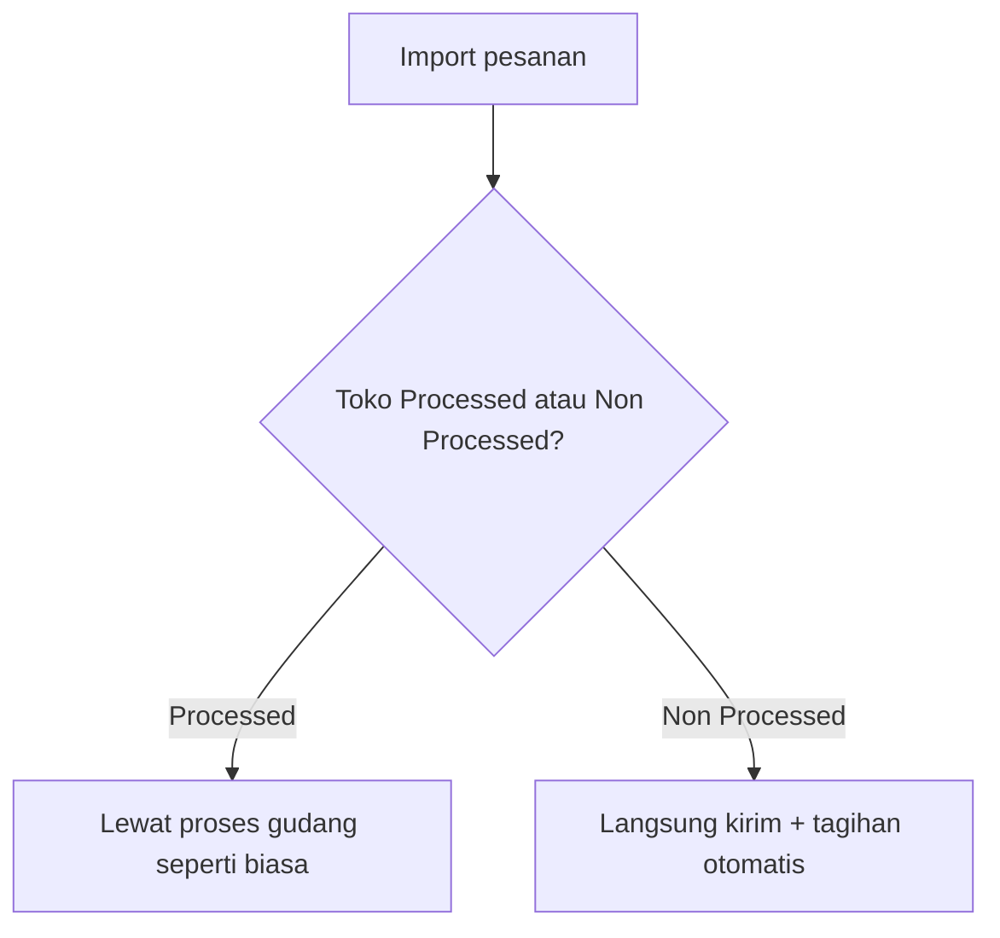

# Store — Knowledge Base

> **Status: REVIEW** — v2.1 (2026-07-22) menambahkan penjelasan **Fulfillment Mode** (§4.6) — fitur ini masih dalam tahap penyiapan, belum aktif di sistem. Konten SOP operator lain (v2.0, 2026-06-25) tetap berlaku.

## 1. Apa itu Store?

Menu **Store** (`/omni/store-binding`) adalah master data toko Omni Channel. Operator mendaftarkan toko Shopee, Lazada, TikTok Shop, atau tipe **Others** (offline/POS), menghubungkannya ke platform via **OAuth authorize**, mengatur gudang proses/stok, COA penjualan, dan memicu sync warehouse / produk / order.

Store adalah **prasyarat** sebelum Manage Platform Product, sync order platform, wave fulfillment, dan Instant Settlement berjalan normal.

### Dua tipe store

| Tipe | Kapan dipakai | Authorize? |
|------|---------------|------------|
| **Platform** | Shopee, Lazada, TikTok | Ya — OAuth wajib |
| **Others** | Offline, POS, Sales Order General | Tidak — setup manual |

> **Catatan:** Tokopedia masih ada untuk store lama, tetapi **tidak bisa dibuat baru** dari form Create (hidden di UI).

## 2. Glosarium

| Istilah | Arti |
|---------|------|
| Store Binding | Registrasi toko internal (`omni_stores`) terhubung ke marketplace |
| Authorize / OAuth | Redirect ke platform untuk token API |
| Authorization Status | Authorized (hijau) atau Unauthorized (merah) |
| Setup Incomplete | Konfigurasi belum lengkap (COA, cash/bank, WH, dll.) |
| Store Outdated | Token OAuth expired — perlu re-authorize |
| Auto Sync Order | `auto_download` — pull order otomatis tiap **5 menit** |
| Auto Sync Product | `sync_product` — pull produk otomatis tiap **1 jam** |
| Building Process | Default warehouse proses order (Level 19) |
| Building Stock | Warehouse acuan stok sync ke platform (Level 19, Show in Store aktif) |
| Show in Store | Toggle di Master Warehouse (`include_ats`) — wajib ON agar WH muncul di Building Stock |
| Product Sync % | Progress sync produk awal; hijau jika ≥97% |
| Can Sync Order | Ya jika product sync ≥97% (`initial_sync_product_completed`) |
| Product Onboarding | Antrian sync otomatis: Waiting → In Progress → Completed |
| Fulfillment Mode *(segera hadir)* | Pengaturan toko: **Processed** (pesanan lewat proses gudang) atau **Non Processed** (pesanan langsung kirim tanpa proses gudang) |

## 3. Yang Bisa / Tidak Bisa Dilakukan

### Bisa

- Create store baru (platform atau Others)
- Authorize store platform via OAuth (Shopee, Lazada, TikTok)
- Edit informasi, logo, tagging, pickup time, pricelist category
- Bind warehouse process & stock; atur COA dan cash/bank
- Trigger sync warehouse, product, order (per store atau bulk)
- Lihat log sync warehouse, order, dan audit trail
- Aktifkan kolom tersembunyi (Product Onboarding, Default Owner, dll.) via column manager

### Tidak Bisa

- **Import** create/update store dari Excel/CSV — tidak ada fitur ini di menu Store
- Authorize store **Others**
- Re-authorize jika sudah Authorized tanpa proses deauth/refresh token
- Hapus store yang masih dipakai transaksi aktif
- Sync order manual sebelum Product Sync % mencapai **97%**
- Sync warehouse/product/order jika store **Unauthorized**
- Create store Tokopedia baru (hidden di form)

## 4. Cara Pakai (How-To)

### 4.1 Daftarkan toko platform baru

1. **Omni Channel → Store → Create**
2. Pilih platform, isi **Store Name** (wajib)
3. **TikTok Shop:** isi **Store Code** (Store ID marketplace) — wajib
4. Save → sistem buka tab OAuth marketplace (Shopee/Lazada/TikTok)
5. Login & approve di platform → kembali ke OlshopERP (notifikasi sukses/error)
6. Buka detail store → lengkapi **COA**, **Cash/Bank**, **Building Process/Stock**
7. Sync produk awal berjalan **otomatis** (antrian onboarding) — pantau **Product Sync %** dan **Product Onboarding**
8. Setelah **Can Sync Order = Yes** (≥97%), order bisa di-sync otomatis/manual

### 4.2 Daftarkan toko Others (offline/POS)

1. Create → pilih channel **Others**
2. Lengkapi nama, COA, cash/bank, **Default Building Process** (wajib untuk active)
3. Tidak perlu authorize — langsung bind warehouse & gunakan untuk SO General / POS

### 4.3 Atur gudang

| Field | Level | Prasyarat |
|-------|-------|-----------|
| Default Building Process | 19 | Warehouse Settings: Outrack, Scrap, Return dikonfigurasi |
| Building Stock | 19 | Toggle **Show in Store** aktif di Master Warehouse |

Jika warehouse tidak muncul di dropdown → buka **Supply Chain → Warehouse**, aktifkan **Show in Store**, atau konfigurasi di **Warehouse Settings** (`/supplychain/setting`).

### 4.4 Atur COA

| Field | Untuk apa |
|-------|-----------|
| Account Receivable COA | Piutang Sales Invoice order **platform** (store = "customer") |
| Cash/Bank Receiving | Penerimaan AR saat **Approve Instant Settlement** — **wajib** |
| Customer's Deposit COA | Kelebihan bayar AR → Credit Note |

### 4.5 Sync manual

| Tombol | Lokasi | Kapan bisa diklik |
|--------|--------|-------------------|
| **Product** | Form → Synchronization | Authorized + tidak ada job lock |
| **Order** | Form → Synchronization | Authorized + Can Sync Order = Yes |
| **Warehouse** | Form → Synchronization | Authorized |
| **Bulk Sync Product/SO** | DataList toolbar | Multi-select store authorized |

Tombol disabled (loading) saat job sync sedang berjalan — tunggu sampai selesai.

### 4.6 Fulfillment Mode — cara pesanan diproses (segera hadir)

> **Catatan:** Fitur ini masih disiapkan, belum aktif — bagian ini menjelaskan rencana cara kerjanya.

Setiap toko akan punya pengaturan **Fulfillment Mode**: apakah pesanannya perlu diproses lewat gudang (picking, packing, dst.) atau langsung dikirim tanpa proses gudang.

| Opsi | Artinya | Siapa yang bisa pilih |
|------|---------|------------------------|
| **Processed** | Pesanan tetap lewat proses gudang seperti biasa | Semua toko (default); satu-satunya opsi untuk toko marketplace |
| **Non Processed** | Pesanan langsung lompat ke pengiriman & tagihan, tanpa antre gudang | Hanya toko **Others** (offline/manual) |

Kalau kamu ganti pengaturan ini, perubahan hanya berlaku untuk pesanan **baru** — pesanan yang sudah ada tetap ikut jalur lama.

Saat import, kamu pilih apakah meng-import untuk toko Processed atau Non Processed — sistem menolak kalau toko yang dipilih tidak sesuai. Kolom & filter Fulfillment Mode akan muncul di daftar toko. Detail cara import ada di dokumentasi **Dev - Sales Order** ([knowledge-base](../sales-order-general/knowledge-base.md)). Membuat pesanan manual/POS dengan jalur otomatis ini belum termasuk rencana saat ini.

## 5. UI — Tombol & Toggle (Referensi Cepat)

### DataList toolbar

| Tombol | Fungsi |
|--------|--------|
| Create | Form create store baru |
| Bulk Delete | Hapus store terpilih (jika policy mengizinkan) |
| Bulk Sync Product | Sync produk banyak store sekaligus |
| Bulk Sync SO | Sync order banyak store sekaligus |

### DataList kolom Sync

| Icon | Fungsi |
|------|--------|
| Merah (reauthorize) | Buka OAuth ulang — store unauthorized/expired |
| Biru | Sync product manual |
| Orange | Sync order manual (jika eligible) |
| Tosca | Sync warehouse manual |

### Form — Synchronization (hanya Platform)

| Kontrol | Tooltip / keterangan |
|---------|---------------------|
| Auto Sync Product | "Turn on to automatically sync products every hour." |
| Auto Sync Order | "Turn on to automatically sync orders every 5 minutes." |
| Tombol Product/Order/Warehouse | Icon rotate + loading saat proses |
| Sync Percentage | Hijau ≥97%, merah di bawah |
| Can sync order | Yes/No — gate sebelum order sync |

## 6. Status Badge di DataList

| Badge | Arti | Tindakan |
|-------|------|----------|
| Authorized (hijau) | OAuth valid | Operasional normal |
| Unauthorized (merah) | Belum/expired OAuth | Klik reauthorize |
| Setup Incomplete (kuning) | COA/WH/belum authorize | Lengkapi form store |
| Store Outdated (merah + warning) | Token expired | Re-authorize segera |
| Auto Sync ON/OFF | Status toggle di form | Edit store untuk ubah |
| Product Sync % hijau/merah | Progress vs 97% | Tunggu onboarding jika merah |
| Can Sync Order Yes/No | Gate order sync | Tunggu 97% jika No |

## 7. Import yang Melibatkan Store

**Menu Store tidak punya import.** Store direferensikan saat import di menu lain:

| Menu | Kolom store | Catatan |
|------|-------------|---------|
| **Instant Settlement** | Pilih store sebelum upload CSV | Template per platform (Shopee/Lazada/TikTok/Others) |
| **Sales Order General** | Kolom `Store Name` | Hanya store tipe **Others** |
| **Other Cost / Other Discount** | Kolom `Applied Store` | Nama store atau `ALL` |
| **Credit Note** | Kolom Store (opsional) | Max 5 nama store |

Detail template & validasi: [requirement.md §6](./requirement.md#6-import--referensi-store-di-menu-lain)

## 8. Troubleshooting

| Gejala | Penyebab | Solusi |
|--------|----------|--------|
| Authorize gagal "already authorized" | Sudah authorized | Cek validity date; hubungi dev untuk refresh token |
| Toggle sync tidak berfungsi | `can_update_store` false (bukan owner) | Login sebagai company owner store |
| Product Sync % stuck / merah | Unauthorized atau antrian penuh | Authorize → tunggu onboarding; cek store lain same platform |
| Can Sync Order = No | Belum 97% product sync | Tunggu onboarding selesai |
| Product Onboarding `waiting` lama | Antrian platform (store lain masih sync) | Normal — tunggu |
| Auto Sync Product OFF + waiting | Tidak eligible antrian | Nyalakan toggle Auto Sync Product |
| Order tidak masuk otomatis | `auto_download` OFF | Nyalakan Auto Sync Order |
| WH tidak muncul di dropdown | Show in Store OFF | Aktifkan di Master Warehouse |
| Building Process kosong | Omni Channel Settings NULL | Set di Global Settings atau isi manual |
| Duplicate store name | Validasi unik | Gunakan nama berbeda |
| Settlement Approve error COA | Cash/bank store kosong | Lengkapi di form store |
| Sync tombol loading terus | Job lock aktif | Tunggu / cek Horizon queue |

## 9. FAQ

**Q: Apa beda Store vs Warehouse Binding?**  
A: **Store** = identitas toko + OAuth + COA + trigger sync. **Warehouse Binding** = grid mapping WH platform ↔ WH sistem lintas store.

**Q: Store Others perlu authorize?**  
A: Tidak. Lengkapi COA, cash/bank, dan warehouse process.

**Q: Kenapa order sync tidak jalan padahal Auto Sync ON?**  
A: Cek **Can Sync Order** — harus Yes (product sync ≥97%). Cek juga status Authorized.

**Q: Dari mana COA piutang order Shopee?**  
A: Dari **Account Receivable COA** di Store — bukan dari General Company.

**Q: Bisa pilih lebih dari 1 warehouse di Building Stock?**  
A: Ya. Stok di-combine dari semua warehouse terpilih.

**Q: Apa urutan prioritas stok sync ke platform?**  
A: Fake Stock → Building Stock (store) → Omni Channel Global Settings.

**Q: Apakah ada import untuk create store massal?**  
A: Tidak. Store dibuat satu per satu via form Create.

**Q: Kenapa Tokopedia tidak ada di dropdown Create?**  
A: Platform legacy — store Tokopedia existing masih bisa diedit; create baru tidak didukung di UI saat ini.

**Q: Apa itu Fulfillment Mode?**  
A: Pengaturan Processed/Non Processed di §4.6 — masih tahap penyiapan, belum aktif.

## 10. Relasi Instant Settlement (operator)

Sebelum **Approve** batch Instant Settlement:

| Field store | Wajib? |
|-------------|--------|
| COA | Ya — posting pendapatan |
| Cash/Bank Account | Ya — error jika kosong |

Status Authorized store **tidak** dicek saat upload.

Detail: [Instant Settlement](../accounting-settlement-upload/requirement.md)

## 11. Do's and Don'ts

### Do's

- Selesaikan OAuth segera setelah create store platform
- Setup Warehouse Settings (Outrack, Scrap, Return) sebelum pilih Building Process
- Set COA & cash/bank sebelum Approve settlement
- Gunakan kategori Pricelist untuk update harga massal
- Pantau Product Sync % sebelum expect order masuk

### Don'ts

- Jangan hapus/edit store yang sudah punya transaksi
- Jangan expect order sync sebelum Can Sync Order = Yes
- Jangan abaikan Store Outdated — sync akan gagal
- Jangan asumsikan COA platform order sama dengan General Company
