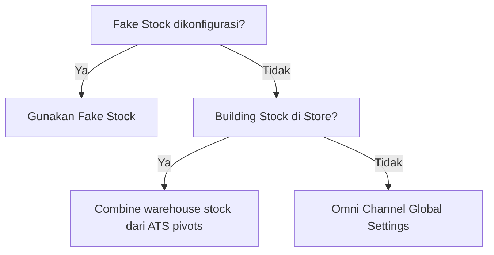
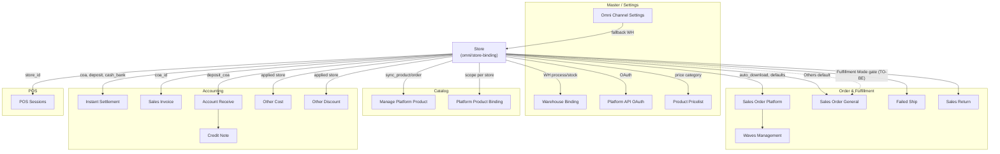

# Store — Requirement Documentation

> **Status: REVIEW** — v2.1 menambahkan requirement **TO-BE Fulfillment Mode** (belum diimplementasi di codebase — lihat §12 `GAP-ST-FM-01`). Konten AS-IS v2.0 (verifikasi codebase 25 Juni 2026) tetap berlaku untuk seluruh bagian lain.

## 0. Metadata & Changelog

| Version | Date | Author | Changes |
|---------|------|--------|---------|
| 1.0 | 2026-06-19 | QA - Yemima | Initial AS-IS draft |
| 1.1 | 2026-06-22 | QA - Yemima | Sequencing sync platform product on onboarding (§10) |
| 1.2 | 2026-06-22 | QA - Yemima | Rule `sync_product` OFF (§10.7); QA E2E authorize simulation |
| 1.3 | 2026-06-23 | QA - Yemima | Cross-reference Relasi Instant Settlement |
| 2.0 | 2026-06-25 | QA - Yemima | Konsolidasi `store_requirement_1.md`; verifikasi codebase; §5 UI/UX tombol; §6 import terkait; §12 gap analysis |
| 2.1 | 2026-07-22 | QA - Yemima | TO-BE: kolom **Fulfillment Mode** (Processed/Non Processed) §4.8 — gate dual import Dev - Sales Order; `GAP-ST-FM-01` |

**UI route:** `/omni/store-binding`  
**API prefix:** `omnichannel/store/*`  
**Primary table:** `omni_stores`  
**Cross-link TO-BE:** [Dev - Sales Order — Import bulk](../sales-order-general/requirement.md#63-import-bulk-excel-2-sheet) (dual import Processed/Non-Processed dikonsumsi di sana).

---

## 1. Ringkasan Eksekutif

Menu **Store** adalah master data toko Omni Channel — merepresentasikan toko/channel penjualan baik terintegrasi marketplace (**Platform**) maupun toko internal/offline (**Others**). Store menjadi titik pusat konfigurasi sinkronisasi (produk, order, warehouse), default akuntansi, default proses gudang, dan pricelist per channel.

### 1.1 Dua Tipe Store

| Tipe | Definisi | Platform tersedia (AS-IS) |
|------|----------|---------------------------|
| **Platform** | Terintegrasi ke OlshopERP via API marketplace | Shopee, Lazada, TikTok Shop — OAuth redirect. Tokopedia: legacy (hidden saat create, token manual) |
| **Others** | Offline / di luar marketplace; dipakai POS & Sales Order General | Dibuat manual, tanpa OAuth |

### 1.2 Nilai Bisnis

| Kebutuhan | Jawaban Store |
|-----------|---------------|
| Sinkronisasi otomatis marketplace | Toggle Auto Sync Product & Auto Sync Order |
| Default akuntansi per store | Section Sales Order Default Configuration (COA, deposit, cash/bank) |
| Gudang proses otomatis per order | Default Building Process + Building Stock |
| Konsistensi harga lintas store | Pricelist Products (kategori harga) |
| Transparansi integrasi | Flag Store Outdated, status Authorization |

---

## 2. Acceptance Criteria

### 2.1 DataList

| ID | Kriteria | Status codebase |
|----|----------|-----------------|
| A-01 | User dapat create store Platform & Others | ✅ |
| A-02 | TikTok Shop wajib `store_code` | ✅ |
| A-03 | Authorize store via OAuth redirect | ✅ Shopee/Lazada/TikTok |
| A-04 | Platform Others tidak bisa authorize | ✅ |
| A-05 | DataList: status auth, auto sync, sync %, onboarding | ✅ kolom onboarding default hidden |
| A-06 | Bind WH process/stock per store | ✅ V2 endpoints |
| A-07 | Set COA, deposit COA, cash/bank | ✅ required on update |
| A-08 | Sync warehouse/product/order per store | ✅ |
| A-09 | Bulk sync product & SO dari DataList | ✅ |
| A-10 | Audit log perubahan store | ✅ |
| A-11 | Row onboarding `(0,0)` saat create store | ✅ |
| A-12 | Sequencing sync produk onboarding | ✅ §10 |
| A-13 | Flag Store Outdated untuk unauthorized/expired | ✅ |
| A-14 | Icon re-authorize menggantikan sync saat unauthorized | ⚠️ Partial — lihat §12 |
| A-15 | Store dengan relasi transaksi tidak bisa edit/delete | ✅ policy + validation |
| A-16 | Tokopedia & TikTok wajib Store ID sebelum redirect | ⚠️ Hanya TikTok (`store_code`); Tokopedia hidden on create |

### 2.2 Create & Configuration

| ID | Kriteria | Status |
|----|----------|--------|
| A-17 | Pilih channel Others → tipe Others | ✅ |
| A-18 | Default Owner Data autofill company creator | ✅ `default_company_owner` |
| A-19 | Account Receivable COA filter COA Class Assets | ✅ select2 COA |
| A-20 | Default Building Process autofill dari Omni Channel Settings | ✅ `DefaultWarehouse` |
| A-21 | Building Stock combine multi-warehouse | ✅ `omni_store_ats_warehouses` |
| A-22 | Prioritas stok sync: Fake Stock > Building Stock > Global | ✅ (lihat technical §8) |
| A-23 | Order sync gated ≥97% product sync | ✅ `initial_sync_product_completed` |
| A-24 | Update pricelist kategori → sync ke store terkait | ✅ via Product Pricelist menu |
| A-25 | **(TO-BE)** Others pilih Fulfillment Mode Processed/Non Processed; Platform Processed only | 🔜 **Belum implementasi** — lihat §4.8, §12 `GAP-ST-FM-01` |

---

## 3. Validasi & Rules

| ID | Rule | Trigger | Pesan / behavior |
|----|------|---------|------------------|
| V-01 | `store_name` max 50, unique (non-deleted) | Create/update | "The store name already exists." |
| V-02 | `store_code` unique globally jika diisi | Create | "Store code has been taken at {name}" |
| V-03 | TikTok: `store_code` required | Create platform TikTok | "Store code field is required..." |
| V-04 | Email format valid jika diisi | Create/update | Laravel email rule |
| V-05 | Authorize hanya jika belum authorized | `authorizationLink` | "This store has been authorized" |
| V-06 | Others tidak authorize | `authorizationLink` | "Unable to authorize this store" |
| V-07 | WH process level ≤ 30 (legacy binding) | `WarehouseBindingController@store` | "Warehouse process level must be under 31." |
| V-08 | Building Stock: warehouse `include_ats = 1` | Save stock WH | Reject + auto-enable saat set process WH |
| V-09 | `coa_id`, `deposit_coa_id`, `cash_bank_account_id` required | Update store | Laravel validation |
| V-10 | `coa_id` on create | Create | **Tidak divalidasi** (commented out) — autofill dari company default |
| V-11 | Setup incomplete → `status = 0` | Create/update | `isStoreSetupIncomplete()` |
| V-12 | Others: `warehouse_process_id` required untuk active | Setup check | Status inactive sampai lengkap |
| V-13 | Delete: authorized+active, used in SO, is SO default | Delete | Ditolak per kondisi |
| V-14 | Order sync manual: `initial_sync_product_completed = 1` | `SalesOrderController@synchronize` | Error jika belum ≥97% |
| V-15 | Sync warehouse: `authorization_status = 1`, `status = 1` | `OmniChannelController@syncWarehouse` | Error reauthorize |
| V-16 **(TO-BE)** | Non Processed hanya untuk tipe **Others** | Create/update store | Platform: opsi Non Processed disabled/hidden; hanya Processed |
| V-17 **(TO-BE)** | Default Fulfillment Mode Others (existing & baru) = **Processed** | Create / data migrasi | Direkomendasikan; tidak auto-switch ke Non Processed |
| V-18 **(TO-BE)** | Perubahan Fulfillment Mode tidak retroaktif | Update store | Berlaku untuk order baru saja — order existing tetap ikut mode saat dibuat |

---

## 4. Fitur & Behavior

| ID | Fitur | Trigger | Expected result |
|----|-------|---------|-----------------|
| F-01 | OAuth Authorize | Tombol Authorize / create redirect | URL platform; cache `store_binding` 180s |
| F-02 | Auto Sync Order (`auto_download`) | Toggle / inline PATCH | Scheduler order sync tiap **5 menit** (bukan 10–15 menit) |
| F-03 | Auto Sync Product (`sync_product`) | Toggle / inline PATCH | Scheduler produk tiap **1 jam**; gates onboarding queue |
| F-04 | Warehouse Process binding | `PUT process-warehouses` | Set `warehouse_process_id`; auto `include_ats` |
| F-05 | Warehouse Stock binding | `PUT stock-warehouses` | Multi `omni_store_ats_warehouses` |
| F-06 | Warehouse Return binding | `POST update-warehouse-return` | **FE hidden** (`v-if="false"`) — endpoint ada, UI tidak tampil |
| F-07 | COA assignment | Select2 | `coa_id`, `deposit_coa_id`, `cash_bank_account_id` |
| F-08 | Sync Warehouse | Tombol Warehouse | `WarehouseSyncJob` → `omni_warehouse_platforms` |
| F-09 | Sync Product | Tombol Product / bulk | `ProductPlatformSyncStoreJob` |
| F-10 | Sync Order | Tombol Order / bulk | `SalesOrderSynchronizeJob` — gated 97% |
| F-11 | Pricelist category | `updatePricelistCategory` | Link `pricelist_pivots` |
| F-12 | Label group (tagging) | Multi tagging | `omni_store_group_pivots` |
| F-13 | Shipping information | Tab Shopee/TikTok | Pickup time per shipping service |
| F-14 | Store logo | Upload / default OlshopERP logo | `logo` column |
| F-15 | Others: Default Sales Order | `is_so_general_default` | First Others store auto-default |
| F-16 | Platform toggles | Form switches | `drop_shipping`, `auto_sync_inventory`, `auto_capture_tracking_number`, dll. |
| F-17 | Default Warehouse Void | Select2 (conditional) | Warehouse void untuk automated distribution |
| F-18 | Onboarding queue | `platform-product:onboarding` | Sequencing per platform §10 |

### 4.1 Warehouse Level (verified codebase)

| Field | Level warehouse | Config |
|-------|-----------------|--------|
| Default Building Process | **19** (`building_level`) | `WarehouseBindingController@select2WarehouseSystemProcess` + `for_wh_binding` |
| Building Stock | **19** (space type) + `include_ats=1` | `select2WarehouseSystemStock` |
| Building Return (backend) | **20** (`rack_level - 1`) | `select2WarehouseSystemReturn` — UI hidden |
| Outrack / Scrap / Return (learn-more) | **20** | Dikonfigurasi di Warehouse Settings |

### 4.2 Authorization per Platform

| Platform | Create flow | Authorize |
|----------|-------------|-----------|
| Shopee | Save → `redirect_url` → tab baru OAuth | `callback-shopee/{store_id}` |
| Lazada | Same | `callback/{store_id}` |
| TikTok Shop | Wajib `store_code` (Store ID) | `callback-tiktok` |
| Tokopedia | **Hidden on create** (FE filter) | `POST get-token-tokopedia` — legacy, tidak di onboarding scheduler |
| Others | Tanpa redirect | Blocked di `authorizationLink` |

### 4.3 Product Stock Sync Priority

### 4.5 Auto Sync Interval (AS-IS — verified `Kernel.php` + `config/omni.php`)

| Job | Schedule | Window | Config |
|-----|----------|--------|--------|
| `sales-order:sync-create` | **Every 5 min** | 06:00–17:59 WIB | `create_sync_interval` = 5 menit |
| `booking:sync-create` | Every 5 min | 06:00–17:59 | Booking orders |
| `sales-order:sync-update --subhour` | **Every 30 min** | 06:00–17:59 | `max_backward` = 2 hari |
| `sales-order:sync-update` | **Hourly** | 18:00–05:59 | Same |
| `product-platform:sync` | **Hourly** | 24/7 | — |
| `platform-product:onboarding` | Every minute | 24/7 | Hanya store **authorized** |
| `product-platform:push-stocks` | Daily 22:00 | — | Hanya **authorized** stores |

> Requirement bisnis menyebut 10–15 menit — **tidak match** AS-IS. Interval aktual lebih granular (create 5 menit, update 30 menit/1 jam).

#### 4.5.1 Apakah store Unauthorized ikut scheduler?

| Scheduler | Filter `authorization_status = 1`? | Call API platform untuk unauthorized? |
|-----------|-----------------------------------|--------------------------------------|
| Order sync create/update | ✅ **Ya** (+ `auto_download`, `initial_sync_product_completed`, `status`) | **Tidak** — store tidak masuk antrian |
| Product onboarding | ✅ **Ya** | **Tidak** |
| Product hourly sync (`product-platform:sync`) | ⚠️ **Tidak di WHERE** — cek di loop | **Tidak pull** — unauthorized dapat `dispatchBind` (auto-bind lokal DB saja) |
| Sync progress monitor (retry stuck) | ❌ **Tidak** | ⚠️ **Bisa** — retry job untuk store yang pernah sync lalu deauth |
| Push stock | ✅ **Ya** | **Tidak** |
| Sales return sync | ✅ **Ya** | **Tidak** |

**Kesimpulan optimasi:** Unauthorized store **tidak** menerima order sync terjadwal. Celah utama hemat API: (1) tambahkan `authorization_status = 1` di query `SyncOmniProductCommand` agar tidak iterate unauthorized sama sekali; (2) tambahkan guard auth di `SyncProgressMonitorCommand` / `ProductPlatformRetrySyncJob` sebelum retry API; (3) pertimbangkan matikan `sync_product`/`auto_download` saat deauth (G-03).

Defense-in-depth: platform service (`OmniShopeeService`, dll.) juga guard `authorization_status` sebelum call API — job yang somehow ter-dispatch tetap fail fast tanpa hit platform.

### 4.6 Tokopedia — Legacy AS-IS (tidak dipakai untuk store baru)

| Aspek | Kondisi codebase |
|-------|------------------|
| Create store baru | **Hidden** di FE (`getPlatform` filter) |
| OAuth redirect | **Tidak ada** — tidak masuk `$platform_with_login` di `StoreController@store` |
| Authorize | `POST omnichannel/get-token-tokopedia` + `shop_id` — legacy |
| `OmniService` | Constructor **throw** `"Tokopedia is deprecated"` — endpoint legacy efektif non-functional untuk flow baru |
| Onboarding scheduler | **Excluded** — `TriggerOnboardingCommand` hanya Shopee/Lazada/TikTok |
| `WarehouseSyncJob` | **Excluded** |
| `SyncOmniProductCommand` | **Excluded** via `where name != Tokopedia` |
| `push-stocks` | **Excluded** via `whereNotIn(PL_TOKOPEDIA)` |
| Store existing | Masih bisa edit; branching khusus Tokopedia di beberapa controller (Failed Ship, DO, dll.) |

### 4.7 Building Return (G-06) — Penjelasan

**Default Building Return** adalah konfigurasi warehouse Level **20** (Outrack/Scrap/Return) untuk mengarahkan proses retur order store ke building tertentu.

| Lapisan | Status |
|---------|--------|
| **Backend** | Endpoint `POST omnichannel/store/update-warehouse-return` → `WarehouseBindingController` type `WB_RETURN`. Select2: `select2/warehouse-system-return` (level 20). Data binding tersimpan di `omni_warehouse_binding_pivot`. |
| **Frontend Form** | Section **disembunyikan** dengan `v-if="false"` + class `hidden` di `Form.vue` ~baris 752. User **tidak bisa** set Building Return dari UI Store saat ini. |
| **Save flow** | `updateWarehouseReturn()` **di-comment** di `submitForm()` (`// await this.updateWarehouseReturn()`). Meski user punya data lama di memory, tidak terkirim saat save. |
| **Warehouse Binding menu** | Binding Return masih bisa dikelola dari menu **Warehouse Binding** terpusat (grid lintas store). |
| **Dampak operasional** | Store baru tidak bisa set return WH dari form Store; harus via Warehouse Binding atau data legacy dari store yang sudah pernah dikonfigurasi sebelum UI di-hide. |

**Mengapa G-06 dicatat:** Requirement bisnis menyebut warehouse Return/Outrack/Scrap — di UI Store field ini sengaja di-hide (kemungkinan dipindah ke Warehouse Binding), tapi kode FE/BE tidak sinkron (endpoint hidup, UI mati, save di-skip).

### 4.8 Fulfillment Mode (TO-BE)

> **Belum diimplementasi.** Kolom `fulfillment_mode` belum ada di `omni_stores` — lihat [technical §5.1](./technical.md#51-fulfillment-mode--planned-schema--invariants-to-be) dan §12 `GAP-ST-FM-01`. Section ini mendokumentasikan requirement TO-BE sebagai acuan sebelum development mulai — **jangan** dianggap AS-IS.

| Field | Label UI (locked) | Opsi (locked) | Nilai teknis |
|-------|--------------------|----------------|--------------|
| Fulfillment Mode | **Fulfillment Mode** | **Processed**, **Non Processed** | `processed`, `non_processed` |

**Aturan bisnis:**

1. Store tipe **Others** boleh pilih **Processed** atau **Non Processed**. Store tipe **Platform** hanya boleh **Processed** — opsi Non Processed disabled/hidden di form untuk Platform (lihat V-16).
2. Default Fulfillment Mode untuk store Others (existing maupun baru) adalah **Processed** (direkomendasikan) — tidak ada auto-switch ke Non Processed (V-17).
3. Fulfillment Mode boleh diubah kapan saja; perubahan **hanya berlaku ke order baru** yang dibuat setelah tanggal perubahan — tidak retroaktif ke order yang sudah ada (V-18).
4. Kolom **Fulfillment Mode** + filter tampil di DataList Store (§5.1).
5. Flag ini menggerakkan **dual import** di [Dev - Sales Order / All Sales Order](../sales-order-general/requirement.md#63-import-bulk-excel-2-sheet):
   - **Import Processed** → store yang dipilih harus Fulfillment Mode = Processed → jalur normal wave → ship (lihat requirement Sales Order General §6.5 Fulfillment).
   - **Import Non-Processed** → store yang dipilih harus Fulfillment Mode = Non Processed → skip proses gudang (wave/pick/pack) → auto Outbound + Sales Invoice. **Detail alur ini adalah rumah kanonik di dokumentasi Sales Order General** — tidak diduplikasi di sini.
6. **Out of scope (belum direncanakan):** create manual/POS untuk order Non Processed dengan auto path yang sama seperti dual import — saat ini tidak termasuk cakupan TO-BE ini.

### 4.4 Auto Sync & Authorization (AS-IS vs requirement bisnis)

| Kondisi | Requirement bisnis | AS-IS codebase |
|---------|-------------------|----------------|
| Unauthorized | Toggle locked OFF, non-editable | DB default ON (`sync_product=1`, `auto_download=1`); FE toggle hanya disabled jika `!canUpdate` — **bukan** karena unauthorized |
| Unauthorized → Authorized | Toggle auto ON | Tidak ada flip eksplisit — mengandalkan default DB ON |
| Authorized → Unauthorized | Toggle harus OFF | `deauthorize_store` set `authorization_status=0`; **tidak** auto-OFF toggle |
| Sync saat unauthorized | Diblokir | Endpoint sync cek `authorization_status` |

---

## 5. UI/UX — DataList, Form, Tombol & Toggle

### 5.1 DataList (`/omni/store-binding`)

**Toolbar (kiri atas filter area)**

| Tombol | Fungsi | API / behavior |
|--------|--------|----------------|
| **Create** | Navigasi ke `/omni/store-binding/create` | — |
| **Bulk Delete** | Hapus multi store terpilih | Policy delete per row |
| **Bulk Sync Product** | Sync produk untuk store terpilih | `POST omnichannel/store/bulk-sync-product` |
| **Bulk Sync SO** | Sync order untuk store terpilih | `POST omnichannel/store/bulk-sync-so` |
| **Advanced Filter** | SearchBuilder kolom | Default filter: Default Owner Data = company login |
| **Show Deleted** | Tampilkan soft-deleted stores | Refresh grid |

**Kolom DataList**

| Kolom | Visible default | Keterangan |
|-------|-----------------|------------|
| Checkbox | ✅ | Multi-select untuk bulk actions |
| Store Name | ✅ | Logo platform, link edit (tab baru), badge Setup Incomplete / Store Outdated, copy icon |
| Tagging | ✅ | Label group |
| Authorization | ✅ | Dot hijau Authorized / merah Unauthorized (hanya Platform) |
| Start/End Authorization | ✅ | Rentang `authorization_valid_date` – `authorization_end_date` |
| Auto Sync Order / Product | ✅ | Dual row ON/OFF; tooltip header: order 5 menit, product 1 jam |
| Product Sync % / Can Sync Order | ✅ | Hijau jika ≥ threshold (97%); Yes/No untuk order eligibility |
| Product Onboarding | Hidden | Waiting / In Progress / Completed |
| Default Owner Data | Hidden | Company owner |
| Default Sales Order | Hidden | Others default flag |
| **Fulfillment Mode** **(TO-BE)** | 🔜 Belum ada | Processed / Non Processed; Platform selalu Processed. Advanced Filter juga tambah filter kolom ini — belum implementasi, lihat §4.8 |
| Sync (action column) | ✅ | Icon sync per tipe — lihat §5.3 |
| Action | ✅ | Edit, Delete, Authorize (reauthorize) |
| Created/Updated by | ✅ | Standard audit columns |

**Badge Store Name**

| Badge | Kondisi | Warna | Tooltip |
|-------|---------|-------|---------|
| Setup Incomplete | `store_info=0` & belum authorized / Others belum lengkap | Kuning (#D97706) | Integrasi belum selesai |
| Store Outdated | `store_info=0` & pernah authorized (`authorization_valid_date` ada) | Merah (#B91C1C) | "Store setup is incomplete. Finish the integration..." |

**OAuth callback notification:** Query `?notification=&type=success|error|info` → Toastify 6 detik.

### 5.2 Form Create/Edit (`/omni/store-binding/create|edit/:id`)

**Header sidenav**

| Elemen | Fungsi |
|--------|--------|
| Platform logo + auth status | `HeaderBasicInformation.vue` |
| **Authorize Store** (link icon) | `GET store/{id}/authorize` → `window.open(url)` — hidden jika sudah authorized |
| Save / Cancel | POST create atau PUT update |

**Section: Basic Information**

| Field | Create | Edit | Keterangan |
|-------|--------|------|------------|
| Select Channel | Editable (Tokopedia hidden) | Editable | Others → tipe Others |
| Store Name | Required | Editable | Max 50, unique |
| Store Code | Required (TikTok) | Editable | Store ID marketplace |
| Store Platform Name | Disabled | Disabled | Dari API setelah authorize |
| Tagging | Multi | Multi | Auto-create tag baru |
| Logo | Upload | Upload/remove | Default OlshopERP logo |
| Active | Toggle | Disabled jika Platform authorized | Others: editable |
| Set Default Sales Order | Others only | Others only | `is_so_general_default` |

**Section: Other Information**

| Field | Keterangan |
|-------|------------|
| Store Platform ID | Disabled — terisi setelah authorize |
| Email, Mobile, Country, City, Address, Description | Opsional |

**Section: Sales Order Default Configuration**

| Field | Filter / rule |
|-------|---------------|
| Default Owner Data | Internal company active |
| Account Receivable COA | COA Class = Assets |
| Cash/Bank Receiving | Company Detail Bank |
| Customer's Deposit COA | Company accounting default |
| Default Building Process | Level 19, `for_wh_binding`, configured WH |
| Building Stock | Multi-select, level 19, `include_ats=1` |
| Default Warehouse Void | Conditional (automated distribution) |
| **Fulfillment Mode** **(TO-BE)** | Others: selectable Processed/Non Processed (default Processed); Platform: Processed only, disabled/hidden — belum implementasi, lihat §4.8 |

**Section: Synchronization** (`SyncSection.vue` — **hanya Platform**)

| Elemen | Disabled when | API |
|--------|---------------|-----|
| Toggle Auto Sync Product | `!canUpdate` | `PATCH store/{id}` field `sync_product` (debounce 600ms) |
| Tombol **Product** | unauthorized / !canUpdate / job lock / !hasApi | `POST product-platform/sync-products` |
| Toggle Auto Sync Order | `!canUpdate` | `PATCH` field `auto_download` |
| Tombol **Order** | + `!syncOrderEligible` (belum 97%) | `POST sales-order/synchronize` |
| Tombol **Warehouse** | unauthorized / job lock | `GET store/sync-warehouse/{id}` |
| Panel Sync % | — | Hijau/merah vs threshold |
| Product Onboarding | — | Waiting / In Progress / Completed |
| Can sync order | — | Yes/No dari `initial_sync_product_completed` |

**Job lock:** WebSocket `JOB_LOCK_CREATED/RELEASED` + polling `GET queues/availability` — tombol sync disabled saat job aktif.

**Section: Pricelist Products**

| Field | Fungsi |
|-------|--------|
| Price Category | Select2 pricelist → perubahan harga di menu Product Pricelist otomatis propagate |

**Section: Shipping Information** (Platform)

Pickup time Shopee/TikTok per shipping service — datalist terpisah.

**Tabs log (edit mode)**

| Tab | Endpoint |
|-----|----------|
| Warehouse Sync Log | `GET store/{id}/log-sync-warehouse` |
| Order Sync Log | `GET store/{id}/log-sync-order` |
| Audit | `GET store/{id}/audit` |

### 5.3 Kolom Sync — Shortcut Icon (DataList)

| Icon | Warna | Kondisi | Fungsi |
|------|-------|---------|--------|
| Unlink / Reauthorize | Merah | Unauthorized / expired | Buka OAuth re-authorize |
| Sync Product | Biru | Authorized | Manual pull product |
| Sync Order | Orange | Authorized + Can Sync Order Yes | Manual pull order |
| Sync Warehouse | Dark tosca | Authorized | Pull WH platform |

> **Gap:** Requirement menyatakan icon unlink **menggantikan seluruh** icon sync saat unauthorized — verifikasi UI DataTablesV3 perlu QA visual; tombol sync di form detail memang disabled saat unauthorized.

---

## 6. Import — Referensi Store di Menu Lain

> **Menu Store tidak punya import.** Berikut template & validasi di menu lain yang mereferensikan store.

### 6.1 Instant Settlement (upload CSV per platform)

| Platform | Template | Store selection |
|----------|----------|-----------------|
| Shopee | `public/files/upload_settlement_template_shopee.csv` | **Wajib** pilih store sebelum upload |
| Lazada | `upload_settlement_template_lazada.csv` | Wajib |
| TikTok | Referenced di FE — **file static missing** di repo | Wajib |
| Others (General) | `GET settlement-upload/general-template?store_id=&format=csv\|xlsx` | Store tipe Others |

**Validasi store:** `store_id` required on upload (`SettlementUploadController@store`). COA & cash/bank diambil dari konfigurasi store — **Authorized tidak dicek**.

Detail: [Instant Settlement requirement](../accounting-settlement-upload/requirement.md)

### 6.2 Sales Order General Import

**File:** `Modules/OmniChannel/Import/SalesOrderImportSheet1.php`

| Kolom | Header | Validasi store |
|-------|--------|----------------|
| C (index 2) | `Store Name` | Required; exact match `store_name`; **hanya tipe Others/General**; satu store per row; inactive ditolak; harus milik internal company |

### 6.3 Other Cost Import

**Headers:** `Code`, `Name`, `Other Cost COA`, `Applied Store`, `Description`

| Kolom Applied Store | Format | Validasi |
|---------------------|--------|----------|
| `ALL` | Satu nilai | Semua store Others active eligible |
| Nama store | Comma/semicolon separated | Match `store_name` (case-insensitive); harus eligible (tipe Others, active) |
| Kombinasi | — | `ALL` tidak boleh digabung nama lain |

### 6.4 Other Discount Import

Struktur identik Other Cost — headers: `Code`, `Name`, `Other Discount COA`, `Applied Store`, `Description`. Validasi store sama.

### 6.5 Credit Note Import

| Kolom | Header | Validasi store |
|-------|--------|----------------|
| D (index 3) | Store (optional) | Nama dipisah `,` atau `;`; max 5 store; match `store_name`; `default_company_owner` atau `owned_by` = company login |

### 6.6 Receive (AR) Import

Kolom `Supplier/Store ID` — validasi store ID terdaftar di company (tidak via nama).

---

## 7. Diagram Relasi Menu

### 7.1 Relasi Terkonfirmasi (codebase)

| Menu | Field / relasi | Peran Store | Wajib? |
|------|----------------|-------------|--------|
| Sales Order Platform | `store_id`, defaults | Sumber order, COA, WH process | ✅ |
| Sales Invoice | `store_id` via SO | COA piutang dari store | ✅ platform |
| Instant Settlement | `store_id` | COA + cash/bank saat Approve | ✅ upload |
| Account Receive | via SI | Deposit COA | Kondisional |
| Manage Platform Product | per `store_id` | Scope sync/bind | ✅ platform |
| Platform Product Binding | `store_id` | Scope binding | ✅ |
| Warehouse Binding | via `omni_warehouse_platforms` | Mapping WH | ✅ platform |
| Waves | `omni_wave_detail_stores` | Filter wave | Opsional |
| Failed Ship | `store_id` | Konteks order gagal | ✅ |
| Sales Return | `store_id` | Sync return platform | ✅ |
| Other Cost / Discount | pivot `store_id` | Applied to Store (Others) | Opsional |
| POS | `pos_sessions.store_id` | Sesi kasir | ✅ |
| Pricelist | `pricelist_pivots.store_id` | Harga per store | Opsional |
| Journal / Payment pivots | `accounting_*_store_pivots` | Scope posting | Opsional |

---

## 8. Relasi Instant Settlement

**Dampak ke menu ini:** Field **COA** (`coa_id`) dan **Cash/Bank Receiving** (`cash_bank_account_id`) dipakai saat Instant Settlement **Approve** — generate AR dan jurnal penerimaan. Error **V-15 Receiving Destination COA** jika cash/bank kosong.

**Prasyarat:** Lengkapi section accounting di form store **sebelum** Approve settlement. Store **Authorized tidak dicek** saat settlement upload — by design.

Detail: [Instant Settlement §10](../accounting-settlement-upload/requirement.md#10-relasi-menu--integrasi)

---

## 9. Permission & Dependencies

| Dependency | Keterangan |
|------------|------------|
| Platform master | `platforms` — Shopee, Lazada, TikTok, Tokopedia, Others |
| Warehouse Structure | WH + `include_ats` (Show in Store) |
| Omni Channel Settings | `DefaultWarehouse` — wajib ada saat create store |
| COA / Company Detail Bank | Posting & settlement |
| OmniService | OAuth URL & callback |
| Policy `Store` | `viewAny`, `create`, `update`, `view`, `delete` via role-menu |
| Horizon / queue | Sync jobs & onboarding scheduler |

---

## 10. Sequencing Sync Platform Product (Onboarding)

> Scope: antrian sync produk otomatis — menggantikan dispatch langsung dari OAuth callback.

### 10.1 Tabel `omni_store_onboardings`

| Kolom | State |
|-------|-------|
| `product_in_progress` + `product_completed` | `waiting (0,0)` → `in progress (1,0)` → `complete (1,1)` |

**Trigger:** Row dibuat saat **create store** (bukan authorize). Threshold complete: `sync_product_percentage` ≥ `100 - product_failed_threshold` (default **97%**).

### 10.2 Logic sequencing

1. Per platform (TikTok, Shopee, Lazada): pilih store terlama eligible.
2. Beda platform → paralel. Sama platform → tunggu store aktif `product_completed = 1`.
3. Filter: `authorization_status = 1` AND (`product_in_progress = 1` OR `sync_product = 1`).

### 10.3 Interaksi `sync_product`

| `product_in_progress` | `sync_product` | Perilaku |
|---|---|---|
| 0 | ON | Eligible antrian |
| 0 | OFF | Di-skip terus |
| 1 | OFF | Sync lanjut sampai selesai (tidak di-cancel) |

### 10.4 Order sync gating (97%)

- `initial_sync_product_completed` di-set `StoreAfterCommitObserver` saat threshold tercapai.
- Manual & scheduled order sync require flag ini.
- **Bukan** gate untuk toggle Auto Sync Order — toggle bisa ON sebelum 97%, tapi tombol/manual sync ditolak.

Config: `config/omni.php` → `get_so.product_failed_threshold` = **3** (hardcoded via env, bukan per-store).

---

## 11. QA Test Notes

### 11.1 E2E — Authorize + onboarding (OB-E2E-01 s/d 03)

Lihat v1.3 §7.1 — tetap valid. Tambahan regression v2.0:

- [ ] Verify warehouse level 19 muncul di Building Process dropdown setelah WH Settings configured
- [ ] Building Stock hanya tampil WH dengan Show in Store (`include_ats=1`)
- [ ] Sync Warehouse → cek `Warehouse Sync Log` + `omni_warehouse_platforms`
- [ ] Toggle sync saat unauthorized — dokumentasikan actual behavior (§12 G-01)
- [ ] Tokopedia legacy store — edit only, no create
- [ ] Building Return section tidak tampil di FE

### 11.2 Edge Cases

| Case | Expected (AS-IS) |
|------|------------------|
| Auth expired mid-sync | Job berjalan lanjut; attempt baru diblokir |
| Default Building Process NULL | `getProcessWH()` fallback DefaultWarehouse → alternatives → empty |
| Multi Building Stock | Stok di-combine dari semua ATS warehouse |
| Others COA fields | Required on update; relevan untuk settlement & SO General |
| Store inactive (`status=0`) | Tidak bisa dipakai transaksi; sync ditolak |

---

## 12. Gap Analysis — Requirement Bisnis vs Codebase

| ID | Item requirement | Status implementasi | Catatan |
|----|------------------|---------------------|---------|
| G-01 | Toggle Auto Sync locked OFF saat Unauthorized | ❌ **Belum** | DB default ON; FE tidak lock by auth status |
| G-02 | Auto ON toggle saat Unauthorized → Authorized | ⚠️ **Partial** | Default DB ON; tidak ada explicit flip on authorize |
| G-03 | Auto OFF toggle saat Authorized → Unauthorized | ❌ **Belum** | `deauthorize_store` tidak reset toggle |
| G-04 | Interval auto sync 10–15 menit | ❌ **Berbeda** | Order create: 5 menit; update: 30 menit (siang)/hourly (malam); Product: 1 jam. Unauthorized **tidak** masuk order scheduler — lihat §4.5 |
| G-05 | Tokopedia | 📋 **Legacy AS-IS** | Tidak dipakai store baru; hidden create; `OmniService` deprecated — lihat §4.6 |
| G-06 | Building Return UI aktif | ❌ **Hidden** | UI `v-if="false"`, save di-comment; endpoint backend hidup — lihat §4.7 |
| G-07 | Product Onboarding kolom DataList | ✅ **Implemented** | Default `visible: false` — aktifkan via column manager |
| G-08 | Icon unlink menggantikan semua sync icon | ⚠️ **Perlu QA visual** | DataTablesV3 sync column behavior |
| G-09 | Tooltip locked unauthorized untuk toggle | ❌ **Belum** | Hanya tooltip interval sync |
| G-10 | Order onboarding sequencing | 🔜 **Reserved** | Kolom `order_in_progress/completed` ada, belum dipakai |
| G-11 | `coa_id` required on create | ❌ **Commented out** | Setup incomplete forces inactive instead |
| G-12 | Sync Warehouse non-functional | ✅ **Functional** | `WarehouseSyncJob` aktif (Shopee/Lazada/TikTok) |
| G-13 | Notifikasi blocking antrian lintas company | ❌ **Out of scope** | Accepted — user lihat `waiting` tanpa penjelasan |
| `GAP-ST-FM-01` | **Fulfillment Mode** (Processed/Non Processed) — field, form, datalist, validasi, gate dual import SO General | 🔜 **TO-BE — Implementation pending** | Belum ada kolom `fulfillment_mode` di `omni_stores`; FE `Form.vue`/`DataList.vue` belum update. Lihat §4.8 dan [technical §5.1](./technical.md#51-fulfillment-mode--planned-schema--invariants-to-be). Konsumen import dual mode: [Sales Order General — Gap Registry](../sales-order-general/requirement.md#9-gap-registry) |

---

## 13. Known Gaps / Open Questions

- Refresh token otomatis vs manual re-authorize — SOP operator terpisah
- Apakah G-01 s/d G-03 akan diimplementasi (UX lock toggle unauthorized)?
- TikTok static settlement template missing di repo
- Building Return: re-enable UI atau deprecate endpoint?
- Cross-owner onboarding queue — notifikasi future enhancement
- **Fulfillment Mode (`GAP-ST-FM-01`):** belum ada scope teknis pasti (migration, endpoint, FE) — koordinasikan dengan tim Sales Order General sebelum mulai development karena dua sisi (Store sebagai master flag, SO General sebagai consumer) harus rilis bersamaan.

---

## Related Documents

| Doc | Path |
|-----|------|
| Knowledge Base | [knowledge-base.md](./knowledge-base.md) |
| Technical | [technical.md](./technical.md) |
| DB: omni_stores | [docs/db-schema/omni_channel/omni_stores.md](../../db-schema/omni_channel/omni_stores.md) |
| Warehouse Binding | [../omni-warehouse-binding/requirement.md](../omni-warehouse-binding/requirement.md) |
| Instant Settlement | [../accounting-settlement-upload/requirement.md](../accounting-settlement-upload/requirement.md) |
| Dev - Sales Order (dual import Processed/Non-Processed — TO-BE) | [../sales-order-general/requirement.md](../sales-order-general/requirement.md) |
| All Sales Order (window gabungan) | [../all-sales-order/requirement.md](../all-sales-order/requirement.md) |
