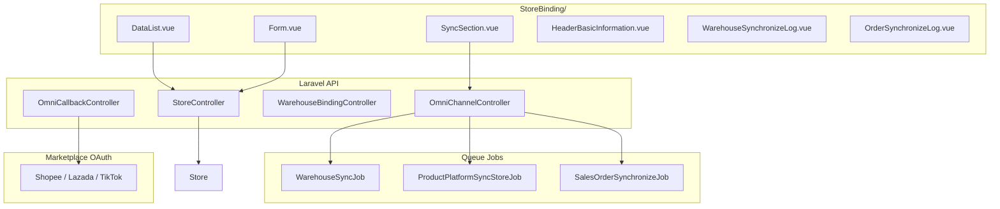
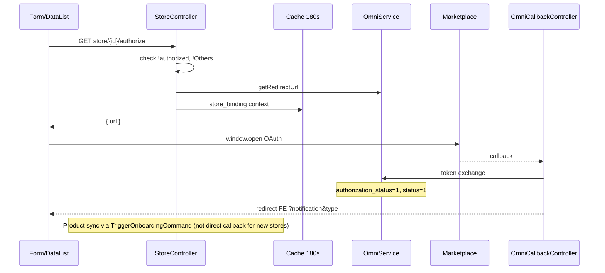

# Store — Technical Documentation

> **Status: DRAFT** — v2.0 (2026-06-25). Verifikasi codebase menyeluruh.

## 0. Metadata

| Field | Value |
|-------|-------|
| Menu slug | `omni-store-binding` |
| UI route | `/omni/store-binding` |
| API base | `{VITE_API_URL}omnichannel/store` |
| Controller | `Modules/OmniChannel/Http/Controllers/StoreController.php` |
| Sync controller | `Modules/OmniChannel/Http/Controllers/OmniChannelController.php` |
| Entity | `Modules/OmniChannel/Entities/Store.php` |
| Table | `omni_stores` |
| Observer | `StoreAfterCommitObserver` |
| Policy | `Modules/OmniChannel/Policies/StorePolicy.php` (extends `MainPolicy`) |

**Validasi:** Inline di `StoreController` — **tidak ada** dedicated FormRequest class.

---

## 1. Architecture Overview



---

## 2. Frontend File Map

**Root:** `olshoperp-frontend/src/pages/Omni/master/StoreBinding/`

| File | Role | Key API / behavior |
|------|------|-------------------|
| `DataList.vue` | Grid + bulk sync + authorize | `GET omnichannel/store`; `@authorize`; bulk sync props |
| `Form.vue` | Create/edit monolith | POST/PUT store; WH V2; authorize sidenav |
| `HeaderBasicInformation.vue` | Header card | Platform logo, auth badge |
| `StorePlatform.vue` | Platform-specific config | `GET store/platform/{id}` |
| `components/SyncSection.vue` | Sync toggles + manual buttons | PATCH inline; sync endpoints; Echo job lock |
| `ShippingInformation.vue` | Pickup time datalist | `shipping-information-datalist` |
| `WarehouseSynchronizeLog.vue` | WH sync log | `GET store/{id}/log-sync-warehouse` |
| `OrderSynchronizeLog.vue` | Order sync log | `GET store/{id}/log-sync-order` |
| `components/PlatformCell.vue` | Platform cell renderer | — |
| `components/CurrentCompanyStoreCell.vue` | Company cell | — |

**Reusable:** `src/components/Omni/StoreSelect.vue` — store picker lintas menu.

**Router:** `src/router/index.ts` — routes `store-binding`, `create`, `edit/:id`.

---

## 3. Backend File Map

| File | Role |
|------|------|
| `StoreController.php` | CRUD, authorize, inline update, WH V2, COA select2, audit, logs |
| `OmniChannelController.php` | `syncWarehouse`, `syncProduct`, `syncOrder`, bulk sync, queue availability |
| `OmniCallbackController.php` | OAuth callbacks Shopee/Lazada/TikTok |
| `WarehouseBindingController.php` | Select2 WH process/stock/return; legacy binding |
| `Entities/Store.php` | Model; `getProcessWH()`, `getStockWH()` |
| `Entities/StoreOnboarding.php` | Onboarding flags |
| `Entities/WarehouseBinding.php` | Pivot WB_PROCESS / WB_STOCK / WB_RETURN |
| `Services/OmniShopeeService.php` etc. | OAuth token refresh; `authorization_status` update |
| `Observers/StoreAfterCommitObserver.php` | Threshold 97%; order sync dispatch |
| `Observers/ProductSynchronizationAfterCommitObserver.php` | `sync_product_percentage` |
| `Jobs/WarehouseSyncJob.php` | Pull platform warehouses |
| `Jobs/ProductPlatformSyncStoreJob.php` | Pull products |
| `Console/Commands/PlatformProduct/TriggerOnboardingCommand.php` | Scheduler onboarding |
| `Routes/api.php` | Route definitions |

---

## 4. API Routes

### 4.1 Authenticated (`auth:sanctum`)

| Method | Path | Handler | Notes |
|--------|------|---------|-------|
| GET | `omnichannel/store` | `index` | DataList JSON |
| POST | `omnichannel/store` | `store` | Create + optional `redirect_url` |
| GET | `omnichannel/store/{id}` | `show` | Detail |
| PUT/PATCH | `omnichannel/store/{store}` | `update` | Full update |
| PATCH | `omnichannel/store/{id}` | `inlineUpdate` | Fields: `auto_download`, `sync_product` |
| DELETE | `omnichannel/store/{store}` | `destroy` | Soft delete |
| GET | `omnichannel/store/{id}/authorize` | `authorizationLink` | OAuth URL |
| PUT | `omnichannel/store/{store}/process-warehouses` | `updateProcessWarehousesV2` | Canonical platform WH process |
| PUT | `omnichannel/store/{store}/stock-warehouses` | `updateStockWarehousesV2` | ATS pivots |
| POST | `omnichannel/store/update-warehouse-return` | `updateWarehouseReturn` | Return binding |
| POST | `omnichannel/store/update-other-warehouse-stock` | `updateStoreOtherWarehouseStock` | Others stock |
| GET | `omnichannel/store/select2/coa` | `select2Coa` | COA picker |
| GET | `omnichannel/store/{store}/audit` | `audit` | Audit trail |
| GET | `omnichannel/store/{id}/log-sync-warehouse` | `getLogStoreSyncWarehouse` | |
| GET | `omnichannel/store/{id}/log-sync-order` | `getLogStoreSyncOrder` | |

### 4.2 Sync routes (public middleware group — FE still sends Bearer)

| Method | Path | Handler |
|--------|------|---------|
| GET | `omnichannel/store/sync-warehouse/{store_id}` | `OmniChannelController@syncWarehouse` |
| GET | `omnichannel/store/sync-product/{store_id}` | `OmniChannelController@syncProduct` |
| GET | `omnichannel/store/sync-order/{store_id}` | `OmniChannelController@syncOrder` |
| POST | `omnichannel/store/bulk-sync-product` | bulk product |
| POST | `omnichannel/store/bulk-sync-so` | bulk order |
| GET | `omnichannel/queues/availability` | Job lock check |

### 4.3 OAuth callbacks

| Method | Path | Platform |
|--------|------|----------|
| GET | `omnichannel/callback/{store_id}` | Lazada |
| GET | `omnichannel/callback-shopee/{store_id}` | Shopee |
| GET | `omnichannel/callback-tiktok` | TikTok |
| POST | `omnichannel/get-token-tokopedia` | Tokopedia (legacy) |

---

## 5. Database Schema

**Primary:** `omni_stores` — [omni_stores.md](../../db-schema/omni_channel/omni_stores.md)

| Kolom kunci | Fungsi |
|-------------|--------|
| `platform_id` | FK platform |
| `store_platform_id` | ID toko marketplace |
| `store_code` | Store ID (wajib TikTok) |
| `authorization_status` | 0/1 OAuth |
| `authorization_valid_date` / `authorization_end_date` | Rentang token |
| `auto_download` | Default **1** — sync order otomatis |
| `sync_product` | Default **1** — sync produk otomatis |
| `sync_product_percentage` | Progress % |
| `initial_sync_product_completed` | Gate order sync (≥97%) |
| `warehouse_process_id` | Default building process |
| `coa_id`, `deposit_coa_id`, `cash_bank_account_id` | Accounting |
| `default_company_owner` | Default `owned_by` transaksi |
| `is_so_general_default` | Default SO General (Others) |
| `latest_sync_*` | Timestamp sync terakhir |

**Related tables:**

| Table | Relasi |
|-------|--------|
| `omni_store_onboardings` | 1:1 onboarding flags |
| `omni_store_ats_warehouses` | Building Stock pivots |
| `omni_store_other_w_h_stocks` | Others-type stock buildings |
| `omni_warehouse_platforms` | WH dari platform per store |
| `omni_warehouse_binding_pivot` | Binding WH sistem ↔ platform |
| `omni_store_group_pivots` | Tagging |
| `omni_store_synchronization_histories` | Sync history |
| `omni_platform_access_tokens` | OAuth tokens per store |

---

## 6. Warehouse Level & `include_ats` (Show in Store)

**Config** (`config/warehouse.php`):

```php
'building_level' => 19,
'rack_level' => 21,
```

| Select2 endpoint | Level filter | Extra |
|------------------|--------------|-------|
| `select2/warehouse-system-process` | = 19 + `for_wh_binding` | Outrack/Scrap/Return configured |
| `select2/warehouse-system-stock` | space type 19 | `include_ats=1` query param |
| `select2/warehouse-system-return` | = 20 (`rack_level - 1`) | FE hidden |

**`include_ats`:** Column on `warehouses` table. Label **"Show in Store"** di `SCM/master/Warehouse/Form.vue`. Store stock select2 passes `include_ats=1`. Setting process WH auto-enables `include_ats` on that warehouse (`StoreController@store` / `@update`).

---

## 7. OAuth & Authorization Flow



**Deauthorize:** `StoreController@deauthorize_store` — webhook; sets `authorization_status=0`, `authorization_end_date=now()`.

**Re-auth product/order:** OAuth callback dispatches sync only if `initial_sync_product_completed && sync_product/auto_download`.

---

## 8. Stock Resolution (`Store::getStockWH`)

Priority (verified `Store.php`):

1. Fake Stock configuration (if set)
2. `omni_store_ats_warehouses` pivots (Building Stock) — **combined** if multiple
3. `DefaultWarehouseStock` from Omni Channel Global Settings (`owned_by`)

**Process WH fallback (`getProcessWH`):**

1. `warehouse_process_id` on store
2. Latest `DefaultWarehouse.default_warehouse_id` for `owned_by`
3. `alternative_1` / `alternative_2` from default WH settings
4. Empty array — downstream must handle

---

## 9. Sync Pipeline

### 9.1 Product sync & 97% gate

| Step | Component |
|------|-----------|
| Update % | `ProductSynchronizationAfterCommitObserver` |
| Threshold check | `StoreAfterCommitObserver::completeProductSync` |
| Config | `config('omni.get_so.product_failed_threshold')` default **3** → 97% |
| Set flag | `initial_sync_product_completed = 1` |
| Onboarding complete | `product_completed = 1` on `omni_store_onboardings` |
| Order dispatch | Observer may dispatch `SalesOrderSynchronizeUpdateJob` |

### 9.2 Onboarding scheduler

`php artisan platform-product:onboarding` (every minute):

- Platforms: TikTok, Shopee, Lazada (not Tokopedia)
- Query: join onboarding, `product_completed=0`, `authorization_status=1`
- Eligible: `product_in_progress=1` OR `sync_product=1`
- Order: `product_in_progress DESC`, `store_id ASC`
- Dispatch: `ProductPlatformSyncStoreJob` with `ProductSyncTypes::STORE_BIND_SYNC_TYPE_ID`

### 9.3 Order sync

- Scheduled: `SynchronizeCreateCommand` / `SynchronizeUpdateCommand` — filter `initial_sync_product_completed=1`
- Manual FE: `POST omnichannel/sales-order/synchronize` — same gate
- Auto: `auto_download=1` + authorized

### 9.4 Warehouse sync

`OmniChannelController@syncWarehouse`:

1. `status=1`, `authorization_status=1`
2. Dispatch `WarehouseSyncJob` (queue: salesorder)
3. Sets `latest_sync_warehouse = now()` **immediately** (before job completes)
4. Platforms: Lazada, Shopee, TikTok only

---

## 10. Cross-Module `store_id` References

| Module | Table / entity |
|--------|----------------|
| Sales Order | `omni_sales_orders.store_id` |
| Sales Return | `omni_sales_returns.store_id` |
| Platform Product Binding | `omni_product_binding_pivots.store_id` |
| Failed Sales Order | `omni_failed_sales_orders.store_id` |
| Waves | `omni_wave_detail_stores.store_id` |
| Settlement Upload | `accounting_settlement_uploads.store_id` |
| Customer Invoice | `accounting_customer_invoices.store_id` |
| Other Cost/Discount pivots | `accounting_other_cost_pivots`, `omni_other_discount_pivots` |
| POS | `pos_sessions.store_id` |
| Pricelist | `pricelist_pivots.store_id` |
| Product sync logs | `product_sync_logs`, `product_sync_statuses` |

---

## 11. Import — Store References (no Store master import)

| Import class | Store validation |
|--------------|------------------|
| `SalesOrderImportSheet1` | Col `Store Name`; Others only; single store |
| `OtherCostImport` | Col `Applied Store`; `ALL` or names; Others eligible |
| `OtherDiscountImport` | Same as Other Cost |
| `CreditNoteImport` | Col Store optional; max 5 names |
| `ReceiveImport` | Col `Supplier/Store ID` |
| `SettlementUploadController` | `store_id` required on upload |

---

## 12. Implementation Gaps (for dev backlog)

| ID | Gap | Location |
|----|-----|----------|
| G-01 | Toggle not locked by unauthorized | `SyncSection.vue` — only `!canUpdate` |
| G-02 | No auto OFF toggles on deauth | `deauthorize_store` |
| G-03 | Building Return UI hidden | `Form.vue` `v-if="false"` |
| G-04 | Tokopedia hidden on create | `Form.vue` `getPlatform` filter |
| G-05 | `coa_id` create validation commented | `StoreController@store` line ~417 |
| G-06 | Order onboarding columns reserved unused | `omni_store_onboardings` |
| G-07 | Sync routes outside sanctum group | `Routes/api.php` lines 58–70 |

---

## 13. Config Reference

| Key | File | Default |
|-----|------|---------|
| `omni.get_so.enabled` | `config/omni.php` | `env('ENABLE_ORDER_SYNC', true)` |
| `omni.get_so.product_failed_threshold` | `config/omni.php` | `3` (→ 97%) |
| `omni.get_so.default.create_sync_interval` | `config/omni.php` | `5` (minutes) |
| `warehouse.building_level` | `config/warehouse.php` | `19` |
| `warehouse.rack_level` | `config/warehouse.php` | `21` |

---

## 14. Related db-schema docs

- [omni_stores.md](../../db-schema/omni_channel/omni_stores.md)
- [omni_store_synchronization_histories.md](../../db-schema/omni_channel/omni_store_synchronization_histories.md)
- [omni_warehouse_binding_pivot.md](../../db-schema/omni_channel/omni_warehouse_binding_pivot.md)
