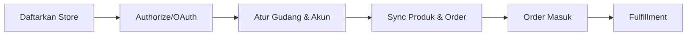
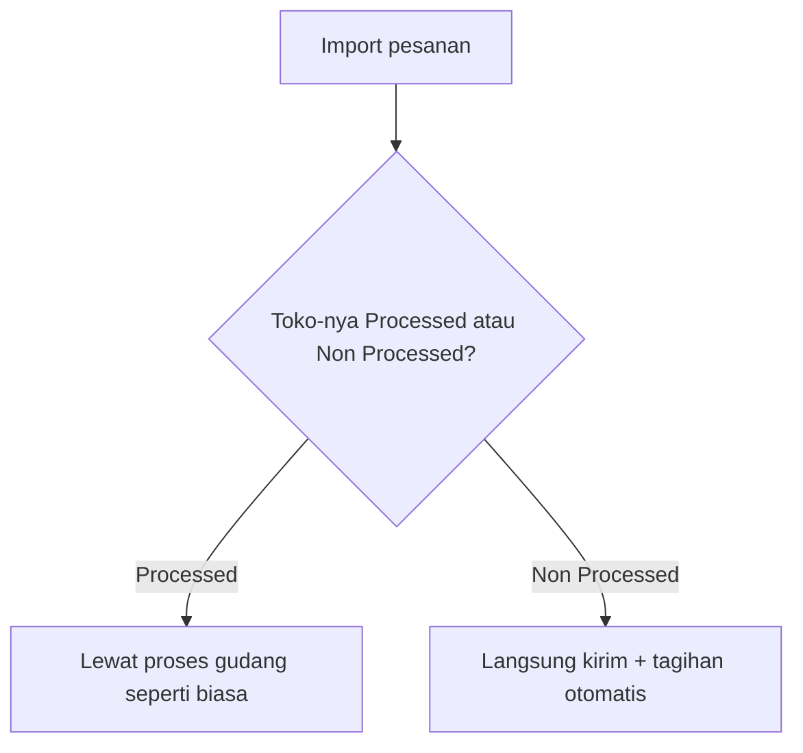

# Store — Panduan Pengguna

**Siapa yang baca panduan ini:** admin operasional, tim onboarding toko, support  
**Menu di sistem:** Omni Channel → Store

---

## 1. Apa Itu & Kenapa Penting

Store adalah tempat kamu mendaftarkan setiap toko penjualan — baik toko marketplace (Shopee, Lazada, TikTok Shop) maupun toko internal/offline (**Others**, dipakai POS dan input manual). Lewat menu ini kamu menghubungkan toko ke marketplace, mengatur gudang mana yang memproses order, akun keuangan mana yang dipakai, dan memicu sinkronisasi produk/order/gudang.

Tanpa Store yang lengkap dan terhubung, order dari marketplace tidak akan masuk, dan transaksi penjualan tidak tahu harus posting ke akun mana.

---

## 2. Overview Flow & Proses Bisnis

### Rantai proses (dari daftar toko sampai order jalan)

**Versi teks (tanpa diagram):**

1. Daftarkan **Store** baru — pilih marketplace atau tipe **Others**.
2. Kalau marketplace: **Authorize** (login & setujui akses di platform).
3. Lengkapi gudang proses/stok dan akun keuangan (COA, cash/bank).
4. Sistem sinkronisasi produk & order secara otomatis (atau kamu trigger manual).
5. Order masuk dan diproses sesuai pengaturan toko (lihat §5 Fulfillment Mode).

🎬 [Interactive demo akan ditambahkan di sini]

### Dua tipe toko

| Tipe | Kapan dipakai | Perlu Authorize? |
|------|----------------|-------------------|
| **Platform** | Toko yang terhubung ke marketplace (Shopee, Lazada, TikTok Shop) | Ya |
| **Others** | Toko internal/offline — dipakai POS, input manual, atau import pesanan massal | Tidak |

> Tokopedia masih bisa diedit untuk toko lama, tapi tidak bisa dibuat baru dari form Create.

---

## 3. Sebelum Mulai (Flow Sebelum)

Pastikan ini sudah siap sebelum mendaftarkan toko baru:

- [ ] Kamu tahu tipe toko yang akan didaftarkan — Platform (marketplace) atau Others (offline/manual).
- [ ] Struktur gudang sudah disiapkan (level proses/stok) supaya muncul di pilihan Building Process/Stock.
- [ ] Akun keuangan (COA piutang, cash/bank penerima) sudah tersedia — dibutuhkan sebelum toko bisa dipakai transaksi.
- [ ] Untuk TikTok Shop: siapkan **Store Code** (Store ID dari marketplace) — wajib diisi saat create.

🎬 [Interactive demo akan ditambahkan di sini]

---

## 4. Setelah Selesai (Flow Sesudah)

Setelah toko berhasil didaftarkan dan (untuk Platform) sudah di-authorize:

1. **Sinkronisasi produk** berjalan otomatis secara bertahap (antrian onboarding) — pantau progresnya di halaman detail toko.
2. Setelah progres sinkronisasi produk mencapai ambang tertentu, **order dari toko itu bisa mulai disinkronkan** (otomatis atau manual).
3. Lengkapi akun keuangan & gudang di form toko — dipakai saat approval settlement dan proses order.
4. Sinkronisasi gudang bisa dijalankan manual kapan saja lewat tombol **Warehouse**.

Yang belum tersedia saat ini:

- Toggle sinkronisasi otomatis belum terkunci otomatis saat toko belum terhubung (unauthorized) — kamu perlu cek status koneksi secara manual.
- Import massal untuk membuat/mengubah data toko — tidak ada; toko dibuat satu per satu lewat form.

🎬 [Interactive demo akan ditambahkan di sini]

---

## 5. Yang Perlu Diperhatikan

Ditulis dari sudut pandang yang kamu alami di layar:

- **Kalau kamu pilih toko Others**, kamu tidak akan lihat langkah Authorize — cukup lengkapi gudang & akun keuangan, lalu toko langsung bisa dipakai.
- **Kalau toko marketplace-mu sudah pernah di-authorize**, kamu tidak bisa authorize ulang sampai koneksinya diputus (deauthorize) atau tokennya kedaluwarsa.
- **Kalau kamu coba sync order manual sebelum sinkronisasi produk selesai** (di bawah ambang tertentu), tombolnya akan ditolak — tunggu sampai progresnya cukup tinggi.
- **Kalau kamu belum isi akun keuangan (COA/cash-bank)**, proses approval settlement nanti akan gagal — lengkapi dulu di form toko.
- **Kalau gudang pilihanmu tidak muncul di dropdown**, kemungkinan gudang itu belum diaktifkan untuk ditampilkan di Store — koordinasikan dengan admin gudang.
- **Kalau kamu ganti pengaturan Fulfillment Mode** (lihat di bawah), perubahan hanya berlaku untuk pesanan **baru** — pesanan yang sudah ada tetap ikut jalur lama.
- **Kalau toko-mu adalah marketplace**, Fulfillment Mode selalu **Processed** — kamu tidak akan lihat opsi Non Processed sama sekali.

### Fulfillment Mode — pengaturan cara pesanan diproses *(segera hadir, belum aktif)*

Setiap toko akan punya pengaturan **Fulfillment Mode** yang menentukan apakah pesanannya perlu diproses lewat gudang atau langsung dikirim.

| Opsi | Artinya | Siapa yang bisa pilih |
|------|---------|-------------------------|
| **Processed** | Pesanan tetap lewat proses gudang seperti biasa (wave, pick, pack, kirim) | Semua toko — default; satu-satunya opsi untuk toko marketplace |
| **Non Processed** | Pesanan langsung lompat ke pengiriman & tagihan, tanpa antre proses gudang | Hanya toko **Others** (offline/manual) |

**Versi teks (tanpa diagram):**

1. Saat kamu import pesanan, kamu pilih apakah kamu meng-import untuk toko yang **Processed** atau toko yang **Non Processed**.
2. Sistem menolak import kalau toko yang kamu pilih tidak sesuai dengan pengaturan Fulfillment Mode-nya.
3. Toko **Processed** → pesanan lewat proses gudang seperti biasa.
4. Toko **Non Processed** → pesanan langsung dikirim dan ditagih otomatis, tanpa proses gudang.

Detail lengkap cara import untuk masing-masing mode ada di dokumentasi menu **Dev - Sales Order**.

🎬 [Interactive demo akan ditambahkan di sini]

> Membuat pesanan manual atau dari kasir (POS) untuk toko Non Processed dengan jalur otomatis ini **belum** termasuk rencana saat ini.

---

## 6. Langkah-Langkah (Step by Step)

### Daftarkan toko marketplace baru

1. Buka **Omni Channel → Store → Create**.
2. Pilih platform marketplace (Shopee, Lazada, atau TikTok Shop).
3. Isi **Store Name** (wajib). Untuk TikTok Shop, isi juga **Store Code** (Store ID dari marketplace) — wajib.
4. Klik **Save** — sistem membuka tab baru untuk login & menyetujui akses di marketplace.
5. Setelah disetujui, kamu akan diarahkan kembali dan mendapat notifikasi berhasil/gagal.
6. Buka detail toko → lengkapi **akun keuangan** (COA, cash/bank) dan **gudang** (Building Process/Stock).
7. Pantau progres sinkronisasi produk sampai cukup tinggi — setelah itu order bisa mulai disinkronkan.

### Daftarkan toko Others (offline/manual)

1. Buka **Create** → pilih channel **Others**.
2. Isi nama toko, akun keuangan, dan **Default Building Process** (wajib supaya toko bisa aktif).
3. Tidak perlu Authorize — toko langsung bisa dipakai untuk input manual, import pesanan, atau POS.

### Sinkronisasi manual

1. Buka detail toko → bagian **Synchronization**.
2. Klik tombol **Product**, **Order**, atau **Warehouse** sesuai kebutuhan.
3. Tombol akan menampilkan status loading selama proses berjalan — tunggu sampai selesai sebelum klik lagi.

🎬 [Interactive demo akan ditambahkan di sini]

---

## 7. Tips & Hal yang Sering Bikin Bingung

- **Toko tidak bisa di-authorize ulang?** Kalau sudah pernah authorized, kamu perlu putuskan koneksinya dulu (deauthorize) sebelum bisa authorize lagi.
- **Order tidak masuk otomatis?** Cek apakah sinkronisasi order otomatis untuk toko itu sudah aktif, dan apakah progres sinkronisasi produknya sudah cukup tinggi.
- **Gudang tidak muncul di pilihan?** Gudang itu mungkin belum diaktifkan untuk ditampilkan di Store — minta admin gudang mengaktifkannya.
- **Tidak ada fitur import untuk membuat toko massal** — setiap toko harus dibuat satu per satu lewat form Create.
- **Toko Tokopedia tidak ada di pilihan Create?** Platform ini sudah legacy — toko lama masih bisa diedit, tapi tidak bisa dibuat baru.
- **Fulfillment Mode belum muncul di form-mu?** Fitur ini masih dalam tahap penyiapan — belum aktif di sistem saat ini.

---

## 8. Referensi

Untuk detail lebih lanjut (QA, developer, atau operator yang mau ngulik):

| Dokumen | Isi |
|---------|-----|
| [knowledge-base.md](./knowledge-base.md) | SOP operator, troubleshooting, FAQ |
| [requirement.md](./requirement.md) | Aturan bisnis, validasi, acceptance criteria, gap |
| [technical.md](./technical.md) | API, database, alur sinkronisasi teknis |

**Menu terkait:** Warehouse Binding · Manage Platform Product · Dev - Sales Order (import Processed/Non-Processed) · All Sales Order · Waves Management · Instant Settlement

---

*Derivatif dari requirement / knowledge-base / technical v2.1 — tanpa menambah fakta baru di luar sumber.*
