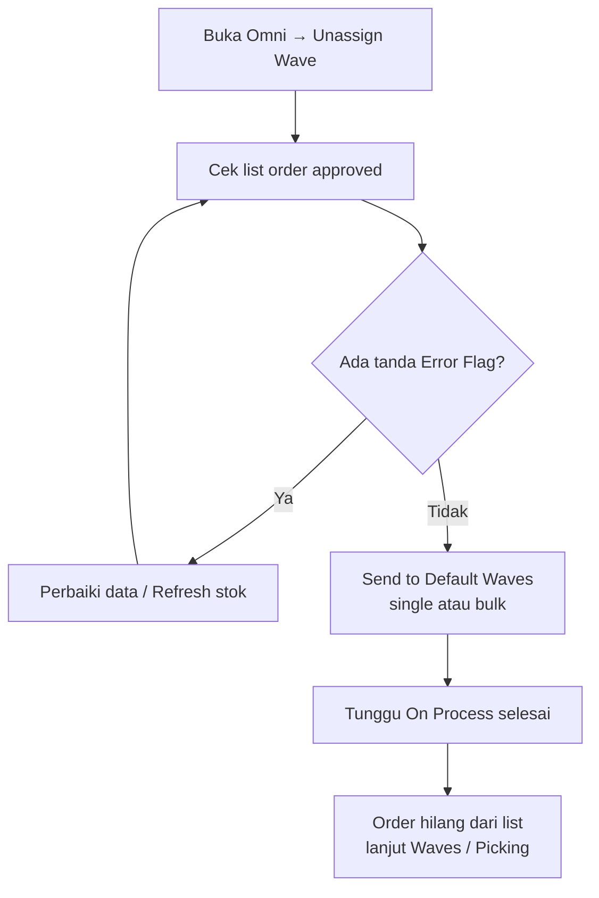

# Unassign Wave — Knowledge Base (Operator)

**Audience:** Warehouse Operation / Fulfillment, Support  
**Route:** `/omni/unassign-wave`

---

## 1. Apa itu Unassign Wave?

Unassign Wave adalah **antrian order yang sudah disetujui** tetapi belum dikirim ke proses gudang (Default Wave). Dari sini operator memilih order lalu klik **Send to Default Waves** supaya stok di-reserve dan order siap masuk picking.

Tanpa langkah ini, order tidak masuk rantai fulfillment gudang.

---

## 2. Kapan dipakai?

| ✅ Pakai Unassign Wave jika | ❌ Jangan harapkan order muncul jika |
|-----------------------------|--------------------------------------|
| Order Platform / General sudah **approved** | Order masih draft / open |
| Order belum dikirim ke Default Wave | Order sudah sukses “send” (hilang dari list) |
| Mau cek order bermasalah (Failed Process) atau yang sedang diproses | Qty barang sudah mulai keluar dari order |

---

## 3. Alur kerja standar

Happy path: order approved masuk list → cek error → kirim ke Default Wave → order hilang dari list → lanjut Waves Management / Picking.

**Keterangan langkah:**

- **Cek list:** pastikan order yang dimaksud muncul. Kalau tidak, cek status approval dan apakah sudah pernah sukses dikirim.
- **Error Flag:** hover icon untuk tahu jenis masalah (produk belum terhubung, stok kurang, shipping, dll).
- **Refresh Availability Stock:** khusus setelah stok digudang sudah ditambah — membersihkan tanda “stok tidak cukup”.
- **Send single:** tombol di kolom Action per baris.
- **Send bulk:** centang beberapa baris → toolbar **Send to Default Waves** di atas tabel.
- **On Process:** order sedang diproses sistem; tunggu sampai selesai. Sukses = hilang dari list. Gagal = kembali ke list (sering masuk Failed Process).

---

## 4. Pill Failed Process & Error Flag

Pill **Failed Process** memfilter order yang bermasalah dan perlu dicek sebelum dikirim ke gudang.

| Tanda (Error Flag) | Artinya (awam) | Biasanya perbaiki di |
|--------------------|----------------|----------------------|
| Shipping | Layanan kirim belum terhubung / berat-dimensi bermasalah | Binding shipping, data produk |
| Bind | Produk order belum terhubung ke produk sistem | Product Binding |
| COA | Pengaturan akun produk belum lengkap | Product COA |
| Stock | Stok di gudang proses kurang | Stock In / Transfer, lalu Refresh |
| Price | Harga jual kosong | Edit order / sync platform |
| Bundle | Isi bundle tidak lengkap | System Product Bundle |
| Warehouse | Gudang proses store belum di-set | Setting store / default warehouse |
| Cancelled | Order dibatalkan di platform | Ikuti SOP cancel |
| Broken data | Data platform tidak lengkap | Perbaiki data order |

Satu order bisa punya beberapa tanda sekaligus.

> Kadang order masuk Failed Process **tanpa** icon di kolom Error Flag — biasanya karena store belum punya gudang proses. Cek setting warehouse di store terkait. Perbaikan perilaku tampilan sudah terdaftar.

---

## 5. Pill On Process to Default Waves

Menampilkan order yang **sedang diproses** kirim ke gudang, lengkap dengan jumlah order. Pill ini dan Failed Process tidak bisa aktif bersamaan — pilih salah satu.

---

## 6. Refresh Availability Stock

Tombol ini **hanya** untuk masalah stok:

1. Sistem cek ulang stok terbaru di gudang proses.
2. Kalau sudah cukup → tanda stock error hilang.
3. Tanda lain (bind, shipping, COA, dll) **tidak** hilang — harus diperbaiki manual dulu.

Setelah refresh sukses, baru retry **Send to Default Waves**.

---

## 7. Send Wave Logs

Buka **Log Data** untuk melihat histori kirim ke Default Wave: sukses/gagal, pesan error, waktu mulai/selesai, siapa yang proses.

- Satu baris = satu order (meski kamu kirim lewat bulk).
- Log dari menu **Skip Wave Process** juga muncul di sini.

---

## 8. Troubleshooting

| Gejala | Penyebab umum | Solusi |
|--------|---------------|--------|
| Order tidak muncul di list | Belum approved, sudah sukses dikirim, atau (General) setting proses ke wave dimatikan | Cek status order & setting terkait |
| Ada tanda merah di Error Flag | Data master/order belum lengkap | Hover flag → perbaiki sesuai jenis → Send ulang |
| Failed Process tanpa icon error | Store belum punya gudang proses | Cek setting warehouse store |
| Tombol kirim tidak bisa / abu-abu | Order sedang On Process, atau setting mematikan proses untuk tipe tertentu | Tunggu proses selesai / cek setting |
| Sudah kirim tapi muncul lagi di list | Proses gagal di tengah | Buka Send Wave Logs, baca pesan error |
| Stok sudah ditambah tapi masih stock error | Data stok belum di-refresh | Klik **Refresh Availability Stock** |
| Angka pill Failed Process beda dengan jumlah baris filter | Perbedaan cakupan hitungan vs filter | Percaya isi tabel setelah filter; perbaikan konsistensi sudah terdaftar |

---

## 9. FAQ

**Q: Apa bedanya Unassign Wave dengan Skip Wave Process?**  
A: Unassign Wave = kirim ke Default Wave saja. Skip Wave Process = shortcut batch yang lanjut sampai shipped, tapi langkah wave-nya memakai aturan yang sama dan log-nya sama.

**Q: Harus perbaiki semua error dulu baru boleh Send?**  
A: Ya untuk error non-stok. Untuk stok, bisa coba Refresh dulu kalau stok fisik sudah cukup.

**Q: Kenapa General order saya tidak muncul?**  
A: Cek Order Process Setting — jika proses ke wave dimatikan, hanya order Platform yang masuk list ini.
