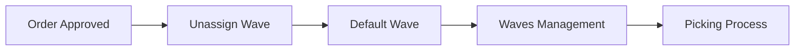
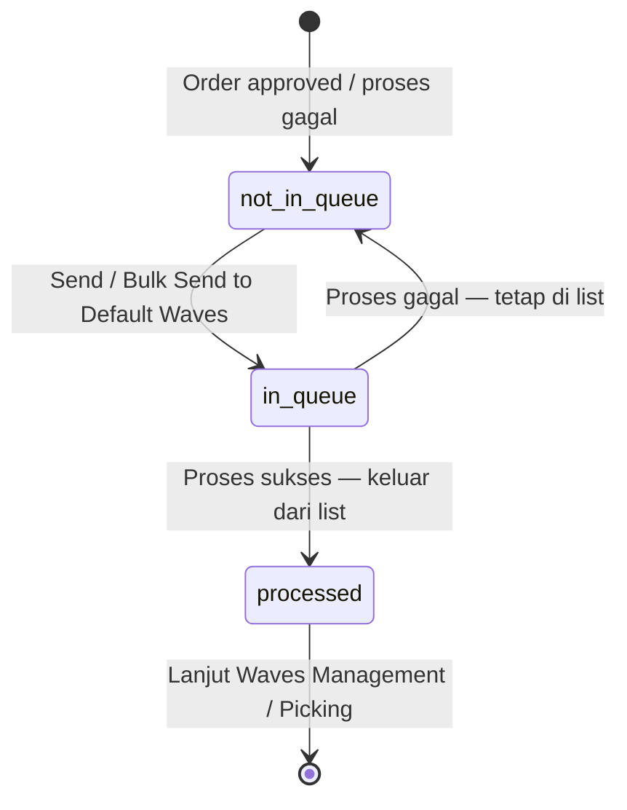
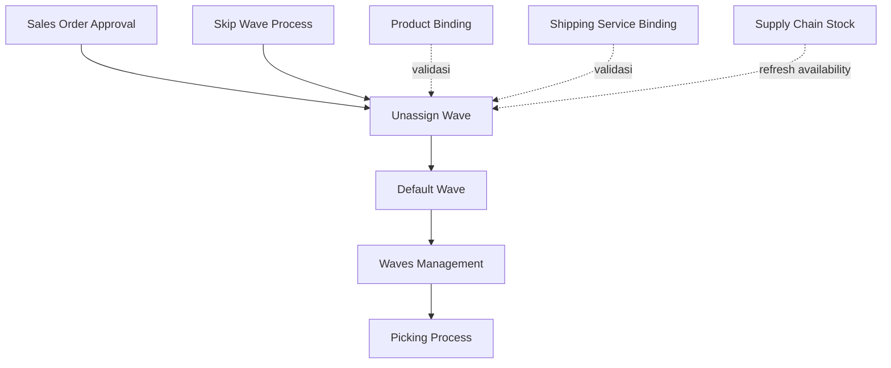

# Unassign Wave — Requirement Documentation

**Modul:** SupplyChain / OmniChannel  
**Prefix:** `UW-`  
**Audience:** PM, Warehouse Ops, QA  
**UI route:** `/omni/unassign-wave`  
**SoT:** `unassign-waves-source-of-truth.md` v1.0 (18 Jul 2026)

---

## 0. Metadata & Changelog

| Version | Date | Author | Changes |
|---------|------|--------|---------|
| 1.0 | 2026-07-20 | QA - Yemima | Draft awal dari SoT v1.0 + verifikasi eligibility/count/send di codebase |

---

## 1. Ringkasan Eksekutif

Unassign Wave adalah **gate utama** sebelum order lanjut ke processing gudang. Menu menampilkan order type **Platform** dan **General** yang sudah **approved** (atau `processed` di level transaksi, selama belum keluar qty) dan belum sukses dikirim ke Default Wave. Operator menjalankan **Send to Default Waves** (single/bulk) agar stock ter-reserve dan order siap masuk rantai fulfillment (picking → checking → packing → shipping).

| Kebutuhan bisnis | Jawaban Unassign Wave |
|------------------|----------------------|
| Antrian order siap gudang | Datalist order belum `unassign_wave_status = processed` |
| Reserve stock ke wave | Send to Default Waves (single / bulk) |
| Deteksi order bermasalah | Pill Failed Process + kolom Error Flag |
| Monitoring antrian proses | Pill On Process to Default Waves + ProgressChecker |
| Audit eksekusi | Slideover Send Wave Logs (1 baris per order) |

### 1.1 Rantai proses

---

## 2. Prasyarat

| Prasyarat | Sumber | Catatan |
|-----------|--------|---------|
| Order berstatus approved (list juga menerima transaction_status processed) | Sales Order Platform / General | Draft / open tidak masuk list |
| Order type Platform atau General | Sales Order | Kedua tipe di datalist yang sama |
| Detail order belum punya qty outbound (`prepared_to_out_quantity` / `processed_to_out_quantity` = 0) | Sales Order detail | Ada qty keluar → tidak eligible |
| Setting proses ke wave | Order Process Setting (`process_to_wave`) | Jika `process_to_wave = 0`, order **General** dikecualikan dari list dan ditolak saat single send |

---

## 3. Siklus Status

Status yang relevan di menu ini adalah `unassign_wave_status` (bukan transaction_status Sales Order).

| Status | Kondisi transisi | Muncul di Unassign Wave? | Tombol |
|--------|------------------|--------------------------|--------|
| **Not in queue** | Baru eligible, atau gagal setelah in queue | Ya | **Send to Default Waves** aktif (single) |
| **In queue** | Sedang diproses (single/bulk) | Ya — pill On Process | Single send ditolak; UI menonaktifkan aksi proses |
| **Processed** | Sukses ke Default Wave | Tidak | Tidak ada — hilang dari list |

---

## 4. Datalist

**URL:** `/omni/unassign-wave`

### 4.1 Fitur di atas datatable

| Fitur | Perilaku |
|-------|----------|
| Pill **Failed Process** | Filter order eligible yang punya error flag (header/detail) **atau** store tanpa konfigurasi warehouse process. Perilaku sejenis Failed Process di Sales Order Platform/General |
| Pill **On Process to Default Waves {count}** | Filter `unassign_wave_status = in queue` + counter |
| Global Search | Across kolom datatable |
| Advanced Filter | Multi kondisi |
| **Refresh Availability Stock** | Cek ulang availability stock di warehouse process; hapus flag stock error jika sudah cukup |
| Column show/hide | Standar datatable |
| Export | Advanced export with/without detail |
| **Log Data (Send Wave Logs)** | Slide right — histori send to default waves |
| Toolbar bulk | Muncul saat ada row tercentang → **Send to Default Waves** |

Pill Failed Process dan On Process **saling eksklusif** di UI (mengaktifkan satu menonaktifkan yang lain).

### 4.2 Kolom datatable utama

| # | Kolom | Keterangan |
|---|-------|------------|
| 1 | Trx Code \| Platform Order | Kode internal + kode platform |
| 2 | Error Flag | Icon error — lihat §6.1 |
| 3 | Store Name \| Buyer Name | Store dan buyer |
| 4 | Shipper \| Tracking Number | Logistik |
| 5 | Pre-sale Time \| Trx Date | Pre-sale dan tanggal transaksi |
| 6 | Payment Time \| Deadline Time | Pembayaran dan deadline |
| 7 | Trx Status \| Platform Status | Status internal dan platform |
| 8 | Process | Hanya stage wave (stage 1). Order sukses tidak lagi di list |
| 9 | Total SKU \| Total Qty Products | Agregat |
| 10 | Created by \| Created at | Audit |
| 11 | Action | **Send to Default Waves** per row |

Checkbox kiri untuk select multiple + toolbar bulk.

### 4.3 Slideover Send Wave Logs

Fitur: global search, advanced filter, column show/hide, export advanced.

| # | Kolom | Keterangan |
|---|-------|------------|
| 1 | Trx Code \| Platform Order | Order terkait |
| 2 | Store | Store order |
| 3 | Status | success / failed (dan in progress selama jalan) |
| 4 | Error Message | Pesan gagal |
| 5 | Started at | Mulai proses |
| 6 | Completed at | Selesai (sukses/gagal) |
| 7 | Processed by | User eksekutor |
| 8 | Notes | **Satu baris per order**, bukan per batch — bulk tetap menghasilkan banyak baris |

---

## 5. Form & Field

Bukan form create/edit transaksi. Interaksi operator:

| Permukaan | Field yang bisa diinteraksi | Catatan |
|-----------|----------------------------|---------|
| Datalist | Checkbox, pill filter, advanced filter, action buttons | Tidak ada input transaksi baru |
| Send Wave Logs | Read-only | Tidak ada field edit |

---

## 6. How It Works

### 6.1 Pill Failed Process & Error Flag

Order eligible yang gagal validasi send, atau store belum punya warehouse process.

| Flag | Arti | Akar masalah tipikal |
|------|------|----------------------|
| Shipping error | Shipping belum bind / berat-dimensi melebihi batas | Binding shipping, DNW produk |
| Bind error | Produk belum binding ke system product | Product Binding |
| COA error | COA produk belum lengkap | Product COA |
| Stock error | Stock FIFO warehouse process kurang | Stock In / Transfer |
| Price error | Harga jual kosong | Edit order / sync platform |
| Bundle error | Komponen bundle tidak lengkap | System Product Bundle |
| Warehouse error | Warehouse process belum di-set | Store Omni / Default Warehouse |
| Cancelled | Order dibatalkan di platform | SOP cancel |
| Broken data | Data platform tidak lengkap | Perbaikan data order |

Satu order bisa punya lebih dari satu flag. Store tanpa warehouse process bisa masuk Failed Process **tanpa** icon Error Flag (lihat GAP-UW-01).

### 6.2 Pill On Process to Default Waves

Filter + counter order `in queue`. Eksklusif dengan Failed Process di UI.

### 6.3 Refresh Availability Stock

1. Ambil order Unassign Wave yang punya error terkait stock.
2. Cek ulang availability di warehouse process (termasuk warehouse anak non-virtual).
3. Jika stock cukup → hapus flag stock error di order/detail.
4. Error non-stock (bind, shipping, COA, dll) **tidak** dihapus.

### 6.4 Send to Default Waves — single & bulk

- **Single:** Action per row.
- **Bulk:** Checkbox → toolbar **Send to Default Waves**.

Setelah klik: status → `in queue`, muncul di pill On Process. Sukses → `processed` (hilang dari list). Gagal → kembali `not in queue`; masuk Failed Process jika ada error tersimpan.

**Disable / reject kondisi (AS-IS):**

| Kondisi | Behavior |
|---------|----------|
| `unassign_wave_status` bukan `not in queue` | Single: error *"Sales order has been send to default wave."* |
| `process_to_wave = 0` dan order General | Single: error setting off; bulk: General di-skip dari selection |
| Bundle components tidak lengkap | Error validasi sebelum job di-dispatch (bulk: satu gagal menghentikan dispatch batch di entry point ini) |

### 6.5 Send Wave Logs

Histori tiap attempt send (dari Unassign Wave **atau** Skip Wave Process). Satu baris = satu order per attempt.

### 6.6 Relasi Skip Wave Process

Skip Wave Process = shortcut batch yang menggabungkan send-to-default-wave + skip processing sampai shipped. Validasi wave memakai jalur job yang sama (`SOApproveToWave`); log muncul di Send Wave Logs yang sama.

---

## 7. Validasi

### 7.1 Eligibility masuk datalist

| # | Kondisi | Arti bisnis |
|---|---------|-------------|
| E1 | `unassign_wave_status` ∈ {not in queue, in queue} | Belum sukses ke default wave |
| E2 | `transaction_status` ∈ {approved, processed} | Sudah lolos approval (atau processed tanpa outbound qty) |
| E3 | Tidak ada detail dengan `prepared_to_out_quantity` / `processed_to_out_quantity` lebih dari 0 | Belum ada qty keluar |
| E4 | Jika `process_to_wave = 0` → hanya type Platform | General dikecualikan |

### 7.2 Validasi saat Send to Default Waves

| # | Kondisi | Behavior | Error message (contoh) |
|---|---------|----------|------------------------|
| V1 | Harus `not in queue` saat trigger | Tolak jika sudah in queue / processed | Sales order has been send to default wave. |
| V2 | Bundle components lengkap | Tolak sebelum dispatch | Order tidak bisa diproses, detail bundle tidak ditemukan |
| V3 | Validasi order/detail (binding, COA, harga, bundle, stock, shipping, cancel) | Gagal → flag error + log failed | Bervariasi per flag |
| V4 | Store aktif / tidak terhapus | Gagal, tercatat di log | Store inactive / Store deleted |
| V5 | Lock per warehouse process | Tunggu antrian; bisa timeout | Lock wait timeout acquiring warehouse process lock |
| V6 | `process_to_wave` untuk General | Tolak jika setting off | Cannot process to wave because the setting is currently off. |

### 7.3 Validasi bulk action

| # | Kondisi | Behavior |
|---|---------|----------|
| B1 | Satu order gagal di job batch tidak menghentikan order lain | `allowFailures` pada Bus batch |
| B2 | Setelah batch selesai, sisa `in queue` direset ke `not in queue` | Mencegah status menggantung |
| B3 | Validasi bundle di entry bulk | Gagal di satu SO menghentikan seluruh dispatch (return error) — beda dari failure di dalam job |

---

## 8. Relasi Menu Lain

| Menu | Peran |
|------|-------|
| Sales Order Approval (Platform / General) | Hulu — approved masuk antrian |
| Skip Wave Process | Shortcut batch; reuse job + log yang sama |
| Default Wave / Waves Management | Hilir setelah sukses |
| Product Binding | Selesaikan Bind error |
| Shipping Service Binding | Selesaikan Shipping error |
| Supply Chain Stock | Sumber Refresh Availability Stock |

---

## 9. Gap Registry

| ID | Deskripsi | Dampak | Status |
|----|-----------|--------|--------|
| GAP-UW-01 | Order Failed Process karena store tanpa warehouse process bisa tampil tanpa icon Error Flag (counter pill tetap hitung) | Operator bingung kenapa masuk Failed Process tanpa icon | Open |
| GAP-UW-02 | Counter Failed Process (`transaction_status = approved` saja) vs filter list (`approved` + `processed`) tidak identik | Angka pill bisa beda dari jumlah baris filter | Open |
| GAP-UW-03 | Disable condition tombol Send belum sepenuhnya terdokumentasi di UI (AS-IS API: tolak jika bukan not in queue / setting off) | Test case QA perlu cover API + UI disable state | Open — sebagian terisi di §6.4 |

---

## 10. FAQ

**Q: Kenapa order approved belum muncul?**  
A: Cek belum ada qty outbound di detail, dan (untuk General) setting `process_to_wave` masih aktif.

**Q: Failed Process tapi Error Flag kosong?**  
A: Sering karena store belum punya warehouse process — bukan error validasi biasa. Lihat GAP-UW-01.

**Q: Bedanya Refresh Availability Stock vs retry Send?**  
A: Refresh hanya membersihkan stock error jika stok sudah cukup. Error lain harus diperbaiki dulu, lalu Send ulang.

**Q: Sudah diproses tapi masih di list?**  
A: Proses gagal → kembali not in queue. Cek Send Wave Logs.

**Q: Beda Unassign Wave vs Skip Wave Process?**  
A: Skip Wave = shortcut batch sampai shipped; validasi wave dan log-nya sama dengan Unassign Wave.

---

## 11. Changelog (file)

| Version | Date | Changes |
|---------|------|---------|
| 1.0 | 2026-07-20 | Initial dari SoT + codebase eligibility/count/send |
