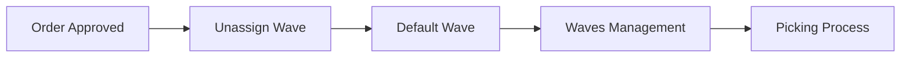
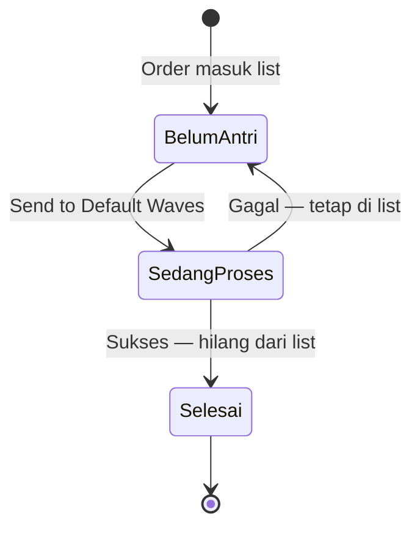

# Unassign Wave — Panduan Pengguna

**Siapa yang baca panduan ini:** warehouse ops, fulfillment, support  
**Menu di sistem:** Omni → Unassign Wave

---

## 1. Apa Itu & Kenapa Penting

Unassign Wave adalah antrian order yang **sudah disetujui** tetapi **belum dikirim ke proses gudang**. Dari sini kamu mengirim order ke Default Wave supaya stok di-reserve dan order siap masuk picking.

Tanpa langkah ini, order tidak lanjut ke rantai gudang (picking, checking, packing, shipping).

---

## 2. Overview Flow & Proses Bisnis

### Rantai proses

**Versi teks (tanpa diagram):**

1. Order Platform / General **di-approve**.
2. Order muncul di **Unassign Wave**.
3. Operator klik **Send to Default Waves** (satu per satu atau banyak sekaligus).
4. Order masuk **Default Wave** / **Waves Management**.
5. Lanjut **Picking** (lalu checking, packing, shipping sesuai proses gudang).

🎬 [Interactive demo akan ditambahkan di sini]

### Siklus status di menu ini

**Versi teks — arti tiap status:**

| Status di layar | Artinya | Masih di list? |
|-----------------|---------|----------------|
| Belum antri (siap kirim) | Bisa diklik Send | Ya |
| Sedang diproses (On Process) | Sistem sedang mengirim ke Default Wave | Ya, di pill On Process |
| Selesai | Sukses ke Default Wave | Tidak — hilang dari list |

---

## 3. Sebelum Mulai (Flow Sebelum)

Pastikan ini sudah siap:

- Order sudah **approved** (bukan draft/open).
- Produk di order sudah terhubung ke produk sistem, punya harga, COA, dan (jika bundle) komponen lengkap.
- Shipping service sudah ter-bind jika dibutuhkan.
- Store punya **gudang proses**.
- Stok di gudang proses cukup untuk qty order.
- Untuk order **General**: setting proses ke wave masih aktif (kalau dimatikan, order General tidak muncul di sini).

🎬 [Interactive demo akan ditambahkan di sini]

---

## 4. Setelah Selesai (Flow Sesudah)

Kalau **Send to Default Waves** sukses:

- Order **hilang** dari Unassign Wave.
- Order masuk Default Wave / Waves Management.
- Tim gudang bisa lanjut picking.

Kalau gagal:

- Order **tetap** di list.
- Cek tanda Error Flag dan/atau **Send Wave Logs** untuk pesan gagalnya.
- Perbaiki data → kirim ulang (atau Refresh stok dulu jika masalahnya stok).

Ada jalur shortcut **Skip Wave Process** yang bisa memproses banyak order sekaligus sampai shipped — langkah wave-nya tetap memakai aturan yang sama, dan log-nya tetap bisa dilihat di Send Wave Logs.

🎬 [Interactive demo akan ditambahkan di sini]

---

## 5. Yang Perlu Diperhatikan

- Kalau kamu kirim order yang **sedang diproses** atau **sudah pernah sukses dikirim**, sistem menolak / tombol tidak aktif.
- Kalau **isi bundle tidak lengkap**, sistem menolak sebelum proses jalan.
- Kalau ada masalah data (produk belum terhubung, stok kurang, shipping, harga kosong, dll), proses gagal dan order punya tanda peringatan — perbaiki dulu baru kirim ulang.
- Kalau **store tidak aktif / terhapus**, proses gagal dan tercatat di log.
- Kalau banyak order dikirim bersamaan ke gudang yang sama, sistem mengantri per gudang; bisa timeout dan muncul di log.
- Kalau setting proses ke wave **dimatikan**, order General tidak bisa dikirim lewat menu ini.
- Satu order gagal dalam kirim massal **tidak** menghentikan order lain yang sudah masuk antrian proses (kecuali gagal di pengecekan awal sebelum antrian dibuat).
- Setelah batch selesai, order yang “nyangkut” di sedang-proses akan dikembalikan ke siap kirim supaya tidak menggantung.

---

## 6. Langkah-Langkah (Step by Step)

1. Buka **Omni → Unassign Wave**.
2. Cek list order. Pakai pencarian / advanced filter bila perlu.
3. (Opsional) Aktifkan pill **Failed Process** untuk fokus ke order bermasalah.
4. Hover kolom **Error Flag** — perbaiki data sesuai jenis tanda.
5. Jika masalahnya stok dan stok fisik sudah ditambah: klik **Refresh Availability Stock**, lalu cek lagi apakah tanda stok hilang.
6. Kirim satu order: klik **Send to Default Waves** di kolom Action.
7. Atau kirim banyak: centang baris → klik **Send to Default Waves** di toolbar atas.
8. Pantau pill **On Process to Default Waves** sampai selesai.
9. Order sukses hilang dari list → lanjut di Waves Management / Picking.
10. Jika gagal: buka **Log Data (Send Wave Logs)**, baca pesan error, perbaiki, ulangi dari langkah 4–7.

🎬 [Interactive demo akan ditambahkan di sini]

---

## 7. Tips & Hal yang Sering Bikin Bingung

- **Order approved tapi tidak muncul** — cek apakah sudah pernah sukses dikirim, apakah ada qty yang sudah keluar, atau (General) setting proses ke wave dimatikan.
- **Masuk Failed Process tapi tidak ada icon error** — sering karena store belum punya gudang proses. Cek setting store dulu.
- **Refresh stok vs kirim ulang** — Refresh hanya membersihkan tanda stok kurang. Tanda lain harus diperbaiki manual.
- **Sudah klik Send tapi order muncul lagi** — proses gagal. Baca Send Wave Logs.
- **Angka di pill Failed Process beda dengan jumlah baris** — percaya isi tabel setelah filter aktif; perbedaan hitungan sedang dicatat untuk perbaikan.
- **Skip Wave Process** — shortcut batch sampai shipped; log wave-nya tetap di Send Wave Logs Unassign Wave.

---

## 8. Referensi

| Butuh | Buka |
|-------|------|
| Aturan lengkap & gap QA | [requirement.md](./requirement.md) |
| Troubleshooting operator | [knowledge-base.md](./knowledge-base.md) |
| API, job, tabel, invariant | [technical.md](./technical.md) |

**Related menus:** Sales Order Approval (Platform/General) · Skip Wave Process · Waves Management · Product Binding · Shipping Service Binding · Supply Chain Stock
