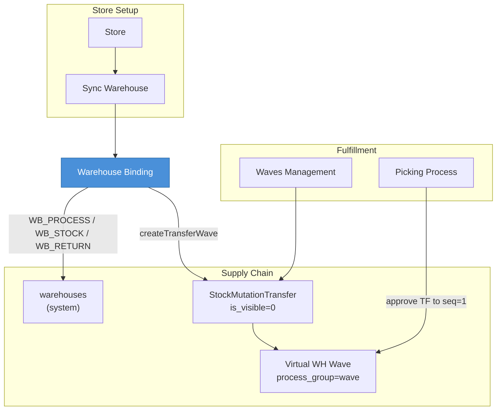
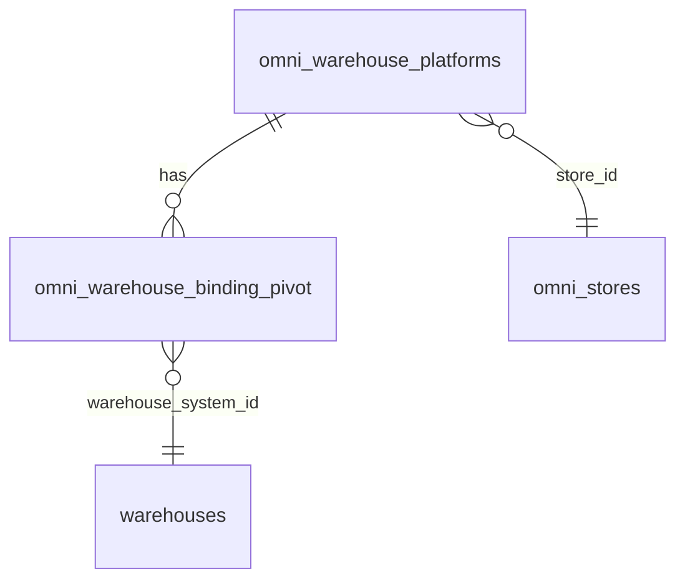

# Warehouse Binding — Requirement Documentation

> **Status: DRAFT** — Dokumentasi AS-IS pertama (2026-06-19). Belum melalui review QA/PM.

## 0. Metadata & Changelog

| Version | Date | Author | Changes |
|---------|------|--------|---------|
| 1.0 | 2026-06-19 | QA - Yemima | Initial AS-IS draft |

**UI route:** `/omni/warehouse-binding`  
**API:** `omnichannel/warehouse-binding`  
**Table:** `omni_warehouse_binding_pivot`

---

## 1. Ringkasan

Menu **Warehouse Binding** mengelola pivot antara `omni_warehouse_platforms` (marketplace) dan `warehouses` (sistem). Tiga tipe: **Process**, **Stock**, **Return**. Binding **Process** memicu `createTransferWave` yang membuat dokumen `StockMutationTransfer` internal (hidden) dari WH proses ke virtual WH wave per definisi wave aktif.

---

## 2. Acceptance Criteria (AS-IS)

| ID | Kriteria | Validasi |
|----|----------|----------|
| A-01 | DataList WH platform dengan kolom platform, WH stock, WH process | `WarehousePlatform` join Store |
| A-02 | Create binding type Process | 1 WH system per WH platform |
| A-03 | Create binding type Stock | Multi WH system allowed |
| A-04 | Create binding type Return | Optional WH system |
| A-05 | Process bind → auto stock bind | Create `WB_STOCK` if missing |
| A-06 | Process bind → `createTransferWave` | Hidden TF per wave |
| A-07 | Process bind → `include_ats = 1` | Audit log auto-activation |
| A-08 | WH process level ≤ 30 | `warehouseSpaceType.level` check |
| A-09 | Delete binding dari detail | `destroy` policy |
| A-10 | Select2 WH by type | process / stock / return endpoints |

---

## 3. Validasi & Rules

| ID | Rule | Trigger | Pesan |
|----|------|---------|-------|
| V-01 | `warehouse_platform_id` required array distinct | store() | Laravel validation |
| V-02 | `warehouse_system_id` required unless type Return | store() | required_unless Return |
| V-03 | Process: WH level ≤ 30 | WB_PROCESS | "Warehouse process level must be under 31." |
| V-04 | Return: WH level ≤ 30 jika diisi | WB_RETURN | Same message |
| V-05 | Stock: hapus binding stock orphan per store | store + store_id | Delete where not in selection |
| V-06 | Process: hapus process binding lain di store | store + store_id | whereNotIn platform ids |

---

## 4. Fitur & Behavior per Tipe

### 4.1 Process (`WB_PROCESS`)

| Step | Behavior |
|------|----------|
| 1 | Upsert pivot Process untuk setiap `warehouse_platform_id` |
| 2 | `createTransferWave(warehouse_system_id)` |
| 3 | Auto-create Stock pivot jika belum ada |
| 4 | Enable `include_ats` on warehouse + CustomAudit |
| 5 | Hapus Process binding lain di store (jika `store_id` dikirim) |

### 4.2 Stock (`WB_STOCK`)

| Step | Behavior |
|------|----------|
| 1 | Create pivot Stock untuk setiap kombinasi platform × system |
| 2 | Hapus Stock binding lama yang tidak ada di request |
| 3 | Preserve Process/Return bindings saat cleanup stock |

### 4.3 Return (`WB_RETURN`)

| Step | Behavior |
|------|----------|
| 1 | Upsert atau delete jika `warehouse_system_id` kosong |
| 2 | `createTransferWave` jika WH diisi |
| 3 | Cleanup Return binding lain di store |

---

## 5. Diagram Relasi

---

## 6. Permission & Dependencies

| Item | Detail |
|------|--------|
| Policy | `WarehouseBindingPolicy` — viewAny, create, update, delete |
| Prerequisite | Store authorized + sync warehouse |
| WH Structure | Building-level WH untuk Stock; process-level untuk Process |
| Wave | `Wave::all()` dipakai `createTransferWave` |

---

## 7. QA Test Notes

- [ ] Bind Process → cek pivot + stock auto + include_ats audit
- [ ] Bind Process → cek hidden transfer per wave di DB
- [ ] Bind Stock multi-WH → hapus yang tidak dipilih
- [ ] Bind Return kosong → pivot deleted
- [ ] WH level 31+ → error
- [ ] Grid filter platform name & WH name

---

## 8. Known Gaps

- `update()` method kosong — edit hanya via re-create Process/Return
- Order column `warehouse_stock` pakai subquery max created_at — edge case multi binding

---

## Related Documents

| Doc | Path |
|-----|------|
| Knowledge Base | [knowledge-base.md](./knowledge-base.md) |
| Technical | [technical.md](./technical.md) |
| Store | [../omni-store-binding/requirement.md](../omni-store-binding/requirement.md) |
