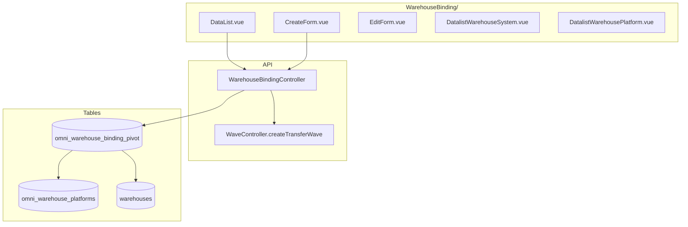
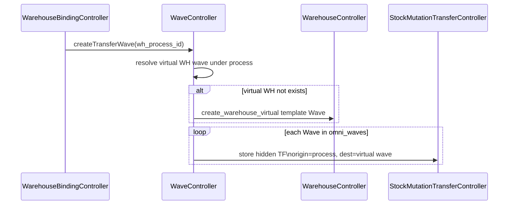

# Warehouse Binding — Technical Documentation

> **Status: DRAFT** — Dokumentasi AS-IS pertama (2026-06-19). Belum melalui review QA/PM.

## 1. Architecture Overview



---

## 2. Frontend File Map

**Root:** `olshoperp-frontend/src/pages/Omni/master/WarehouseBinding/`

| File | Role | Key API |
|------|------|---------|
| `DataList.vue` | Grid WH platform | `GET omnichannel/warehouse-binding` |
| `CreateForm.vue` | Create binding by type | `POST omnichannel/warehouse-binding` |
| `EditForm.vue` | Edit Process/Return | `POST` (re-bind) |
| `DatalistWarehousePlatform.vue` | Picker WH platform | select2 warehouse-platform |
| `DatalistWarehouseSystem.vue` | Detail bindings per platform | `GET warehouse-binding/{id}` |

---

## 3. Backend File Map

| File | Role |
|------|------|
| `WarehouseBindingController.php` | index, store, show, destroy, select2 |
| `Entities/WarehouseBinding.php` | Constants `WB_PROCESS`, `WB_STOCK`, `WB_RETURN` |
| `Entities/WarehousePlatform.php` | `warehouse_process()`, `warehouse_stock()` helpers |
| `WaveController.php` | `createTransferWave($warehouse_process)` |
| `StoreController.php` | Alternate entry: `updateProcessWarehousesV2`, etc. |

---

## 4. API Routes

| Method | Path | Action |
|--------|------|--------|
| GET | `warehouse-binding` | index (datalist) |
| POST | `warehouse-binding` | store (create bindings) |
| GET | `warehouse-binding/{id}` | show (bindings per WH platform) |
| DELETE | `warehouse-binding/{WarehouseBinding}` | destroy |
| GET | `warehouse-binding/select2/warehouse-system-process` | WH process picker |
| GET | `warehouse-binding/select2/warehouse-system-stock` | WH stock picker |
| GET | `warehouse-binding/select2/warehouse-system-return` | WH return picker |
| GET | `warehouse-binding/select2/warehouse-platform` | WH platform picker |
| GET | `warehouse-binding/select2/type` | Binding type enum |

**Request body (store):**

```json
{
  "type": "Process|Stock|Return",
  "warehouse_platform_id": [1, 2],
  "warehouse_system_id": [10],
  "store_id": 5
}
```

---

## 5. Database Schema

**Table:** `omni_warehouse_binding_pivot` — [schema doc](../../db-schema/omni_channel/omni_warehouse_binding_pivot.md)

| Column | Notes |
|--------|-------|
| `warehouse_platform_id` | FK `omni_warehouse_platforms.id` |
| `warehouse_system_id` | FK `warehouses.id` |
| `type` | `Process` / `Stock` / `Return` |
| `code` | Generated for Stock type |
| `owned_by` | Company scope |

---

## 6. createTransferWave Side-Effect

Dipanggil dari `WarehouseBindingController@store` saat type **Process** atau **Return** (dengan WH).



**TF attributes (AS-IS):**

- `warehouse_origin` = WH process
- `warehouse_destination` = virtual WH wave (`process_group = wave`)
- `transaction_reference_class` = `Wave::class`
- `is_visible` = 0
- `transaction_status` = OPEN

---

## 7. Select2 Constraints

| Endpoint | Filter |
|----------|--------|
| `select2WarehouseSystemProcess` | `include_ats=1`, `for_wh_binding`, under_31=false |
| `select2WarehouseSystemStock` | `warehouse_space_type_id` = building level |
| `select2WarehouseSystemReturn` | Same family as process |

---

## 8. Related db-schema

- [omni_warehouse_binding_pivot.md](../../db-schema/omni_channel/omni_warehouse_binding_pivot.md)
- [omni_warehouse_platforms.md](../../db-schema/omni_channel/omni_warehouse_platforms.md) (if exists)
