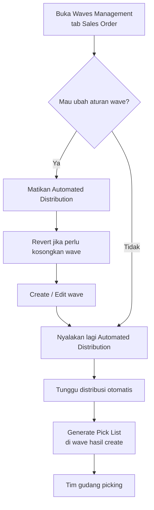

# Waves Management — Knowledge Base (Operator)

**Audience:** Warehouse Operation / Fulfillment Lead, Support  
**Route:** `/omni/waves-management`

---

## 1. Apa itu Waves Management?

Waves Management mengatur **kelompok order (dan transfer)** yang siap dipicking bareng. Sistem bisa **otomatis memindahkan** order dari tampungan utama (**Default Waves**) ke kelompok khusus (wave) sesuai aturan yang kamu buat — misalnya platform, store, rak, atau produk tertentu.

Dua tab:

| Tab | Untuk apa |
|-----|-----------|
| **Sales Order** | Order marketplace/general → distribusi ke wave → Generate Pick List |
| **Waves Transfer** | Transfer antar gudang yang butuh picking list |

---

## 2. Kapan dipakai?

| ✅ Pakai jika | ❌ Jangan harapkan jika |
|---------------|-------------------------|
| Order sudah dikirim ke Default Waves (dari Unassign Wave) | Order belum lewat Unassign Wave |
| Mau mengelompokkan picking biar lebih efisien | Mau edit wave sambil automasi masih ON |
| Transfer External dibuat dengan opsi picking list dan sudah di-approve | Transfer tanpa opsi picking list |

---

## 3. Alur kerja standar (Sales Order)

**Keterangan langkah:**

- **Automated Distribution ON:** sistem memindahkan order dari Default Waves ke wave yang cocok, sesuai interval (biasanya tiap beberapa menit).
- **Edit / hapus wave:** hanya saat toggle **OFF**.
- **Revert:** mengembalikan **semua** order di wave khusus ke Default Waves. Mematikan toggle saja **tidak** mengembalikan order.
- **Generate Pick List:** tombol di baris wave yang kamu buat (bukan di Default Waves).
- **Choose Warehouse:** memfilter angka total di kolom (berapa SO/SKU di gudang itu), bukan menyembunyikan baris wave.

---

## 4. Istilah penting

| Istilah | Arti awam |
|---------|-----------|
| **Wave** | Kelompok order/transfer siap pick bareng |
| **Default Waves** | Tampungan utama — order menunggu sebelum masuk kelompok khusus |
| **Automated Distribution** | Proses otomatis mengelompokkan order |
| **Priority** | Urutan wave mana dicek lebih dulu (angka lebih kecil = lebih dulu) |
| **Any / All** | Cukup salah satu syarat, atau harus semua terpenuhi |
| **Exact Match** (produk) | Isi SKU order harus sama persis dengan daftar di wave |
| **Revert** | Kembalikan semua order dari wave khusus ke Default Waves |
| **Picking List** | Daftar barang yang diambil gudang dalam satu dokumen |

---

## 5. Membuat / mengubah wave

Saat Create/Edit, isi aturan kelompok (nama, store wajib, label group, platform/building/rack/shipper opsional), aturan pecah picking list (max order, SKU, berat, dll), dan opsional **Assign Specific Product**.

**Tips:**

- Kosongkan platform di form → dianggap semua platform (sesuai tooltip).
- Centang “Grouped by stores” → sistem ikut mencentang “Grouped by platform”.
- Setelah ubah Building, pilih ulang Rack yang masih di bawah building itu.
- Default Waves **tidak bisa** diedit atau dihapus.

> Field **Minimum order** saat ini lebih ke tampilan di list; belum jadi penahan otomatis agar order menunggu sampai jumlah minimum terpenuhi. Perbaikan sudah terdaftar.

---

## 6. Tab Waves Transfer

- Hanya ada **Default Waves** transfer.
- Tidak ada toggle distribusi / Revert / Create wave baru.
- Transfer muncul jika: dibuat dengan **With Picking List**, sudah **approve**, belum punya picking list.
- Generate picking list bisa manual/bulk; biasanya satu transfer → satu picking list.
- Angka di kolom picking list bisa diklik untuk melihat daftar dokumen.

---

## 7. Troubleshooting

| Gejala | Penyebab umum | Solusi |
|--------|---------------|--------|
| Order menumpuk di Default Waves | Toggle OFF, atau tidak cocok kriteria wave manapun | Nyalakan toggle; cek aturan wave & Last success attempt |
| Tidak bisa ubah wave | Toggle masih ON | Matikan Automated Distribution |
| Toggle OFF tapi order tidak balik | Pause ≠ Revert | Klik **Revert** |
| Tidak bisa hapus wave | Masih ada order di dalamnya, atau itu Default Waves | Revert dulu / jangan hapus Default |
| Transfer tidak muncul | Belum approve, atau tanpa opsi picking list, atau sudah punya PL | Cek flag & status transfer |
| Label angka di tab Transfer membingungkan | Penamaan kolom beda dari tab SO | Percaya tooltip/konteks; perbaikan label sudah terdaftar |

---

## 8. FAQ

**Q: Matikan toggle = order hilang dari wave?**  
A: Tidak. Order tetap di wave sampai kamu **Revert** (atau distribusi memindahkan lagi setelah rules berubah dan toggle ON).

**Q: Kenapa Generate Pick List tidak ada di Default Waves?**  
A: Sengaja — generate dari wave hasil create user (atau jalur transfer di tab Transfer).

**Q: Beda Unassign Wave vs Waves Management?**  
A: Unassign Wave = kirim order ke Default Waves. Waves Management = kelompokkan dari Default Waves ke wave khusus + generate picking list.
