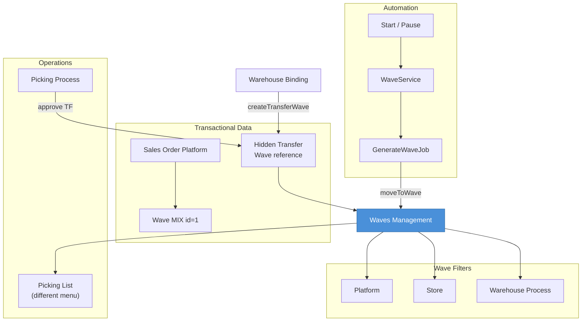
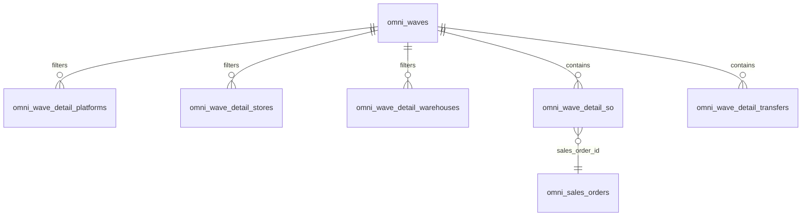

# Waves Management — Requirement Documentation

> **Status: DRAFT** — Dokumentasi AS-IS pertama (2026-06-19). Belum melalui review QA/PM.

## 0. Metadata & Changelog

| Version | Date | Author | Changes |
|---------|------|--------|---------|
| 1.0 | 2026-06-19 | QA - Yemima | Initial AS-IS draft |
| 1.1 | 2026-06-23 | QA - Yemima | Cross-reference Relasi Instant Settlement (Fase 2) |

**UI route:** `/omni/waves-management`  
**API:** `omnichannel/wave/*`  
**Table:** `omni_waves`

---

## 1. Ringkasan

**Waves Management** mengkonfigurasi aturan distribusi SO Platform dan transfer internal ke wave prioritas. Filter utama: **platform**, **store**, **warehouse process**, plus shipper, rack, label group, dan kondisi produk/kuantitas. Otomasi **Start/Pause** mengontrol apakah `GenerateWaveJob` memindahkan SO dari wave default MIX ke wave matching.

---

## 2. Acceptance Criteria (AS-IS)

| ID | Kriteria |
|----|----------|
| A-01 | DataList wave SO dan Transfer (`wave_type` query param) |
| A-02 | Wave MIX (id=1) selalu di atas, non-clickable edit |
| A-03 | CRUD wave custom (priority, filters, conditions) |
| A-04 | Filter platform via `detail_platform` |
| A-05 | Filter store via `detail_store` |
| A-06 | Filter warehouse via `detail_warehouse` |
| A-07 | Start automation → status STARTED |
| A-08 | Pause automation → status PAUSED |
| A-09 | `GenerateWaveJob` distribusi SO ke matching wave |
| A-10 | Revert all wave → `RevertWaveJob` |
| A-11 | Generate picklist dari wave (bulk) |
| A-12 | Warehouse filter header scope SO count per `wh_process_id` |

---

## 3. Validasi & Rules

| ID | Rule | Notes |
|----|------|-------|
| V-01 | `priority` NOT NULL = wave aktif | `scopeActiveWave` |
| V-02 | SO wave: count scoped by `wh_process_id` filter | Employee warehouse area |
| V-03 | Transfer wave: count by `warehouse_origin` | Hidden TF reference |
| V-04 | Pause jika sudah PAUSING/PAUSED | Return error "Wave is not started" |
| V-05 | Start idempotent jika sudah STARTED | No-op |

---

## 4. Fitur & Behavior

| ID | Fitur | Trigger | Result |
|----|-------|---------|--------|
| F-01 | Wave CRUD | Form | `omni_waves` + detail pivot tables |
| F-02 | Platform filter | Wave form multi-select | `omni_wave_detail_platforms` |
| F-03 | Store filter | Wave form | `omni_wave_detail_stores` |
| F-04 | Warehouse filter | Wave form | `omni_wave_detail_warehouses` |
| F-05 | Start automation | POST `wave/generate/start` | `WaveService::start()` |
| F-06 | Pause automation | POST `wave/generate/pause` | `WaveService::pause()` |
| F-07 | Generate wave | `GenerateWaveJob` | `findMatchingWave` → `moveToWave` |
| F-08 | Create transfer wave | `createTransferWave` | Hidden TF per WH process (from WH binding) |
| F-09 | Revert wave | POST `wave/revert-all` | SO kembali ke MIX |
| F-10 | SO detail slideover | Click SO total | `wave/{wave}/so-detail` |
| F-11 | Picklist generation | Bulk action | `GeneratePicklistByWaveJob` |

---

## 5. Diagram Relasi

---

## 6. Wave Matching Logic (ringkas)

`WaveService::findMatchingWave($sales_order, $waves)` mengevaluasi wave berdasarkan (AS-IS):

- Platform & store SO
- `wh_process_id` vs detail warehouse
- Shipper, label group, rack
- Kondisi produk (qty SKU, dimensi, berat)
- Priority ascending — wave pertama yang match menang

---

## 7. QA Test Notes

- [ ] Create wave filter 1 store → SO store lain tetap di MIX
- [ ] Start automation → SO baru pindah dari MIX
- [ ] Pause → SO baru tetap di MIX
- [ ] Filter WH header → SO count berubah per scope
- [ ] Transfer tab → tampil hidden TF dari WH binding
- [ ] Revert all → SO kembali MIX, revert_status UI
- [ ] Generate picklist bulk → job dispatched

---

## 8. Known Gaps

- Pause tidak auto-revert ke MIX (kode revert di-comment)
- `WaveDetailProductTemp` flow — dokumentasi terpisah TBD

## Relasi Instant Settlement

**Dampak ke menu ini:** Wave adalah **awal rantai fulfillment** (Wave → Pick → Check → Pack → Collect → DO → Shipped WH 3PL). SO yang belum masuk wave / belum selesai processing **tidak eligible** upload settlement.

**Prasyarat dari menu ini agar settlement lolos:** SO approved dan assigned ke wave (reserve stok); lanjutkan processing hingga Shipped sebelum upload file settlement.

**Independensi:** Delete settlement **tidak** mengembalikan SO ke wave MIX atau membatalkan reserve — status gudang tetap Shipped. Wave config berubah tidak mempengaruhi batch settlement yang sudah di-upload.

**Detail alur bulk:** [Instant Settlement](../accounting-settlement-upload/requirement.md)

Diagram integrasi: [Instant Settlement §10](../accounting-settlement-upload/requirement.md#10-relasi-menu--integrasi).

---

## Related Documents

| Doc | Path |
|-----|------|
| Knowledge Base | [knowledge-base.md](./knowledge-base.md) |
| Technical | [technical.md](./technical.md) |
| Picking Process | [../omni-picking-process/requirement.md](../omni-picking-process/requirement.md) |
