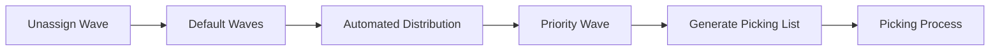
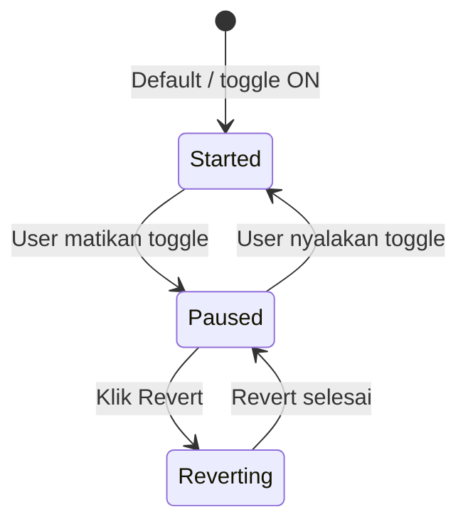
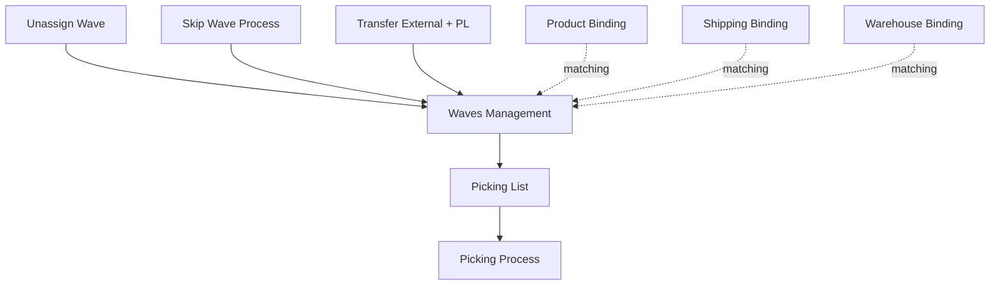

# Waves Management — Requirement Documentation

**Modul:** SupplyChain / OmniChannel  
**Prefix:** `WM-`  
**Audience:** PM, Warehouse Ops, QA  
**UI route:** `/omni/waves-management`  
**SoT:** `waves-management-source-of-truth.md` v1.0 (19 Jul 2026)

---

## 0. Metadata & Changelog

| Version | Date | Author | Changes |
|---------|------|--------|---------|
| 1.0 | 2026-06-19 | QA - Yemima | Initial AS-IS draft (struktur lama) |
| 1.1 | 2026-06-23 | QA - Yemima | Cross-ref Instant Settlement |
| 2.0 | 2026-07-20 | QA - Yemima | Rewrite dari SoT v1.0 + verifikasi matching/revert/transfer/gaps |

---

## 1. Ringkasan Eksekutif

Waves Management mengatur pengelompokan order (dan transfer external dengan picking list) ke dalam **wave** berdasarkan kriteria yang sama, lalu mendistribusikan order dari **Default Waves** ke priority wave lewat **Automated Distribution**. Order di wave siap di-generate picking list agar picking lebih efisien (SKU / lokasi rack / kombinasi kriteria). Audience: Warehouse Operation / Fulfillment Lead.

| Kebutuhan bisnis | Jawaban Waves Management |
|------------------|-------------------------|
| Kelompokkan order siap pick | Priority wave + kriteria platform/store/building/rack/shipper/product |
| Distribusi otomatis | Toggle Automated Distribution + interval menit |
| Edit aman tanpa race | Edit/delete hanya saat toggle OFF |
| Kembalikan order ke bucket | Button Revert → semua priority wave ke Default Waves |
| Transfer butuh pick | Pill Waves Transfer (Default Waves Transfer + generate PL) |

### 1.1 Rantai proses (Sales Order)

### 1.2 Rantai proses (Transfer External)

Transfer External di-approve dengan flag **With Picking List** → otomatis masuk **Default Waves Transfer** → generate Picking List (tanpa distribusi priority seperti jalur order).

---

## 2. Prasyarat

| Prasyarat | Sumber | Catatan |
|-----------|--------|---------|
| Order sudah sukses Send to Default Waves | Unassign Wave / Skip Wave | Kandidat distribusi hanya yang ada di Default Waves |
| Master Store aktif | Master Store | Participating Store; tidak wajib authorized |
| Master Warehouse Structure aktif | Master Warehouse | Building (level 19–21), Building Rack (level lebih dari 30) |
| Master Company sebagai Shipper | Master Company | Field Shipper |
| Master Label Group | Label Group | Single Batch / Multi Rack Batch / Mixed Batch |
| Master System Product aktif | Master Product | Assign Specific Product |
| Warehouse Binding & Shipping Binding | Binding menus | Validasi silang Building–Store dan Shipper–Platform |

---

## 3. Siklus Status

Status utama = status **Automated Distribution** (per company via `WaveGenerateStatus`), yang menentukan apakah wave boleh diedit.

| Status | Kondisi | Wave existing edit/hapus? | UI |
|--------|---------|---------------------------|-----|
| **Started** | Toggle ON | Tidak | Toggle ON, interval, Create, Last success attempt |
| **Paused** | Toggle OFF | Ya (kecuali Default Waves) | Toggle OFF, Create, Revert aktif |
| **Reverting** | Proses Revert berjalan | Tidak | Banner revert; aksi lain disabled sementara |

**Keanggotaan order (bukan status menu):** order di Default Waves sampai match priority wave; Revert mengembalikan seluruh order di priority wave ke Default Waves. Mematikan toggle **tidak** otomatis me-revert.

---

## 4. Datalist

**URL:** `/omni/waves-management`

### 4.1 Fitur umum (kedua pill)

| Fitur | Perilaku |
|-------|----------|
| Global Search | Across kolom pada pill aktif |
| Choose Warehouse | Opsional (null = semua). Opsi warehouse structure level dropoff. **Men-scope angka agregat** (SO/Transfer/SKU/Qty) ke warehouse process — tidak menyembunyikan baris wave. Scope mengikuti pill aktif |

### 4.2 Pill Sales Order (default)

| Elemen | Perilaku |
|--------|----------|
| **Revert** | Kembalikan semua order di priority wave ke Default Waves. UI: aktif saat toggle OFF — lihat GAP-WM-05 |
| **Create** | Buat wave baru (§5) |
| Toggle **Automate Distribution** | ON = distribusi per interval; edit wave hanya saat OFF. Tooltip: matikan toggle tidak auto-reset order ke default — perlu Revert eksplisit |
| Interval (menit) | Numeric di samping toggle. Default ~3 menit |
| Last success attempt | Timestamp distribusi sukses terakhir; null jika belum pernah |

**Kolom Waves SO:**

| # | Kolom | Keterangan |
|---|-------|------------|
| 1 | Wave Name | Default Waves tetap "Default Waves", tidak bisa diubah |
| 2 | Priority | Angka user; Default Waves tidak editable |
| 3 | SO Total \| Min Sales Order | Total SO di wave \| nilai Min Sales Order (syarat bisnis — GAP-WM-02) |
| 4 | Total SKU \| Total Qty Products | Agregat detail |
| 5 | Label Group | Label group wave |
| 6 | Specific Product Conditions | Yes/No ada Assign Specific Product |
| 7 | Automated \| Last Update | Info automasi |
| 8–9 | Created / Updated | Audit |
| 10 | Action | **Generate Pick List** — hanya wave user-created, **bukan** Default Waves |

Checkbox + bulk delete hanya aktif saat toggle OFF.

### 4.3 Pill Waves Transfer

| Elemen | Perilaku |
|--------|----------|
| Revert / Create / Toggle | **Tidak ada** |
| Data | Hanya **Default Waves** Transfer (seed, persist setelah migrate) |
| Automated distribution | Selalu OFF — transfer + PL masuk default langsung |
| Visibility | Transfer external approved, belum punya picking list |
| Generate PL | Manual / bulk; satu PL ≈ satu dokumen transfer |

**Kolom:** Wave Name · Transfer Total · Total SKU \| Total Qty · Picking List (klik → detail PL) · Automated/Last Update · audit. Lihat GAP-WM-06 untuk label Qty.

---

## 5. Form & Field — Create/Edit Waves

Disclosure: **A. Waves & Picking List Rules**, **B. Assign Specific Product**, **C. Audit Log** (edit only).

### 5.1 Section A1 — Waves Rules

| Field | Wajib? | Tipe | Sumber | Catatan |
|-------|--------|------|--------|---------|
| Waves Code | Auto | text | — | Digenerate setelah save |
| Waves Name | Ya | text | — | — |
| Minimum order in each waves | Ya | numeric | — | Gate bisnis — GAP-WM-02 (AS-IS display) |
| Waves Priority | Tidak | numeric | — | Kosong = “paling akhir” bisnis — GAP-WM-03 |
| Participating Platform | Tidak | multiselect | Shopee, TikTok, Lazada, Others | Kosong = semua platform (tooltip UI). AS-IS matching: platform selalu dievaluasi |
| Participating Store | Ya | multiselect | Store aktif | Authorized tidak wajib |
| Building | Tidak | multiselect | WH structure level 19–21 | — |
| Building Rack | Tidak | multiselect | Level lebih dari 30 | Child dari Building terpilih |
| Shipper | Tidak | multiselect | Company shipper aktif | — |
| Set condition | Ya | radio any/all | — | Any = minimal satu kriteria; All = semua |
| Label Group | Ya | select | 3 opsi label | Klasifikasi picking |

### 5.2 Section A2 — Pick List Rules

Memecah dokumen picking list dalam satu wave.

| Field | Wajib? | Catatan |
|-------|--------|---------|
| Grouped by platform / stores / shipper | Tidak | Checkbox; centang stores tanpa platform → auto-centang platform |
| Maximum order in each picking list | Tidak | Cap jumlah order per dokumen PL |
| SKU Qty (min–max) | Lihat GAP-WM-04 | Cap jumlah SKU; Min berisiko “nyangkut” |
| Product Qty (min–max) | Lihat catatan | Qty primary unit (BOX dikonversi ke pieces jika primary = pieces) |
| Max Dimension & Weight | Tidak | Length/Width/Height/Weight |

Overflow batas → sisa order digenerate ke dokumen PL baru, wave yang sama.

### 5.3 Section B — Assign Specific Product

| Field | Wajib? | Catatan |
|-------|--------|---------|
| Select Product | Tidak | Multiselect product aktif (single/variant/bundle/random) |
| Datatable SKU | — | System Product SKU \| Name |
| Set condition | Ya jika ada product | Any / All / Exact Match |

### 5.4 Section C — Audit Log

Hanya di edit — histori perubahan wave.

### 5.5 Cascade UI

Platform → refresh Store, Shipper, Building · Store → Building · Building → Rack · Grouped by stores → auto platform.

---

## 6. How It Works

### 6.1 Automated Distribution (matching)

Setiap interval (default 3 menit) saat toggle ON:

1. Ambil order di Default Waves (dengan delay sejak approve — config).
2. Screening priority wave (bisnis: priority kecil dulu — GAP-WM-01 AS-IS).
3. Evaluasi kriteria order (platform selalu; store/building/rack/shipper jika diisi) per any/all.
4. Evaluasi Assign Specific Product jika di-set (any/all/exact).
5. Kriteria order **AND** product harus lolos.
6. Order yang match pindah ke wave itu; tidak lanjut priority berikutnya.
7. Tidak match mana pun → tetap Default Waves (bukan error).

**Minimum order:** bisnis = gate; AS-IS = display saja (GAP-WM-02).  
**Priority kosong:** bisnis = paling akhir; AS-IS lihat GAP-WM-03.

### 6.2 Pause sebelum edit

Edit/delete wave hanya saat toggle OFF agar kriteria tidak bentrok dengan distribusi berjalan. Pause **tidak** auto-revert order.

### 6.3 Revert

1. Matikan toggle (UI).
2. Klik Revert.
3. Semua order di priority wave → Default Waves.
4. Edit wave → nyalakan toggle lagi → redistribusi dengan rules baru.

Berlaku company-wide (bukan per-wave UI). Hanya pill SO. Backend belum enforce toggle OFF (GAP-WM-05).

### 6.4 Waves Transfer

1. Transfer External + **With Picking List** → approve.
2. Masuk Default Waves Transfer (tanpa priority distribute).
3. Auto / manual generate PL (satu transfer ≈ satu PL).
4. Setelah picking selesai → flow Transfer External reguler.

Tanpa flag With Picking List → tidak lewat menu ini.

---

## 7. Validasi

### 7.1 Field wajib (Waves Rules)

| # | Field | Aturan |
|---|-------|--------|
| V1 | Waves Name | Wajib |
| V2 | Minimum order in each waves | Wajib, numeric |
| V3 | Participating Store | Minimal satu |
| V4 | Set condition any/all | Wajib |
| V5 | Label Group | Wajib |

### 7.2 Validasi silang

| # | Kondisi gagal | Pesan (contoh) |
|---|---------------|----------------|
| V6 | Store bukan bagian platform terpilih | Store tidak cocok dengan platform |
| V7 | Building tanpa WH binding ke store | Warehouse tidak cocok dengan store |
| V8 | Rack bukan child Building | Rack tidak cocok dengan warehouse |
| V9 | Shipper tanpa shipping bind ke platform | Shipper tidak cocok dengan platform |

### 7.3 Gate edit / delete / bulk

| # | Aksi | Syarat |
|---|------|--------|
| V10 | Edit wave | Toggle OFF |
| V11 | Delete wave | Toggle OFF, wave kosong order, bukan Default |
| V12 | Edit/delete Default Waves | Tidak diizinkan |
| V13 | Bulk delete | Toggle OFF |
| V14 | Generate Pick List | Hanya wave user-created |
| V15 | Revert | Bisnis: toggle OFF dulu — GAP-WM-05 |

### 7.4 Waves Transfer

| # | Kondisi | Behavior |
|---|---------|----------|
| V16 | Tanpa With Picking List | Tidak masuk Waves Transfer |
| V17 | Approved, belum PL | Tampil di Waves Transfer |
| V18 | Sudah punya PL | Tidak tampil lagi |

---

## 8. Relasi Menu Lain

| Menu | Peran |
|------|-------|
| Unassign Wave | Hulu — sukses send = kandidat Default Waves |
| Skip Wave Process | Alternatif batch masuk Default Waves |
| Transfer External | Hulu pill Transfer via With Picking List |
| Picking List / Process | Hilir setelah generate PL |
| Binding (Product/Shipping/WH) | Prasyarat validasi & matching |

---

## 9. Gap Registry

| ID | Deskripsi | Dampak | Status |
|----|-----------|--------|--------|
| GAP-WM-01 | Bisnis: priority kecil dulu; duplikat → id terkecil. AS-IS job tidak `orderBy priority` eksplisit — urutan pemenang bisa tidak sesuai | Matching tidak konsisten saat priority duplikat | Open |
| GAP-WM-02 | Bisnis: Minimum Order = gate. AS-IS display di kolom SO Total, tidak dipakai keputusan distribusi | Order masuk wave meski di bawah minimum | Open |
| GAP-WM-03 | Bisnis: Priority kosong = paling akhir. AS-IS: `scopeActiveWave` treat NULL inactive, tapi generate path tidak konsisten memakai scope itu — behavior tidak = “paling akhir” | Wave priority kosong tidak berperilaku seperti ekspektasi | Open |
| GAP-WM-04 | SKU Qty Min di Pick List Rules bisa membuat SKU tidak pernah masuk PL. Usulan: hanya Max | SKU “nyangkut” | Open |
| GAP-WM-05 | Bisnis: Revert wajib toggle OFF. AS-IS hanya UI disable; backend `revert-all` tanpa cek pause | Revert bisa dipicu tanpa pause | Open |
| GAP-WM-06 | Tab Transfer: label “Qty Total” AS-IS = distinct SKU; pola label beda dari tab SO | Operator bingung arti kolom | Open |

---

## 10. FAQ

**Q: Order tetap di Default Waves?**  
A: Tidak match kriteria wave aktif, atau toggle OFF / interval belum jalan. Cek Last success attempt.

**Q: Tidak bisa edit wave?**  
A: Matikan Automated Distribution dulu.

**Q: Matikan toggle = order balik ke Default?**  
A: Tidak. Perlu klik **Revert**.

**Q: Default Waves tidak bisa diubah?**  
A: Ya — bucket sistem untuk order yang belum match.

**Q: Beda SO vs Transfer?**  
A: SO = fulfillment order + distribusi priority. Transfer = dokumen transfer external + PL, bucket default terpisah tanpa distribusi priority.

**Q: Transfer tidak muncul?**  
A: Harus With Picking List + sudah approve, belum punya PL.

---

## 11. Changelog (file)

| Version | Date | Changes |
|---------|------|---------|
| 2.0 | 2026-07-20 | Rewrite SoT v1.0 + AS-IS gaps WM-01…06 |
