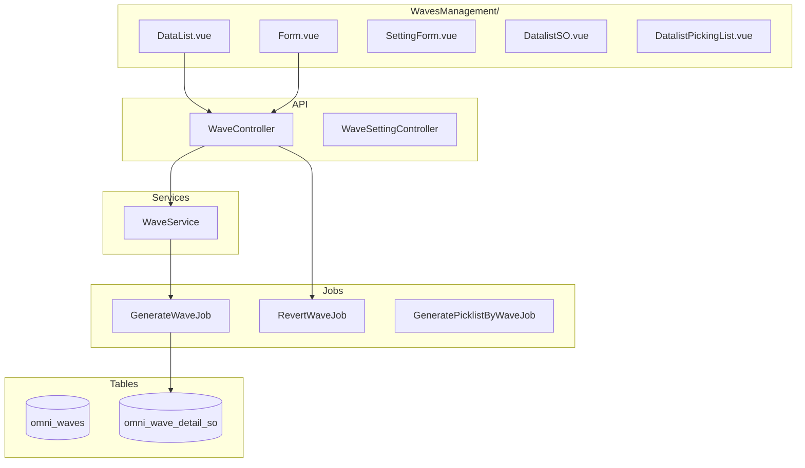
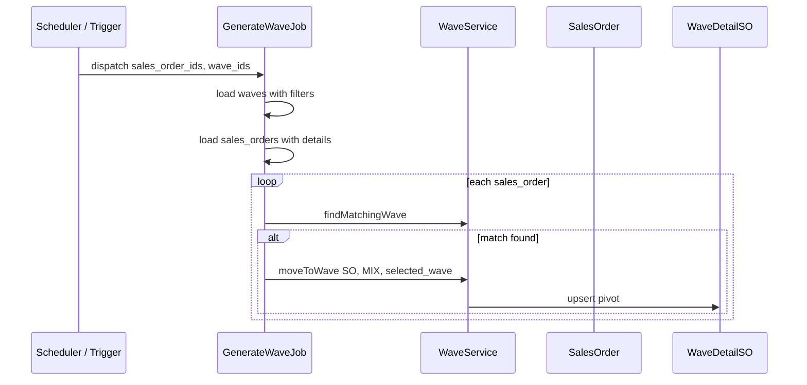

# Waves Management — Technical Documentation

> **Status: DRAFT** — Dokumentasi AS-IS pertama (2026-06-19). Belum melalui review QA/PM.

## 1. Architecture Overview



---

## 2. Frontend File Map

**Root:** `olshoperp-frontend/src/pages/Omni/WavesManagement/`

| File | Role | Key API |
|------|------|---------|
| `DataList.vue` | Grid wave + start/pause + WH filter | `GET omnichannel/wave` |
| `Form.vue` | Create/edit wave rules | `POST/PUT omnichannel/wave` |
| `components/SettingForm.vue` | Wave automation settings | `wave-setting` resource |
| `DatalistSO.vue` | SO dalam wave (slideover) | `GET wave/{wave}/so-detail` |
| `DatalistProduct.vue` | Product breakdown | `wave/{id}/product-detail` |
| `DatalistPickingList.vue` | Picklist per wave | picklist endpoints |

**DataList query params:** `wave_type` = `sales order` | `transfer`, `warehouse_id` filter

---

## 3. Backend File Map

| File | Role |
|------|------|
| `WaveController.php` | CRUD, index, start/pause, revert, select2 filters |
| `WaveService.php` | `findMatchingWave`, `moveToWave`, `start`, `pause` |
| `Jobs/GenerateWaveJob.php` | Batch distribute SO to waves |
| `Jobs/RevertWaveJob.php` | Revert SO to MIX |
| `Entities/Wave.php` | Model, constants `WAVE_TYPE_*` |
| `Entities/WaveGenerateStatus.php` | Automation state singleton |
| `Entities/WaveDetailSO.php` | Pivot SO ↔ wave |
| `WaveDefaultSeeder.php` | Seed MIX wave id=1 |

---

## 4. API Routes

| Method | Path | Action |
|--------|------|--------|
| GET | `omnichannel/wave` | index (datalist) |
| POST | `omnichannel/wave` | store |
| GET/PUT/DELETE | `omnichannel/wave/{wave}` | show/update/destroy |
| POST | `omnichannel/wave/generate/start` | start automation |
| POST | `omnichannel/wave/generate/pause` | pause automation |
| POST | `omnichannel/wave/revert-all` | revert all SO |
| GET | `omnichannel/wave/select2/platform` | platform filter |
| GET | `omnichannel/wave/select2/store` | store filter |
| GET | `omnichannel/wave/select2/warehouse` | WH process filter |
| GET | `omnichannel/wave/select2/filter-warehouse` | header WH filter |
| GET | `omnichannel/wave/{wave}/so-detail` | SO in wave |
| GET | `omnichannel/wave/{wave}/transfer-detail` | Transfers in wave |
| POST | `omnichannel/transfer-picking/generate-picklist` | generate picklist |

---

## 5. Database Schema

**Primary:** [omni_waves.md](../../db-schema/omni_channel/omni_waves.md)

| Column | Purpose |
|--------|---------|
| `priority` | Sort order; NULL = inactive |
| `minimum_order` | Min SO count threshold |
| `wave_type` | `sales order` / `transfer` |
| `so_condition` | `all` / `any` filter logic |
| `product_condition` | Product match rules |
| `grouped_by` | JSON: store/shipper/platform |
| `wave_label_group_id` | Label group filter |

**Detail tables:**

| Table | FK |
|-------|-----|
| `omni_wave_detail_platforms` | `wave_id`, `platform_id` |
| `omni_wave_detail_stores` | `wave_id`, `store_id` |
| `omni_wave_detail_warehouses` | `wave_id`, `warehouse_id` |
| `omni_wave_detail_so` | `wave_id`, `sales_order_id` |
| `omni_wave_detail_transfers` | `wave_id`, `stock_mutation_id` |

---

## 6. GenerateWaveJob Pipeline



**WaveService::start():**

```php
Wave::generate_status()->update(['status' => STATUS_STARTED]);
```

**WaveService::pause():**

```php
// Error if already PAUSING/PAUSED
$status->update(['status' => STATUS_PAUSED]);
```

---

## 7. createTransferWave (cross-reference)

`WaveController::createTransferWave($warehouse_process)` — dipanggil dari Warehouse Binding, bukan dari UI Waves Management langsung. Membuat hidden `StockMutationTransfer` per wave untuk setiap WH process.

---

## 8. Related db-schema

- [omni_waves.md](../../db-schema/omni_channel/omni_waves.md)
