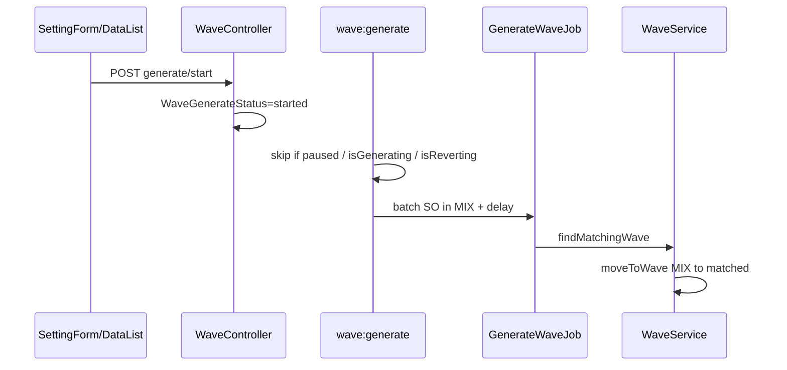

# Waves Management — Technical Documentation

**API prefix:** `omnichannel/wave` (+ SupplyChain wave transfer routes)  
**Module:** `Modules/OmniChannel` + `Modules/SupplyChain` (transfer path)  
**Behavior SoT:** [requirement.md](./requirement.md) v2.0  
**Defaults:** MIX = `Wave::getDefaultWave()` (`id=1`); MIX-TF = `code=MIX-TF`

---

## 1. File Map

### Backend — Sales Order / automation

| Layer | Path |
|-------|------|
| Controller | `Modules/OmniChannel/Http/Controllers/WaveController.php` |
| Setting | `Modules/OmniChannel/Http/Controllers/WaveSettingController.php` |
| Service | `Modules/OmniChannel/Services/WaveService.php` (`findMatchingWave`, `moveToWave`, `addToDefaultWave`) |
| Picklist SO | `Modules/OmniChannel/Services/PicklistService.php` |
| Job distribute | `Modules/OmniChannel/Jobs/GenerateWaveJob.php` |
| Job revert | `Modules/OmniChannel/Jobs/RevertWaveJob.php` |
| Job picklist | `GeneratePicklistByWaveJob`, `GeneratePicklistByWaveAndSOJob` |
| Command | `app/Console/Commands/GenerateWave.php` (`wave:generate`) |
| Schedule | `app/Console/Kernel.php` — cron `*/{generate_every}` |
| Entities | `Wave`, `WaveSetting`, `WaveGenerateStatus`, `WaveDetailSO` |
| Picklist API | `Modules/OmniChannel/Http/Controllers/TransferPickingController.php` |

### Backend — Transfer

| Layer | Path |
|-------|------|
| Approve → wave | `Modules/SupplyChain/Jobs/TransferApproveToWaveJob.php` |
| Wave → PL | `Modules/SupplyChain/Jobs/TransferWaveToPickingListJob.php` |
| Service | `Modules/SupplyChain/Services/WaveTransferService.php` |
| Detail/PL API | `Modules/SupplyChain/Http/Controllers/WaveDetailTransferController.php` |
| Entity | `Modules/SupplyChain/Entities/WaveDetailTransfer.php` |
| Seeder | `Modules/SupplyChain/Database/Seeders/WaveDefaultTransferSeeder.php` |

**Legacy/dead:** `WaveTransferService::arrangeWaveSO`, `MoveBufferToWaveJob` (`@deprecated`), buffer-based priority matching untuk transfer.

### Frontend

| Path | Role |
|------|------|
| `olshoperp-frontend/src/pages/Omni/WavesManagement/DataList.vue` | Tabs SO/Transfer, revert, WH filter |
| `Form.vue` | Create/edit |
| `components/SettingForm.vue` | Toggle + interval |
| `DatalistSO.vue` | Slideover SO / transfer detail |
| `DatalistPickingList.vue` | Transfer PL list |
| `DatalistProduct.vue` | Specific products |

---

## 2. API Routes (utama)

Prefix `/api/omnichannel/` kecuali dicatat. Auth: `auth:sanctum` + `auth_verified`.

| Method | Path | Action |
|--------|------|--------|
| GET/POST | `wave` | Index / Store |
| GET/PUT/PATCH/DELETE | `wave/{wave}` | Show / Update / Destroy |
| GET | `wave/{wave}/audit` | Audit |
| POST | `wave/generate/start` | Start automation |
| POST | `wave/generate/pause` | Pause |
| POST | `wave/revert-all` | Revert (tanpa cek pause — GAP-WM-05) |
| GET | `wave/{wave}/so-detail` | SO di wave |
| GET | `wave/select2/*` | Platform/store/warehouse/rack/shipper/product/label |
| GET/POST | `wave-setting` | Interval + expose `automated_distribution` / `revert_status` |
| POST | `transfer-picking/generate-picklist` | PL single wave |
| POST | `transfer-picking/bulk-generate-picklist` | Bulk PL |
| GET | **`supplychain/wave/{wave}/transfer-detail`** | Transfer di wave (FE pakai ini) |
| GET | **`supplychain/wave/{wave}/picking-list`** | PL transfer |

Catatan: route `omnichannel/wave/{wave}/transfer-detail` ada di routing Omni — method controller perlu dicek; FE memakai endpoint SupplyChain. `[VERIFY: CODEBASE]` dead Omni route.

---

## 3. Database — Key Tables

### `omni_waves`

| Column | Notes |
|--------|-------|
| `name`, `priority` (nullable) | Comment: bigger = less important; NULL + `scopeActiveWave` |
| `minimum_order` | Display di list SO; **tidak** dipakai `GenerateWaveJob` (GAP-WM-02) |
| `so_condition` | `all` / `any` |
| `product_condition` | `all` / `any` / `exact match` |
| Picklist rules | `grouped_by` JSON, `max_order_each_picking_list`, `min/max_qty_sku`, `min/max_qty_product`, dims/weight |
| `wave_type` | `sales order` / `transfer` |
| `wave_label_group_id` | Label group |

### Automation / membership

| Table | Role |
|-------|------|
| `omni_wave_setting` | Global: `generate_every`, `generate_delay`, `validation_operation` AND/OR |
| `omni_wave_generate_statuses` | `started` / `starting` / `paused` / `pausing` |
| `omni_wave_detail_s_os` | SO ↔ wave |
| `scm_wave_detail_transfers` | Transfer ↔ wave |
| Detail filters | `omni_wave_detail_platforms|stores|warehouses|racks|shippers|products` |

**Bukan** toggle ini: `gs_order_process_settings.process_to_wave` (gate Unassign Wave).

---

## 4. Matching (`WaveService::findMatchingWave`)

1. Kumpulkan dari SO: `platform_id`, `store_id`, `wh_process_id`, rack dari mutation origin, shipper via shipping bind, root `product_id`.
2. Iterasi wave collection (**tanpa `orderBy('priority')`** — GAP-WM-01).
3. Order criteria (`so_condition`): platform **selalu**; store/building/rack/shipper hanya jika wave punya rows (rack/shipper = partial overlap).
4. Product criteria: empty list → true; else any / all / exact match.
5. Gabung order+product dengan `WaveSetting.validation_operation` (`and`/`or`).
6. First match wins → `moveToWave(MIX → selected)`.

Transfer live path: **selalu** MIX-TF; tidak pakai matching priority.

---

## 5. Flow utama

**Revert:** `POST revert-all` → chunk `RevertWaveJob` → `moveToWave(current → MIX)`. FE poll `revert_status`.

**Transfer:** Approve TF + `with_picking_list` → `TransferApproveToWaveJob` → MIX-TF → `TransferWaveToPickingListJob`.

---

## 6. Invariants

| ID | Assertion |
|----|-----------|
| INV-WM-01 | MIX / MIX-TF tidak editable/deletable via UI normal |
| INV-WM-02 | Edit/delete custom wave hanya jika generate status paused (+ delete: no SO detail) |
| INV-WM-03 | Pause tidak auto-revert (call revert di `pause()` di-comment) |
| INV-WM-04 | Satu company: max satu generate batch dan satu revert batch aktif |
| INV-WM-05 | Matching SO = first hit only; order tidak di-split multi-wave |
| INV-WM-06 | Transfer + PL selalu ke MIX-TF lalu picklist |
| INV-WM-07 | Keanggotaan SO hanya pindah antar wave — tidak “hilang” dari `wave_detail_so` tanpa tujuan |

---

## 7. Validation Highlights

- Store wajib di form; silang platform/store/WH/rack/shipper di store/update.
- Start/pause via `WaveGenerateStatus`.
- Revert: **tidak** validasi paused di backend (GAP-WM-05).
- Generate picklist SO: skip wave / SO `is_instant_processing` di job bulk.

---

## 8. Frontend Behaviors

- Tabs SO vs Transfer; SettingForm bind start/pause + `generate_every`.
- Revert button: UI disable saat reverting; **tidak** hard-block oleh toggle ON (selaras GAP-WM-05).
- Choose Warehouse scopes aggregate counts per pill.
- Transfer detail/PL: panggil `supplychain/wave/...`.
- Tab Transfer kolom “Qty Total” → distinct SKU (GAP-WM-06).

---

## 9. Failure Modes & Transaction Boundary

| Mode | Behavior |
|------|----------|
| Matching exception | Log + rollback; SO tetap MIX |
| Revert exception per chunk | Log; batch lanjut chunk lain |
| Concurrent generate | `Wave::isGenerating` → company skip |
| Concurrent revert | Generate skip; FE disable |
| `addToDefaultWave` stock fail | MySQL 1644 → validation no stock |
| `moveToWave` | Per-SO transaction; reparent mutation details |
| Picklist empty | Error no orders |

Race lock company: `[VERIFY: CODEBASE]` selain `job_batches` name uniqueness.

---

## 10. Data Lifecycle

| Flag / membership | Hulu | Waves Management | Hilir |
|-------------------|------|------------------|-------|
| `WaveDetailSO` | Unassign / Skip → MIX | Distribute → priority; Revert → MIX | Generate PL / Picking |
| Wave filter products | Form Assign Specific Product | Matching product_condition | — |
| WH / Shipping binding | Master binding | Validasi form + matching building/shipper | Perubahan binding bisa invalidasi wave existing |
| `WaveDetailTransfer` | TF approve + PL flag | MIX-TF | Picking list transfer |

---

## 11. Tests & QA Notes

- Cover: start/pause gate edit, matching any/all/exact, revert partial failure, transfer→MIX-TF→PL.
- Regresi gaps: priority order (WM-01), `minimum_order` ignored (WM-02), NULL priority (WM-03), revert tanpa pause (WM-05), Transfer column labels (WM-06).
- Ubah response/aggregates → update mock FE bila ada.

---

## 12. Known Issues

| GAP | Technical note |
|-----|----------------|
| GAP-WM-01 | `GenerateWaveJob` load waves tanpa `orderBy('priority')` |
| GAP-WM-02 | `minimum_order` hanya di formatting list |
| GAP-WM-03 | `scopeActiveWave` ada; generate path tidak konsisten memakainya |
| GAP-WM-04 | `min_qty_sku` di PicklistService |
| GAP-WM-05 | `revertWave()` tanpa cek `WaveGenerateStatus` |
| GAP-WM-06 | FE Transfer “Qty Total” = `sku_total_formatted` (distinct product) |

---

## 13. Changelog

| Version | Date | Changes |
|---------|------|---------|
| 2.0 | 2026-07-20 | Rewrite SoT + file map transfer/automation/gaps |
| 1.0 | 2026-06-19 | Initial AS-IS draft |
