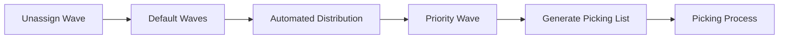
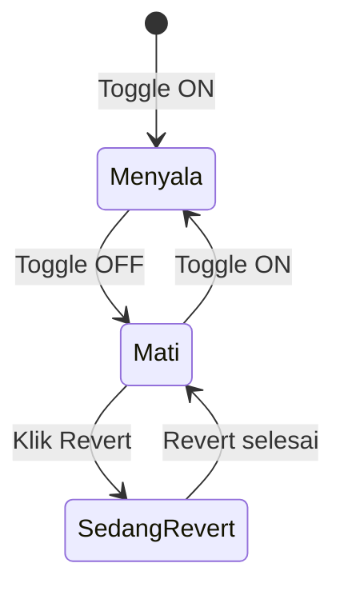

# Waves Management — Panduan Pengguna

**Siapa yang baca panduan ini:** warehouse ops, fulfillment lead, support  
**Menu di sistem:** Omni → Waves Management

---

## 1. Apa Itu & Kenapa Penting

Waves Management adalah tempat kamu **mengelompokkan order** (dan transfer yang butuh picking) supaya tim gudang mengambil barang lebih efisien. Order yang sudah masuk tampungan utama (**Default Waves**) bisa otomatis dipindah ke kelompok khusus sesuai aturan yang kamu buat, lalu dibuatkan **Picking List**.

Tanpa pengelompokan yang jelas, picking cenderung acak dan lebih lambat.

---

## 2. Overview Flow & Proses Bisnis

### Rantai proses (order)

**Versi teks (tanpa diagram):**

1. Order dikirim ke Default Waves lewat **Unassign Wave** (atau jalur Skip Wave).
2. Kalau **Automated Distribution** menyala, sistem memindahkan order ke wave yang cocok.
3. Di wave hasil buatmu, kamu **Generate Pick List**.
4. Tim gudang mengerjakan **Picking**.

### Rantai proses (transfer)

1. Buat **Transfer External** dengan opsi **With Picking List**.
2. Setelah approve, transfer masuk **Default Waves Transfer**.
3. Generate picking list (otomatis/manual).
4. Lanjut picking sesuai flow transfer.

🎬 [Interactive demo akan ditambahkan di sini]

### Status automasi

**Versi teks:**

| Status | Artinya | Bisa edit wave? |
|--------|---------|-----------------|
| Menyala | Distribusi otomatis jalan | Tidak |
| Mati | Distribusi berhenti | Ya (kecuali Default Waves) |
| Sedang Revert | Order dikembalikan ke Default Waves | Tidak, tunggu selesai |

> Mematikan toggle **tidak** otomatis mengembalikan order. Pakai tombol **Revert** jika ingin semua order di wave khusus kembali ke Default Waves.

---

## 3. Sebelum Mulai (Flow Sebelum)

Pastikan:

- Order sudah lewat **Unassign Wave** (ada di Default Waves).
- Master store, gudang (building/rack), shipper, dan label group siap.
- Binding warehouse & shipping sudah lengkap kalau kamu pakai filter building/shipper.
- Untuk transfer: flag **With Picking List** dinyalakan sebelum approve.

🎬 [Interactive demo akan ditambahkan di sini]

---

## 4. Setelah Selesai (Flow Sesudah)

- Order yang sudah di wave khusus → **Generate Pick List** → picking.
- Setelah ubah aturan wave: Revert (opsional) → nyalakan lagi automasi → order di Default Waves terdistribusi ulang.
- Transfer dengan picking list → kerjakan PL → lanjut flow Transfer External.

🎬 [Interactive demo akan ditambahkan di sini]

---

## 5. Yang Perlu Diperhatikan

- Kalau kamu mengubah wave saat automasi masih **menyala**, sistem menolak / tombol edit tidak aktif — matikan toggle dulu.
- **Default Waves** tidak bisa diedit atau dihapus.
- Menghapus wave hanya boleh jika sudah kosong (tidak menampung order) dan automasi mati.
- Kalau store / gudang / shipper tidak cocok satu sama lain, simpan wave ditolak dengan pesan ketidakcocokan.
- Order yang tidak cocok kriteria wave manapun **tetap aman** di Default Waves — itu normal, bukan error.
- Satu order gagal saat distribusi tidak menghentikan order lain.
- Saat revert berjalan, tunggu selesai sebelum aksi lain.
- Filter **Choose Warehouse** mengubah angka total di kolom, bukan menyembunyikan baris wave.
- Tab Transfer tidak punya toggle distribusi — jalur berbeda dari order.

---

## 6. Langkah-Langkah (Step by Step)

### A. Buat / ubah wave (Sales Order)

1. Buka **Omni → Waves Management** (tab Sales Order).
2. Matikan **Automated Distribution**.
3. (Opsional) Klik **Revert** jika ingin semua order kembali ke Default Waves dulu.
4. Klik **Create** (atau Edit wave yang ada).
5. Isi nama, store (wajib), label group, dan filter lain yang dibutuhkan.
6. Atur aturan pecah picking list (max order, SKU, berat, dll) bila perlu.
7. (Opsional) Assign Specific Product + pilih Any / All / Exact Match.
8. Simpan.
9. Nyalakan kembali **Automated Distribution** dan set interval menit.
10. Tunggu distribusi, lalu **Generate Pick List** di wave yang kamu buat.

### B. Transfer

1. Pindah ke tab **Waves Transfer**.
2. Pastikan transfer sudah approve + With Picking List.
3. Generate picking list (satu/bulk) dari wave default transfer.
4. Klik angka picking list untuk melihat detail dokumen bila perlu.

🎬 [Interactive demo akan ditambahkan di sini]

---

## 7. Tips & Hal yang Sering Bikin Bingung

- **Order menumpuk di Default Waves** — cek toggle ON, Last success attempt, dan apakah kriteria wave benar-benar cocok.
- **Sudah matikan toggle tapi order tidak balik** — klik **Revert**.
- **Tidak ada tombol Generate Pick List di Default Waves** — normal; generate dari wave buatanmu (atau tab Transfer).
- **Minimum order** di list saat ini lebih ke informasi; belum menahan order sampai jumlah minimum terpenuhi.
- **Angka di tab Transfer terasa aneh** — penamaan kolom sedang ditinjau; ikuti tooltip/konteks.
- **Beda Unassign Wave vs sini** — Unassign = masuk Default Waves; sini = kelompokkan + picking list.

---

## 8. Referensi

| Butuh | Buka |
|-------|------|
| Aturan lengkap & gap QA | [requirement.md](./requirement.md) |
| Troubleshooting operator | [knowledge-base.md](./knowledge-base.md) |
| API, job, matching, invariant | [technical.md](./technical.md) |

**Related menus:** [Unassign Wave](../omni-unassign-wave/) · Skip Wave Process · Transfer External · Picking List / Picking Process · Warehouse / Shipping Binding
