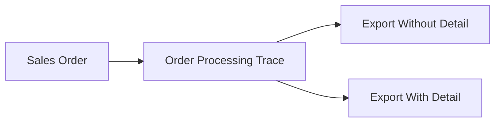

# Order Processing Trace — Requirement Documentation

**Modul:** SupplyChain → Report **dan** OmniChannel → Report (satu halaman)  
**Menu UI:** **Order Processing Trace**  
**Audience:** PM, QA, Fulfillment, Support, Developer  
**Status:** **TO-BE** v1.0 (belum implementasi)  
**SoT:** [`_meta/sot/order-processing-trace-source-of-truth.md`](../_meta/sot/order-processing-trace-source-of-truth.md) v1.3  
**Jira:** [ETM-15713](https://erpintegration.atlassian.net/browse/ETM-15713)

---

## 0. Metadata & Changelog

| Version | Date | Author | Changes |
|---------|------|--------|---------|
| 1.0 | 2026-09-02 | QA - Yemima | Split dari SOT v1.3 — TO-BE spec implementasi |

---

## 1. Ringkasan Eksekutif

**Order Processing Trace** adalah report **read-only** dengan POV **1 baris = 1 Sales Order** (general + platform). Menampilkan kode order dan **referensi transaksi proses** (Skip Wave, Picking, Checking, Packing, DO, Failed Ship, Outbound) beserta tanggal.

Fitur wajib: **Advanced Filter**, **Export Without Detail** (mirror grid), **Export With Detail** (POV produk + kolom **Bundle SKU**).

**Bukan:** Sales Order Report (revenue); All Sales Order (monitor + aksi).

---

## 2. UI / UX (TO-BE)

### 2.1 Navigasi dual entry

| Entry sidebar | Route |
|---------------|-------|
| SupplyChain → Report | `/supplychain/order-processing-trace` |
| OmniChannel → Report | `/omni/order-processing-trace` |

Satu komponen + satu API — dataset identik.

### 2.2 Grid

| Control | Rule |
|---------|------|
| Granularitas | 1 baris = 1 SO |
| Default filter Trx Date | Awal–akhir **bulan berjalan** |
| Default sort | Trx Date DESC (usulan) |
| Global Search | Trx Code, Trx Platform, Skip Wave batch, kode ref |
| Advanced Filter | SearchBuilder (§5) |
| Columns Show/Hide | Ya |
| Hyperlink | Trx Code → edit SO; ref → edit dokumen sumber |
| Tooltip | Wajib §2.3 & §3 |

### 2.3 Kolom grid (urutan wajib)

| # | Header | Ref | Date | Kosong |
|---|--------|-----|------|--------|
| 1 | Trx Code \| Trx Platform | Kode SO internal | Nomor platform | Platform = `-` |
| 2 | Trx Date \| Platform Date | §3 | §3 | General: Platform Date = `-` |
| 3 | Skip Wave Process No | batch_code Skip Wave | — | `-` |
| 4–7 | Picking / Checking / Packing / DO Ref \| Date | Kode doc | Trx date doc | `-` |
| 8 | Failed Ship \| Date | **Satu** FS per order | Trx date FS | `-` |
| 9 | Outbound \| Date | **Satu** outbound per order | Trx date OB | `-` |

Multi-ref **koma** hanya edge case Picking–DO. **Failed Ship & Outbound: single ref** (AS-IS §4).

---

## 3. Aturan tanggal

| Tipe SO | Trx Date | Platform Date |
|---------|----------|---------------|
| General | `transaction_date` SO | `-` |
| Platform | `created_at` SO (masuk sistem) | `transaction_date` platform |

---

## 4. Kardinalitas AS-IS (patuh saat implementasi query)

| Stage | Maks / SO | Catatan |
|-------|-----------|---------|
| Outbound | **1 doc** | Guard backend: SO tidak boleh 2 outbound |
| Failed Ship | **1 doc** | `useSo` + import; requirement FS §5.5.2 |
| Picking–DO | 1 (normal) | Koma hanya edge re-process |

**Partial** = multi SKU/qty dalam **doc yang sama**, bukan multi doc FS/OB.

---

## 5. Advanced Filter (minimum)

Trx Date, Platform Date, Order Type, Trx Code/Platform, Store, Customer, Skip Wave No, ref per stage.

---

## 6. Export

### 6.1 Without Detail

1 baris = 1 SO; mirror grid; respect filter; Export All async + This Page.

### 6.2 With Detail

| Aspek | Rule |
|-------|------|
| Grain | **1 baris = 1 SO detail line** |
| Kolom produk | SKU, Product Name, Qty |
| Bundle SKU | Header bundle untuk child; else `-` |
| Outbound | Ref sama untuk semua line dalam 1 OT; line tidak ikut = `-` |
| Failed Ship | Ref FS sama untuk line dengan qty FS; else `-` |
| Case D | Satu line qty partial: kolom FS **dan** OB **same row** |

**QA cases wajib:** Case A (2 SKU FS + 3 SKU OB), B (bundle), C (skip wave), D (partial qty dual ref).

---

## 7. Business rules

| ID | Rule |
|----|------|
| R-01 | Read-only — tidak create/edit/approve |
| R-02 | Company scope token |
| R-03 | General + platform satu grid |
| R-06b | 1 SO = 1 FS — header single ref |
| R-06c | 1 SO = 1 outbound — header single ref |
| R-10 | Export detail Case D — FS + OB same row |
| R-15 | Dual sidebar — data identik |

---

## 8. Acceptance Criteria (TO-BE)

Lihat checklist lengkap SoT §10 dan [`docs/download/ETM-15713-order-processing-trace-dev-qa-brief.md`](../../download/ETM-15713-order-processing-trace-dev-qa-brief.md) §8.

---

## 9. Gap Registry

| ID | Status | Ringkas |
|----|--------|---------|
| GAP-SOPT-01 | Resolved | Single ref FS/OB; koma hanya Picking–DO edge |
| GAP-SOPT-02 | Resolved | Export detail grain + Case D |
| GAP-SOPT-03 | Resolved | Dual SCM + Omni sidebar |
| GAP-SOPT-04 | Open | Join teknis — dev saat build |
| GAP-SOPT-05–07 | Open | Kolom opsional, filter boolean, timezone |

---

## 10. Related Documents

| Doc | Path |
|-----|------|
| SoT | [../_meta/sot/order-processing-trace-source-of-truth.md](../_meta/sot/order-processing-trace-source-of-truth.md) |
| Dev/QA brief | [../../download/ETM-15713-order-processing-trace-dev-qa-brief.md](../../download/ETM-15713-order-processing-trace-dev-qa-brief.md) |
| Failed Ship 1 SO = 1 FS | [../supplychain-failed-ship/requirement.md](../supplychain-failed-ship/requirement.md) §5.5.2 |
| Purchase Report (pola report) | [../accounting-purchase-report/](../accounting-purchase-report/) |
