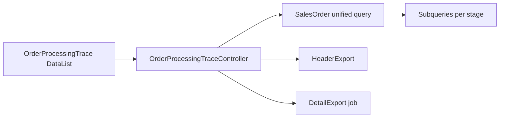

# Order Processing Trace — Technical Documentation

**Behavior SoT:** [requirement.md](./requirement.md) v1.1 (TO-BE) · [_meta/sot/…](../_meta/sot/order-processing-trace-source-of-truth.md) v1.4  
**Status implementasi:** **Belum ada** per 2026-09-03  
**Jira:** [ETM-15713](https://erpintegration.atlassian.net/browse/ETM-15713)

---

## 1. Architecture (TO-BE)

- Read-only; on-demand query (no snapshot table).  
- Company scope: `owned_by` = token company.  
- **Satu** FE route SCM + **satu** API (tanpa alias Omni).

---

## 2. File map (TO-BE — rencana)

| Layer | Path (usulan) |
|-------|----------------|
| FE | `olshoperp-frontend/src/pages/SupplyChain/Report/OrderProcessingTrace/` |
| BE controller | `Modules/SupplyChain/Http/Controllers/OrderProcessingTraceController.php` (atau modul yang memegang report SCM) |
| Export header | `…/Exports/OrderProcessingTraceHeaderExport.php` |
| Export detail | `…/Exports/OrderProcessingTraceDetailExport.php` + job async |
| Policy | `…/Policies/OrderProcessingTracePolicy.php` |
| Routes | Group `supplychain/order-processing-trace` **saja** |

Pola referensi AS-IS: [Purchase Report](../accounting-purchase-report/technical.md).

---

## 3. API (TO-BE)

| Method | Path | Notes |
|--------|------|-------|
| GET | `/supplychain/order-processing-trace` | Datalist grid |
| GET | `…/export-excel` | Query param mode: `header` \| `detail` |
| GET | `…/export-progress` | Async progress |
| GET | `…/export-file` | File list |

**Out of scope route:** `/omni/order-processing-trace` — **tidak** diimplementasi (keputusan 2026-09-03: SCM only).

---

## 4. Query notes

### Base

- Unified SO view — pola [All Sales Order](../all-sales-order/technical.md) (general + platform).  
- Left join / subquery per stage; soft-deleted excluded.

### Kardinalitas (wajib)

| Join | Grain |
|------|-------|
| Outbound header | 1 SO → max 1 `StockMutationOutbound` (guard existing) |
| Failed Ship header | 1 SO → max 1 FS (`FailedShipController@useSo`) |
| Outbound detail export | `OutboundMutationDetail.transaction_reference_id` → `SalesOrderDetail.id` |
| FS detail export | Failed ship detail → SO detail line |
| Skip Wave | `batch_code` per `sales_order_id` dari log Skip Wave |

### Invariants

1. Export detail: jangan assign OB ref ke SKU tidak ada di outbound doc.  
2. Case D: FS + OB ref pada **same row** untuk partial qty line.  
3. Hyperlink SO: route berbeda general vs platform.

---

## 5. Relasi backend existing (AS-IS guards)

| Guard | Lokasi |
|-------|--------|
| 1 SO = 1 outbound | `StockMutationOutboundDetailController` |
| 1 SO = 1 FS | `FailedShipController@useSo`, `FailedShipImportJob` |

---

## 6. Open technical gaps

| ID | Item |
|----|------|
| GAP-SOPT-04 | Exact join path Picking–DO per SO detail — verify saat build |
| GAP-SOPT-07 | Timezone `created_at` platform untuk kolom Trx Date |
