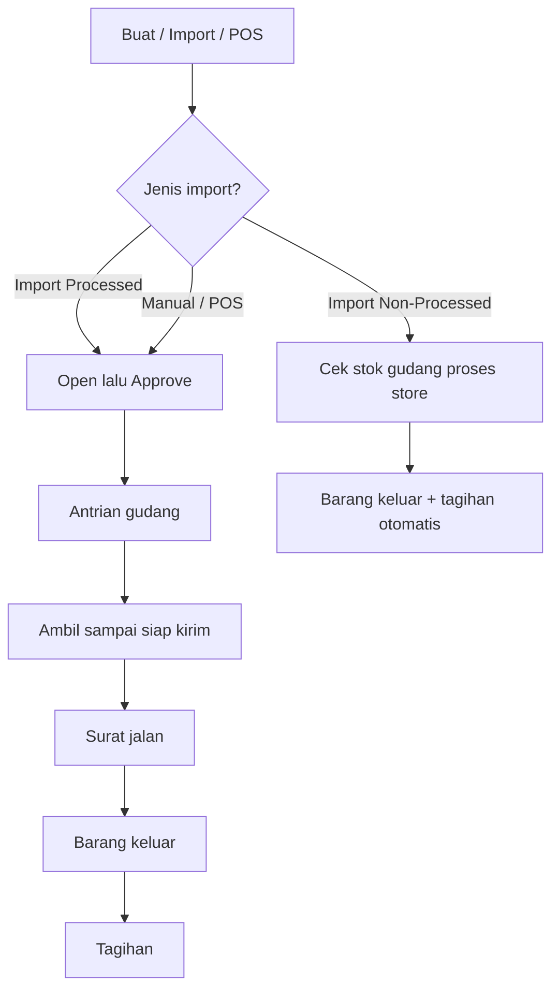

# Dev - Sales Order — Knowledge Base

**Siapa yang baca:** operator Busdev/Ops, support  
**Menu:** Business Development → **Dev - Sales Order**  
**Route:** `/businessdevelopment/sales-order-general`

Layar gabungan: **All Sales Order**. Marketplace: **Dev - Sales Platform**.  
Mode toko: **Fulfillment Mode** di master **Store** (**Processed** / **Non Processed**).

---

## 1. Apa itu & kenapa penting

**Dev - Sales Order** mencatat **pesanan penjualan internal** (telepon/WA, B2B, Excel, POS) — bukan sync Shopee/Lazada/TikTok.

Ada **dua jalur setelah import**, tergantung Fulfillment Mode store: masuk proses gudang penuh, atau langsung keluar barang + tagihan.

---

## 2. Kapan dipakai?

| Kebutuhan | Cara |
|-----------|------|
| Penjualan B2B / offline | Create manual → lengkapi customer & produk |
| Banyak order + proses gudang | **Import Processed** (store harus **Processed**) |
| Banyak order tanpa proses gudang | **Import Non-Processed** (store harus **Non Processed**) |
| Kasir toko | Point of Sales (jalur Non-Processed POS = nanti) |
| Lihat general + marketplace | **All Sales Order** (tombol import sama) |

---

## 3. Alur kerja standar

**Keterangan langkah:**

1. **Create** — buat draft lalu buka edit.  
2. **Import Processed** — hasil **Open**; lanjut Approve → antrian gudang (sering perlu Unassign/Skip Wave).  
3. **Import Non-Processed** — sistem cek stok di gudang proses **store order itu**; jika OK buat barang keluar + tagihan otomatis (tanpa wave–ship).  
4. Store salah mode vs tombol → order itu gagal; order lain di file bisa lanjut.  
5. Template Excel **sama** untuk kedua tombol.

🎬 [Interactive demo akan ditambahkan di sini]

### Arti status (ringkas)

| Status | Artinya | Bisa diedit? |
|--------|---------|--------------|
| Draft | Baru disusun | Ya |
| Open | Siap review & approve (hasil Import Processed) | Ya |
| Approved | Disetujui / final (termasuk Non-Processed sukses) | Tidak |
| Rejected / Closed / Void | Ditolak / ditutup / dibatalkan | Tidak |

---

## 4. Import Excel (operator)

### Dua tombol

| Tombol | Store harus | Setelah sukses |
|--------|-------------|----------------|
| **Import Processed** | **Processed** | Open → Approve → proses gudang |
| **Import Non-Processed** | **Non Processed** | Progress job (mirip Skip Wave) → outbound + invoice otomatis |

Atur mode di **Omni → Store → Fulfillment Mode** dulu.

### Template (tidak berubah)

1. **Sheet 1** — tanggal, customer, store, referensi, kurir, tracking, SKU, qty, unit, harga.  
2. **Sheet 2** (opsional) — biaya/diskon tambahan.

| Rule | Nilai |
|------|-------|
| Max SKU per order | **100** |
| Format | `.xlsx` / `.xls` |
| Gabung 1 order | Customer + Store + Tanggal + Platform Order ID + Shipper + Tracking |
| Store | Tipe **Others** + mode sesuai tombol |
| Rumus Excel | Ditolak |

### Jika import gagal

1. Cek **Import History** / log (Non-Processed: log progress mirip Skip Wave).  
2. Mismatch mode store ↔ tombol → ganti store/mode atau ganti tombol.  
3. Non-Processed stok kurang → seluruh order gagal; lihat SKU mana yang kosong.  
4. File sangat besar bisa stuck — pecah file (batasan sistem).

---

## 5. Yang sering bikin bingung

| Gejala | Penyebab umum | Solusi |
|--------|---------------|--------|
| Order gagal “mode” / fulfillment | Store Processed diunggah lewat Non-Processed (atau sebaliknya) | Samakan tombol dengan Fulfillment Mode store |
| Setelah Approve belum masuk gudang | Setting tidak auto-wave | Unassign / Skip Wave di SCM |
| Invoice tidak muncul setelah Approve (Processed) | Memang tidak saat Approve | Tunggu outbound / settlement |
| Non-Processed gagal stok | Stok di hierarki gudang proses store kurang | Isi stok / kurangi qty / ganti store |
| Create langsung ke edit | By design | Lengkapi di halaman edit |

---

## 6. Istilah → bahasa sehari-hari

| Istilah | Artinya |
|---------|---------|
| Fulfillment Mode | Di Store: **Processed** (lewat gudang) atau **Non Processed** (langsung keluar + tagih) |
| Import Processed / Non-Processed | Dua tombol upload Excel |
| Platform Order ID | Nomor referensi luar + kunci gabung baris |
| Wave | Antrian gudang sebelum ambil barang |
| Outbound | Bukti barang keluar |
| Sales Invoice | Tagihan customer |

---

## 7. FAQ singkat

**Bedanya dengan All Sales Order?** Satu layar general + marketplace; tombol import sama.  
**POS ikut Non-Processed?** Belum — requirement berikutnya.  
**Max detail?** 100 baris per pesanan.

## Referensi

- [requirement.md](./requirement.md) · [technical.md](./technical.md) · [user-guide.md](./user-guide.md)  
- Store: [../omni-store-binding/knowledge-base.md](../omni-store-binding/knowledge-base.md)  
- ASO: [../all-sales-order/knowledge-base.md](../all-sales-order/knowledge-base.md)
