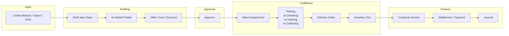
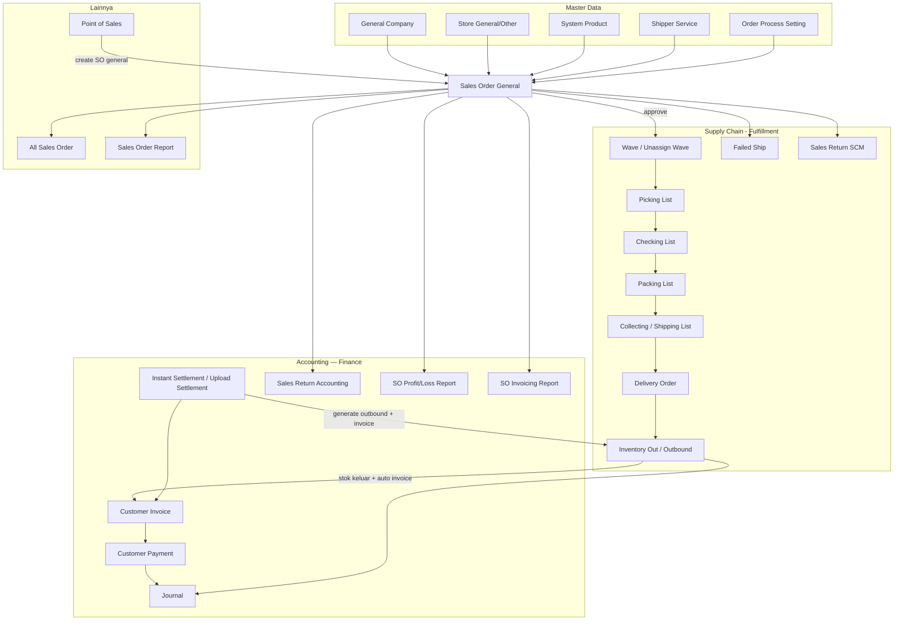
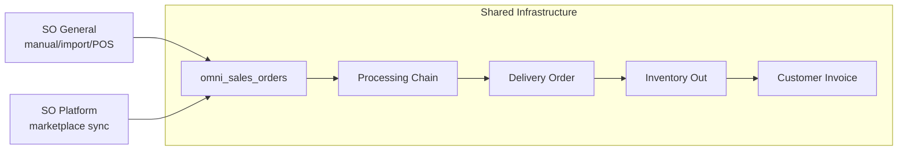

# Sales Order General (Internal) — Requirement Detail

**Modul:** OmniChannel + BusinessDevelopment + SupplyChain + Accounting  
**Versi Dokumen:** 2.0  
**Tanggal Update:** 18 Juni 2026  
**Audience:** PM, Operations, QA, Support, Developer  
**Status:** Sesuai perilaku sistem saat ini (as-is)

---

## Daftar Isi

1. [Fungsi & Tujuan](#1-fungsi--tujuan)
2. [How It Works — Alur Kerja](#2-how-it-works--alur-kerja)
3. [Validasi yang Berjalan](#3-validasi-yang-berjalan)
4. [Fitur Import — Struktur, Validasi, Rules & Batasan](#4-fitur-import--struktur-validasi-rules--batasan)
5. [Relasi Menu Lain — Fungsi & Dampak](#5-relasi-menu-lain--fungsi--dampak)
6. [Relasi dengan Sales Order Platform & Perbedaannya](#6-relasi-dengan-sales-order-platform--perbedaannya)
7. [FAQ](#7-faq)
8. [Failed Process — AS-IS](#8-failed-process--as-is)
9. [Improvement TO-BE — Re-check Failed Process & Log](#9-improvement-to-be--re-check-failed-process--log)
10. [Product Bundle — Proporsi Harga (Price Before VAT)](#10-product-bundle--proporsi-harga-price-before-vat)
11. [Benchmark COGS & Price Before VAT (Detail Order)](#11-benchmark-cogs--price-before-vat-detail-order)

---

## 1. Fungsi & Tujuan

### Apa itu Sales Order General?

**Sales Order General** (`type_sales_order = general`) adalah dokumen penjualan **internal/manual** di OlshopERP. Pesanan ini **tidak** berasal dari sinkronisasi marketplace, melainkan dari:

- Input manual di menu **Dev - Sales Order**
- Upload file Excel (import bulk)
- Transaksi **Point of Sales (POS)**
- (Opsional) referensi nomor eksternal via field Platform Order ID

### Masalah yang diselesaikan

| Kebutuhan Bisnis | Bagaimana SO General Menjawab |
|------------------|------------------------------|
| Catat penjualan B2B/offline ke customer | Header + detail produk internal + customer dari General Company |
| Kelola pesanan massal dari spreadsheet | Import Excel 2 sheet (header+detail + biaya/diskon) |
| Picu proses gudang (picking → kirim) | Approve SO → wave → processing → delivery order → outbound |
| Lacak stok yang "dipesan tapi belum keluar" | Outstanding SO stock + ATS di System Product |
| Tagih customer & catat jurnal | Customer Invoice otomatis saat outbound/settlement |
| Rekonsiliasi pembayaran order internal | Instant Settlement / Upload Settlement (tipe General) |

### Menu terkait di UI

| Menu | Route | Peran | Doc |
|------|-------|-------|-----|
| **Dev - Sales Order** | `/businessdevelopment/sales-order-general` | CRUD utama SO **internal** (menu ini) | Folder ini |
| **Dev - Sales Platform** | `/omni/sales-order` | SO marketplace — **independen** | [omni-sales-platform](../omni-sales-platform/requirement.md) |
| **All Sales Order** | `/businessdevelopment/all-sales-order` | Gabungan general + platform | [all-sales-order](../all-sales-order/requirement.md) |

> Failed Process TO-BE / Re-check: trigger utama didokumentasikan di [All Sales Order](../all-sales-order/requirement.md); detail flag engine tetap di SP + §8–§9 folder ini.

### Entitas data utama

Semua tipe SO (general & platform) disimpan di tabel yang sama:

- Header: `omni_sales_orders`
- Detail: `omni_sales_order_details`
- Biaya/diskon tambahan: `omni_sales_order_other_costs`, `omni_sales_order_other_discounts`
- Info pengiriman: `omni_sales_order_other_infos` (tracking number, COD, dll.)

Class `SalesOrderGeneral` adalah subclass kosong dari `SalesOrder` — hanya untuk **scoping policy/menu permission**.

---

## 2. How It Works — Alur Kerja

### 2.1 Siklus hidup SO General (overview)



### 2.2 Create — cara kerja

**Manual (UI):**

1. User klik Create di datalist → buka `/sales-order-general/create`
2. Frontend memanggil `GET omnichannel/sales-order/default-values` (customer, store, warehouse, shipper default)
3. Frontend **langsung POST create** → SO draft dibuat otomatis
4. Redirect ke halaman edit `/sales-order-general/edit/{id}`
5. User isi header, tambah detail, other cost/discount
6. Toggle status **Draft ↔ Open** saat siap direview

**Import Excel:**

1. Upload file → validasi struktur & data (Sheet 1 + Sheet 2)
2. Grouping baris → 1 SO per kombinasi header
3. Dispatch job async per SO → create header + detail + other cost/discount
4. SO langsung berstatus **`open`** (bukan draft), `is_import = 1`

### 2.3 Approval — cara kerja

Saat user klik **Approve** (`POST omnichannel/sales-order/{id}/approve`):

```
1. Pre-check: bukan draft, punya detail, produk aktif, tidak sedang import
2. Set transaction_status = approved
3. Simpan MA buffer & price history produk
4. approveGeneral():
   a. Jika OrderProcessSetting.process_to_wave = OFF
      → generateSalesOrderRandom() (alokasi Random SKU)
   b. Jika config omni.approve_so.approve_with_validation = true
      → CheckApproveSoGeneral():
         • Validasi bundle
         • Cek belum ada outbound
         • Generate random SKU rows
         • FIFO stock check per warehouse
         • Buat wave transfer + MoveSOToWaveMixJob
   c. Update SO: approved_at, ready_to_process=1,
      unassign_wave_status, is_instant_processing
```

**Penting — default config saat ini:**

| Config | Default | Dampak |
|--------|---------|--------|
| `omni.approve_so.approve_with_validation` | **`false`** | Approve **tidak langsung** assign wave; SO tetap `unassign_wave_status = not in queue` |
| `OrderProcessSetting.process_to_wave` | ON (1) | Wajib lewat wave; outbound manual dari SO diblokir |
| `OrderProcessSetting.instant_processing` | OFF | Processing manual (pick/check/pack) |

Jika `approve_with_validation = false` (default), setelah approve user harus jalankan **Unassign Wave** atau **Skip Wave Process** di SCM agar SO masuk wave.

### 2.4 Fulfillment — cara kerja setelah approve

#### A. Wave assignment (`MoveSOToWaveMixJob`)

- SO masuk `WaveDetailSO` di wave default gudang proses
- `TransferMutationDetail` dibuat di wave mutation
- **Stok di `scm_item_stocks`:**
  - `reserved_quantity` **naik**
  - `available_quantity` **turun**
- `unassign_wave_status` → `processed`

#### B. Processing chain (normal)

| Tahap | Menu SCM | Virtual WH | Trigger berikutnya |
|-------|----------|------------|-------------------|
| Picking | Picking List | `picking` | Approve → generate Checking List |
| Checking | Checking List | `checking` | Approve → generate Packing List |
| Packing | Packing List | `packing` | Approve → generate Collecting/Shipping List |
| Collecting | Transfer Summary / Shipping | `shipping` | Siap untuk Delivery Order |

Pada setiap approve transfer antar virtual WH, `ItemStockMutation::approveTransfer` memindahkan qty antar virtual warehouse (partial atau full transfer).

**Catatan:** Generate outbound otomatis di tahap packing **sudah dinonaktifkan** (ETM-10761). Outbound dibuat lewat Delivery Order → Settlement atau manual.

#### C. Instant processing (alternatif)

Jika `is_instant_processing = 1` (dari Order Process Setting):

1. SO harus **sudah di wave** (`unassign_wave_status = processed`)
2. Scheduler `salesorder:instant-processing` (setiap menit) dispatch `SkipProcessingJob`
3. `SkipProcessTrait` auto-approve: picking → checking → packing → collecting
4. Lalu auto-create & approve Delivery Order via `DeliveryOrderProcessTrait`
5. SO instant **dikecualikan** dari generate picklist manual

Job lama `InstantProcessingSalesOrderJob` sudah **deprecated** — diganti `SkipProcessingJob`.

#### D. Delivery Order

- Menu: SCM → **Delivery Order**
- SO general dipisah dari platform (tanpa resolusi logistic marketplace)
- Membutuhkan collecting list (`PROCESS_TYPE_SHIPPING`) sudah ada
- `attachSalesOrderToDeliveryOrder()`:
  - Approve outbound/transfer shipping yang belum approved
  - Approve draft Customer Invoice jika ada
  - Buat `DeliveryOrderDetail`, update `prepared_to_do_quantity`
- Approve DO → generate shipping-DO transfer (`PROCESS_TYPE_SHIPPING_DO`)

#### E. Inventory Out (stok fisik keluar)

- Menu: SCM → **Outbound External** (kode prefix `OT`)
- **Pemicu utama:** `Settlement::generateOutbound()` dari shipping-DO transfer yang sudah approved
- `type_so = GENERAL` untuk SO internal
- Approve outbound → `ItemStockMutation::approveOutbound()`:
  - `used_quantity` **naik**
  - `reserved_quantity` **turun**
  - `processed_to_out_quantity` naik di `omni_sales_order_details`
- **Trigger invoice:** jika belum ada invoice qty → `CustomerInvoiceHelper::autoGenerateFromSalesOrder` (auto-approve)
- **Trigger journal:** `JournalProcess::stockOutboundAutoJournal()`

### 2.5 Finance — cara kerja

| Event | Menu | Apa yang terjadi |
|-------|------|------------------|
| Outbound approve (pertama) | Accounting → Sales Invoice | Auto-create & approve Customer Invoice + jurnal AR |
| Settlement upload & approve | Accounting → Instant Settlement | Generate outbound + invoice + payment + jurnal |
| Manual invoice | Accounting → Sales Invoice | User pilih outstanding SO |
| Sales Return | SCM / Accounting → [Sales Return](../supplychain-sales-returns/README.md) · [Approval](../accounting-sales-return/README.md) | Retur barang dari SO yang sudah outbound + invoice |
| POS approve | Busdev → Point of Sales | Auto invoice + outbound + receive |

**SO General approve saja TIDAK membuat invoice** (berbeda dengan POS yang langsung invoice).

### 2.6 Dampak ke stok — ringkasan per fase

| Fase | `available_quantity` | `reserved_quantity` | `used_quantity` | Outstanding SO |
|------|---------------------|--------------------|-----------------|--------------------|
| SO open/draft (belum wave) | — | — | — | **Qty masuk outstanding** |
| Wave assign | ↓ | ↑ | — | **Keluar outstanding** |
| Pick/Check/Pack transfer | Pindah antar VH | ↓ di source | — | — |
| Outbound approve | — | ↓ | ↑ | — |
| Post-change | — | — | — | `StoreSOBasedStockJob` refresh ATS |

**ATS (Available To Sell)** = On Hand − Outstanding SO − Reserved Out (direcalculate async via `StoreSOBasedStockJob`).

---

## 3. Validasi yang Berjalan

Validasi tidak memakai FormRequest terpisah — semua inline di controller. Frontend menampilkan error dari `response.data.data`.

### 3.1 Validasi Header (Create / Update)

| Field | Rule | Pesan / Kondisi Gagal |
|-------|------|----------------------|
| `transaction_date` | Required | Wajib diisi |
| `transaction_date` | Fiscal period | Harus dalam periode fiskal aktif |
| `customer_id` | Required (general) | Wajib untuk SO general |
| `customer_id` | Exists | Company `company_type=general`, `is_customer=1` |
| `store_id` | Required | Store wajib dipilih |
| `currency_id` | Required | Exists di master Currency |
| `exchange_rate` | Required, numeric, min 1 | Harus 1 jika currency primary |
| `shipping_platform_system_id` | Required | Shipper service valid & aktif |
| `with_quotation` | Required | Boolean |
| `type_sales_order` | Required | `general` atau `platform` |
| `code` | Unique | Per `owned_by` (company) |
| `platform_order_id` | Optional, max 100 | Unique antar SO non-void |
| `tracking_number` | Optional, max 100 | Unique antar SO non-void |
| `description` | Max 150 | |
| `customer_reference_document` | Max 50 | |
| `cod_amount` | Numeric, min 0 | |
| `transaction_status` | In: draft, open | Saat create |
| File attachment | Extension valid | Sesuai `validationExtensionFile()` |

**Aturan edit:**

| Kondisi | Validasi |
|---------|----------|
| Status bukan draft/open | Tidak bisa edit (`can_update = false`) |
| Sudah ada detail | Tidak boleh ubah `customer_id`, `type_sales_order`, `currency_id` |
| Platform unpaid (platform only) | Tidak boleh keluar dari draft |

### 3.2 Validasi Detail Line Item

| Field | Rule | Kondisi Gagal |
|-------|------|---------------|
| `product_id` | Required | Produk wajib |
| `sales_order_quantity` | Required, gt:0 | Qty > 0 |
| `sales_order_quantity` | Bilangan bulat | Desimal ditolak |
| `sales_order_quantity_unit_id` | Required | Unit wajib |
| `each_price_before_discount_before_vat` | Required, numeric, min 0 | Harga ≥ 0 |
| `sales_discount` | Nullable, numeric, min 0 | |
| `description` | Max 150 | |
| Produk | Active | Status = 1 |
| Produk | Bukan PARENT | "PARENT product type can't be used" |
| Produk | Tidak deleted | |
| Produk | owned_by = company SO | Scope company |
| Bundle | Header aktif | Bundle inactive ditolak |
| Unit alternatif | Active | Unit alt inactive ditolak |
| Max detail | `config('general.max_child')` = **100** | Melebihi batas ditolak |

### 3.3 Validasi Approval

| Cek | Hasil jika gagal |
|-----|------------------|
| Status = draft | "This sales order is draft, you can't approve" |
| Status = approved/void/closed | Sudah final, tidak bisa approve lagi |
| Import sedang berjalan | "Updating process is in progress" |
| Tidak ada detail | Error no detail |
| Produk inactive (termasuk bundle header) | "contains inactive product(s)" |
| Approval concurrent (cache 60s) | "Approval process is in progress" |
| `approve_with_validation = true` → stok FIFO tidak cukup | "Insufficient Stock" + detail error per line |
| `approve_with_validation = true` → outbound sudah ada | "Sales order has generated outbound" |
| Bundle component invalid | Validasi bundle gagal |

### 3.4 Validasi Other Cost / Other Discount

| Rule | Detail |
|------|--------|
| Master code exists | Di `OtherCost` atau `OtherDiscount` |
| Master active | `status = 1` |
| Scope company | `owned_by` = company atau `is_all_company = true` |
| Amount | Numeric, tidak nol, tidak negatif |

### 3.5 Validasi Void / Close / Delete

| Aksi | Syarat |
|------|--------|
| Delete | Status draft/open saja |
| Void | Cek invoice & payment terkait — bisa blocked |
| Close/Reject | Status open |
| Duplicate (clone) | Dari SO void; tracking & platform order ID harus unik di clone baru |

---

## 4. Fitur Import — Struktur, Validasi, Rules & Batasan

Terdapat **dua jenis import** berbeda:

| Jenis | Lokasi UI | Scope |
|-------|-----------|-------|
| **A. Import Header (bulk)** | Datalist Dev - Sales Order / All Sales Order | Buat banyak SO baru sekaligus |
| **B. Import Detail** | Form edit → tab Detail | Tambah line items ke 1 SO yang sudah ada |

---

### 4.1 Import A — Bulk Header + Detail (Excel 2 Sheet)

#### Metode import

```
Upload file (.xlsx / .xls)
  → SalesOrderImportHistory dibuat (status: processing)
  → Parse Sheet 1: validasi semua baris (sinkron)
  → Parse Sheet 2: validasi other cost/discount (sinkron)
  → Jika validasi gagal total → import_status = failed, log error
  → Jika lolos → dispatch Laravel Bus::batch(SalesOrderImportJob[])
      Queue: import_connection_{git_branch}
      Satu job = satu SO (header + semua detail baris grupnya)
  → Setiap job: SalesOrderController@store + SalesOrderDetailController@store per line
  → Batch finally: StoreSOBasedStockJob (recalculate SO-based stock)
  → Update history: count success/failed, total SO success
```

**Progress polling:** `GET omnichannel/sales-order/progress`

- ~95% saat batch import job berjalan
- ~5% saat kalkulasi stok (`so_general_import_calculate`)

**Monitoring:**

| Endpoint | Fungsi |
|----------|--------|
| `GET .../import-history` | Riwayat semua import |
| `GET .../import-history-detail/{id}` | Detail per SO dalam 1 sesi import |
| `GET .../import-log` | Error log per baris |
| `GET .../cek-import-log` | Cek ketersediaan log |

#### Batasan & limit data

| Batasan | Nilai | Keterangan |
|---------|-------|------------|
| Format file | `.xlsx`, `.xls` saja | Validasi MIME di upload |
| Max detail per SO (per grup import) | **100 baris** | `limitDetail = 100` di Sheet 1 |
| Max detail per SO (sistem) | **100 baris** | `config('general.max_child')` = 100 |
| Max baris total file | **Tidak ada hard cap eksplisit** | Tidak seperti Skip Wave Import (1001 rows) |
| Concurrent import | 1 batch aktif | Stale batch lama di-auto-cleanup saat upload baru |
| Approve SO saat import | **Diblokir** | Cache key `so_general_import_{so_id}` |
| Status SO hasil import | **`open`** | Bukan draft |
| Default currency | ID = 1, rate = 1 | |
| Default payment type | 8 | |

**Jumlah SO per file** = jumlah grup unik dari kombinasi header (bisa ratusan SO selama server/queue sanggup).

#### Struktur file — Sheet 1 (wajib)

**Header baris ke-1 harus exact match (case-sensitive):**

| Kolom | Header | Wajib | Tipe | Validasi Detail |
|-------|--------|-------|------|-----------------|
| A | Transaction Date | **Ya** | Date | `DD-MM-YYYY`, `YYYY-MM-DD`, atau Excel date serial; fiscal period aktif |
| B | Customer Code | **Ya** | Text | Satu kode; Company aktif, `company_type=general`, `is_customer=1`; tidak boleh koma (multi) |
| C | Store Name | **Ya** | Text | Satu nama; Store aktif; platform = **General/Other** (`Platform::PL_OTHER`); tidak boleh koma |
| D | Platform Order ID | Tidak | Text | Unique antar SO non-void; satu ID per baris; konsisten dalam grup |
| E | Shipper Service Code | Tidak* | Text | ShippingService aktif; satu kode; tidak boleh koma |
| F | Tracking Number | Tidak | Text | Unique antar SO non-void; konsisten dalam grup |
| G | System Product SKU | **Ya** | Text | SKU exists di company (`owned_by`) |
| H | Qty | **Ya** | Number | > 0, numeric |
| I | Unit | **Ya** | Text | Kode unit valid; primary unit atau alternate unit produk |
| J | Price | **Ya** | Number | ≥ 0, numeric |

\*Kosong → pakai default shipper service (`is_default_shipping_service = 1`). Jika default tidak ada → error.

**Aturan grouping → 1 SO:**

```
Customer Code + Store Name + Transaction Date + Platform Order ID
+ Shipper Service Code + Tracking Number
```

Baris dengan kombinasi sama = **satu SO**, tiap baris = satu detail line.

**Contoh Sheet 1:**

| Transaction Date | Customer Code | Store Name | Platform Order ID | Shipper Service Code | Tracking Number | System Product SKU | Qty | Unit | Price |
|----------------|---------------|------------|-----------------|---------------------|-----------------|-------------------|-----|------|-------|
| 18-06-2026 | CUST001 | Toko Internal | PO-001 | JNE-REG | AWB123 | SKU-A | 2 | PCS | 50000 |
| 18-06-2026 | CUST001 | Toko Internal | PO-001 | JNE-REG | AWB123 | SKU-B | 1 | PCS | 75000 |
| 18-06-2026 | CUST002 | Toko Internal | | JNE-REG | | SKU-C | 5 | BOX | 100000 |

→ Baris 1-2 = **1 SO** (2 detail). Baris 3 = **1 SO** terpisah.

#### Struktur file — Sheet 2 (opsional)

**Other Cost & Other Discount:**

| Kolom | Header | Wajib | Validasi |
|-------|--------|-------|----------|
| A | Platform Order ID | **Ya** | Harus match ID di Sheet 1 |
| B | Other Cost/Disc Code | **Ya** | Exists & active di master OtherCost atau OtherDiscount |
| C | Amount | **Ya** | Numeric, ≠ 0, ≥ 0 |

Baris kosong seluruhnya di-skip.

#### Validasi khusus import

| Kondisi | Error |
|---------|-------|
| Header kolom tidak match | "The file format doesn't match the system template." |
| Cell berisi formula Excel | "...contains an Excel formula. Please input a static value only." |
| Store bukan General/Other | "Store {name} is not a 'General/Other' type store" |
| Platform Order ID beda header di baris lain | "...already used in another header" |
| Tracking Number beda header | "...already used in another header" |
| Platform Order ID duplikat di sistem | "...has already been taken" |
| SKU tidak ditemukan | "Product SKU {sku} not found" |
| Unit tidak valid | "Unit {code} not valid" |
| Sheet 2: ID tidak ada di Sheet 1 | "...does not exist in Sheet 1" |
| Semua baris gagal | Import failed — cek log |
| File kosong (hanya header) | "The data you have entered is empty." |

#### Default value SO hasil import

| Field | Nilai |
|-------|-------|
| `type_sales_order` | `general` |
| `transaction_status` | `open` |
| `is_import` | `1` |
| `currency_id` | `1` |
| `exchange_rate` | `1` |
| `payment_type` | `8` |
| `with_quotation` | `0` |
| `code` | Auto-generate `SO-...` |

#### Download template

`GET omnichannel/sales-order/export?type=general` → `Template Import Sales Order.xlsx`

---

### 4.2 Import B — Detail per SO (Excel 1 Sheet)

#### Metode import

```
Upload di form edit SO (DatalistDetail.vue)
  → POST omnichannel/sales-order/{id}/sales-order-detail/upload
  → Validasi sinkron semua baris
  → Dispatch batch SalesOrderImportDetailJob per baris
  → StoreSOBasedStockJob recalculate stok
```

**Progress:** `GET omnichannel/sales-order/{id}/progress`

#### Batasan

| Batasan | Nilai |
|---------|-------|
| SO harus editable | Status draft/open |
| Max detail total | **100** (`config('general.max_child')`) — existing + import |
| Template | `/files/Template-Import-SO-General-Detail.xlsx` |

#### Struktur file

| Kolom | Header | Wajib | Validasi |
|-------|--------|-------|----------|
| A | Product ID | Salah satu* | Match produk by ID atau SKU |
| B | System Product SKU | Salah satu* | |
| C | System Product Name | Tidak | Informatif saja |
| D | Qty | **Ya** | Numeric, > 0 |
| E | Unit | **Ya** | Kode unit valid |
| F | Unit Price | **Ya** | Numeric, ≥ 0 |

---

## 5. Relasi Menu Lain — Fungsi & Dampak

### 5.1 Diagram relasi lengkap



### 5.2 Tabel relasi per menu — kedalaman keterlibatan

| # | Menu | Modul | Keterlibatan | Fungsi | Dampak ke SO / Stok / Finance |
|---|------|-------|-------------|--------|-------------------------------|
| 1 | **System Product** | SCM | **Wajib** — sumber SKU di detail | Master produk, harga, pajak, bundle; primary/alternate unit | Produk inactive → tidak bisa tambah/approve; ATS berkurang saat outstanding |
| 1b | **[Master Unit](../supplychain-unit/)** | SCM | **Wajib** — satuan qty detail | Primary + alternate unit; konversi ke base unit | Unit inactive → tidak muncul di select2; rate lock jika `haveRelations()` |
| 2 | **General Company** | GS | **Wajib** — customer | Master customer B2B | `customer_id` di header; alamat billing/shipping |
| 3 | **Store General/Other** | Omni | **Wajib** — store | Toko internal (`PL_OTHER`) | Menentukan `platform_id`, warehouse proses |
| 4 | **Shipper Service** | Omni | **Wajib** — pengiriman | Kurir & metode kirim | `shipping_platform_system_id`; referensi DO |
| 5 | **Order Process Setting** | GS | **Konfigurasi** | `process_to_wave`, `instant_processing` | Mengontrol random SKU, wave path, auto-skip processing |
| 6 | **Other Cost / Discount** | Omni | **Opsional** | Biaya/diskon tambahan | Mengubah grand total; masuk invoice & settlement — master: [Other Cost](../omni-other-cost/requirement.md) |
| 7 | **Wave Management** | SCM | **Pasca-approve** | Antrian pengelompokan SO | Reserve stok: `available ↓`, `reserved ↑` |
| 8 | **Unassign Wave / Skip Wave Process** | SCM | **Jika approve_with_validation=false** | Assign SO ke wave manual/batch | Memicu `CheckApproveSoGeneral` + FIFO |
| 9 | **Picking List** | SCM | **Fulfillment** | Ambil barang dari rak gudang | Transfer stok ke virtual WH picking |
| 10 | **Checking List** | SCM | **Fulfillment** | QC barang | Transfer ke virtual WH checking |
| 11 | **Packing List** | SCM | **Fulfillment** | Kemas barang | Transfer ke virtual WH packing |
| 12 | **Collecting / Shipping List** | SCM | **Fulfillment** | Siap kirim | Transfer ke virtual WH shipping |
| 13 | **Skip Processing** | SCM | **Instant path** | Auto-approve pick→pack→collect | Bypass manual processing |
| 14 | **Delivery Order** | SCM | **Pasca-collecting** | Surat jalan | `prepared_to_do_quantity`, `processed_to_do_quantity` |
| 15 | **Inventory Out (Outbound)** | SCM | **Stok keluar fisik** | Mutasi stok keluar | `used_quantity ↑`; **trigger auto invoice + jurnal** |
| 16 | **Failed Ship** | SCM | **Pasca-Shipped 3PL, pre-settlement** | COD gagal kirim; stok masih di WH 3PL | TF `failed ship` (restock/lost/scrap); kolom `prepared_to_failed_ship_quantity` / `processed_to_failed_ship_quantity`; **mutually exclusive** dengan SI/Outbound — [doc FS](../supplychain-failed-ship/requirement.md#36-peta-relasi-menu-fulfillment--failed-ship--settlement) |
| 17 | **Customer Invoice** | Accounting | **Penagihan** | Invoice AR dari SO | `prepared_to_invoice_quantity`; jurnal piutang |
| 18 | **Instant Settlement** | Accounting | **Rekonsiliasi** | Upload CSV settlement general | Generate outbound + invoice + payment sekaligus |
| 19 | **Upload Settlement** | Accounting | **Rekonsiliasi** | Template `SettlementGeneralExport` | Kolom: Order ID, Date, Total + OC/OD |
| 20 | **Customer Payment** | Accounting | **Pasca-invoice** | Pembayaran customer | Jurnal kas/bank |
| 21 | **Sales Return** | SCM + Accounting | **Retur** | Kembalikan barang post-outbound | [SCM](../supplychain-sales-returns/README.md) · [Finance](../accounting-sales-return/README.md) — gudang input qty, Finance Complete |
| 22 | **SO Profit/Loss** | Accounting | **Laporan** | Margin per SO | Read-only analytics |
| 23 | **SO Invoicing** | Accounting | **Laporan** | Status invoice per SO | Read-only analytics |
| 24 | **Point of Sales** | Busdev | **Input alternatif** | Buat SO saat transaksi retail | Approve khusus: auto invoice + outbound + receive |
| 25 | **All Sales Order** | Busdev | **View gabungan** | Lihat general + platform | Wrapper form by `type_sales_order` |
| 26 | **Sales Order Report** | Omni | **Laporan** | Revenue analytics | Agregasi semua tipe SO |

### 5.3 Alur stok & finance — timeline per event

| Urutan | Event | Menu | Perubahan Stok | Perubahan Finance |
|--------|-------|------|---------------|-------------------|
| 1 | SO created (open) | Dev - Sales Order | Outstanding SO ↑ (ATS ↓) | — |
| 2 | SO approved | Dev - Sales Order | Outstanding SO ↓ (jika masuk wave) | — |
| 3 | Wave assigned | Wave | `reserved ↑`, `available ↓` | — |
| 4 | Pick/Check/Pack approved | Processing | Transfer antar virtual WH | — |
| 5 | DO created & approved | Delivery Order | `prepared_to_do_quantity` update | Draft invoice mungkin di-approve |
| 6 | Outbound approved | Inventory Out | `used ↑`, `reserved ↓` | **Auto Customer Invoice + jurnal outbound** |
| 7 | Settlement approved | Instant Settlement | Outbound jika belum ada | Invoice + Payment + Jurnal lengkap |
| 8 | Payment recorded | Customer Payment | — | Jurnal pelunasan piutang |
| 9 | Sales Return | Sales Return | Stok masuk kembali (inbound retur) | Credit note / jurnal retur |

### 5.4 Settlement khusus General

SO General diidentifikasi saat store-nya platform = **`Platform::PL_OTHER`** (General/Other).

| Aspek | General | Platform |
|-------|---------|----------|
| Template upload | `SettlementGeneralExport` — Order ID, Date, Total + OC/OD | Mapping per marketplace |
| Format file | CSV (`txt,csv`) | CSV/Excel per platform |
| URL referensi SO | `/businessdevelopment/sales-order-general/edit/{id}` | `/omni/sales-order/edit/{id}` |
| Class referensi | `SalesOrderGeneral::class` | `SalesOrder::class` |
| Pipeline approve | `SettlementGenerateOutboundJob` → `SettlementGenerateInvoiceJob` → approve jobs → jurnal | Sama + validasi platform order ID & failed-ship |

---

## 6. Relasi dengan Sales Order Platform & Perbedaannya

Keduanya adalah **satu entitas** (`omni_sales_orders`) dengan flag `type_sales_order` berbeda. Berikut perbandingan lengkap:

### 6.1 Perbandingan fungsional

| Aspek | Sales Order General | Sales Order Platform |
|-------|--------------------|-----------------------|
| **Sumber data** | Manual UI, Excel import, POS | Sync marketplace (Shopee, Lazada, TikTok, dll.) |
| **Menu utama** | Busdev → Dev - Sales Order | Omni → Dev - Sales Platform |
| **Policy / permission** | `SalesOrderGeneralPolicy` | `SalesOrderPolicy` |
| **Customer** | Wajib: General Company (`is_customer=1`) | Buyer info di `SalesOrderCustomer`; `customer_id` opsional |
| **Store** | Harus General/Other (`PL_OTHER`) | Store terikat marketplace |
| **Identitas unik** | `code` internal (`SO-...`) | `platform_order_id` dari marketplace |
| **Produk di detail** | `product_id` (System Product langsung) | `product_omni_id` (+ `product_id` setelah binding) |
| **Product binding** | **Tidak perlu** | **Wajib** sebelum approve/wave |
| **Edit header** | Luas (draft/open) | Sebagian besar read-only |
| **Hapus line item** | Boleh (draft/open) | Tidak boleh user-delete |
| **Import Excel** | Ya (2 sheet) | Tidak — pakai platform sync |
| **Status saat create/import** | Draft (manual) / Open (import) | Dari platform (biasanya langsung open) |
| **Approval** | **Sinkron** — `approveGeneral()` langsung | **Async** — `CheckOrderFlagsJob` di queue |
| **Validasi approve** | FIFO stock, bundle, wave, **benchmark COGS** (auto-approve) | Binding, logistic, platform flags, **benchmark COGS** |
| **Observer khusus** | Tidak ada | `SalesOrderStatusObserver` → auto download AWB |
| **Invoice saat approve** | Tidak (kecuali POS) | Settlement-driven |
| **AWB / logistic API** | Tidak ada | Platform API integration |
| **Sync** | N/A | `synchronize`, webhooks, failed SO retry |
| **Settlement** | Template General (CSV) | Template per marketplace |
| **Sales Return platform sync** | Exclude `PL_OTHER` | Include platform stores |
| **Company scope** | Company-scoped | `withoutCompanyScope()` di beberapa query |
| **Skip Wave Process batch** | Exclude general (hanya platform) | Include platform |

### 6.2 Kapan menggunakan yang mana?

| Skenario | Gunakan |
|----------|---------|
| Order dari Shopee/Lazada/TikTok | **Platform** — otomatis via sync |
| Order telepon/WA/manual ke gudang | **General** — input manual atau import |
| Bulk order dari spreadsheet | **General** — import Excel |
| Penjualan retail di toko fisik | **General** — via POS |
| Lihat semua order tanpa peduli tipe | **All Sales Order** |

Dokumen lengkap Sales Platform (sync, booking, pills, auto-approve, 6 icon): [omni-sales-platform/requirement.md](../omni-sales-platform/requirement.md).  
View gabungan + konsistensi lintas tipe: [all-sales-order/requirement.md](../all-sales-order/requirement.md).

### 6.3 Hubungan data antar tipe



Fulfillment chain (wave → pick → check → pack → DO → outbound) **sama**, tetapi:
- Platform punya langkah tambahan: binding, AWB download, platform logistic
- General punya langkah tambahan: customer master, import Excel, settlement template general

### 6.4 All Sales Order — jembatan antar tipe

Menu **All Sales Order** menampilkan kedua tipe dalam satu datalist. Saat edit:

- `type_sales_order = general` → form `SalesOrderGeneral/Form.vue`
- `type_sales_order = platform` → form `Omni/SalesOrder/Form.vue`

Import di All Sales Order menggunakan mekanisme import general yang sama.

---

## 7. FAQ

### Umum

**Q: Apa beda Sales Order General dan Sales Order Platform?**  
A: General = pesanan manual/internal (B2B, offline, import Excel). Platform = pesanan dari marketplace yang disync otomatis. Keduanya pakai tabel sama tapi alur input, validasi, dan edit berbeda. Lihat [Bagian 6](#6-relasi-dengan-sales-order-platform--perbedaannya).

**Q: Apakah SO General butuh product binding?**  
A: **Tidak.** Detail langsung pakai System Product (`product_id`). Binding hanya diperlukan untuk SO Platform.

**Q: Kenapa saat klik Create langsung redirect ke edit?**  
A: By design. Sistem auto-create SO draft dengan default values, lalu redirect ke halaman edit agar user langsung mengisi data.

---

### Status & Approval

**Q: Apa beda status Draft dan Open?**  
A: Draft = masih dikerjakan, **tidak bisa diapprove**. Open = siap direview dan diapprove.

**Q: Kenapa SO hasil import langsung Open, bukan Draft?**  
A: Import dirancang untuk data yang sudah lengkap dan siap diproses. User bisa langsung approve tanpa toggle status.

**Q: Kenapa approve gagal padahal stok ada?**  
A: Kemungkinan: (1) `approve_with_validation = true` dan FIFO di warehouse proses tidak cukup, (2) produk inactive, (3) import masih berjalan, (4) SO masih draft. Cek error message dan detail error per line.

**Q: Setelah approve, kenapa SO tidak masuk wave?**  
A: Default config `approve_with_validation = false`. SO tetap `not in queue` sampai dijalankan **Unassign Wave** atau **Skip Wave Process** di SCM.

---

### Import

**Q: Berapa maksimal data yang bisa diimport?**  
A: Per SO: max **100 detail line** (baik per grup import maupun `config general.max_child`). Total baris file **tidak ada batas hard cap** di kode, tetapi performa tergantung queue server. Satu file bisa menghasilkan banyak SO (1 SO per kombinasi header unik).

**Q: Format tanggal di Excel import?**  
A: `DD-MM-YYYY` atau `YYYY-MM-DD` atau format date serial Excel. Harus dalam fiscal period aktif.

**Q: Bisa pakai store Shopee di import General?**  
A: **Tidak.** Store harus tipe General/Other. Error: "Store {name} is not a 'General/Other' type store".

**Q: Apa fungsi Platform Order ID di import General?**  
A: Sebagai **referensi eksternal** dan **kunci grouping** baris menjadi 1 SO. Bukan ID dari marketplace. Harus unique antar SO non-void.

**Q: Sheet 2 (Other Cost/Discount) wajib diisi?**  
A: **Tidak.** Opsional. Jika diisi, Platform Order ID harus match Sheet 1.

**Q: Bisa approve SO saat import masih jalan?**  
A: **Tidak.** Sistem blok approve dengan pesan "Updating process is in progress."

**Q: Bagaimana cek error import?**  
A: Buka Import History di datalist → lihat log per baris (`import-log`) dengan sheet name, row number, dan error message.

---

### Stok & Processing

**Q: Kapan stok benar-benar berkurang (keluar gudang)?**  
A: Saat **Inventory Out (Outbound) diapprove** — `used_quantity` naik. Sebelum itu, stok hanya di-**reserve** saat masuk wave.

**Q: Apa itu Outstanding SO dan dampaknya ke ATS?**  
A: Qty di SO draft/open/approved (belum wave) yang mengurangi ATS. Setelah masuk wave, qty pindah ke `reserved_quantity` di `item_stocks`.

**Q: Apa itu Instant Processing?**  
A: Setting di Order Process Setting. Jika ON, setelah SO masuk wave, scheduler otomatis skip picking/checking/packing/collecting dan lanjut ke Delivery Order.

**Q: Kenapa outbound tidak otomatis dibuat saat packing?**  
A: Fitur auto-outbound di packing sudah dinonaktifkan (ETM-10761). Outbound dibuat via Delivery Order → Settlement, atau manual di Outbound External.

---

### Finance & Settlement

**Q: Kapan Customer Invoice dibuat untuk SO General?**  
A: Bukan saat approve SO. Invoice dibuat saat: (1) **Outbound approve** (otomatis), (2) **Settlement upload & approve**, (3) manual di Sales Invoice, (4) POS approve.

**Q: Bagaimana cara settlement untuk SO General?**  
A: Via **Instant Settlement** / Upload Settlement. Pilih store General/Other. Download template `SettlementGeneralExport` (CSV). Upload → sistem generate outbound + invoice + payment.

**Q: Apakah SO General bisa di Sales Return?**
A: **Ya.** Sales Return platform sync exclude General/Other, tapi SO General bisa diretur manual jika sudah outbound + invoice. Lihat [Sales Return requirement v2.0](../supplychain-sales-returns/requirement.md).

---

### Relasi Menu

**Q: Menu apa saja yang terpengaruh jika saya approve SO General?**  
A: Wave → Picking → Checking → Packing → Collecting → Delivery Order → Inventory Out → Customer Invoice → Journal. Jika instant processing ON, picking-packing di-skip otomatis.

**Q: Bisa buat Outbound manual dari SO General?**  
A: Bisa, **jika** `process_to_wave = OFF`. Jika ON, outbound manual dari SO diblokir — harus lewat wave path.

**Q: POS dan SO General apa hubungannya?**  
A: POS membuat SO dengan `type_sales_order = general` dan `pos_session_id`. Approve POS langsung generate invoice + outbound + receive — bypass wave normal.

---

## 8. Failed Process — AS-IS

Kolom **Failed Process** (datalist) menampilkan icon error kondisi order yang menghalangi proses fulfillment. Fitur ini aktif di:

| Menu | Route | API datalist |
|------|-------|--------------|
| **Dev - Sales Platform** | `/omni/sales-order` | `GET omnichannel/sales-order/get?type=platform&failed_process=true` |
| **All Sales Order** | `/businessdevelopment/all-sales-order` | `POST businessdevelopment/all-sales-order/get?type=all&failed_process=true` |

### 8.1 Visibility & filter

| Aspek | Perilaku AS-IS |
|-------|----------------|
| Kolom error flag | Hanya muncul saat pill **Failed Process** aktif (`failed_process=true`) |
| Tanpa pill | Kolom `error_flags_formatted` mengembalikan `-` |
| Pill **Ready to Process** | `failed_process=false` — order tanpa flag error |
| Counter pill | `GET omnichannel/sales-order/failed-process` → `count_errors` |
| Scope filter datalist | Filter aktif (store, status, search builder) **tidak** memengaruhi counter pill; hanya memengaruhi baris yang ditampilkan |

### 8.2 Icon & kondisi (AS-IS)

Icon dirender oleh `SalesOrder::renderErrorFlags()` — tooltip memakai class `tooltip-function-text` + atribut `value` (wording saja, **tanpa** timestamp).

| Flag key | Icon | Warna | Tooltip utama | Sumber data |
|----------|------|-------|---------------|-------------|
| `bind-error` | `fa-link-slash` | `#d02828` | Unbinded Product. | `omni_sales_order_detail_errors` per detail |
| `coa-error` | `fa-share-nodes` | `#d02828` | Product COA has not been set up. | Detail error flags |
| `stock-error` | `fa-boxes-stacked` | `#d02828` | Unavailable Stock \| {nama WH process} | Detail error flags |
| `warehouse-error` | `fa-warehouse` | `#2f6495` | No warehouse process / stock found. Check Omni settings… | Store tanpa WH stock/process (`Store::getStockWH()`) + order-level `error_info` |
| `shipping-error` | `fa-truck` | `#d02828` | Pesan shipping (platform) | Order-level `omni_sales_order_errors` |
| `shipping-error-min-weight` | `fa-truck` | `#d02828` | Berat di bawah minimum kurir | Order-level |
| `price-error` | `fa-tag` | `#d02828` | Price is null. | Detail flags |
| `bundle-error` | `fa-flag` | `#d02828` | Bundle detail belum lengkap | Detail flags |

> **Catatan:** Improvement TO-BE (§9) fokus pada 4 icon utama (`bind-error`, `coa-error`, `stock-error`, `warehouse-error`). Icon shipping/price/bundle tetap ada di AS-IS tetapi di luar scope re-check manual pertama.

### 8.3 Kapan flag diset & dihapus (AS-IS)

| Trigger | Flag yang terpengaruh |
|---------|----------------------|
| Approve SO Platform → `CheckOrderFlagsJob` (async) | Semua flag validasi approve (binding, COA, stock, shipping) |
| `validateOrderDetails()` saat approve/wave | `bind-error`, `coa-error`, `stock-error` per detail |
| Product bind (`ProductBindingObserver`) | `bind-error` bisa hilang otomatis |
| Artisan `screening:error-flag-stock-sales-order` | Hanya `stock-error` — **daily 04:00 WIB** |
| Unassign Wave → **Refresh Availability Stock** | Hanya `stock-error` — scope order di Unassign Wave saja |

**Gap AS-IS (updated 2026-07-15):** Tombol **Recheck failed process** **sudah ada** di **All Sales Order** (bukan di Dev Sales Platform list). Detail residual vs TO-BE §9: [all-sales-order §5.4](../all-sales-order/requirement.md#54-re-check-failed-process--as-is-vs-to-be-sog-9).

### 8.4 Acceptance Criteria AS-IS

| ID | Kriteria | Validasi |
|----|----------|----------|
| FP-01 | Pill Failed Process menampilkan kolom icon | Toggle pill → kolom `error_flags_formatted` muncul |
| FP-02 | Hover icon menampilkan wording error | Tooltip dari atribut `value` pada elemen HTML |
| FP-03 | Order multi-flag menampilkan semua icon relevan | `getErrors()` merge order-level + detail-level |
| FP-04 | Filter search builder mendukung teks flag | Mapping di `error_flags_formatted` filter (bind-error, stock-error, dll.) |

---

## 9. Improvement TO-BE — Re-check Failed Process & Log

**Status:** TO-BE (belum diimplementasi)  
**Menu utama trigger:** Business Development → **All Sales Order**  
**Dampak UI terkait:** Kolom Failed Process di **All Sales Order** dan **Dev - Sales Platform** (tooltip + data flag sama — sumber API `error_flags_formatted`)

### 9.1 Background & objective

Flag Failed Process tidak update realtime. Contoh: order dengan Unavailable Stock tidak otomatis hilang meski stok sudah tersedia. User tidak punya cara memaksa evaluasi ulang tanpa menunggu trigger otomatis (approve job, daily screening, atau bind produk).

**Objective:**

1. Tooltip per icon menampilkan **Last Checked** timestamp
2. Tombol manual **Re-check Failed Process** untuk seluruh order (lintas store, tanpa batas filter datalist)
3. Satu order = satu Horizon job (traceable)
4. Log hasil trigger dikelompokkan per store

### 9.2 AC 1 — Hover tooltip: Last Checked timestamp

| ID | Kriteria | Expected |
|----|----------|----------|
| RC-01 | Hover icon Failed Process | Menampilkan wording existing **dan** baris `Last checked: DD-MM-YYYY HH:MM:SS` |
| RC-02 | Format datetime | `DD-MM-YYYY HH:MM:SS` (standar OlshopERP) |
| RC-03 | Contoh | `Unavailable Stock` + `Last checked: 23-06-2026 14:32:05` |

### 9.3 AC 2 — Tombol trigger Re-check Failed Process

| ID | Kriteria | Expected |
|----|----------|----------|
| RC-04 | Lokasi tombol | Halaman **All Sales Order** |
| RC-05 | Scope batch | Semua order di sistem (lintas store); **tidak** dibatasi filter datalist aktif |
| RC-06 | Dispatch | 1 batch job; tiap order = 1 job terpisah di Horizon |
| RC-07 | Tombol disabled saat batch berjalan | Pesan: `Re-check is in progress. Button will be available once the current process is complete.` |
| RC-08 | Tombol enabled kembali | Setelah seluruh job batch selesai (sukses **atau** gagal) |

### 9.4 AC 3 — Logic re-check per job (per order)

Setiap job mengevaluasi ulang kondisi secara **granular** — flag resolved dihapus per icon; flag yang masih valid tetap tampil.

| Icon | Flag key | Kondisi dicek ulang |
|------|----------|---------------------|
| `fa-link-slash` (merah) | `bind-error` | Detail produk belum terbinding ke System Product |
| `fa-share-nodes` (orange) | `coa-error` | System Product belum punya konfigurasi COA lengkap |
| `fa-boxes-stacked` (merah) | `stock-error` | Stok unavailable di Warehouse Process store order |
| `fa-warehouse` (`#2F6495`) | `warehouse-error` | Store belum punya Warehouse Process |

| ID | Kriteria | Expected |
|----|----------|----------|
| RC-09 | Granular update | Unavailable Stock resolved + Unbinded masih ada → hanya icon stock hilang |
| RC-10 | Last Checked sukses | Timestamp tiap icon diupdate ke waktu eksekusi job |
| RC-11 | Job gagal (exception) | Flag yang gagal dievaluasi **tidak** diubah; Last Checked tetap nilai terakhir valid |
| RC-12 | Partial failure dalam 1 job | Catat icon/kondisi mana yang gagal (lihat RC-16) |

### 9.5 AC 4 — Log trigger re-check (grouped per store)

Setiap klik tombol menghasilkan **set log baru** (append, bukan overwrite).

| Kolom | Keterangan |
|-------|------------|
| Store | Nama store yang ordernya masuk batch |
| Action | `Re-check Failed Process` |
| Description | `Manual re-check triggered for all sales orders in [Store Name]. Evaluates binding status, COA configuration, stock availability, and warehouse process for each order.` |
| Date | Waktu user klik tombol (bukan waktu job selesai) |
| Success | Jumlah order berhasil dievaluasi (job sukses), per store |
| Failed | Jumlah job gagal + ringkasan reason |
| Start | Timestamp job paling awal di store tersebut |
| Ended | Timestamp job paling akhir di store tersebut |
| Updated By | User yang mengklik trigger |

| ID | Kriteria | Expected |
|----|----------|----------|
| RC-13 | Agregasi lintas store | 5 store → 5 baris log |
| RC-14 | Riwayat multi-trigger | Klik 2× (setelah batch 1 selesai) → 2 set log tersimpan |

### 9.6 AC 5 — Granularitas kegagalan per icon

| ID | Kriteria | Expected |
|----|----------|----------|
| RC-15 | Partial evaluasi gagal | Log Failed mencatat icon/kondisi spesifik, bukan hanya "job failed" |
| RC-16 | Format contoh | `Order SO-001: Failed to evaluate Unavailable Stock (timeout). Other flags updated successfully.` |

### 9.7 QA test scenarios (TO-BE)

| # | Skenario | Expected |
|---|----------|----------|
| T01 | Hover icon setelah trigger | Wording + Last checked `DD-MM-YYYY HH:MM:SS` |
| T02 | Klik Re-check Failed Process | Batch dispatched; N order = N job Horizon |
| T03 | Klik saat batch masih jalan | Tombol disabled + pesan progress |
| T04 | Unavailable Stock resolved lalu trigger | Icon stock hilang |
| T05 | 2 flag; stock resolved, unbinded belum | Hanya icon stock hilang |
| T06 | Order dari 5 store | Log 5 baris (1 per store) |
| T07 | Sebagian job gagal | Kolom Failed + Success terisi benar |
| T08 | Partial failure 1 order | Log catat kondisi/icon yang gagal |
| T09 | Trigger 2× berturut (batch 1 selesai) | 2 set log |
| T10 | 100 order | 100 job terpisah dalam 1 batch |

### 9.8 Open items

| # | Item | Status |
|---|------|--------|
| O-01 | Log ditampilkan di modal terpisah All Sales Order, atau digabung log view Sales Platform? | **Open** — rekomendasi: modal/log tab di All Sales Order (sumber trigger); Sales Platform hanya konsumsi tooltip |
| O-02 | Rate limit setelah batch selesai (cooldown X menit)? | **Open** — AS-IS Unassign Wave tidak punya cooldown; rekomendasi: cukup disabled selama batch berjalan |
| O-03 | Retention policy log re-check | **Open** |

### 9.9 Out of scope (explicit)

- Menu **Failed Ship** (SCM) — proses pasca-shipped COD gagal; **bukan** kolom Failed Process SO
- Tombol **Refresh Availability Stock** di Unassign Wave — tetap terpisah, scope Unassign Wave only
- Re-check otomatis shipping-error / price-error / bundle-error — belum masuk AC awal

---

## 10. Product Bundle — Proporsi Harga (Price Before VAT)

**Scope:** Sales Order **General** & **Platform** (detail bundle di `omni_sales_order_details` + tree child).  
**PM source:** Proporsi harga Product Bundle menggunakan acuan **Price Before VAT**.  
**Jira:** [ETM-12890](https://erpintegration.atlassian.net/browse/ETM-12890) (SO General HPP) · [ETM-12947](https://erpintegration.atlassian.net/browse/ETM-12947) (SO Platform HPP)  
**System Product (parent tax hide, rumus proporsi):** [system-product §6.4 & §11](../system-product/requirement.md#11-bundle-pricing-distribution-sales-order--to-be)

### 10.1 Ringkasan perubahan

| Topik | Before | After (TO-BE) |
|-------|--------|---------------|
| Basis proporsi alokasi | Retail Price (gross) | **Price Before VAT** per komponen |
| Pajak parent bundle (master) | Bisa di-set di header | **Hidden** — pajak hanya di komponen |
| Coefficient Tax (12%, DPP 11/12) | Tidak terdokumentasi konsisten | Price Before VAT ÷ **1.11**; DPP dari VAT ÷ 12% |
| Modal Detail Bundle | Kolom parsial | Kolom lengkap + **Price Before VAT hidden default** |
| Snapshot nilai | Partial | **Capture** saat sync/approve — tidak ikut edit master |

**Code canonical:** `SalesOrderDetailController::pickBundleChildren()` · Modal API: `so_general_parent_bundle()` · UI: `PrimeDataTables.vue` (icon bundle di datalist detail SO).

### 10.2 Core logic — proporsi & alokasi

**Input:** Bundle Price (harga baris header di SO) · Retail Price tiap komponen (× qty) · setting pajak komponen.

**Steps:**

1. Konversi retail → **Price Before VAT (basis)** per komponen:
   - **Include:** `Retail / (1 + rate_efektif)` — coefficient true → rate efektif **11%** (÷1.11)
   - **Exclude / No tax:** `Retail`
2. `% proporsi` = `basis_item / sum(basis_all_items)`
3. **Alokasi** = `% × Bundle Price`
4. Hitung kolom output per komponen (Price Before VAT, DPP, VAT, Total Price) — lihat §10.3

**Equal split:** jika total basis = 0 → `Bundle Price / jumlah komponen`.

**Tax Exclude penting:** VAT ditambahkan **di atas** alokasi → Total Price komponen exclude **> alokasi** → **jumlah Total Price semua komponen dapat melebihi Bundle Price header** (bukan bug rounding).

### 10.3 Simulation & QA validation

**Global variables (PM):**

| Variable | Nilai |
|----------|-------|
| Bundle Price (target) | 49.999 |
| FRESHBOXBB4 retail | 25.000 |
| bbll retail | 5.000 |

#### Scenario A — Coefficient Tax (Include 12% eff 11%) + No VAT

| Step | Item 1 (FRESHBOXBB4) | Item 2 (bbll) |
|------|----------------------|---------------|
| Basis proporsi | 25.000 / 1.11 = **22.522,52** | **5.000,00** |
| Total basis | **27.522,52** | |
| % proporsi | **81,83%** | **18,17%** |
| Alokasi Bundle Price | 49.999 × 81,83% = **40.915,93** | **9.083,07** |

**Output kolom (final):**

| Item | Price Before VAT | DPP | VAT | Total Price | Notes |
|------|------------------|-----|-----|-------------|-------|
| FRESHBOXBB4 | 36.861,20 (40.915,93/1.11) | 33.789,42 (VAT/12%) | 4.054,73 | **40.915,93** | Coefficient: P.BeforeVAT ÷1.11; DPP dari VAT÷12% |
| bbll | 9.083,07 | 9.083,07 | 0 | **9.083,07** | No tax |
| **TOTAL** | | | | **49.999,00** | = Bundle Price |

#### Scenario B — Mixed VAT (Include 11% + Exclude 11%)

Basis proporsi **sama** dengan Scenario A (27.522,52 · 81,83% / 18,17% · alokasi 40.915,93 / 9.083,07).

| Item | Price Before VAT | DPP | VAT | Total Price | Notes |
|------|------------------|-----|-----|-------------|-------|
| FRESHBOXBB4 (Inc 11%) | 36.861,20 | 36.861,20 | 4.054,73 | **40.915,93** | Total = alokasi |
| bbll (Exc 11%) | 9.083,07 | 9.083,07 | 999,14 (×11%) | **10.082,21** | Total = alokasi + VAT |
| **TOTAL** | | | | **50.998,14** | **> 49.999** — expected (efek Exclude) |

### 10.4 Data integrity & snapshot

| Konteks | Rule |
|---------|------|
| **SO Platform** | Saat order terbentuk / binding, nilai Bundle Price, DPP, VAT, Price Before VAT per komponen harus **di-capture** — **tidak berubah** meskipun master product diedit |
| **SO General — Draft/Open** | Masih **recalculate** jika user edit harga bundle header |
| **SO General — Approved** | Nilai **di-capture (lock)** — sama seperti platform post-sync |

**UI warning (AS-IS):** Modal Detail Bundle menampilkan peringatan jika resep bundle master berubah setelah transaksi dibuat — nilai transaksional tetap pakai snapshot/capture, bukan master terbaru.

### 10.5 Modal Detail Bundle (UI/UX)

Trigger: klik icon bundle pada baris detail SO (General & Platform).

| Kolom | Keterangan | Default visibility |
|-------|------------|-------------------|
| **SKU Code \| Name** | Gabung 1 sel | **Visible** |
| **Qty** | Qty komponen dalam bundle | **Visible** |
| **Unit** | Satuan komponen | **Visible** |
| **Retail Price** | Harga retail master product | **Visible** |
| **Bundle Price** | Harga alokasi hasil proporsi | **Visible** |
| **Price Before VAT** | Harga bersih sebelum pajak (§10.2–10.3) | **Hidden** |
| **DPP** | Dasar Pengenaan Pajak — **≠ Price Before VAT** jika Coefficient True | **Visible** |
| **VAT** | Nilai pajak | **Visible** |
| **Total Price** | Price Before VAT + VAT (per aturan include/exclude) | **Visible** |

**AS-IS gap:** Label kolom alokasi masih **"Order Price"** di `PrimeDataTables.vue` — TO-BE rename **"Bundle Price"**. Kolom Price Before VAT saat ini **visible** — TO-BE **hidden by default**.

### 10.6 Validasi Auto-Approval (HPP / Benchmark COGS)

Validasi HPP (ETM-12890 General · ETM-12947 Platform) — **PM TO-BE** untuk bundle komponen:

```
Price Before VAT (dari detail bundle komponen)  VS  Benchmark COGS (Parent SKU header)
```

| Kondisi | Hasil (PM) |
|---------|------------|
| Price Before VAT **<** Benchmark COGS Parent | **Auto-Approval DITOLAK** |
| Price Before VAT **≥** Benchmark COGS Parent | Lanjut rule auto-approve lainnya |

**AS-IS code (semua line SO, termasuk non-bundle):** `updateAutoApproveFlagForSalesOrder()` membandingkan **`each_price_after_vat_primary_currency`** vs **`benchmark_cogs`** snapshot — **bukan** Price Before VAT (GAP-BM-05). Detail: [Benchmark COGS requirement §12](../accounting-product-benchmark-price/requirement.md#12-gaps--pm-vs-as-is-codebase).

**UI flag:** icon dollar merah — *"Product price is below COGS Benchmark. Manual approval required."* (`CanManageOrderDetailError`).

### 10.7 Acceptance Criteria (bundle proporsi)

| ID | Kriteria | Expected |
|----|----------|----------|
| BND-01 | Basis proporsi | Price Before VAT, bukan retail gross |
| BND-02 | Coefficient True | DPP ≠ Price Before VAT (Scenario A) |
| BND-03 | Exclude VAT | Grand total komponen boleh > Bundle Price (Scenario B) |
| BND-04 | Modal kolom | Sesuai tabel §10.5; Price Before VAT hidden default |
| BND-05 | SO Platform snapshot | Nilai tidak berubah setelah edit master |
| BND-06 | SO General Approved | Nilai lock; Draft/Open recalculate saat edit header |
| BND-07 | HPP auto-approve | Tolak jika Price Before VAT < Benchmark COGS parent |
| BND-08 | Parent bundle master | Accounting & Tax hidden di System Product |

### 10.8 QA test scenarios

| # | Skenario | Expected |
|---|----------|----------|
| T-B01 | Tambah bundle Scenario A ke SO Open | Alokasi 40.915,93 + 9.083,07; total = 49.999 |
| T-B02 | Scenario B mixed VAT | Total komponen > Bundle Price header |
| T-B03 | Edit retail master setelah SO Platform sync | Modal/tax snapshot SO tidak berubah |
| T-B04 | Edit bundle price SO General Draft | Komponen recalculate |
| T-B05 | Approve SO General dengan bundle | Nilai lock post-approve |
| T-B06 | Auto-approve HPP — Price Before VAT < benchmark parent | Ditolak |
| T-B07 | Klik icon bundle | Modal kolom lengkap; Price Before VAT hidden (TO-BE) |

---

## 11. Benchmark COGS & Price Before VAT (Detail Order)

**Scope:** Sales Order **General** & **Platform** — semua baris detail (bukan hanya bundle).  
**Master menu:** [Benchmark COGS](../accounting-product-benchmark-price/requirement.md) — sumber kalkulasi v1.1: PO + Stock Addition + Opname IN + Opening Stock  
**Jira:** [ETM-12890](https://erpintegration.atlassian.net/browse/ETM-12890) · [ETM-12947](https://erpintegration.atlassian.net/browse/ETM-12947)

### 11.1 Kolom detail SO (PM TO-BE)

| Kolom | Posisi | Default visibility | Formula / sumber |
|-------|--------|-------------------|------------------|
| **Price Before VAT** | Sebelum **DPP** | **Hidden** | Include: `Price / (1 + Tax Rate)` · Exclude/No tax: `Price` |
| **Benchmark COGS** | Setelah Price Before VAT | **Hidden** | Snapshot `accounting_product_benchmark_prices` saat line dibuat / binding |

**AS-IS kolom FE:**

| Menu | Field backend | `visible` default |
|------|---------------|-------------------|
| SO General | `price_before_vat_formatted` | `false` |
| SO Platform | `each_price_before_discount_before_vat_so_formatted` (header **Price Before VAT**) | `false` |
| Keduanya | `benchmark_cogs_formatted` | `false` |

Bundle header (General): `price_before_vat_formatted` = **sum** child `each_price_before_discount_before_vat × qty`.

### 11.2 Snapshot `benchmark_cogs`

| Event | AS-IS |
|-------|-------|
| Create detail / random line | `handleBenchmarkCogsOnCreating()` — copy master jika `product_id` set & belum > 0 |
| Platform product **binding** | Re-set `benchmark_cogs` dari system product ter-bind |
| Ganti `product_id` di edit | Re-fetch benchmark |
| Master Benchmark COGS berubah | Kolom SO **tetap** (history) |

**DB:** `omni_sales_order_details.benchmark_cogs` · `omni_sales_order_detail_randoms.benchmark_cogs`

### 11.3 Logic pengambilan nilai (PM)

| Tipe line | PM | AS-IS capture |
|-----------|-----|---------------|
| Single / Variant child | COGS SKU line | `product_id` → master row |
| Bundle header / Random (representasi) | COGS **Parent SKU** | Header: parent `product_id` ✓ |
| Bundle **child** komponen | PM bundle §10.6: vs parent | Child: **own** product benchmark — **GAP-BM-06** |
| Platform **unbound** | Skip; COGS 0 | `product_id` null → 0, validasi skip |

Spreadsheet logic: [Google Sheet](https://docs.google.com/spreadsheets/d/1c_eDle4g4E_IIp6d0wNpER6LIzugh1MBBYE1gxv28iU/edit?gid=2129708031#gid=2129708031)

### 11.4 Auto-Approval (HPP)

| Aspek | PM TO-BE | AS-IS |
|-------|----------|-------|
| Bandingkan | **Price Before VAT** vs **Benchmark COGS** (snapshot) | **`each_price_after_vat_primary_currency`** vs `benchmark_cogs` |
| Block | Set `prevent_auto_approve = true` | ✓ same flag |
| Observer | — | `SalesOrderDetailPriceObserver` |
| Random **bundle** line | — | Force block auto-approve |
| UI | — | Icon dollar merah di error flags |

**Bundle-specific rule (PM):** lihat [§10.6](#106-validasi-auto-approval-hpp--benchmark-cogs).

### 11.5 Acceptance Criteria

| ID | Kriteria |
|----|----------|
| BC-01 | Kolom Price Before VAT & Benchmark COGS hidden default; bisa di-unhide |
| BC-02 | Snapshot: edit master COGS tidak mengubah order lama |
| BC-03 | Binding platform mengisi `benchmark_cogs` |
| BC-04 | Unbound platform: benchmark 0, validasi skip |
| BC-05 | Harga di bawah benchmark → manual approval (PM: Price Before VAT — verify GAP-BM-05) |
| BC-06 | Bundle/Random parent: benchmark = parent SKU (header line) |

### 11.6 Perbandingan SO General vs Platform

| Aspek | General | Platform |
|-------|---------|----------|
| Kolom Benchmark COGS | ✓ | ✓ |
| Snapshot on create | ✓ | ✓ |
| Snapshot on bind | N/A (direct system product) | ✓ saat binding |
| Price Before VAT field name | `price_before_vat_formatted` | `each_price_before_discount_before_vat_so_formatted` |
| Auto-approve check | Same `updateAutoApproveFlagForSalesOrder()` | Same |

---

## Relasi Instant Settlement

**Dampak ke menu ini:** Sales Order (General & Platform — entitas `omni_sales_orders`) adalah **sumber baris** settlement. Import CSV match order by **`platform_order_id`** (platform) atau **`code`** SO internal (General/Others). Settlement generate outbound + SI + (setelah Approve) AR per order lolos validasi.

**Prasyarat dari menu ini agar settlement lolos:**

| Syarat | General | Platform |
|--------|---------|----------|
| Identitas match file | SO `code` | `platform_order_id` |
| Status gudang | Shipped WH 3PL (V-04) | Sama |
| Qty net | Setelah Failed Ship | Sama |
| Store | General/Other store | Store file = store upload |
| Fulfillment | Wave → … → DO → Shipped | Sama (+ binding produk sebelum wave) |

**Independensi:** Delete settlement **tidak** revert status SO, wave, atau qty processing. SO tetap Shipped — bisa upload settlement file **baru** (re-settlement). Outbound/invoice manual pada SO yang sama dapat bentrok — hindari dobel qty.

**Detail alur bulk:** [Instant Settlement](../accounting-settlement-upload/requirement.md) — §4 template, §5.1 total penghasilan, all-or-nothing, Smart AR.

Lihat juga §5.4 (settlement General) dan §6 (perbandingan Platform) di dokumen ini.

Diagram integrasi: [Instant Settlement §10](../accounting-settlement-upload/requirement.md#10-relasi-menu--integrasi).

---

## Changelog

| Versi | Tanggal | Perubahan |
|-------|---------|-----------|
| 1.0 | 18 Juni 2026 | Dokumen awal |
| 2.0 | 18 Juni 2026 | Restruktur 7 bagian: fungsi, how it works, validasi, import detail, relasi mendalam (stok→processing→settlement→finance), perbandingan platform, FAQ |
| 2.1 | 2026-06-23 | Cross-reference Relasi Instant Settlement (Fase 2) — section standar |
| 2.2 | 2026-07-02 | §8 Failed Process AS-IS + §9 Improvement TO-BE Re-check Failed Process & Log |
| 2.3 | 2026-07-05 | §10 Product Bundle — proporsi harga Price Before VAT, coefficient, modal, snapshot, HPP (ETM-12890/12947) |
| 2.5 | 2026-07-09 | Cross-ref Benchmark COGS v1.1 perluasan sumber |
| 2.4 | 2026-07-05 | §11 Benchmark COGS & Price Before VAT detail order; §10.6 AS-IS gap auto-approve |

## Lampiran Teknis (Developer)

| Concern | File |
|---------|------|
| Model | `Modules/OmniChannel/Entities/SalesOrder.php`, `SalesOrderGeneral.php` |
| Controller | `SalesOrderController.php`, `SalesOrderApprovalController.php`, `SalesOrderDetailController.php` |
| Bundle proporsi | `SalesOrderDetailController::pickBundleChildren()`, `so_general_parent_bundle()` |
| Bundle modal FE | `olshoperp-frontend/src/components/project/DataTables/PrimeDataTables.vue` |
| Benchmark COGS snapshot | `SalesOrderDetail.php` / `SalesOrderDetailRandom.php` — `handleBenchmarkCogsOnCreating()` |
| Auto-approve HPP | `SalesOrderDetailController::updateAutoApproveFlagForSalesOrder()`, `SalesOrderDetailPriceObserver.php` |
| Master Benchmark COGS | [accounting-product-benchmark-price](../accounting-product-benchmark-price/technical.md) |
| Import | `Import/SalesOrderImportSheet1.php`, `SalesOrderImportSheet2.php`, `SalesOrderDetailImport.php` |
| Wave | `Services/WaveService.php`, `Jobs/MoveSOToWaveMixJob.php` |
| Instant processing | `Jobs/SkipProcessingJob.php`, `Services/ProcessingService.php` |
| DO | `Traits/Processing/DeliveryOrderProcessTrait.php` |
| Outbound + stok | `app/Helpers/SupplyChain/ItemStockMutation.php` |
| Invoice | `app/Helpers/Accounting/CustomerInvoiceHelper.php` |
| Settlement general | `Modules/Accounting/Entities/Settlement.php`, `Import/SettlementSheet.php` |
| Config | `config/general.php` (`max_child=100`), `config/omni.php` (`approve_with_validation=false`) |
| Frontend | `SalesOrderGeneral/DataList.vue`, `Form.vue`, `DatalistDetail.vue` |
