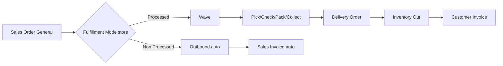
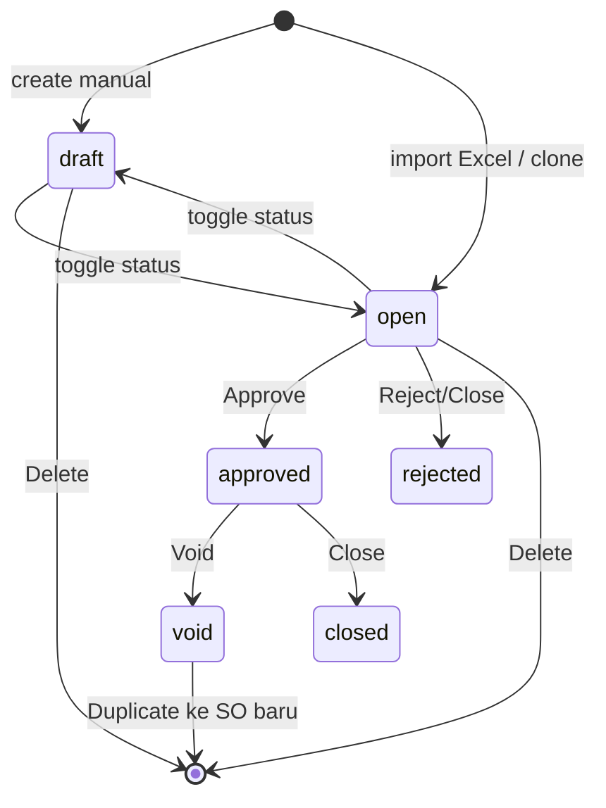
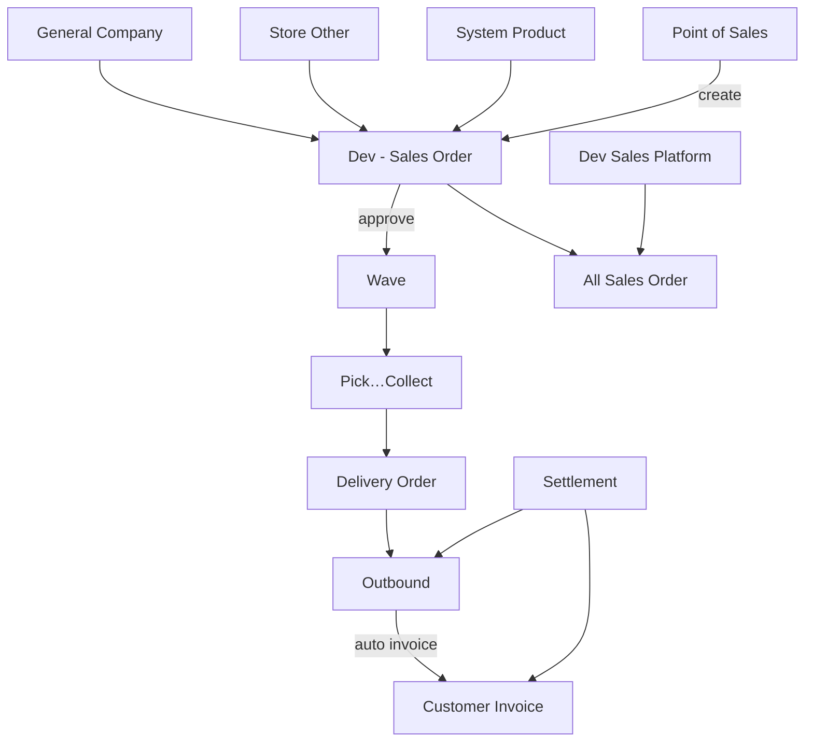

# Dev - Sales Order (Sales Order General) — Requirement Documentation

**Modul:** OmniChannel + BusinessDevelopment (+ SCM / Accounting hilir)  
**Type:** `type_sales_order = general`  
**UI route:** `/businessdevelopment/sales-order-general`  
**Audience:** PM, Ops, Finance, QA  
**SoT:** `busdev-sales-order-general-source-of-truth.md` v1.0 (21 Jul 2026) + Fulfillment Mode TO-BE (22 Jul 2026)

Window gabungan: [All Sales Order](../all-sales-order/requirement.md). Platform independen: [Dev - Sales Platform](../omni-sales-platform/requirement.md).  
Master flag: [Store — Fulfillment Mode](../omni-store-binding/requirement.md).

---

## 0. Metadata & Changelog

| Version | Date | Author | Changes |
|---------|------|--------|---------|
| 2.4 | 2026-07-09 | QA - Yemima | Bundle proporsi + benchmark COGS |
| 3.0 | 2026-07-22 | QA - Yemima | Rewrite dari SoT v1.0: datalist, status, import, ASO window, gap registry GAP-SOG-01…06 |
| 3.1 | 2026-07-22 | QA - Yemima | TO-BE: dual import **Import Processed** / **Import Non-Processed** + Fulfillment Mode store; GAP-SOG-07…12 |

---

## 1. Ringkasan Eksekutif

Sales Order General adalah dokumen penjualan **internal/manual** — order B2B, offline, telepon/WA, import Excel massal, dan POS — **bukan** hasil sync marketplace. Menu utama **Dev - Sales Order**; **All Sales Order** adalah window gabungan general + platform.

**Dua jalur fulfillment (TO-BE, dikunci oleh Store Fulfillment Mode):**

| Mode store | Import tombol | Setelah import sukses |
|------------|---------------|------------------------|
| **Processed** | **Import Processed** | Wave → pick/check/pack/collect → DO → Outbound → Invoice (seperti AS-IS) |
| **Non Processed** | **Import Non-Processed** | Lewati proses gudang; auto Outbound + Sales Invoice (approved) |

| Kebutuhan bisnis | Jawaban |
|------------------|--------|
| Catat penjualan B2B/offline | Header + detail System Product + customer General Company |
| Order massal dari spreadsheet | Import Excel 2 sheet — **dua tombol** Processed / Non-Processed |
| Picu proses gudang | Jalur Processed: Approve → wave → … → outbound |
| Order tanpa proses gudang | Jalur Non-Processed: import → stok check → OB + SI auto |
| Tagih & jurnal | Invoice otomatis saat outbound/settlement (Processed) atau auto saat import (Non-Processed) |
| Kasir toko | POS → SO General (Non-Processed POS = next requirement) |
---

## 2. Prasyarat

| Prerequisite | Sumber (Menu) | Catatan |
|---|---|---|
| Customer aktif | General Company | `company_type = general`, `is_customer = 1` |
| Store tipe General/Other | Store (Omni) | Platform `PL_OTHER`; menentukan warehouse proses + **Fulfillment Mode** |
| Produk aktif + unit | System Product / Master Unit | Detail line; produk PARENT tidak boleh |
| Shipper service aktif | Shipper Service | Import kosong → default `is_default_shipping_service = 1` |
| Fiscal period aktif | Accounting Setting | Transaction date dalam periode aktif |
| Order Process Setting | General Setting | `process_to_wave`, `instant_processing`, random SKU |
| Currency + exchange rate | Master Currency | Rate = 1 jika currency primary |
| (Opsional) Other Cost / Discount | Master Omni | Aktif + scope company |
| Stok cukup (kondisional) | SCM Stock | FIFO hanya jika `approve_with_validation = true` |

---

## 3. Siklus Status

| Status | Kondisi | Editable? | Tombol |
|---|---|---|---|
| draft | Default create manual | Ya | Save, toggle Open, Delete |
| open | Toggle dari draft; default hasil import (`is_import = 1`) | Ya | Save, toggle Draft, Approve, Reject/Close, Delete |
| approved | Approve dari open | Tidak | Void, Close |
| rejected / closed | Reject/Close | Tidak | — |
| void | Void dari approved (cek invoice/payment) | Tidak | Duplicate |

**Aturan:** Draft tidak bisa diapprove. Approve saat import masih berjalan diblokir.

---

## 4. Datalist

Endpoint: `POST omnichannel/sales-order/get?type=general` (ASO: `type=all`, engine kolom sama).

### 4.1 Kolom utama

| Kolom | Visible | Sumber | Keterangan |
|---|---|---|---|
| Trx. Code / Trx. Date | Ya | `code` + `transaction_date` | Link edit |
| Platform Order ID | Ya | `platform_order_id` | Opsional; referensi eksternal |
| Customer | Ya | `customer_id` | General Company |
| Store Name | Ya | `store_id` | General/Other |
| Shipper Service + Tracking | Ya | Shipper + other info | — |
| Processing Status | Ya | Proses gudang + ikon | Wave/pick/pack… |
| Product Amount | Ya | `grand_total_before_vat` | Setelah diskon, belum VAT/OC |
| Net Sales | Ya | `grand_total` | + VAT + other cost/discount |
| Trx. Status | Ya | `transaction_status` | — |
| Outbound / DO / Sales Invoice Code+Date | Ya | Relasi hilir | — |
| Buyer Notes | Ya | Notes | — |
| CURR. / Exchange / Product / COD / Your Ref. / Warehouse / Instant / Data Owner / Booking | Tidak | Berbagai | Column visibility |
| Error Flag | Kondisional | Error flags | Saat filter Failed Process (ASO) |

### 4.2 Fitur datalist

| Fitur | Keterangan |
|---|---|
| Carousel process status | Sales Request, Review, Processed, Shipment Ready, Delivered, Received, Completed, Return, Canceled — count cache ~10 menit; klik = filter |
| Advanced Filter / SearchBuilder | Termasuk tracking di other info |
| Import bulk + history + log | Excel 2 sheet; **dua tombol** Import Processed / Import Non-Processed; riwayat sesi; error per baris |
| Export template | Template Import Sales Order |
| Create | Auto-create draft → redirect edit |
| (ASO saja) PillButtons | Failed Process, Failed Synchronize, Ready to Process, Sync Status; Recheck Failed Process |

---

## 5. Form & Field

### 5.1 Header

| Field | Wajib | Default | Validasi | Catatan |
|---|---|---|---|---|
| Transaction Date | Ya | Hari ini | Fiscal period aktif | — |
| Customer | Ya | Default API | General customer aktif; locked setelah ada detail | — |
| Store | Ya | Default API | Required | Warehouse proses |
| Currency | Ya | ID 1 | Locked setelah ada detail | — |
| Exchange Rate | Ya | 1 | Numeric min 1; =1 jika primary | — |
| Shipper Service | Ya | Default | Valid & aktif | — |
| With Quotation | Ya | 0 | Boolean | — |
| Platform Order ID | Tidak | — | Max 100; unique non-void | Grouping import |
| Tracking Number | Tidak | — | Max 100; unique non-void | — |
| Description / Your Ref. / COD / Attachment | Tidak | — | Max length / numeric ≥0 / extension | — |

### 5.2 Detail line

| Field | Wajib | Validasi |
|---|---|---|
| Product | Ya | Aktif, bukan PARENT, owned_by cocok; bundle header aktif |
| Qty | Ya | > 0, bilangan bulat |
| Unit | Ya | Primary/alt aktif |
| Price | Ya | Numeric ≥ 0 |
| Sales Discount / Description | Tidak | Discount ≥ 0; desc max 150 |

Max **100** detail per SO (`max_child`).

### 5.3 Other Cost / Discount

Code exists + aktif + scope company/all-company; Amount numeric, ≠ 0, tidak negatif.

---

## 6. How It Works

### 6.1 Create manual

Create → ambil default values → **langsung POST draft** → redirect edit → isi header/detail/OC-OD → toggle Draft↔Open.

### 6.2 Approve

Set `approved`; simpan MA buffer & price history; lalu:

- `process_to_wave = OFF` → alokasi Random SKU langsung.
- `approve_with_validation = true` → validasi bundle, belum outbound, random SKU, FIFO, buat wave.
- **Default `approve_with_validation = false`:** tidak assign wave; user jalankan Unassign Wave / Skip Wave Process di SCM.

### 6.3 Import bulk (Excel 2 sheet)

Grouping 1 SO = Customer + Store + Transaction Date + Platform Order ID + Shipper Service Code + Tracking Number.

Template & validasi baris order **tidak berubah** antar jalur. Bedanya: **tombol import** + gate **Fulfillment Mode** store ([Store](../omni-store-binding/requirement.md)).

| Tombol UI | Gate store | Hasil sukses |
|-----------|------------|--------------|
| **Import Processed** | Store Fulfillment Mode = **Processed** | Status **open**, `is_import = 1` — lanjut approve & wave seperti AS-IS |
| **Import Non-Processed** | Store Fulfillment Mode = **Non Processed** | Job: stok → Outbound + Sales Invoice **auto-approved**; SO tidak masuk wave |

- Order di file yang store-nya **mismatch** mode tombol → **gagal order itu saja**; order lain lanjut validasi.  
- Tombol yang sama wajib ada di [All Sales Order](../all-sales-order/requirement.md).

#### 6.3.1 Import Processed (AS-IS path + gate mode)

Alur: upload → history processing → validasi sinkron (+ gate Processed) → job per SO → recalculate stock → update history. Hasil: status **open**, `is_import = 1`, currency 1, rate 1, payment type 8. Fulfillment hanya lewat processing hingga shipped (bukan lompat OB/SI dari import).

#### 6.3.2 Import Non-Processed (TO-BE)

1. Validasi import existing + gate Non Processed.  
2. Cek stok per SKU di **hierarki WH process store order** — reuse fungsi seperti **Send to Default Waves** (multi-store = cek per store).  
3. Satu SKU stok kurang → **rollback seluruh order** + log group order → row → SKU.  
4. Generate **Outbound**: origin dalam hierarki parent WH process; trx date = **order date + 10 detik**; auto-approved.  
5. Generate **Sales Invoice**: trx date = **outbound date + 10 detik**; auto-approved.  
6. Sebelum commit final: cek **semua COA** di jurnal auto OB & SI — jika overlap period Cash/Bank Reconcile **Approved** → rollback order + pesan jelas (tautkan GAP-CBR-08; guard fitur ini meski period lock global belum ada).  
7. Error teknis tengah jalan → **auto-retry** seperti Skip Wave Process.  
8. UI progress: completion, %, log informatif (pola Skip Wave) — redesign UX.  
9. SO sukses: **Approved** + tidak eligible Unassign/Skip Wave / processing (DEV TODO terkait).

Sheet 1 headers (exact, case-sensitive): Transaction Date, Customer Code, Store Name, Platform Order ID, Shipper Service Code, Tracking Number, System Product SKU, Qty, Unit, Price.

Sheet 2: Platform Order ID (match Sheet 1), OC/OD Code, Amount.

Batasan: max 100 detail/SO; `.xlsx/.xls`; tanpa hard cap total baris; 1 batch aktif; approve diblokir selama import Processed; formula Excel ditolak. POS/manual Non-Processed auto = **out of scope** fase ini.

### 6.4 Import detail per SO

Tab Detail (draft/open): 1 sheet Product ID/SKU, Qty, Unit, Unit Price; total tetap ≤ 100.

### 6.5 Fulfillment pasca-approve

1. Wave: reserved ↑, available ↓; `unassign_wave_status` → processed.  
2. Pick → Check → Pack → Collect (transfer virtual WH). Outbound auto di packing **off** (ETM-10761).  
3. Instant processing ON: scheduler auto pick→collect + auto DO.  
4. Delivery Order: butuh collecting; approve DO → transfer shipping-DO.  
5. Outbound (`OT…`): used ↑, reserved ↓; **trigger auto Customer Invoice** (jika belum ada) + jurnal outbound.

### 6.6 Finance

Approve SO **tidak** membuat invoice (kecuali POS). Invoice via: outbound approve, settlement, manual Sales Invoice, atau POS.

Settlement General: CSV Order ID, Date, Total + OC/OD → outbound + invoice + payment + jurnal.

### 6.7 Dampak stok

| Fase | available | reserved | used | Outstanding SO |
|---|---|---|---|---|
| Open/draft belum wave | — | — | — | Naik (ATS turun) |
| Wave assign | Turun | Naik | — | Keluar outstanding |
| Pick/Check/Pack | Pindah VH | — | — | — |
| Outbound approve | — | Turun | Naik | — |

ATS = On Hand − Outstanding SO − Reserved Out (recalculate async).

---

## 7. Validasi

### 7.1 Header

| # | Kondisi | Behavior |
|---|---|---|
| 1 | Date kosong / luar fiscal | Ditolak |
| 2 | Customer invalid | Ditolak |
| 3 | Store/currency/shipper/with_quotation kosong | Ditolak |
| 4 | Exchange ≠ 1 saat primary | Ditolak |
| 5 | Code duplikat per company | Ditolak |
| 6 | Platform Order ID / Tracking duplikat non-void | Ditolak |
| 7 | Edit status bukan draft/open | Diblokir |
| 8 | Ubah customer/tipe/currency setelah ada detail | Diblokir |

### 7.2 Detail

| # | Kondisi | Behavior |
|---|---|---|
| 9–10 | Qty nol/desimal; price negatif | Ditolak |
| 11–13 | Produk inactive/PARENT/bundle/unit inactive | Ditolak |
| 14 | Detail > 100 | Ditolak |

### 7.3 Approval

| # | Kondisi | Pesan / behavior |
|---|---|---|
| 15 | Draft | "This sales order is draft, you can't approve" |
| 16–18 | Final / import jalan / no detail | Diblokir |
| 19 | Produk inactive | "contains inactive product(s)" |
| 20 | Concurrent approve | "Approval process is in progress" |
| 21–22 | Validasi ON: stok kurang / sudah outbound | Insufficient Stock / has generated outbound |

### 7.4 Import

| # | Kondisi | Behavior |
|---|---|---|
| 23–24 | Header mismatch / file kosong | Sesi gagal |
| 25–29 | Formula / store non-Other / PO ID bentrok / SKU / unit | Baris gagal |
| 30–31 | Sheet 2 PO tidak di Sheet 1 / semua gagal | Gagal |
| 32 | **Import Processed** tapi store **Non Processed** (atau sebaliknya) | Order gagal; order lain lanjut (TO-BE) |
| 33 | Non-Processed: stok kurang di hierarki WH process store | Rollback seluruh order + log per SKU (TO-BE) |
| 34 | Non-Processed: COA jurnal OB/SI kena CBR Approved (overlap tanggal) | Rollback order + pesan lock (TO-BE) |

### 7.5 Void / Close / Delete

Delete hanya draft/open; Void bisa diblokir invoice/payment; Close/Reject dari open; Duplicate hanya dari void dengan tracking/PO ID unik.

---

## 8. Relasi Menu Lain

| Menu | Peran |
|---|---|
| General Company / Store Other / Product / Unit / Shipper / OPS / OC-OD | Master wajib/opsional |
| Wave / Unassign / Skip Wave / Processing / Skip Processing / DO / Outbound / Failed Ship | Fulfillment |
| Customer Invoice / Settlement / Payment / Journal / Sales Return / SO reports | Finance & laporan |
| Point of Sales | Create SO retail + auto fulfill/invoice |
| **All Sales Order** | View gabungan; Create/Import pola General; PillButtons + Recheck |
| **Dev - Sales Platform** | Marketplace sync; tampil di ASO |

### 8.1 General vs Platform vs ASO

| Aspek | General | Platform | ASO |
|---|---|---|---|
| Sumber | Manual, import, POS | Sync marketplace | Gabungan view |
| Binding produk | Tidak | Wajib | Ikut tipe |
| Approval | Sinkron | Async queue | Ikut tipe |
| Import Excel | Ya — **Import Processed** & **Import Non-Processed** | Tidak | Ya (kedua tombol, pola General) |
| Edit | Luas draft/open | Mostly read-only | Tergantung tipe |

---

## 9. Gap Registry

| ID | Deskripsi | Dampak | Status |
|---|---|---|---|
| GAP-SOG-01 | Import ~2.000 baris stuck: parse sinkron di HTTP → timeout, progress 0% | User/dev tanpa sinyal jelas | Open |
| GAP-SOG-02 | History stuck `processing` sampai upload baru (stale cleanup) | Status misleading | Open |
| GAP-SOG-03 | Beberapa error gagalkan seluruh sesi — belum partial per order | Order valid ikut terblokir | Open |
| GAP-SOG-04 | Belum export failed re-importable; log row number belum konsisten | Perbaikan manual sulit | Open |
| GAP-SOG-05 | Bulk 5.000+ (parse async, 1 order=1 job, partial, export failed) belum penuh | Kapasitas target belum | In Progress |
| GAP-SOG-06 | History detail per SKU, bukan per order/group | Sulit bedakan order vs baris gagal | Open |
| GAP-SOG-07 | Dual import + gate Fulfillment Mode belum di UI/API | Ops belum bisa pisah jalur Processed / Non-Processed | Open (TO-BE) |
| GAP-SOG-08 | Non-Processed: generate OB+SI auto, anti-wave, status Approved | Order tanpa gudang belum bisa diimport jalur khusus | Open (TO-BE) |
| GAP-SOG-09 | Non-Processed: reuse stock check Send to Default Waves + rollback per order/SKU log | Risiko alokasi stok tidak konsisten dengan wave | Open (TO-BE) |
| GAP-SOG-10 | Non-Processed: CBR/period-lock semua COA jurnal OB+SI | Jurnal bisa menembus period ter-reconcile (lihat GAP-CBR-08) | Open (TO-BE) |
| GAP-SOG-11 | Non-Processed: auto-retry teknis + UI progress ala Skip Wave | UX/job gagal transient tanpa sinyal jelas | Open (TO-BE) |
| GAP-SOG-12 | Trx date OB = order+10s; SI = outbound+10s | Konsistensi timestamp hilir | Open (TO-BE) |

---

## 10. FAQ

**Q: Beda Dev Sales Order vs ASO vs Platform?**  
A: General = internal. Platform = marketplace. ASO = gabungan monitoring; create/import ASO = pola General.

**Q: Create langsung ke edit?**  
A: By design — sistem buat draft + default dulu.

**Q: Import langsung Open?**  
A: Dianggap data lengkap, siap review/approve.

**Q: Setelah approve tidak masuk wave?**  
A: Default tanpa auto-wave — jalankan Unassign Wave / Skip Wave Process.

**Q: Kapan stok keluar / invoice?**  
A: Stok fisik saat outbound approve. Invoice saat outbound/settlement/manual/POS — bukan saat approve SO.

**Q: Store Shopee di import General?**  
A: Tidak — harus General/Other.

**Q: Import Processed vs Non-Processed?**  
A: Tombol mengikuti **Fulfillment Mode** di master Store. Processed = jalur gudang seperti sekarang. Non-Processed = lewati gudang; sistem buat Outbound + Sales Invoice otomatis (setelah stok & COA lolos). Template Excel sama.

**Q: Max import?**
A: 100 detail/SO; total baris tanpa hard cap tapi ~2.000 berisiko stuck (GAP-SOG-01).

---

## Related Documents

| Doc | Path |
|-----|------|
| Knowledge Base | [knowledge-base.md](./knowledge-base.md) |
| Technical | [technical.md](./technical.md) |
| User Guide | [user-guide.md](./user-guide.md) |
| All Sales Order | [../all-sales-order/](../all-sales-order/) |
| Dev Sales Platform | [../omni-sales-platform/](../omni-sales-platform/) |
