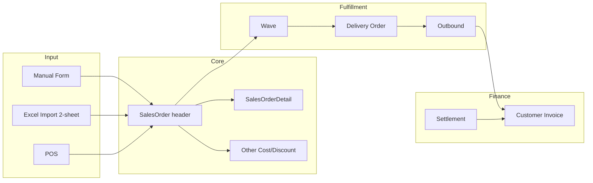
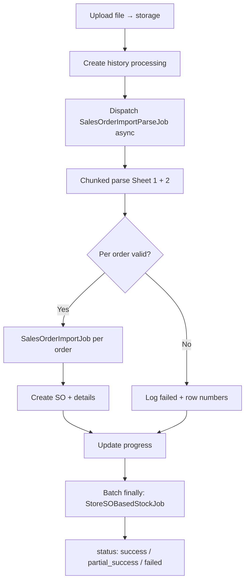

# Sales Order General — Technical Documentation

## 0. Metadata & Changelog

| Version | Date | Author | Changes |
|---------|------|--------|---------|
| 1.0 | 2026-06-19 | QA - Yemima | AS-IS import + merge bulk improvement TO-BE |

**Stack:** Laravel 13 · Vue 3 · Horizon · MariaDB  
**Type:** `type_sales_order = general`  
**UI routes:** `/businessdevelopment/sales-order-general`, `/businessdevelopment/all-sales-order`  
**API prefix:** `/api/omnichannel/sales-order/*`

---

## 1. Architecture Overview



**Entity:** `SalesOrderGeneral` extends `SalesOrder` (policy/menu scoping only).

**Tables:** `omni_sales_orders`, `omni_sales_order_details`, `omni_sales_order_other_costs`, `omni_sales_order_other_discounts`, `omni_sales_order_other_infos`, `omni_sales_order_import_histories`, `omni_sales_order_import_logs`.

---

## 2. Frontend File Map

| File | Role |
|------|------|
| `olshoperp-frontend/src/pages/BusinessDevelopment/SalesOrderGeneral/DataList.vue` | CRUD + import UI |
| `olshoperp-frontend/src/pages/BusinessDevelopment/SalesOrderGeneral/Form.vue` | Create/edit SO |
| `olshoperp-frontend/src/pages/BusinessDevelopment/Report/AllSalesOrder/DataList.vue` | Combined view + import |
| `src/utils/imports.ts` | Import history columns |
| `src/components/project/DataTables/ImportFileTable.vue` | Import progress |

**Router:** `businessdevelopment_sales-order-general_index`, `businessdevelopment_all-sales-order_index`

---

## 3. Backend File Map

| File | Role |
|------|------|
| `Modules/OmniChannel/Http/Controllers/SalesOrderController.php` | CRUD, upload, progress, import history |
| `Modules/OmniChannel/Http/Controllers/SalesOrderDetailController.php` | Detail lines, detail import |
| `Modules/OmniChannel/Import/SalesOrderImport.php` | Import orchestrator |
| `Modules/OmniChannel/Import/SalesOrderImportSheet1.php` | Sheet 1 parse + validate (sync today) |
| `Modules/OmniChannel/Import/SalesOrderImportSheet2.php` | Sheet 2 other cost/discount |
| `Modules/OmniChannel/Import/SalesOrderDetailImport.php` | Per-SO detail import |
| `Modules/OmniChannel/Jobs/SalesOrderImportJob.php` | 1 job = 1 SO group |
| `Modules/OmniChannel/Jobs/StoreSOBasedStockJob.php` | Batch finally — recalc SO stock |
| `Modules/BusinessDevelopment/Entities/SalesOrderGeneral.php` | Subclass for policy |
| `Modules/OmniChannel/Entities/SalesOrderImportHistory.php` | Import session |
| `Modules/OmniChannel/Entities/ImportSoLog.php` | Per-row error log |

**Config:** `config/general.php` → `max_child = 100`

---

## 4. Import — AS-IS (Current Implementation)

### 4.1 Flow

```
POST upload (.xlsx/.xls)
  → SalesOrderImportHistory (status: processing)
  → Parse Sheet 1 + Sheet 2 — SYNCHRONOUS in HTTP request
  → On validation fail → import_status = failed
  → On success → Bus::batch(SalesOrderImportJob[]) per order group
  → Each job: SalesOrderController@store + detail per line
  → Batch finally: StoreSOBasedStockJob
  → Update history counts
```

**Progress:** `GET omnichannel/sales-order/progress` (~95% during batch, ~5% stock calc)

### 4.2 Order grouping key

`Customer + Store + Transaction Date + Platform Order ID + Shipper Service Code + Tracking Number`

### 4.3 Limits (AS-IS)

| Rule | Value |
|------|-------|
| Max detail per order | 100 (`limitDetail` + `max_child`) |
| File format | `.xlsx`, `.xls` |
| Max rows file | No hard cap |
| Concurrent import | 1 active batch per company |
| SO status after import | `open` |
| Approve during import | Blocked (`so_general_import_{so_id}` cache) |

### 4.4 API (import)

| Method | Path | Role |
|--------|------|------|
| POST | `omnichannel/sales-order/upload` | Upload Excel |
| GET | `omnichannel/sales-order/progress` | Progress polling |
| GET | `omnichannel/sales-order/import-history` | History list |
| GET | `omnichannel/sales-order/import-history-detail/{id}` | Per-SKU detail |
| GET | `omnichannel/sales-order/import-log` | Row-level errors |
| GET | `omnichannel/sales-order/export?type=general` | Download template |

### 4.5 Known AS-IS issues

| Issue | Cause |
|-------|-------|
| ~2.000 rows stuck at 0% | Full parse in HTTP thread → timeout before jobs dispatch |
| No Horizon jobs visible | Request dies before `Bus::batch` |
| Old history → failed on new upload | Stale batch cleanup marks previous `failed` |
| No export failed orders | Feature not implemented |

---

## 5. Import Bulk Improvement — TO-BE (Design Spec)

> Merged from legacy `old_sales-order-import-bulk-improvement.md`. **Not yet implemented.**

### 5.1 Goals

| ID | Goal |
|----|------|
| G1 | Handle ≥5.000 rows per file without stuck |
| G2 | 1 order = 1 Horizon job |
| G3 | Partial success — valid orders proceed if others fail |
| G4 | Error reports include Excel row numbers |
| G5 | Export failed orders in re-importable template format |

### 5.2 Target architecture



**Key change:** HTTP returns in <10s; parsing moves to queue (`SalesOrderImportParseJob`).

### 5.3 Validation rules (TO-BE)

- **Order-level atomic failure:** 1 invalid row → entire order fails (no partial SO)
- **>100 detail lines:** entire order fails with row range message
- **File-level failure:** corrupt template → entire session `failed` immediately

### 5.4 Proposed API additions

| Method | Path | Role |
|--------|------|------|
| GET | `import-history/{id}/orders` | Order-level success/fail list |
| GET | `import-history/{id}/export-failed` | Re-importable Excel |

### 5.5 Proposed schema changes

**`omni_sales_order_import_histories`:** `total_so_failed`, `total_order`, `processed_order`, `parse_status`, `failure_reason`

**Order-level tracking:** extend `import_history_details` or new `import_history_orders` with `group_key`, `first_row_number`, `last_row_number`, `row_numbers` (json)

### 5.6 New jobs (proposal)

| Job | Role |
|-----|------|
| `SalesOrderImportParseJob` | Async chunked Excel read + order grouping |
| `SalesOrderImportFailedExport` | Generate failed-order Excel |

### 5.7 QA test scenarios (TO-BE)

| # | Scenario | Expected |
|---|----------|----------|
| TS-1 | 5.000 rows, 50 orders | Progress >0%, Horizon shows jobs |
| TS-2 | Order 101 SKU lines | Order fails; others succeed → `partial_success` |
| TS-3 | Export failed → fix → re-import | Fixed orders succeed |

---

## 6. Cross-References

| Topic | Doc |
|-------|-----|
| Business rules & import columns | [requirement.md](./requirement.md) §4 |
| Operator guide | [knowledge-base.md](./knowledge-base.md) |
| Platform SO comparison | [requirement.md](./requirement.md) §6 |

---

## Related Documents

| Doc | Path |
|-----|------|
| Requirement | [requirement.md](./requirement.md) |
| Knowledge Base | [knowledge-base.md](./knowledge-base.md) |
| Legacy import improvement source | [../_legacy/old_sales-order-import-bulk-improvement.md](../_legacy/old_sales-order-import-bulk-improvement.md) |
