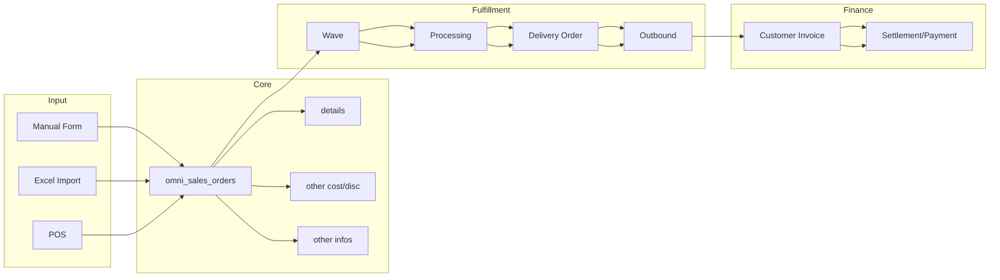
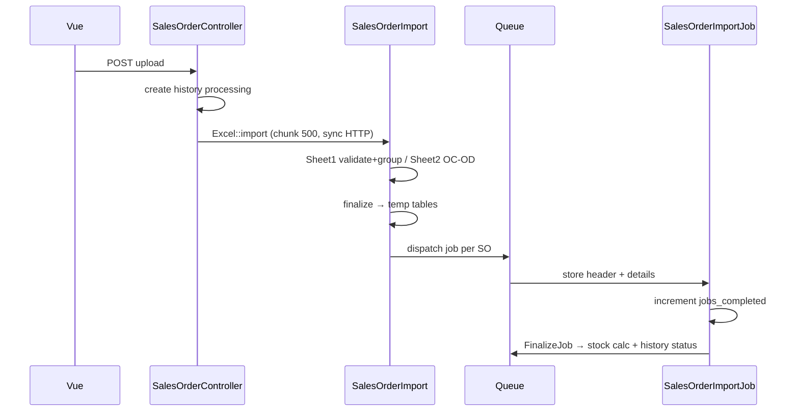

# Dev - Sales Order (Sales Order General) — Technical Documentation

**Type:** `type_sales_order = general`  
**UI:** `/businessdevelopment/sales-order-general`  
**API prefix:** `/api/omnichannel/sales-order/*`  
**Behavior:** [requirement.md](./requirement.md) v3.1  
**Stack:** Laravel 13 · Vue 3 · Horizon · MariaDB

---

## 0. Changelog

| Version | Date | Changes |
|---------|------|---------|
| 1.3 | 2026-07-09 | Bundle / benchmark COGS file map |
| 3.0 | 2026-07-22 | Rewrite SoT v1.0: file map, import AS-IS, invariants, failure modes |
| 3.1 | 2026-07-22 | TO-BE: dual import channels + Non-Processed OB/SI pipeline; GAP-SOG-07…12 |

---

## 1. Architecture Overview

`SalesOrderGeneral` extends `SalesOrder` — policy/menu scoping only. Shared table dengan Platform.

---

## 2. File Map

### Backend

| Role | Path |
|------|------|
| Entity | `Modules/OmniChannel/Entities/SalesOrder.php`, `…/SalesOrderDetail.php`, other cost/discount/info |
| Subclass policy | `Modules/BusinessDevelopment/Entities/SalesOrderGeneral.php` |
| CRUD / list / import API | `Modules/OmniChannel/Http/Controllers/SalesOrderController.php` |
| Approve | `Modules/OmniChannel/Http/Controllers/SalesOrderApprovalController.php` |
| Detail lines | `Modules/OmniChannel/Http/Controllers/SalesOrderDetailController.php` |
| Import orchestrator | `Modules/OmniChannel/Import/SalesOrderImport.php` |
| Sheet 1 / Sheet 2 | `SalesOrderImportSheet1.php`, `SalesOrderImportSheet2.php` |
| Detail import | `SalesOrderImportDetailImport.php` / `SalesOrderDetailImport.php` |
| Jobs | `SalesOrderImportJob`, `SalesOrderImportFinalizeJob`, `StoreSOBasedStockJob`, wave/skip processing jobs |
| History / log | `SalesOrderImportHistory`, `SalesOrderImportHistoryDetail`, `ImportSoLog` |
| Temp import | `SalesOrderImportTemHeader`, `SalesOrderImportTemDetail` |
| Config | `config/general.php` → `max_child`; `config/omni.php` → `approve_so.approve_with_validation` |

### Frontend

| Role | Path |
|------|------|
| Datalist General | `olshoperp-frontend/src/pages/BusinessDevelopment/SalesOrderGeneral/DataList.vue` |
| Form / Detail | `Form.vue`, `DatalistDetail.vue` |
| ASO list | `…/Report/AllSalesOrder/DataList.vue` |
| PillButtons (ASO/SP) | `src/pages/Omni/SalesOrder/components/PillButtons.vue` |
| Import columns | `src/utils/imports.ts`, `ImportFileTable.vue` |

---

## 3. API Routes (import & list)

| Method | Path | Role |
|--------|------|------|
| POST | `omnichannel/sales-order/get?type=general` | Datalist |
| POST | `omnichannel/sales-order/upload?type=general` | Bulk import |
| GET | `omnichannel/sales-order/progress` | Import progress |
| GET | `omnichannel/sales-order/import-history` | History |
| GET | `omnichannel/sales-order/import-history-detail/{id}` | Success SO codes |
| GET | `omnichannel/sales-order/import-log` | Row errors (`id_table` = `general`) |
| GET | `omnichannel/sales-order/filter-process-status?type=general` | Carousel counts |
| GET | `omnichannel/sales-order/pill-count?type=…` | ASO/SP pills |
| POST | `omnichannel/sales-order/{id}/approve` | Approve |
| GET | `omnichannel/sales-order/export?type=general` | Template |

ASO list: `businessdevelopment/all-sales-order/get?type=all` (shared column engine).

---

## 4. Database — Key Tables

| Table | Role |
|-------|------|
| `omni_sales_orders` | Header (`type_sales_order`, `platform_order_id`, `transaction_status`, flags) |
| `omni_sales_order_details` | Lines; qty/price; `processed_to_out_quantity`, DO/invoice qty flags |
| `omni_sales_order_other_costs` / `_other_discounts` | OC/OD |
| `omni_sales_order_other_infos` | Tracking, COD, booking fields |
| `omni_sales_order_import_histories` | Import session + counters + `url_row_failed` |
| `omni_sales_order_import_history_details` | Success rows (SKU / SO code) |
| `omni_import_so_logs` | Row-level errors |

---

## 5. Import — AS-IS Flow

**Grouping key:** Customer + Store + Transaction Date + Platform Order ID + Shipper + Tracking.  
**SO status after import:** `open`, `is_import = 1`.  
**Progress:** ~95% jobs, ~5% `StoreSOBasedStockJob`.

Known AS-IS issues → [requirement §9](./requirement.md) GAP-SOG-01…06 (HTTP sync parse, log wipe, soft-delete PO ID, etc.).

### 5.1 Dual import channels + Non-Processed pipeline (TO-BE)

| Channel | UI label | Gate | Downstream |
|---------|----------|------|------------|
| `processed` | **Import Processed** | Store `fulfillment_mode = processed` | Existing import → open → wave path |
| `non_processed` | **Import Non-Processed** | Store `fulfillment_mode = non_processed` | Stock check (reuse Send to Default Waves / WH process hierarchy) → Outbound + Sales Invoice auto-approve |

**Non-Processed dates:** Outbound `trx_date = order_date + 10s`; Sales Invoice `trx_date = outbound_date + 10s`.  
**COA guard:** every COA on auto journals OB & SI vs Approved Cash/Bank Reconcile period overlap → rollback order (see GAP-CBR-08 / GAP-SOG-10).  
**Retry:** mirror Skip Wave Process technical retry.  
**UI:** Skip Wave–like progress/log `[VERIFY: CODEBASE]` until implemented.  
**Parity:** same two buttons on All Sales Order FE.

Store field: [omni-store-binding technical §5.1](../omni-store-binding/technical.md).

---

## 6. Invariants

| ID | Invariant |
|----|-----------|
| INV-SOG-01 | `count(details) ≤ 100` per SO |
| INV-SOG-02 | Qty integer `> 0`; price `≥ 0` |
| INV-SOG-03 | `platform_order_id` / tracking unique among non-void SO |
| INV-SOG-04 | Import Processed SO: `transaction_status = open` and `is_import = 1` |
| INV-SOG-05 | `processed_to_out_quantity ≤ sales_order_quantity` per detail |
| INV-SOG-06 | Store platform for general = `PL_OTHER` |
| INV-SOG-07 | Draft never approved |
| INV-SOG-08 | ATS = on_hand − outstanding_so − reserved_out after recalculate |
| INV-SOG-09 | First outbound approve without existing invoice qty → exactly one auto-approved Customer Invoice |
| INV-SOG-10 | TO-BE: Import channel must match store `fulfillment_mode` or order fails (others continue) |
| INV-SOG-11 | TO-BE: Non-Processed success → SO approved + not eligible for wave/processing |
| INV-SOG-12 | TO-BE: Any SKU stock fail → entire order rolled back (no partial SO) |

---

## 7. Validation Highlights

- Header/detail/approve/import: inline di controller (lihat requirement §7).  
- Import Sheet1: formula reject; fiscal period; store `PL_OTHER`; cross-chunk PO/tracking index.  
- Soft-deleted SO still can block platform order ID on re-import if query does not exclude trashed — GAP related.  
- `bootImport` master lookup from **first chunk only** — risk for rows after chunk 500 (GAP capacity).

---

## 8. Frontend Behaviors

| Behavior | Notes |
|----------|-------|
| Create | `default-values` → POST create → redirect edit |
| Carousel | `filter-process-status?type=general` + filter `sales_order_process_status` |
| ASO upload | Still `upload?type=general` |
| Processing icons | `formatAvailabilityAndProcessStatus` (TransferSummary) |
| Import UI | Dual actions: **Import Processed** / **Import Non-Processed** + history/log (Non-Processed progress TO-BE Skip Wave–like) |

---

## 9. Failure Modes & Transaction Boundary

| Failure | Boundary / expected |
|---------|---------------------|
| HTTP timeout during parse | No jobs; history may stay `processing` until next upload (GAP-SOG-01/02) |
| Concurrent approve | Cache lock ~60s |
| Approve during import | Cache `so_general_import_{so_id}` |
| Job fails mid-order | Soft-delete SO if detail errors after header created; PO ID may remain “taken” |
| Sheet2 error after Sheet1 | `parent->hasError` may not stop `finalize()` dispatch — verify/fix |
| Multiple FinalizeJob | Race on `jobs_completed` without finalize flag |

---

## 10. Data Lifecycle

| Flag / qty | Moves when |
|------------|------------|
| Outstanding SO | Open/approved pre-wave → wave moves to reserved |
| `prepared_to_do` / `processed_to_do` | DO create/approve |
| `processed_to_out` | Outbound approve → may trigger invoice qty |
| Settlement chain | Outbound → invoice → payment → journal if incomplete |
| `is_instant_processing` | Scheduler skip-processing eligibility |
| Void → Duplicate | Clone resets relations; new unique tracking / PO ID |

---

## 11. Tests & QA Notes

- No dedicated automated tests for `SalesOrderImport*` found at rewrite time — add feature tests for grouping, max 100, soft success, chunk lookup.  
- Staging repro: compare detail lines per `platform_order_id` after partial import (detail swap risk under parallel jobs).

---

## 12. Known Issues (GAP refs)

| GAP | Technical note |
|-----|----------------|
| GAP-SOG-01/05 | Move parse to queue; raise HTTP timeout workaround not enough |
| GAP-SOG-02 | Cleanup on upload only |
| GAP-SOG-03/06 | Order-level atomic failure + history detail per group |
| GAP-SOG-04 | Implement failed export; persist logs per `history_id` |
| GAP-SOG-07…12 | Dual import + Non-Processed OB/SI pipeline, CBR COA guard, Skip Wave UX/retry — see requirement §9 |

---

## Related

[requirement.md](./requirement.md) · [knowledge-base.md](./knowledge-base.md) · [user-guide.md](./user-guide.md) · [all-sales-order/technical.md](../all-sales-order/technical.md)
