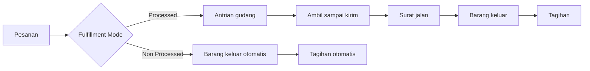
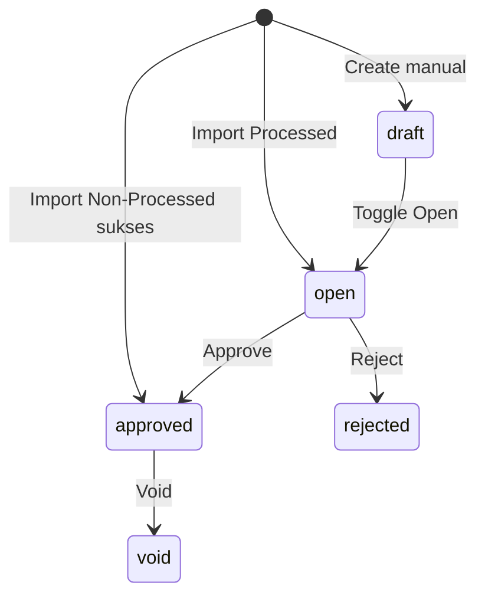

# Dev - Sales Order — Panduan Pengguna

**Siapa yang baca:** Busdev, ops, support, finance ops  
**Menu:** Business Development → **Dev - Sales Order**  
**Untuk apa:** Mencatat pesanan penjualan **internal** (bukan dari marketplace)

Sebelum import massal, atur **Fulfillment Mode** di menu **Store**: **Processed** atau **Non Processed**.

---

## 1. Apa Itu & Kenapa Penting

Dev - Sales Order mencatat pesanan dari telepon, WA, B2B, Excel, atau kasir — **bukan** sync Shopee/Lazada/TikTok.

Dari sini pesanan bisa masuk proses gudang penuh, atau (untuk toko Non Processed) langsung keluar barang dan tagihan. Data yang salah membuat stok “boleh dijual” dan tagihan ikut salah.

---

## 2. Overview Flow & Proses Bisnis

**Versi teks:**

1. Pesanan dibuat (manual, **Import Processed**, **Import Non-Processed**, atau POS).  
2. **Processed:** Approve → antrian gudang → ambil–kemas → surat jalan → barang keluar → tagihan.  
3. **Non Processed (import):** cek stok → barang keluar + tagihan otomatis (tanpa wave–ship).  
4. Settlement / pembayaran menyelesaikan rekonsiliasi bila dipakai.

🎬 [Interactive demo akan ditambahkan di sini]

### Siklus status

| Status | Artinya | Bisa diubah? |
|--------|---------|--------------|
| **Draft** | Baru disusun | Ya |
| **Open** | Siap approve (hasil Import Processed) | Ya |
| **Approved** | Final (termasuk Non-Processed sukses) | Tidak |
| **Rejected / Closed / Void** | Ditolak / ditutup / batal | Tidak |

---

## 3. Sebelum Mulai (Flow Sebelum)

- [ ] Customer aktif (General Company).  
- [ ] Store tipe **Others** dengan **Fulfillment Mode** yang tepat.  
- [ ] Produk & satuan aktif.  
- [ ] Kurir / shipper (atau default).  
- [ ] Periode pembukuan aktif.  
- [ ] Non-Processed: stok cukup di gudang proses store.

🎬 [Interactive demo akan ditambahkan di sini]

---

## 4. Setelah Selesai (Flow Sesudah)

**Setelah Approve (Processed):** pesanan terkunci → sering perlu Unassign/Skip Wave → proses gudang → surat jalan → barang keluar → tagihan.

**Setelah Import Non-Processed sukses:** barang keluar + tagihan sudah dibuat otomatis; pesanan tidak masuk antrian gudang.

🎬 [Interactive demo akan ditambahkan di sini]

---

## 5. Yang Perlu Diperhatikan

- Kalau kamu pakai **Import Processed** untuk store **Non Processed** (atau sebaliknya), order itu gagal — samakan tombol dengan mode store.  
- Kalau kamu **Approve saat Draft** / import masih jalan, sistem menolak.  
- Kalau qty nol/desimal, produk induk, atau lebih dari 100 baris SKU, sistem menolak.  
- Kalau cell Excel berisi rumus, baris ditolak.  
- Kalau Non-Processed stok SKU kurang, **seluruh order** gagal — cek log SKU mana.  
- Kalau Non-Processed kena akun yang sudah di-rekonsiliasi untuk tanggal itu, order digagalkan dengan pesan jelas.  
- Kalau kamu mengira tagihan muncul saat Approve jalur Processed — tunggu outbound/settlement.  
- POS memakai jalur Non-Processed otomatis: **belum** di fase ini.

---

## 6. Langkah-Langkah (Step by Step)

### A. Buat manual

1. Buka Dev - Sales Order → **Create**.  
2. Lengkapi customer, store, produk.  
3. Open → **Approve** → lanjut gudang di SCM bila perlu.

### B. Import Processed

1. Pastikan store = **Processed**.  
2. Download template → isi tanpa rumus.  
3. Klik **Import Processed** → pantau history/log.  
4. Review SO Open → Approve → proses gudang.

### C. Import Non-Processed

1. Pastikan store = **Non Processed**.  
2. Template sama.  
3. Klik **Import Non-Processed**.  
4. Pantau progress/completion/log (mirip Skip Wave).  
5. Order sukses: outbound + invoice otomatis.

### D. Kasir (POS)

Ikuti Point of Sales. Jalur Non-Processed penuh dari POS = requirement berikutnya.

🎬 [Interactive demo akan ditambahkan di sini]

---

## 7. Tips & Hal yang Sering Bikin Bingung

- Template Excel **tidak berubah** — bedanya hanya tombol + mode store.  
- Satu file bisa multi-store; tiap order dicek ke gudang proses **store-nya sendiri**.  
- All Sales Order punya **tombol import yang sama**.  
- Platform Order ID di General = referensi kamu, bukan nomor Shopee.

---

## 8. Referensi

| Untuk | Dokumen |
|-------|---------|
| Aturan QA | [requirement.md](./requirement.md) |
| Troubleshooting | [knowledge-base.md](./knowledge-base.md) |
| Teknis | [technical.md](./technical.md) |
| Store Fulfillment Mode | [../omni-store-binding/user-guide.md](../omni-store-binding/user-guide.md) |
| All Sales Order | [../all-sales-order/user-guide.md](../all-sales-order/user-guide.md) |
