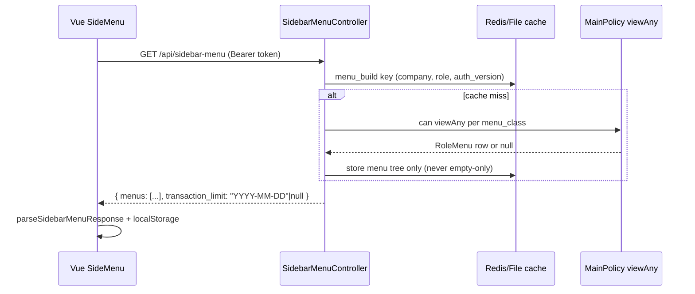

# Sidebar Menu (Gate) — Technical Documentation

> **Audience:** Cursor agents, backend/frontend engineers.  
> **Purpose:** Mencegah regresi sidebar kosong (bug recurring).

## 1. Symptom & root cause (historical)

| Gejala | Network `GET /api/sidebar-menu` |
|--------|----------------------------------|
| Sidebar hanya search bar, tanpa modul/menu | HTTP 200, `status.error = 0` |
| Payload salah | `data: [{ "transaction_limit": null }]` saja |

**Root causes yang pernah terjadi:**

1. **Backend** — `menu_build` cache menyimpan hasil build **termasuk** footer `{ transaction_limit }`. Saat semua `viewAny` gagal, `formatMenu()` → `[]`, lalu di-append footer → cache `[{ transaction_limit: null }]` selama **600 detik**.
2. **Backend** — `gate-view-any` cache key tanpa `role_id` (cross-role pollution) atau cache `false` yang stale setelah privilege diubah.
3. **Frontend** — `SideMenu.vue` / `MobileMenu.vue` menyimpan **`data.data` utuh** ke `localStorage.sidebar` (termasuk footer), berbeda dengan `router/index.ts` yang sudah `slice(0, -1)`.
4. **Frontend** — `localStorage.sidebar` corrupt ter-cache; reload tidak fetch ulang.

## 2. Architecture overview



## 3. API contract (canonical)

**Route:** `GET /api/sidebar-menu`  
**Auth:** `auth:sanctum`  
**Controller:** `Modules\Gate\Http\Controllers\SidebarMenuController@index`

### Response shape (TO-BE — enforced)

```json
{
  "status": { "error": 0, "title": "Success", "message": "Success" },
  "data": {
    "menus": [
      {
        "icon": "fa-box",
        "title": "Inventory",
        "pageName": "#",
        "actives": ["..."],
        "subMenu": [ { "title": "...", "pageName": "...", "path": "/..." } ]
      }
    ],
    "transaction_limit": "2024-01-01"
  }
}
```

| Field | Type | Notes |
|-------|------|-------|
| `data.menus` | array | Tree modul → menu → subMenu. **Minimal 1 group** untuk user dengan privilege normal. |
| `data.transaction_limit` | string\|null | Batas render transaksi (General Setting), **bukan** item menu. |

### Legacy array format (backward compat di FE only)

FE parser `parseSidebarMenuResponse()` masih menerima:

```json
"data": [ {...menuGroup}, { "transaction_limit": null } ]
```

**Jangan** generate format legacy dari backend lagi.

## 4. Backend file map

| File | Role |
|------|------|
| `Modules/Gate/Http/Controllers/SidebarMenuController.php` | Build tree, API response |
| `Modules/Gate/Support/SidebarMenuCache.php` | Cache keys + invalidation |
| `Modules/Gate/Http/Controllers/RoleMenuController.php` | Privilege save → `invalidateForRole()` |
| `app/Policies/MainPolicy.php` | `viewAny()` via `gate_role_menus` |
| `Modules/Gate/Entities/Menu.php` | `hasActiveSubMenus()` — gate-view-any scoped per role |
| `Modules/GeneralSetting/Http/Controllers/RenderTransactionLimitController.php` | Flush menu_build on limit change |

## 5. Cache keys (DO NOT break)

| Key pattern | TTL | Stores | Invalidation |
|-------------|-----|--------|--------------|
| `menu_build:{company}:{role}:{auth_version}` | 600s | Menu tree **only** | `SidebarMenuCache::invalidateForRole()`, render limit update |
| `sidebar-auth-version:{role}` | 1 day | Integer version | Bump on role-menu save |
| `gate-view-any:{role}:{menu_class}:{auth_version}` | 600s | **true only** (never cache false) | Auth version bump |
| `render_transaction_limit:{company}` | 600s | RenderTransactionLimit model | RenderTransactionLimitController@store |
| `RoleMenu:{model}:{role}` (MainPolicy) | 300s | RoleMenu row | RoleMenuController store (per menu_class) |

### Regression guardrails (agents MUST follow)

1. **Never** append `transaction_limit` inside `menu_build` cache closure.
2. **Never** `Cache::remember` an empty menu tree for 600s when `role_id` is present — forget key if build returns `[]`.
3. **Never** cache `viewAny = false` in `gate-view-any` — only cache positive results.
4. **Always** include `role_id` in `gate-view-any` keys (and `sidebar-auth-version`).
5. **Always** call `SidebarMenuCache::invalidateForRole($roleId, $menuClasses)` after role-menu privilege changes.
6. **Never** add `where('view', 1)` on `gate_role_menus` — column does not exist; use policy/`viewAny`.

## 6. Frontend file map

| File | Role |
|------|------|
| `olshoperp-frontend/src/utils/sidebarMenuResponse.ts` | **Single parser** for API + localStorage |
| `olshoperp-frontend/src/layouts/project/SideMenu/SideMenu.vue` | Primary sidebar |
| `olshoperp-frontend/src/components/project/MobileMenu/MobileMenu.vue` | Mobile drawer |
| `olshoperp-frontend/src/router/index.ts` | Prefetch sidebar + `transaction_limit` → DataStore |
| `olshoperp-frontend/src/components/project/TopBar/TopBar.vue` | Refresh sidebar cache on company switch |

### FE rules

- Import `parseSidebarMenuResponse` / `persistSidebarMenuLocalStorage` — **do not** duplicate slice logic.
- If `menus.length === 0`, **remove** `localStorage.sidebar` (force refetch next load).
- Do not treat objects with only `transaction_limit` as menu items.

## 7. Troubleshooting

| Check | Action |
|-------|--------|
| API returns only `transaction_limit` | Verify token has `role_id`; check `gate_role_menus` for role; flush `menu_build` / bump auth version |
| API OK but UI empty | Clear `localStorage.sidebar`; hard refresh |
| After role privilege edit | User must re-login (tokens expired in `delete_session`) or wait cache TTL |
| Staging after deploy | `php artisan cache:clear` once if old `menu_build` keys exist |

## 8. Tests

| Test | Path |
|------|------|
| Cache key / invalidation unit | `tests/Unit/Gate/SidebarMenuCacheTest.php` |

**Manual QA:** Login as admin → sidebar shows modules → DevTools `sidebar-menu` → `data.menus.length > 0`.

## 9. Changelog

| Date | Change |
|------|--------|
| 2026-06-20 | Fix recurring empty sidebar; structured API; SidebarMenuCache; FE parser; this doc |
