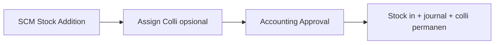

# Stock Addition — Knowledge Base

> Status **review**. **Colli v2** (§7) = TO-BE parity Purchase Inbound — [ETM-15633](https://erpintegration.atlassian.net/browse/ETM-15633).

## 1. Apa itu Stock Addition?

Penambahan stok manual (inventory adjustment inbound). `StockMutationAddition` dengan `is_inventory_adjustment = 1`, `supplier_id` null, kode `AI`. Detail di `InboundMutationDetail`.

| Item | Nilai |
|------|-------|
| Menu | Supply Chain → Stock Addition |
| Route UI | `/supplychain/adjustment-addition` |
| Kode dokumen | `AI` |
| Tabel header | `scm_stock_mutations` |
| Tabel detail | `scm_inbound_mutation_details` — perlu harga/benchmark untuk jurnal |

**Tujuan:** Menambah qty stok di gudang tanpa PO — opname surplus, koreksi, opening stock, dll.

## 2. Glosarium

| Istilah | Arti |
|---------|------|
| Stock Mutation | Transaksi pergerakan stok di `scm_stock_mutations` |
| Item Stock | Batch/lot stok fisik per produk di gudang (`scm_item_stocks`) |
| Transaction status | `open`, `draft`, `approved`, `rejected`, `void`, dll. |
| Approval log | Riwayat approve di `scm_stock_mutation_approvals` |
| Fiscal period | Periode akuntansi — transaksi harus dalam periode terbuka |
| Colli (v2) | Wadah multi-SKU di satu Location Destination; code prefix `COL` |
| Colli Type | Master jenis wadah (Box, Pallet, …) — dipakai saat **New Colli** |
| Existing / New Colli | Pakai code yang sudah ada (WH sama) vs buat code baru + Type |

## 3. Yang Bisa / Tidak Bisa Dilakukan

### Bisa
- Buat header transaksi (status `open` / `draft`)
- Tambah/edit/hapus detail selama belum approved (`can_update`)
- Import Excel detail (jika menu mendukung)
- Assign **Existing** / **New Colli** ke baris detail (opsional) — TO-BE Colli v2
- Bulk assign beberapa SKU ke **satu** colli
- Approve dengan permission `approval` (lihat catatan approve per menu)
- Export list dan detail, print label (jika tersedia)
- Lihat audit log dan approval eligibility

### Tidak Bisa
- Ubah header/detail setelah approved (`can_update = false`)
- Tanggal transaksi lebih besar dari hari ini
- Approve tanpa detail
- Approve saat import detail sedang berjalan (cache lock)
- Transaksi di luar fiscal period terbuka
- Hapus dokumen auto-generated (opname, in-transit) — baca error message spesifik
- Pakai Existing Colli dari gudang **beda** dengan Location Destination
- Satu baris detail ke lebih dari satu colli

## 4. Cara Pakai (How-To)

### Skenario umum
1. Buka menu **Stock Addition** → **Create**.
2. Isi header: tanggal transaksi, gudang (origin/destination sesuai tipe), deskripsi, lampiran opsional.
3. Simpan → tambah detail produk (manual, bulk, atau import).
4. (Opsional) Assign Colli: Existing (WH sama) atau New + Colli Type — atau biarkan kosong.
5. Review **Approval Eligibility** di panel form.
6. **Approve** lewat **Stock Addition Approval** (Accounting) — bukan tombol Approve di SCM.
7. Verifikasi stok / kode colli di **Stock Monitoring** / Stock History.

## 5. Troubleshooting

| Gejala | Penyebab | Solusi |
|--------|----------|--------|
| Approve gagal "doesn't have any detail" | Belum ada baris detail | Tambah minimal 1 detail |
| "Updating process is in progress" | Import Excel masih jalan | Tunggu selesai, cek import log |
| "Transaction date cannot be greater than today" | Tanggal lebih besar dari hari ini | Koreksi tanggal transaksi |
| Fiscal period error | Periode tutup | Buka periode di Accounting atau ubah tanggal |
| Tidak bisa ubah gudang | Sudah ada detail terikat gudang | Hapus detail dulu atau buat dokumen baru |
| Tombol Approve tidak muncul | Permission / menu SCM adjustment | Cek role; untuk Addition/Deduction approve di Accounting |
| Existing Colli ditolak | Colli beda WH vs Location Destination | Pilih colli WH sama, atau New Colli |
| Colli hilang dari list | Draft dihapus / reject+delete; colli baru belum pernah Approve | Normal — buat New Colli lagi jika perlu |

## 6. FAQ

**Q: Apa beda menu ini dengan Stock Adjustment?**  
A: Menu mutation (`mutation-inbound/outbound/transfer`) untuk alur operasional normal. Menu `adjustment-addition/deduction` khusus `is_inventory_adjustment = 1` dengan approval finance terpisah.

**Q: Dokumen terkait menu lain?**  
A: Lihat: accounting-adjustment-inbound, supplychain-stock-opname, Colli Type, New Purchase Inbound (acuan Colli v2).

**Q: Bagaimana cara approve?**  
A: SCM: create/edit only. Approve via Accounting: POST `accounting/adjustment-inbound/{id}/approve` (`InboundValueAdjustmentController`).

**Q: Colli wajib diisi?**  
A: Tidak. Baris tanpa colli (NULL) diperbolehkan.

**Q: Sama dengan Colli di Purchase Inbound?**  
A: Ya untuk konsep Existing/New, Colli Type, multi-SKU satu code, WH exact. Beda: Stock Addition tidak punya Available Use dari PO; approve lewat Accounting.

## 7. Colli v2 (TO-BE) — ringkas operator

Detail aturan: [requirement §11](./requirement.md#11-fitur-colli-v2-to-be--etm-15633).

| Langkah | Yang dilakukan |
|---------|----------------|
| 1 | Pastikan **Location Destination** sudah benar |
| 2 | Tambah produk (manual / import) |
| 3 | Centang baris → Assign **Existing** atau **New** (+ Type) → Save |
| 4 | Import: isi kolom **Colli** (nomor urut sama = 1 New Colli; code existing; kosong = tanpa colli) |
| 5 | Setelah approve Accounting, colli permanen & terlihat di monitoring |
