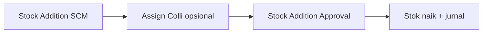
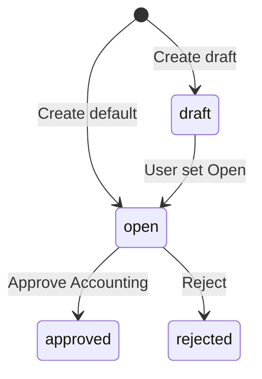

# Stock Addition — Panduan Pengguna

**Siapa yang baca panduan ini:** operator gudang, inventory, operations support, finance yang approve penambahan stok  
**Menu di sistem:** Supply Chain → **Stock Addition**  
**Kode transaksi:** dimulai dengan `AI`  
**Approve:** lewat menu **Stock Addition Approval** (Accounting) — tombol Approve di SCM tidak dipakai untuk menu ini

---

## 1. Apa Itu & Kenapa Penting

**Stock Addition** dipakai untuk **menambah stok di gudang secara manual** — tanpa Purchase Order. Contoh: koreksi surplus, opening stock, atau penyesuaian inventory lain yang disepakati finance.

Setelah disetujui di Accounting, qty stok naik dan jurnal penyesuaian ikut terbit. Kamu juga bisa (opsional) mengelompokkan beberapa SKU ke **satu Colli** (wadah Box/Pallet, dll.) di lokasi gudang yang sama — aturan sama dengan Colli di Purchase Inbound, tapi tanpa alur PO.

---

## 2. Overview Flow & Proses Bisnis

### Rantai proses

**Versi teks (tanpa diagram):**

1. Buat dokumen **Stock Addition** di Supply Chain (header + baris produk).
2. Opsional: assign **Existing** / **New Colli** ke baris.
3. Finance **Approve** di **Stock Addition Approval**.
4. Stok masuk ke Location Destination; colli (jika ada) jadi permanen dan bisa dilihat di monitoring stok.

🎬 [Interactive demo akan ditambahkan di sini]

### Siklus status

**Versi teks:**

| Status | Artinya | Bisa diubah? |
|--------|---------|--------------|
| **Draft** | Masih disusun | Ya (di SCM) |
| **Open** | Siap diajukan approve | Ya (di SCM) |
| **Approved** | Stok + jurnal sudah post | Tidak |
| **Rejected** | Ditolak finance | Tidak (alur normal) |

---

## 3. Sebelum Mulai (Flow Sebelum)

Pastikan:

- [ ] Ada **Location Destination** (gudang tujuan) yang benar.
- [ ] **Tanggal transaksi** tidak lebih dari hari ini; periode fiskal masih terbuka.
- [ ] Produk & unit siap dipilih.
- [ ] Kalau mau **New Colli**: master **Colli Type** Active sudah ada (type Default biasanya terpilih otomatis).
- [ ] Role punya akses create/edit di Stock Addition; approve dilakukan role finance di **Stock Addition Approval**.

> Dokumen Stock Addition yang dibuat otomatis dari Stock Opname **jangan diubah** dari menu SCM.

🎬 [Interactive demo akan ditambahkan di sini]

---

## 4. Setelah Selesai (Flow Sesudah)

Setelah dokumen **di-approve** di Accounting:

1. Qty stok di Location Destination naik.
2. Jurnal penyesuaian terbit (sesuai harga/benchmark di baris, bila relevan).
3. Colli yang baru di-assign jadi **permanen** (tidak hilang saat draft dihapus).
4. Cek hasil di **Stock Monitoring** / riwayat stok — termasuk kode colli jika dipakai.
5. Data addition manual yang sudah approved bisa ikut sumber kalkulasi **Benchmark COGS** (bila harga baris terisi).

Jika colli **baru** belum pernah Approve, lalu semua draft yang memakai kode itu dihapus → kode bisa hilang dari daftar. Setelah Approve, kode colli **permanen**.

🎬 [Interactive demo akan ditambahkan di sini]

---

## 5. Yang Perlu Diperhatikan

- **Kalau kamu isi tanggal lebih dari hari ini**, sistem menolak.
- **Kalau periode fiskal tutup**, create/approve ditolak — buka periode atau ubah tanggal.
- **Kalau belum ada baris produk**, approve ditolak.
- **Kalau import Excel masih berjalan**, approve ditolak — tunggu selesai.
- **Kalau dokumen sudah approved**, header/detail tidak bisa diubah.
- **Kalau sudah ada baris**, biasanya gudang tujuan terkunci — hapus baris dulu atau buat dokumen baru jika gudang salah.
- **Kalau kamu pilih Existing Colli di gudang lain**, sistem menolak — colli harus di Location Destination yang sama.
- **Kalau satu baris mau ke dua colli**, tidak boleh — maksimal satu colli per baris.
- **Kalau baris tanpa colli**, itu boleh — colli tidak wajib.
- **Kalau kamu hapus draft** yang generate colli baru (belum Approve, tidak dipakai dokumen lain), kode colli bisa hilang — itu normal.
- **Kalau kamu mengharapkan approve di layar SCM**, tombolnya tidak dipakai; lanjut ke **Stock Addition Approval**.

---

## 6. Langkah-Langkah (Step by Step)

### Langkah 1 — Buat header

1. Buka **Stock Addition → Create**.
2. Isi **Transaction Date**, **Location Destination**, deskripsi (opsional), lampiran (opsional).
3. Simpan (Open atau Draft). Kode dokumen otomatis `AI…`.

### Langkah 2 — Tambah produk

1. Tambah baris: pilih produk, qty, unit, harga bila diperlukan.
2. Atau **Import Excel** untuk banyak baris.
3. Pastikan minimal satu baris sebelum diajukan approve.

### Langkah 3 — Colli v2 (opsional)

1. Colli **tidak wajib**.
2. Pilih **Existing Colli** (kode di gudang yang sama) atau **New Colli** + **Colli Type**.
3. Banyak SKU ke **satu** wadah: centang beberapa baris → Assign + Save.
4. Satu baris = maksimal satu colli.
5. **Import:** satu kolom **Colli** — nomor urut sama di banyak baris = satu New Colli bersama; isi kode existing = Existing; kosong = tanpa colli.
6. Contoh: 3 SKU + New Colli type Box → satu kode `COL…`. Existing di gudang lain → ditolak.

> Tidak ada “ambil dari sisa PO” seperti di Purchase Inbound — di sini qty kamu isi sendiri.

🎬 [Interactive demo akan ditambahkan di sini]

### Langkah 4 — Approve (Accounting)

1. Buka **Stock Addition Approval**.
2. Approve dokumen yang sudah lengkap.
3. Qty stok tidak berubah hanya karena assign colli — colli hanya mengikat wadah; qty mengikuti isi baris.

### Langkah 5 — Verifikasi

| Kebutuhan | Lakukan |
|-----------|---------|
| Cek stok naik | Stock Monitoring / Real Time Stock |
| Cek kode colli | Monitoring stok / detail colli |
| Tolak dokumen | Reject di Approval (stok tidak berubah) |

---

## 7. Tips & Hal yang Sering Bikin Bingung

- **Beda dengan Purchase Inbound?** Addition = tambah stok **tanpa PO**. Colli v2 konsepnya sama (satu wadah banyak SKU di satu lokasi).
- **Kenapa tidak ada tombol Approve di SCM?** Desain menu: create/edit di SCM, approve di Accounting.
- **Colli wajib?** Tidak.
- **Existing colli kosong di daftar?** Cek Location Destination — harus sama persis dengan lokasi colli.
- **Colli hilang setelah hapus draft?** Belum Approve + tidak dipakai dokumen lain — normal.
- **Import masih “in progress”?** Jangan approve dulu; cek log import.
- **Dokumen dari Stock Opname?** Jangan diedit di Stock Addition SCM.
- **Remapping variant?** Untuk pindah variant pakai alur **Stock Remapping**, jangan double dengan Addition manual.

---

## 8. Referensi

| Dokumen | Isi |
|---------|-----|
| [knowledge-base.md](./knowledge-base.md) | SOP operator, troubleshooting, FAQ |
| [requirement.md](./requirement.md) | Aturan bisnis, Colli v2 §11, validasi |
| [technical.md](./technical.md) | API, file map, catatan Colli v2 |

**Menu terkait:** Stock Addition Approval · Stock Opname · Colli Type · New Purchase Inbound (acuan Colli v2) · Benchmark COGS · Stock Remapping

---

*Derivatif dari requirement v1.2 / knowledge-base v1.1 / technical v1.1 — tanpa menambah fakta baru di luar sumber.*
