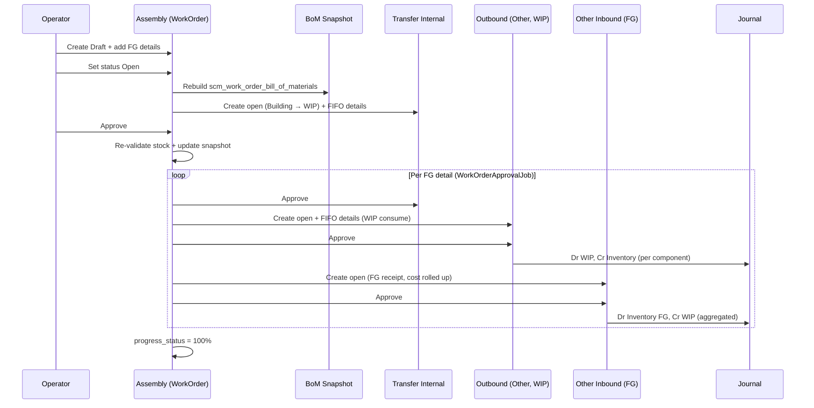
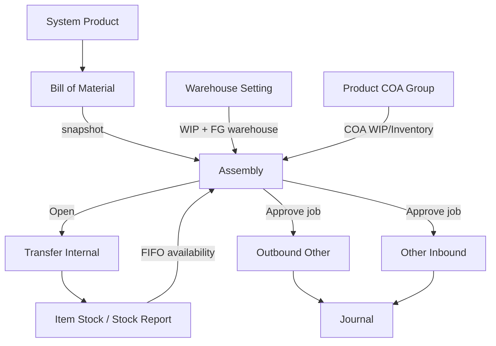

# Assembly — Requirement Documentation

**Modul:** Supply Chain Management (SCM)  
**Audience:** PM, Operations, QA, Support, Developer  
**Status:** AS-IS verified against codebase per 2026-07-04

**UI route:** `/supplychain/assembly`  
**API resource:** `supplychain/work-order` (legacy alias Work Order)

---

## 0. Metadata & Changelog

| Version | Date | Author | Changes |
|---------|------|--------|---------|
| 1.0 | 2026-06-19 | QA - Yemima | Initial draft from codebase analysis |
| 2.0 | 2026-07-04 | QA - Yemima | Full rewrite: merge PM requirement, codebase verification, stock movement chain, import spec, UI/UX buttons, gap analysis |
| 2.1 | 2026-07-04 | QA - Yemima | Clarify G-03 (integer input vs multi-unit auto-calc), G-04 (sequential sub-assembly by design), G-07 → pending development |

---

## 1. Ringkasan Eksekutif

**Assembly** (`AS-*`) mendokumentasikan proses perakitan produk jadi (finish goods / Header BOM) dari komponen BoM. Backend diimplementasikan sebagai **Work Order** (`scm_work_orders`).

Alur status: **Draft → Open → Approved**. Transfer Internal dibuat saat **Open**; Outbound (WIP) + Other Inbound (Finish Good) + jurnal dibuat saat **Approve** via job async per detail line.

| Kebutuhan Bisnis | Bagaimana Assembly Menjawab |
|------------------|----------------------------|
| Rakit produk dari komponen BoM | Detail finish goods + explode BoM langsung (`detail_product_bom`) |
| Kontrol stok & COA | Validasi stok komponen + COA WIP/Inventory saat Open & Approve |
| Traceability ke transfer | `stock_mutation_ids` pada detail → TFI, Outbound, Inbound |
| Snapshot BoM | Tabel `scm_work_order_bill_of_materials` — di-rebuild saat Open, di-update saat Approve |
| Multi FG per transaksi | 1 Assembly bisa punya banyak detail line (1 SKU FG unik per WO) |

**Prefix kode:** `AS` (auto-generate jika kosong).

---

## 2. Prasyarat — Bill of Material

Assembly hanya bisa memakai SKU yang:

- Ter-flag **Header BOM** (`is_bom = 1`, `parent_id` null) di menu [Bill of Material](../bill-of-material/)
- Status Header BOM = **Active** (`status = 1`)
- Memenuhi **Composition Rule**: `count(detail_sku) > 1 OR qty(detail_sku) > 1`
- Produk punya COA **Work In Progress** dan **Inventory** terkonfigurasi

| Rule BOM | Dampak ke Assembly |
|----------|-------------------|
| Strict 1:1 (1 SKU header = 1 BOM) | 1 header SKU = 1 blueprint; tidak ada versioning |
| Variant BOM independen | Tiap variant punya detail berbeda |
| Nested BOM allowed | Komponen bisa Header BOM lain — **tidak di-explode rekursif** (lihat §8) |
| Edit BOM mid-assembly | Snapshot di `scm_work_order_bill_of_materials` di-rebuild saat Open; qty di-update saat Approve non-retry |
| BOM Inactive | SKU tidak muncul di selector detail |

---

## 3. Acceptance Criteria (AS-IS)

### 3.1 Datalist

| ID | Kriteria |
|----|----------|
| A-01 | User dengan permission `viewAny` melihat datalist Assembly |
| A-02 | Kolom: TRX Code/Date, Building, Type, Start Date, Progress, Description, TRX Status, Error flag, Generated Trx, Created/Updated By |
| A-03 | Global search: Assembly Code, SKU Header BOM, SKU Detail BOM |
| A-04 | Advanced filter + column show/hide tersedia |
| A-05 | Export all: with details / without details / active page |
| A-06 | Bulk approve & bulk delete (Draft/Open) |
| A-07 | Retry tersedia jika approved tapi progress ≠ 100% dan tidak generating |

### 3.2 Create / Edit Header

| ID | Kriteria |
|----|----------|
| A-08 | Create header → status **draft** |
| A-09 | Field wajib: transaction_date, warehouse_id (Building Origin), start_date, type |
| A-10 | Kode unik per company; auto `AS-*` jika kosong |
| A-11 | Warehouse selector: level building (config) + WIP & FG sudah dikonfigurasi di Warehouse Setting |
| A-12 | Setelah ada detail, warehouse_id / transaction_date / start_date **tidak bisa diubah** |
| A-13 | Status radio Draft/Open — Open trigger `generateTrasfer()` |

### 3.3 Detail (Finish Goods)

| ID | Kriteria |
|----|----------|
| A-14 | 1 SKU FG unik per Assembly (`Product already used`) |
| A-15 | Hanya produk dengan Header BOM Active + punya komponen detail |
| A-16 | Qty assembly integer only dari UI (`FormInput isInteger`); > 0 |
| A-17 | Max assembly qty ditampilkan per baris (berdasarkan ketersediaan komponen) |
| A-18 | Import detail Excel (template general) |
| A-19 | Edit qty/unit hanya saat status **draft** |
| A-20 | BundleProductForm menampilkan grid komponen BoM + availability |

### 3.4 Open (Draft → Open)

| ID | Kriteria |
|----|----------|
| A-21 | Minimal 1 detail sebelum Open |
| A-22 | WIP + Finish Good warehouse harus terkonfigurasi |
| A-23 | COA WIP & Inventory valid untuk FG dan semua komponen |
| A-24 | Stok komponen cukup di building tree (exclude In Transit, virtual, WIP) |
| A-25 | Generate 1 Transfer Internal (Building → WIP), status **open**, FIFO pick komponen |
| A-26 | Snapshot BoM ke `scm_work_order_bill_of_materials` |
| A-27 | Gagal Open → revert status ke draft + pesan stok tidak cukup |

### 3.5 Approve (Open → Approved)

| ID | Kriteria |
|----|----------|
| A-28 | Approve hanya dari status **open** (`can_approve`) |
| A-29 | Validasi ulang stok, COA, inactive BoM components, TFI qty match |
| A-30 | Dispatch `WorkOrderApprovalJob` per detail (delay +40s antar job) |
| A-31 | Job: approve TFI → create+approve Outbound (WIP) → create+approve Other Inbound (FG) |
| A-32 | Progress status = % detail finished |
| A-33 | Reject: destroy TFI, clear error_message, status rejected |

### 3.6 Delete

| ID | Kriteria |
|----|----------|
| A-34 | Delete header: hanya Draft/Open; destroy TFI + soft-delete detail & BOM snapshot |
| A-35 | Delete detail: hanya saat header Draft |

---

## 4. Validasi & Rules

### 4.1 Header (store / update)

| ID | Rule | Trigger | Pesan error (contoh) |
|----|------|---------|----------------------|
| V-01 | `transaction_date` required, not future | store/update | Transaction date cannot be greater than today |
| V-02 | Fiscal period valid | store/update/approve | Fiscal period error |
| V-03 | `warehouse_id` required integer | store/update | validation required |
| V-04 | `start_date` required, ≥ transaction_date | store/update/approve | The start date cannot be earlier than transaction date |
| V-05 | `type` required string | store/update | validation required |
| V-06 | `description` max 150 | store/update/approve | validation max |
| V-07 | `code` unique per company | store/update | unique rule |
| V-08 | Lock warehouse/date/start_date jika detail exists | update | Invalid params |
| V-09 | Approved header tidak bisa update | update | already approved message |

### 4.2 Detail

| ID | Rule | Trigger | Pesan error |
|----|------|---------|-------------|
| V-10 | FG SKU unik per WO | store/bulkUse/import | Product already used |
| V-11 | Header BOM active exists | store | BoM product not available |
| V-12 | BoM punya komponen detail | bulkUse | doesn't have any component details |
| V-13 | Inactive BoM components | store/update/approve | inactive component(s) |
| V-14 | `quantity` numeric `gt:0`; **UI integer-only** (`isInteger=true`) | update / inline edit | Assembly Qty must be greater than 0 |
| V-15 | Edit/delete detail hanya draft | update/destroy | Work order is not in draft status |
| V-16 | Max detail count | import/approve | `config('general.max_child')` |

### 4.2.1 Qty Integer — Input User vs Auto-Calculate (Multi-Unit)

**Input end user (manual):** desimal **tidak boleh**.

| Lapisan | Mekanisme | File |
|---------|-----------|------|
| FE modal edit | `FormInput :isInteger="true"` | `DatalistDetail.vue` |
| FE inline edit QTY | `FormInput :isInteger="true"` | `PrimeDataTables.vue` (field `quantity_formatted`) |
| FE keydown | Blok titik/koma saat `isInteger` | `FormInput.vue` |
| BE update | `numeric gt:0` (tidak explicit `integer`) | `WorkorderDetailController@update` |
| BE import Excel | `is_numeric` + `> 0` saja | `WorkOrderDetailImport.php` |

**Auto-calculate (sistem):** desimal **bisa muncul sementara** saat konversi unit, lalu di-round ke integer.

| Kalkulasi | Unit involved | Handling desimal |
|-----------|---------------|------------------|
| **Max Assembly Qty** | Stok komponen (unit BoM detail) → unit assembly FG | `unitConverterFromProduct()` → **`floor()`** → tampil integer |
| **Qty in base unit** (save detail) | Unit assembly FG → base unit produk | `bulkCalculateToBaseUnit()` → **`qtyInBaseUnitRounding()`** → integer |
| **Qty komponen TFI/Outbound** | `bom_qty × assembly_qty` per komponen | `transfer_quantity` pakai unit BoM detail; konversi ke base unit saat save mutation detail via observer |
| **Availability per komponen** | BoM detail unit ↔ FG assembly unit | `unitConverterFromProduct()` → **`floor()`** |

**Contoh kasus multi-unit:**

```
BoM detail: SKU-BAHAN-1 = 1 Box (= 12 pcs/base)
User assembly: 5 Pack FG (1 Pack = 6 pcs)

Max Assembly Qty:
  stok BAHAN-1 = 100 pcs → 100/12 = 8.33 Box → floor → 8 Box max per unit FG
  setelah convert ke unit Pack → floor lagi → angka bulat ditampilkan user
```

> **Catatan:** User selalu input qty assembly **bulat**. Desimal hanya internal saat konversi antar unit (primary/alternate) sebelum rounding. Import Excel saat ini **belum** explicit cek integer — disarankan isi qty bulat di template.

### 4.3 Open (`generateTrasfer`)

| ID | Rule | Trigger | Pesan error |
|----|------|---------|-------------|
| V-17 | WIP + FG configured | Open | WIP and Finish Good warehouse must be configured |
| V-18 | COA WIP + Inventory FG & components | Open | Header/Detail BoM COA message |
| V-19 | Stok komponen cukup (FIFO date ≤ trx date) | Open | Cannot change status to Open... out of stock |
| V-20 | Origin ≠ WIP warehouse | Open | Origin stock cannot be picked from WIP Warehouse |
| V-21 | TFI detail generation success | Open | Internal transfer failed |

### 4.4 Approve

| ID | Rule | Trigger | Pesan error |
|----|------|---------|-------------|
| V-22 | Status must be open | approve | can_approve check |
| V-23 | ≥1 detail | approve | validate_max_details |
| V-24 | Detail error_message null | approve | Cannot update while detail has error |
| V-25 | `is_generating=1` within 2 min | approve | The work order is generating |
| V-26 | TFI qty = Σ(BOM qty × assembly qty) per product | approve | Transfer quantity does not match |
| V-27 | Stok komponen re-validated | approve (non-retry) | availability updated in snapshot |

### 4.5 Warehouse Filter

| Aspek | Implementasi |
|-------|-------------|
| Building Origin selector | `select2Warehouse` — `check_wip_fg: true`, level dari `config('warehouse.building_level')` |
| Stok check scope | Building tree minus In Transit, virtual warehouse, dan WIP |
| WIP / Finish Good | **Tidak dipilih user** — dari `SettingWarehouseScrapVoid` per building |

---

## 5. Pergerakan Stok — Alur Lengkap

### 5.1 Diagram End-to-End



### 5.2 Warehouse Roles

| Role | Sumber | Keterangan |
|------|--------|------------|
| **Building Origin** | `work_order.warehouse_id` | Dipilih user di form |
| **WIP** | `SettingWarehouseScrapVoid.warehouse_wip_id` | Virtual/production buffer |
| **Finish Good** | `SettingWarehouseScrapVoid.warehouse_finish_good_id` | Tujuan barang jadi |

> **Gap vs PM requirement:** PM doc menyebut "Warehouse Origin" + "Warehouse Destination" sebagai field user. **AS-IS:** user hanya pilih Building Origin; WIP dan FG dari Warehouse Setting, bukan field form.

### 5.3 Dokumen yang Di-generate

| Fase | Dokumen | Origin | Destination | Status awal | Status akhir | Jurnal |
|------|---------|--------|-------------|-------------|--------------|--------|
| Open | Transfer Internal (`TFI`) | Building | WIP | **open** | — (approved di job) | Tidak |
| Approve (job) | Transfer Internal | Building | WIP | open | **approved** | Tidak |
| Approve (job) | Outbound Other (`type_so=other`) | WIP | null | open | **approved** | Dr WIP, Cr Inventory per komponen |
| Approve (job) | Other Inbound (`supplier_id=null`) | null | Finish Good | open | **approved** | Dr Inventory FG, Cr WIP (rollup cost komponen) |

**Referensi:** `transaction_reference_class = WorkOrder::class` pada header mutasi; detail outbound/inbound ref `WorkOrderDetail::class`.

### 5.4 Kalkulasi Qty Komponen

```
Qty Komponen = BoM detail qty × Assembly detail qty (per FG line)
```

TFI detail dan Outbound detail menggunakan formula yang sama. Saat approve, sistem memvalidasi total TFI qty per product_id = Σ snapshot qty × assembly qty.

### 5.5 FIFO

- TFI detail & Outbound detail: `item_stock_id = null` → sistem FIFO auto-pick
- Filter: `transaction_date ≤ assembly transaction_date`, exclude empty stock
- **Catatan UI:** tooltip Building Origin — "FIFO doesn't apply to outrack and WIP locations"

### 5.6 Reject & Revert

| Aksi | Efek |
|------|------|
| Reject approve | Destroy TFI; clear detail error_message; status → rejected |
| Revert Open → Draft | Destroy TFI; clear error_message |
| Delete Draft/Open | Destroy TFI jika ada; soft-delete detail + BOM snapshot |

---

## 6. Jurnal Akuntansi

Jurnal **tidak** dibuat oleh Assembly header — hanya oleh Outbound & Other Inbound saat di-approve job.

### 6.1 Outbound (konsumsi komponen dari WIP)

| Posisi | COA | Sumber |
|--------|-----|--------|
| Debit | Work In Progress | Product COA Group komponen |
| Credit | Inventory | Product COA Group komponen |

Amount: `each_price_before_vat × outbound_quantity_in_base_unit` per item stock FIFO.

### 6.2 Other Inbound (penerimaan FG)

| Posisi | COA | Sumber |
|--------|-----|--------|
| Debit | Inventory | Product COA Group FG |
| Credit | Work In Progress | Aggregated dari outbound lines terkait WO detail |

FG cost: `Σ(component outbound cost) / FG qty` — diset di `each_price_before_vat` inbound detail.

**Referensi:** `JournalProcess::stockOutboundAutoJournal()` dan `stockInboundAutoJournal()` when ref class = `WorkOrder`.

---

## 7. Import Detail Excel

### 7.1 Template

| Item | Nilai |
|------|-------|
| File statis | `/files/Template-Import-Assembly.xlsx` |
| Tipe import | **`general` only** — tidak ada variant per platform |
| Endpoint upload | `POST work-order/{id}/work-order-detail/upload?type=general` |
| Processing | `WorkOrderDetailImport` → batch `WorkOrderImportJob` → `WorkorderDetailController@store` |

### 7.2 Format Kolom (wajib exact header row 1)

| Col | Header | Wajib | Validasi |
|-----|--------|-------|----------|
| A | Product ID | Ya* | Integer ID dari System Product; fallback ke kolom B jika tidak ditemukan |
| B | System Product SKU | Ya* | SKU valid per company |
| C | Qty | Ya | Numeric, > 0 |
| D | Unit | Ya | Unit code (`units.code`); harus primary atau alternate unit produk |

\*Minimal salah satu Product ID atau SKU harus valid.

### 7.3 Rules Import

| Rule | Pesan error |
|------|-------------|
| Header row exact match 4 kolom | The file format doesn't match the system template |
| File kosong (hanya header) | The imported file is empty |
| Product tidak ditemukan | Product SKU is required / fill product_id |
| Qty bukan numeric / ≤ 0 | Qty must be numeric / must be greater than 0 |
| Unit tidak ada / tidak match produk | Unit is not available / not valid for product |
| Duplicate FG SKU di WO | Product already used (saat job store) |
| BoM tidak available / inactive components | BoM product not available / inactive component(s) |
| Max detail exceeded | Cannot add more than {max_child} details |
| WO bukan draft | Work order is not in draft status |

### 7.4 Export Template (download current details)

Endpoint: `GET work-order/{id}/work-order-detail/export-excel?type=1|2` (.xlsx / .csv)

| Kolom | Draft | Open | Approved |
|-------|-------|------|----------|
| System Product SKU | ✓ | ✓ | ✓ |
| System Product Name | ✓ | ✓ | ✓ |
| Max Assembly Qty | ✓ | ✓ | ✓ |
| Qty | ✓ | ✓ | ✓ |
| Unit | ✓ | ✓ | ✓ |
| Transfer Code / Date | — | ✓ | ✓ |
| Inbound Code / Date | — | — | ✓ |

### 7.5 Import Monitoring

| Fitur | Endpoint |
|-------|----------|
| Progress | `GET work-order-detail/progress/{id}/detail` |
| Import log | `GET work-order-detail/{id}/import-log/detail` |
| Import history | `GET work-order-detail/{id}/import-history` |

---

## 8. Nested BOM — Sequential Sub-Assembly (By Design)

Assembly dirancang untuk **membuat barang jadi dari direct child BoM-nya**. Jika child juga Header BOM dari BoM lain (sub-assembly), child diperlakukan sebagai **1 SKU komponen biasa** — sistem **tidak** auto-explode rekursif.

| Aspek | Behaviour |
|-------|-----------|
| Sumber komponen | `detail_product_bom()` — direct children dengan `is_bom=1` |
| Sub-assembly sebagai komponen | Butuh **Assembly terpisah** dulu agar SKU child punya stok FG |
| Display tree | `TreeDetail.vue` + print label bisa tampilkan tree; **tidak** dipakai untuk kalkulasi stok |
| Stock/accounting | Tidak auto-trigger Assembly child |

**Alur operator (nested BOM):**

```
1. Assembly SKU-SUB-B (child BOM)  → stok FG SKU-SUB-B tersedia
2. Assembly SKU-JADI-A (parent BOM, komponen includes SKU-SUB-B) → konsumsi SKU-SUB-B sebagai 1 unit
```

**Contoh:**

```
BOM SKU-JADI-A:
  ├── SKU-SUB-B (1 pcs) ← juga Header BOM
  └── SKU-BAHAN-3 (3 pcs)

Operator HARUS Assembly SKU-SUB-B terlebih dahulu,
baru Assembly SKU-JADI-A bisa consume SKU-SUB-B dari stok.
```

---

## 9. UI/UX — Tombol & Behaviour

### 9.1 Datalist (`DataList.vue`)

| Tombol/Fitur | Kondisi | Aksi |
|--------------|---------|------|
| **Create** | Always | Navigate `/supplychain/assembly/create` |
| **Edit** (row action) | Draft/Open/Approved | Navigate edit form |
| **Delete** (row/bulk) | Draft/Open + permission | `DELETE work-order/{id}`; destroy TFI |
| **Approve** (row/bulk) | Open + `can_approve` | Approval modal → `POST .../approve` |
| **Print** | Various | Header PDF |
| **Retry** | Approved, progress ≠ 100%, not generating (or stale >2 min) | `GET .../retry` |
| **Export All** | Permission viewAny | With/without details / active page |
| **Advanced Filter** | Always | SearchBuilder semua kolom |
| **Show Deleted** | Toggle | Include soft-deleted rows |

### 9.2 Form Header (`Form.vue`)

| Field | Behaviour |
|-------|-----------|
| Transaction Code | Auto-generate; disabled setelah create |
| Transaction Date | Required; max today; fiscal period tooltip |
| Building Origin | Multiselect async; filter WIP+FG configured |
| Start Date | Required |
| Type | Multiselect: Production, Service, Assembly, Other |
| Progress Status | Read-only; auto dari job |
| Description | Optional, max 150 |
| Status radio Draft/Open | Trigger immediate `PUT` update |

| Tombol | Kondisi | Aksi |
|--------|---------|------|
| **Save & Next** | Create | `POST work-order` → redirect edit |
| **Save All** | Edit + can_update | `PUT work-order/{id}` |
| **Approve** | Edit + can_approve (open) | Buka `ApprovalModal` |
| **Print** (sidebar) | Edit | Header PDF |
| **Approval** (sidebar) | Edit | Slideover approval log |
| **Audit Log** (sidebar) | Edit | Slideover audit |
| **Histories** (sidebar) | Edit | Slideover generated documents |

**Auto-save:** perubahan transaction_date, warehouse, start_date, type → immediate update.

### 9.3 Detail Grid (`DatalistDetail.vue`)

| Tombol/Fitur | Draft | Open | Approved |
|--------------|-------|------|----------|
| Product multiselect | Add via `POST bulk-fifo` (qty=1) | Hidden | Hidden |
| Edit QTY / UNIT inline | ✓ | ✗ | ✗ |
| Delete row | ✓ | ✗ | ✗ |
| Import Excel | ✓ | ✗ | ✗ |
| Download Template | ✓ | ✗ | ✗ |
| Import History / Log | ✓ | ✗ | ✗ |
| Print SKU / BOX / SID | ✓ (SKU, BOX) | ✓ | ✓ (+ SID) |
| BundleProductForm (expand row) | BoM components + availability | Snapshot BOM | Snapshot BOM |
| Warning banner | — | — | "Stock has been reserved..." |

### 9.4 Kolom Detail per Status

| Kolom | Draft | Open | Approved |
|-------|-------|------|----------|
| Product SKU/Name | ✓ | ✓ | ✓ |
| Max Assembly Qty | ✓ | ✓ | ✓ |
| QTY (editable) | ✓ | read-only | read-only |
| UNIT | ✓ | read-only | read-only |
| Transfer Code/Date | — | ✓ | ✓ |
| Inbound Code/Date | — | — | ✓ |
| Error flag | ✓ | ✓ | ✓ |

---

## 10. Relasi Menu Lain



| Menu | Relasi | Catatan |
|------|--------|---------|
| Bill of Material | Prerequisite blueprint | Lihat [bill-of-material](../bill-of-material/) |
| Warehouse Setting | WIP + FG per building | `SettingWarehouseScrapVoid` |
| Transfer Internal | Auto TFI Building→WIP | Prefix `TFI`, ref WorkOrder |
| Outbound (Other) | Konsumsi komponen di WIP | `type_so=other` |
| Other Inbound | Penerimaan FG | `supplier_id=null` |
| Product COA Group | COA WIP & Inventory | Wajib FG + komponen |
| Stock Report / ItemStock | Availability check | FIFO; tidak reserve ATS pre-approve |
| Journal | Via outbound + inbound approve | Auto-approved |
| Sales Order / PO | — | **Tidak ada relasi langsung** di codebase |
| Product Profit Loss | — | Tidak ada hook khusus Assembly |

---

## 11. Edge Cases

| Case | Expected Behavior (AS-IS) |
|------|---------------------------|
| BOM diedit setelah Draft, sebelum Open | Open akan rebuild snapshot dari live BOM |
| BOM diedit setelah Open, sebelum Approve | Approve non-retry update qty snapshot dari live BOM |
| Nested BOM sebagai komponen | Single SKU; Assembly child BOM dulu sebelum parent |
| Stok sebagian komponen cukup | Open/Approve ditolak total |
| Multi FG, 1 komponen tidak cukup | Seluruh Open/Approve gagal |
| User input qty desimal | **Diblok di UI** (`isInteger`); BE import belum explicit integer check |
| Multi-unit auto-calc | Desimal internal saat konversi unit → di-`floor`/`qtyInBaseUnitRounding` ke integer |
| BOM inactive setelah Open | Approve cek `validateProductDetailBom()` — ditolak jika komponen inactive |
| Approve saat job running | Block 2 menit jika `is_generating=1` |
| Partial job failure | Detail `error_message` + progress < 100%; gunakan Retry |
| Building Origin = WIP warehouse | Error: cannot pick from WIP |

---

## 12. Confirmed Design Decisions

| # | Keputusan | AS-IS |
|---|-----------|-------|
| D-01 | **Building Origin** user-select; **WIP + Finish Good** dari Warehouse Setting | ✅ Confirmed |
| D-02 | Approve hanya dari status **Open** (Draft → Open → Approve) | ✅ Confirmed |
| D-03 | **Nested BOM sequential** — sub-assembly harus di-Assembly dulu; tidak auto-explode | ✅ Confirmed (lihat §8) |
| D-04 | **Qty assembly integer** dari input user; desimal hanya internal multi-unit calc | ✅ Confirmed (lihat §4.2.1) |
| D-05 | Import **detail only** (FG lines); header bulk import belum tersedia | ✅ Confirmed (lihat §14) |

---

## 13. Known Gaps / Open Items

| # | Item | AS-IS | Catatan |
|---|------|-------|---------|
| G-05 | Alternate unit di assembly qty | User bisa pilih alternate unit di detail; `bulkUse` default `stock_unit_id` | By design multi-unit |
| G-06 | ATS impact pre-approve | TFI open reserve stok via transfer detail | Perlu verifikasi terpisah di Stock Report |
| G-08 | Approval table naming di doc lama | **`scm_work_orders_approvals`** (bukan `ppc_*`) | Doc corrected |
| G-09 | Total Header SKU di datalist | Tidak ada kolom dedicated; Product column (hidden) + search | Enhancement jika diperlukan |
| G-10 | Import Excel qty integer check | BE cek `is_numeric > 0` saja, belum explicit `integer` | UI sudah integer; harden BE jika perlu |

---

## 14. Pending Development

Fitur yang belum diimplementasi — **bukan bug**, sengaja ditunda.

| # | Fitur | Status saat ini | Target behaviour (future) |
|---|-------|-----------------|---------------------------|
| PD-01 | **Import header Assembly** (bulk create dari datalist) | FE `DataList.vue` punya stub `POST work-order/import` — **route backend tidak ada**; `ImportLog` di-comment out | Bulk create Assembly header via Excel dari datalist |
| | Import detail Assembly (FG lines) | ✅ **Aktif** — `POST work-order/{id}/work-order-detail/upload` | Tetap AS-IS |

> **Saat ini:** operator hanya bisa import **detail** (baris FG) dari form edit Assembly, status Draft.

---

## 15. FAQ

**Q: Kenapa API `work-order` bukan `assembly`?**  
A: Route legacy; comment di `api.php`: assembly alias work order.

**Q: Kenapa SKU tidak muncul di selector detail?**  
A: Belum Header BOM Active, COA WIP/Inventory belum lengkap, atau composition rule violated.

**Q: Kenapa tidak bisa Approve?**  
A: Status harus Open; cek stok komponen, COA, inactive BoM, detail error_message, atau job masih generating.

**Q: Apa beda Open vs Approve?**  
A: Open = reserve/generate TFI (Building→WIP). Approve = finalisasi stok (TFI approve + Outbound WIP + Inbound FG + jurnal).

**Q: Bisa 1 Assembly untuk beberapa FG?**  
A: Ya — multiple detail lines, 1 SKU FG unik per WO.

**Q: Kenapa sub-assembly tidak auto-explode?**  
A: By design — Assembly child BOM harus diproses terlebih dahulu agar SKU child punya stok FG, baru bisa dikonsumsi di Assembly parent.

**Q: Bisa input qty desimal?**  
A: Tidak dari UI. Sistem bisa hitung desimal internal saat konversi multi-unit, lalu di-round ke integer.

---

## Related Documents

| Doc | Path |
|-----|------|
| Knowledge Base | [knowledge-base.md](./knowledge-base.md) |
| Technical | [technical.md](./technical.md) |
| Bill of Material | [../bill-of-material/](../bill-of-material/) |
| Transfer Internal | [../supplychain-mutation-transfer-internal/](../supplychain-mutation-transfer-internal/) |
| Outbound External | [../supplychain-mutation-outbound/](../supplychain-mutation-outbound/) |
| Other Inbound | [../supplychain-other-inbound/](../supplychain-other-inbound/) |
| Warehouse Setting | [../supplychain-setting/](../supplychain-setting/) |
| Product COA Group | [../accounting-product-coa-group/](../accounting-product-coa-group/) |
| Master Unit | [../supplychain-unit/](../supplychain-unit/) |
| System Product | [../system-product/](../system-product/) |
