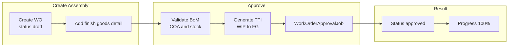
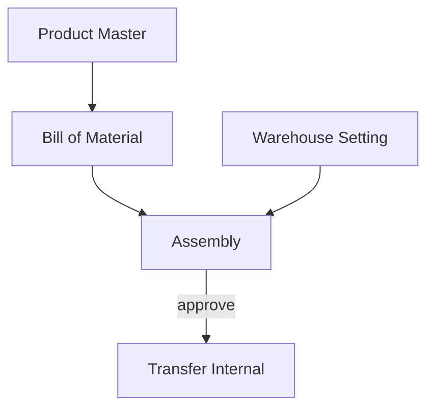

# Assembly — Requirement Detail

> **DRAFT** — Dokumen ini adalah draft awal hasil analisis codebase otomatis per 2026-06-19. Perlu direview PM/QA sebelum final.

**Modul:** SupplyChain  
**Audience:** PM, Operations, QA, Support, Developer  
**Status:** Sesuai perilaku sistem saat ini (AS-IS)

---

## 1. Fungsi & Tujuan

### Apa itu Assembly?

**Assembly** (Work Order, prefix kode `AS`) mendokumentasikan proses perakitan produk jadi dari komponen BoM. Data header di `scm_work_orders`, detail di `scm_work_order_details`.

### Masalah yang diselesaikan

| Kebutuhan Bisnis | Bagaimana Assembly Menjawab |
|------------------|----------------------------|
| Rakit produk dari komponen | Detail finish goods + explode BoM |
| Kontrol stok & COA | Validasi stok komponen dan COA WIP/Inventory saat approve |
| Traceability ke transfer | Link `stock_mutation_ids` pada detail ke Transfer Internal |

### Entitas data utama

| Entitas | Tabel |
|---------|-------|
| Header Assembly | `scm_work_orders` |
| Detail | `scm_work_order_details` |
| BoM snapshot | `scm_work_order_bill_of_materials` |
| Approval | `ppc_work_order_approvals` (via relasi `approvals`) |

---

## 2. How It Works — Alur Kerja

### 2.1 Create (`POST supplychain/work-order`)

| Field | Validasi |
|-------|----------|
| `transaction_date` | Wajib, tidak boleh > hari ini, fiscal period valid |
| `warehouse_id` | Wajib |
| `start_date` | Wajib, tidak boleh < transaction_date |
| `type` | Wajib |
| `code` | Opsional; auto `AS-*` jika kosong; unique per company |
| `description` | Max 150 |

Status awal selalu **draft** (`TS_DRAFT`).

### 2.2 Detail

- Endpoint detail: `work-order/{id}/work-order-detail/*`
- Import Excel via upload + job processing.
- Bulk FIFO: `POST work-order/{id}/bulk-fifo`
- Print label: `work-order-detail/{id}/print`

### 2.3 Approve (`POST work-order/{id}/approve`)

| Validasi | Pesan / efek |
|----------|--------------|
| `approval_status` | `approved` atau `rejected` |
| `description` | Max 150 |
| Minimal 1 detail | `validate_max_details` |
| `start_date` tidak null | Required |
| `is_generating = 1` dalam 2 menit | "The work order is generating." |
| Warehouse setting WIP + FG | Harus terkonfigurasi |
| BoM COA WIP & Inventory | Semua level BoM |
| Komponen BoM aktif | Tidak boleh inactive |
| Stok komponen cukup | Available qty per item stock |

**Reject:** hapus transfer internal terkait, clear `error_message` detail.

**Approve:** dispatch `WorkOrderApprovalJob` — generate inbound/outbound/transfer internal.

---

## 3. Validasi yang Berjalan

### Header (store/update)

- Fiscal period pada `transaction_date`.
- `start_date` >= `transaction_date`.
- `transaction_status` hanya `open` atau `draft` saat create request (disimpan sebagai draft).

### Approval

- Policy `approval` pada `WorkOrder`.
- Detail dengan `error_message` tidak boleh di-approve.
- Produk BoM harus punya header BoM `is_bom = 1`.

---

## 4. Relasi Menu Lain

| Menu | Relasi |
|------|--------|
| Bill of Material | Sumber komponen per finish goods |
| Warehouse Setting | WIP / Finish Good warehouse |
| Transfer Internal | Output mutasi stok |
| Product | COA WIP, Inventory, status aktif |

---

## 5. FAQ

**Q: Kenapa API memakai `work-order` bukan `assembly`?**  
A: Route legacy; komentar di `api.php`: `assembly alias work order`.

**Q: Apakah bisa approve tanpa detail?**  
A: Tidak — `validate_max_details` menolak.

**Q: Bagaimana cek log approval?**  
A: `GET work-order/{id}/log/approve`
