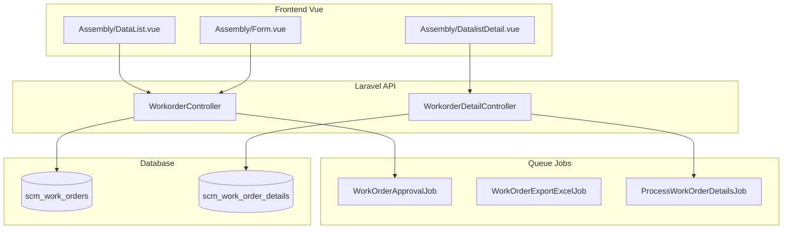

# Assembly — Technical Documentation

> **DRAFT** — Dokumen ini adalah draft awal hasil analisis codebase otomatis per 2026-06-19. Perlu direview PM/QA sebelum final.

**UI route:** `/supplychain/assembly`  
**API base:** `{VITE_API_URL}supplychain/work-order`

---

## 1. Architecture Overview

---

## 2. Frontend File Map

**Root:** `olshoperp-frontend/src/pages/SCM/master/Assembly/`

| File | Role | Key API |
|------|------|---------|
| `DataList.vue` | Datalist header | `GET supplychain/work-order` |
| `Form.vue` | Create/edit header | `POST/PUT work-order/{id}` |
| `DatalistDetail.vue` | Detail grid | `GET work-order/{id}/work-order-detail/primevue` |
| `TreeDetail.vue` | Tree BoM view | detail endpoints |
| `ApprovalDialog.vue` | Approve/reject | `POST work-order/{id}/approve` |
| `DatalistLogApproval.vue` | Approval log | `GET work-order/{id}/log/approve` |
| `ImportLog.vue` | Import status | `work-order-detail/import-log` |

### Router (`src/router/index.ts`)

| Route | Component |
|-------|-----------|
| `supplychain/assembly` | `DataList.vue` |
| `supplychain/assembly/create` | `Form.vue` |
| `supplychain/assembly/edit/:id` | `Form.vue` |

---

## 3. Backend

| File | Role |
|------|------|
| `WorkorderController.php` | CRUD header, approve, export, audit |
| `WorkorderDetailController.php` | Detail CRUD, import, print, bulk FIFO |
| `Entities/WorkOrder.php` | Model `scm_work_orders`, code `AS` |
| `Entities/WorkOrderDetail.php` | Detail lines |
| `Entities/WorkOrderBillOfMaterial.php` | BoM snapshot |
| `Jobs/WorkOrderApprovalJob.php` | Async approval processing |
| `Jobs/WorkOrderExportExcelJob.php` | Export |
| `Policies/WorkOrderPolicy.php` | Authorization |

---

## 4. API Routes (utama)

| Method | Path | Controller@method |
|--------|------|-------------------|
| GET | `work-order` | `WorkorderController@index` |
| POST | `work-order` | `store` |
| GET | `work-order/{id}` | `show` |
| PUT/PATCH | `work-order/{id}` | `update` |
| DELETE | `work-order/{id}` | `destroy` |
| POST | `work-order/{id}/approve` | `approve` |
| GET | `work-order/{id}/log/approve` | `approvalLog` |
| GET | `work-order/{id}/work-order-detail/primevue` | `WorkorderDetailController@index` |
| POST | `work-order/{id}/work-order-detail/upload` | `uploadFile` |
| POST | `work-order/{id}/bulk-fifo` | `bulkUse` |
| GET | `work-order/{id}/retry` | `retry` |

Prefix route group: `supplychain/` (lihat `Modules/SupplyChain/Routes/api.php`).

---

## 5. Database

### `scm_work_orders`

| Column | Keterangan |
|--------|------------|
| `code` | Prefix `AS` |
| `transaction_date`, `start_date` | Tanggal |
| `warehouse_id` | Gudang assembly |
| `type` | Tipe WO |
| `transaction_status` | draft / open / approved / rejected |
| `progress_status` | Persentase (string) |
| `is_generating` | Flag job approval |

### `scm_work_order_details`

| Column | Keterangan |
|--------|------------|
| `finish_goods_product_id` | Produk jadi |
| `quantity` | Qty rakit |
| `stock_mutation_ids` | CSV ID transfer terkait |
| `error_message` | Error per baris |

---

## 6. Authorization

Policy `WorkOrderPolicy`: `viewAny`, `view`, `create`, `update`, `delete`, `approval`.

Menu class di seeder: `WorkOrder::class`, route `supplychain.assembly.index`.
