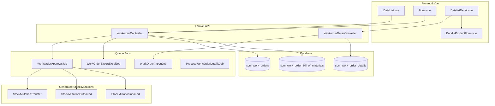
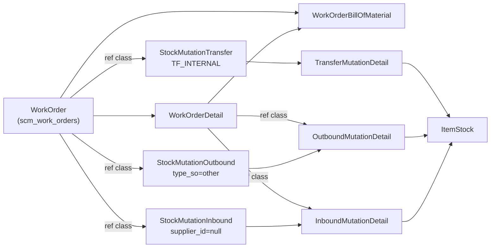

# Assembly — Technical Documentation

**UI route:** `/supplychain/assembly`  
**API base:** `{VITE_API_URL}supplychain/work-order`  
**Model alias:** Work Order (`WorkOrder`)

---

## 1. Architecture Overview



**Status lifecycle:** `draft` → `open` → `approved` / `rejected`

---

## 2. Frontend File Map

**Root:** `olshoperp-frontend/src/pages/SCM/master/Assembly/`

| File | Role | Key API |
|------|------|---------|
| `DataList.vue` | Header datalist + bulk actions + export | `GET work-order` |
| `Form.vue` | Create/edit header + status radio + sidebar | `POST/PUT work-order/{id}` |
| `DatalistDetail.vue` | Detail grid PrimeVue + import + print | `GET/PUT/DELETE work-order/{id}/work-order-detail/*` |
| `TreeDetail.vue` | BoM tree view (Bill of Material API) | Not wired in Form |
| `ApprovalDialog.vue` | Legacy — replaced by shared `ApprovalModal` | — |
| `DatalistLogApproval.vue` | Approval log slideover | `GET .../log/approve` |
| `HistoryDetail.vue` | Generated documents timeline | `GET .../histories` |
| `ImportLog.vue` | Import log (legacy standalone) | — |
| `CreateVariant.vue` | Variant helper | — |

**Shared components:**

| Component | Path | Role |
|-----------|------|------|
| `ApprovalModal` | `components/project/ApprovalModal/` | Approve/reject |
| `BundleProductForm` | `pages/SCM/master/Product/BundleProductForm.vue` | BoM component grid (`assembly=true`) |
| `ImportFileTable` | `components/project/DataTables/` | Import UI wrapper |

### Router

| Route | Component |
|-------|-----------|
| `supplychain/assembly` | `DataList.vue` |
| `supplychain/assembly/create` | `Form.vue` |
| `supplychain/assembly/edit/:id` | `Form.vue` |

Gate menu class: `WorkOrder::class`, route `supplychain.assembly.index`.

---

## 3. Backend File Map

| File | Role |
|------|------|
| `Http/Controllers/WorkorderController.php` | CRUD header, approve, export, audit, `generateTrasfer`, select2 |
| `Http/Controllers/WorkorderDetailController.php` | Detail CRUD, import, print, bulk FIFO, export |
| `Entities/WorkOrder.php` | Model `scm_work_orders`, `code_identifier = 'AS'` |
| `Entities/WorkOrderDetail.php` | Detail lines + `stock_mutation_ids` CSV |
| `Entities/WorkOrderBillOfMaterial.php` | BoM snapshot per detail |
| `Entities/WorkOrderApproval.php` | Approval log → `scm_work_orders_approvals` |
| `Jobs/WorkOrderApprovalJob.php` | Async approve side-effects per detail |
| `Jobs/WorkOrderExportExcelJob.php` | Batch export finalization |
| `Jobs/ProcessWorkOrderDetailsJob.php` | Export prep → temp table |
| `Jobs/WorkOrderImportJob.php` | Per-row import detail |
| `Import/WorkOrderDetailImport.php` | Excel parse + validation |
| `Exports/WorkOrderDetailExport.php` | Detail Excel/CSV export |
| `Policies/WorkOrderPolicy.php` | viewAny, create, update, delete, approval |

---

## 4. API Routes

**Prefix:** `supplychain/` — group `work-order.*` in `Modules/SupplyChain/Routes/api.php`

| Method | Path | Controller@method | Notes |
|--------|------|-------------------|-------|
| GET | `work-order` | `WorkorderController@index` | DataTables |
| POST | `work-order` | `store` | Always draft |
| GET | `work-order/{id}` | `show` | + hes_error, products |
| PUT/PATCH | `work-order/{id}` | `update` | Draft↔Open triggers generateTrasfer |
| DELETE | `work-order/{id}` | `destroy` | Draft/Open only |
| POST | `work-order/{id}/approve` | `approve` | Dispatches jobs |
| GET | `work-order/{id}/approve` | `approveinfo` | Last 5 approvals |
| GET | `work-order/{id}/log/approve` | `approvalLog` | Full log |
| GET | `work-order/{id}/retry` | `retry` | Re-approve failed job |
| GET | `work-order/{id}/histories` | `histories` | Linked mutations |
| GET | `work-order/select2-warehouse` | `select2Warehouse` | WIP+FG filter |
| GET | `work-order/{id}/select2-available-products` | `select2AvailableProducts` | BOM headers |
| GET | `work-order/{product_id}/show-detail/primevue` | `index_detail_primevue` | BoM grid per FG |
| POST | `work-order/export-excel` | `exportAllExcel` | Batch export |
| GET | `work-order/{id}/work-order-detail/primevue` | `WorkorderDetailController@index` | Detail grid |
| POST | `work-order/{id}/work-order-detail/upload` | `uploadFile` | Excel import |
| PUT | `work-order/{id}/work-order-detail` | `update` | Draft only |
| DELETE | `work-order/{wo}/work-order-detail/{detail}` | `destroy` | Draft only |
| POST | `work-order/{id}/bulk-fifo` | `bulkUse` | Add FG qty=1 |
| POST | `work-order/{wo}/work-order-detail/{detail}/inline-edit-product` | `inlineEditProduct` | Change product |
| GET | `work-order/{id}/work-order-detail/export-excel` | `exportExcel` | Detail export |
| GET | `work-order-detail/{id}/print` | `printDetail` | Label PDF |
| GET | `work-order-detail/{id}/print-bulk` | `printBulk` | Bulk label |

**No FormRequest classes** — validation inline in controllers.

---

## 5. Database Schema

### `scm_work_orders` — `WorkOrder`

| Column | Type | Keterangan |
|--------|------|------------|
| `id` | bigint PK | |
| `code` | string | Prefix `AS`, unique per company |
| `transaction_date` | datetime | |
| `warehouse_id` | FK | Building Origin |
| `start_date` | datetime | Planned start |
| `type` | string | Production/Service/Assembly/Other |
| `transaction_status` | enum | draft/open/approved/rejected |
| `progress_status` | string | 0–100 percentage |
| `description` | string(150) | |
| `is_generating` | tinyint | Job in-flight flag |
| audit + soft delete | | owned_by, created_by, etc. |

Migration: `2025_06_04_091044_create_work_orders_table.php`

### `scm_work_order_details` — `WorkOrderDetail`

| Column | Keterangan |
|--------|------------|
| `work_order_id` | FK header |
| `finish_goods_product_id` | FK Product (FG) |
| `quantity`, `quantity_unit_id` | Assembly qty |
| `quantity_conversion_rate`, `quantity_in_base_unit`, `quantity_base_unit_id` | Measurement |
| `status_flag` | `'finished'` when job completes |
| `stock_mutation_ids` | CSV: TFI, Outbound, Inbound IDs |
| `error_message` | Per-line processing error |

Migration: `2025_06_04_091349_create_work_order_details_table.php`

### `scm_work_order_bill_of_materials` — BoM Snapshot

| Column | Keterangan |
|--------|------------|
| `work_order_id`, `work_order_detail_id` | Scope |
| `header_product_bom_id` | Ref BOM row |
| `product_id` | Component product |
| `parent_id` | FG product id |
| `quantity`, `quantity_unit_id` | From live BOM at snapshot time |
| `availability` | Stock check result |
| `error_message` | TFI/outbound/inbound error per component |

Migration: `2025_06_12_111139_create_work_order_bill_of_materials_table.php`

### `scm_work_orders_approvals` — `WorkOrderApproval`

Generated via `generateApprovalTable('scm_work_orders')`. FK: `scm_work_orders_id`.

---

## 6. Stock Movement — Deep Dive

### 6.1 Phase A: Draft → Open (`generateTrasfer`)

**Trigger:** `WorkorderController@update` when `transaction_status` → `open`.

```
1. Validate WIP + FG in SettingWarehouseScrapVoid
2. DELETE all WorkOrderBillOfMaterial for WO
3. FOR EACH detail:
     a. Load Header BOM → detail_product_bom()
     b. Validate COA WIP + Inventory (FG + each component)
     c. Calc availability via ItemStock (building tree, FIFO date filter)
     d. CREATE WorkOrderBillOfMaterial rows
4. CREATE one StockMutationTransfer (if not exists):
     - type: TF_INTERNAL, process_type: null
     - origin: work_order.warehouse_id
     - destination: warehouse_wip_id
     - status: TS_OPEN
     - ref: WorkOrder
5. FOR EACH detail × component:
     - transfer_qty = bom_qty × assembly_qty
     - StockMutationTransferDetailController@store (FIFO, item_stock_id=null)
6. ON error → destroy TFI, return error, revert to draft
```

**Warehouse tree for stock check:**

```php
WarehouseParentByType::where('target_parent_id', $warehouse_id)
    ->whereHas('warehouse', fn($wh) => 
        $wh->where('name', '!=', 'In Transit')
           ->where('is_virtual', 0)
           ->where('id', '!=', $warehouse_wip_id)
    )
```

### 6.2 Phase B: Approve (`WorkorderController@approve` + `WorkOrderApprovalJob`)

**Sync pre-job (approve controller):**

1. Re-upsert WorkOrderBillOfMaterial + availability (non-retry)
2. Validate inactive components (`validateProductDetailBom`)
3. Validate TFI qty = Σ(bom_qty × assembly_qty) per product_id
4. Delete stale open Outbound/Inbound from prior failed runs
5. Set `is_generating = 1`
6. Create approval record; set header **approved**
7. Dispatch `WorkOrderApprovalJob` per detail (+40s delay each)

**Async per detail (`WorkOrderApprovalJob::approveJob`):**

| Step | Action | Controller | Status flow |
|------|--------|------------|-------------|
| 1 | Find TFI (Building→WIP, open) | — | |
| 2 | Approve TFI | `StockMutationTransferController@approve` | open → approved |
| 3 | Create Outbound (type_so=other, origin=WIP) if not exists | `StockMutationOutboundController@store` | open |
| 4 | Add Outbound details per component | `StockMutationOutboundDetailController@store` | FIFO from WIP |
| 5 | Approve Outbound | `StockMutationOutboundController@approve` | → approved + journal |
| 6 | Create Other Inbound (dest=FG) if not exists | `StockMutationInboundController@store` | open |
| 7 | Add Inbound detail (FG, cost rollup) | `StockMutationInboundDetailController@store` | |
| 8 | Approve Inbound | `StockMutationInboundController@approve` | → approved + journal |
| 9 | Set detail status_flag=finished; update progress_status | — | |

**Cost rollup (inbound detail):**

```php
$each_price_before_vat = Σ(outbound_detail.cost) / FG_qty
```

### 6.3 Entity Reference Map



### 6.4 SKU Movement Summary (per component, per FG detail)

| Stage | SKU | From | To | Qty |
|-------|-----|------|-----|-----|
| TFI approve | Component | Building (FIFO lot) | WIP | bom_qty × asm_qty |
| Outbound approve | Component | WIP (FIFO lot) | consumed | bom_qty × asm_qty |
| Inbound approve | FG | — | Finish Good WH | asm_qty |

---

## 7. BoM Snapshot Mechanism

| Event | Action |
|-------|--------|
| **Open** | Delete all WOBOM rows → recreate from `BillOfMaterial::detail_product_bom()` |
| **Approve (non-retry)** | Upsert WOBOM rows with fresh qty + availability |
| **Approved display** | `index_detail_primevue` reads WOBOM, not live BOM |
| **Draft display** | Reads live BOM via `BillOfMaterial` |

**Not stored:** full nested tree — only flat direct children with `is_bom=1`.

---

## 8. Journal Integration

**File:** `app/Helpers/Accounting/JournalProcess.php`

### Outbound (WorkOrder ref)

- **Debit:** Work In Progress COA (per component product)
- **Credit:** Inventory COA (per component product)
- Trigger: `stockMutationRow->transaction_reference_class == WorkOrder::class`

### Other Inbound (WorkOrder ref)

- **Debit:** Inventory COA (FG product)
- **Credit:** WIP COA (aggregated from linked OutboundMutationDetail where ref = WorkOrderDetail)
- FG cost derived from component outbound costs

**Transfer Internal approve:** no journal entries.

---

## 9. Import Pipeline

**Scope saat ini:** import **detail** (FG lines) only. Import header bulk dari datalist = **pending development** (PD-01, lihat `requirement.md` §14).

```
uploadFile (multipart)
  → Excel::import(WorkOrderDetailImport)
    → checkFormat (row 0 exact headers)
    → per-row validation (product, qty, unit)
    → Bus::batch(WorkOrderImportJob[])
      → WorkorderDetailController@store (with_auth=false)
```

**Template headers (exact):** `Product ID | System Product SKU | Qty | Unit`

**Import type:** `general` only (`?type=general`). No platform-specific variants.

**Static file:** `public/files/Template-Import-Assembly.xlsx`

**Tables:**

| Table | Purpose |
|-------|---------|
| `scm_work_order_detail_import_histories` | Import batch header |
| `scm_work_order_detail_import_history_details` | Per-row result |
| `scm_work_order_detail_import_logs` | Error messages |

---

## 10. Export Pipeline

| Export | Job/Class | Output |
|--------|-----------|--------|
| Datalist all | `WorkOrderExportExcelJob` via `ProcessWorkOrderDetailsJob` | Excel/ZIP (>5000 rows) |
| Detail | `WorkOrderDetailExport` | .xlsx / .csv per WO |

Export options (FE): `EXPORT_OPTIONS_WITH_AND_WITHOUT_DETAILS` — with details, without details, active page.

---

## 11. Authorization

**Policy:** `WorkOrderPolicy`

| Ability | Gate |
|---------|------|
| viewAny | Datalist, export |
| view | Show, audit |
| create | Store, detail store |
| update | Update header/detail (draft) |
| delete | Destroy header/detail |
| approval | Approve, retry |

**Accessors (MainModel):**

| Accessor | Condition |
|----------|-----------|
| `can_update` | Not approved/processed/complete/declined/void/closed + gate update |
| `can_approve` | Status open/declined/partially_approved + gate approval |

---

## 12. Key Config Dependencies

| Config / Setting | Usage |
|------------------|-------|
| `config('warehouse.building_level')` | Warehouse selector filter |
| `config('warehouse.item_stock.lowest_available_stock')` | Min available qty threshold |
| `config('general.max_child')` | Max detail lines |
| `SettingWarehouseScrapVoid` | WIP + FG warehouse per building |
| `config('app.fe_url')` | Reference URL on generated mutations |

---

## 13. Known Technical Issues

| Issue | Location | Impact |
|-------|----------|--------|
| `WorkOrderApprovalJob` null check bug | Line 55-58: checks `$work_order` after already using it | Dead code path |
| `WorkOrderApproval` FK typo | `scm_work_order_id` vs `scm_work_orders_id` in relation method | Potential relation bug |
| Header import dead code (PD-01) | `DataList.vue` posts to `work-order/import` — route missing | Non-functional; pending dev |
| COA check bug in generateTrasfer | Uses `$HeaderProductBom->product` for detail COA check (line 1351-1352) | May show wrong SKU in error |
| Import qty integer check | BE `is_numeric > 0` only; FE blocks decimal via `isInteger` | Harden BE if needed |

---

## 14. Multi-Unit Qty Handling

| Step | Function | Rounding |
|------|----------|----------|
| User input | FE `FormInput isInteger=true` | Integer at input |
| Save detail | `MainModelObserver` → `bulkCalculateToBaseUnit()` | `qtyInBaseUnitRounding()` → int |
| Max assembly qty | `unitConverterFromProduct()` per component | `floor()` |
| Component TFI qty | `bom_qty × assembly_qty` in BoM detail unit | Converted on mutation detail save |
| Availability check | `unitConverterFromProduct()` component→FG unit | `floor()` |

`qtyInBaseUnitRounding()` (`UnitHelper.php`): trim 2 decimal places → `round()` to integer.

---

## 15. PPC WorkOrder — Not This Menu

`Modules/PPC/Entities/WorkOrder` is a **separate** module. Assembly menu uses `Modules/SupplyChain/Entities/WorkOrder` only.

---

## Related Documents

| Doc | Path |
|-----|------|
| Requirement | [requirement.md](./requirement.md) |
| Knowledge Base | [knowledge-base.md](./knowledge-base.md) |
| Bill of Material | [../bill-of-material/technical.md](../bill-of-material/technical.md) |
| Transfer Internal | [../supplychain-mutation-transfer-internal/technical.md](../supplychain-mutation-transfer-internal/technical.md) |
| Outbound External | [../supplychain-mutation-outbound/technical.md](../supplychain-mutation-outbound/technical.md) |
| Other Inbound | [../supplychain-other-inbound/technical.md](../supplychain-other-inbound/technical.md) |
| Warehouse Setting | [../supplychain-setting/technical.md](../supplychain-setting/technical.md) |
| Product COA Group | [../accounting-product-coa-group/requirement.md](../accounting-product-coa-group/requirement.md) |
| Master Unit | [../supplychain-unit/technical.md](../supplychain-unit/technical.md) |
| System Product | [../system-product/technical.md](../system-product/technical.md) |
