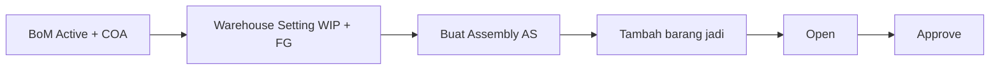
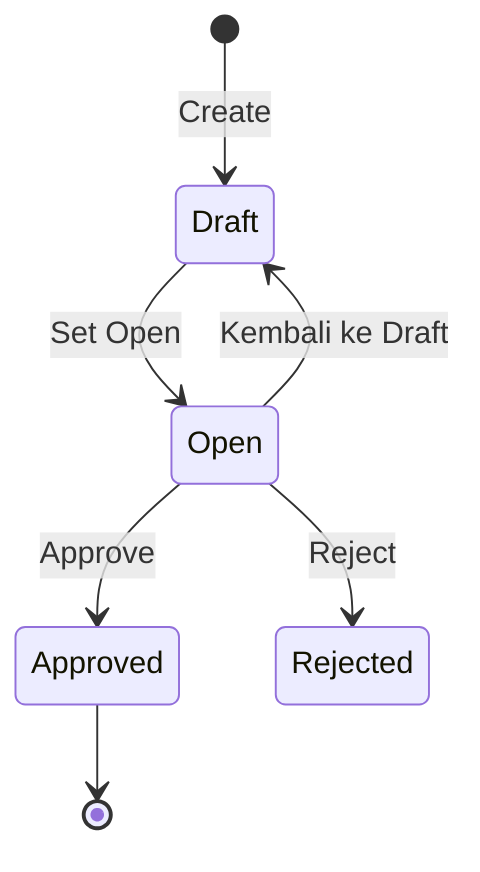

# Panduan Pengguna — Assembly

**Siapa yang baca:** tim gudang / produksi / operations  
**Menu:** Supply Chain → Operations → Assembly  
**Route:** `/supplychain/assembly`  
**Kode dokumen:** `AS-*` (otomatis)

---

## 1. Apa Itu & Kenapa Penting

**Assembly** mencatat perakitan **barang jadi** dari komponen di Bill of Material. Kamu pilih produk jadi, isi qty, lalu sistem memindahkan komponen ke gudang produksi, mengonsumsi bahan, dan menaruh hasil rakitan ke gudang barang jadi.

Tanpa Assembly, stok komponen dan barang jadi tidak berubah berurutan — dan jejak produksi (pindah gudang + jurnal) tidak tercatat.

---

## 2. Overview Flow & Proses Bisnis

**Versi teks:**

1. Siapkan Bill of Material **Active** dan akun Work In Progress + Inventory.  
2. Set gudang **WIP** dan **Finish Good** di Warehouse Setting untuk building yang dipakai.  
3. Buat Assembly (kode `AS-*`).  
4. Tambah baris barang jadi, isi qty bulat.  
5. Set status **Open** — sistem buat Transfer Internal (building → WIP).  
6. **Approve** — komponen terpakai di WIP, barang jadi masuk gudang Finish Good.

### Status

| Status | Arti | Bisa edit detail? |
|--------|------|-------------------|
| Draft | Baru dibuat; isi produk & qty | Ya |
| Open | Transfer Internal sudah dibuat | Tidak — Approve atau Reject / kembali Draft |
| Approved | Produksi selesai; stok & jurnal final | Tidak |
| Rejected | Ditolak; Transfer Internal dihapus | Edit lalu simpan lagi |

---

## 3. Sebelum Mulai

- **Bill of Material** — SKU barang jadi sudah Header BOM **Active**, komposisi valid (minimal 2 komponen, atau qty komponen lebih dari 1).  
- **Warehouse Setting** — building yang kamu pilih sudah punya gudang **WIP** dan **Finish Good**. Tanpa ini, building tidak muncul / Open gagal.  
- **Product COA** — barang jadi **dan** semua komponen punya akun **Work In Progress** dan **Inventory**.  
- **Stok komponen** cukup di building (bukan In Transit / virtual).  
- Tanggal transaksi tidak boleh masa depan; butuh Fiscal Period yang masih Open.

🎬 [Interactive demo akan ditambahkan di sini]

---

## 4. Setelah Selesai

Setelah **Approve** sukses:

- Komponen pindah building → WIP, lalu terpakai (Outbound).  
- Barang jadi masuk gudang Finish Good (Other Inbound).  
- Jurnal otomatis: konsumsi bahan (WIP vs Inventory komponen) dan penerimaan barang jadi.  
- **Progress Status** menuju 100%. Cek **Histories** untuk dokumen turunan.  
- Cetak label SKU / BOX / SID (SID setelah approved).

Kalau progress macet di bawah 100% lebih dari 2 menit → **Retry** dari datalist.

---

## 5. Yang Perlu Diperhatikan

- **Kalau kamu ketik qty desimal** (mis. 1,5), layar menolak. Qty Assembly **bulat saja**. Butuh pecahan? ganti unit (mis. Pack vs Pcs), tetap isi angka bulat.  
- **Kalau komponen juga Header BOM lain** (sub-assembly), sistem **tidak** merakit otomatis ke dalam. Assembly dulu barang child, baru parent.  
- **Kalau building belum punya WIP + Finish Good**, selector kosong atau Open gagal — atur di Warehouse Setting dulu.  
- **Kalau akun WIP / Inventory belum lengkap**, Open atau Approve ditolak.  
- **Kalau stok komponen kurang**, status **tidak** jadi Open — tetap Draft + pesan stok tidak cukup.  
- **Kalau kamu set Open tanpa baris barang jadi**, ditolak — minimal 1 baris.  
- **Kalau 1 SKU barang jadi sudah ada di dokumen ini**, baris kedua ditolak (“Product already used”).  
- **Kalau detail sudah ada**, building / tanggal transaksi / start date terkunci.  
- **Kalau status masih Draft**, tombol Approve belum untuk dipakai — Open dulu (Transfer Internal harus ada).  
- **Kalau ada bendera error merah** di baris, Approve diblok.  
- **Kalau tanggal mulai lebih awal dari tanggal transaksi**, sistem menolak.  
- Hapus header hanya **Draft** atau **Open**. Approved tidak bisa dihapus.

---

## 6. Langkah-Langkah

1. Buka **Supply Chain → Assembly → Create**.  
2. Isi tanggal transaksi, **Building Origin**, Start Date, Type (Production / Service / Assembly / Other). Kode boleh dikosongkan → otomatis `AS-*`.  
3. **Save & Next**.  
4. Di **Assembly Detail**, pilih produk jadi (qty awal 1) atau **Import Excel** (hanya Draft).  
5. Edit **QTY** (bulat) dan **UNIT**. Expand baris untuk lihat komponen + **Max Assembly Qty**.  
6. Sidebar: pilih **Open**.  
7. Cek tidak ada error → **Approve** → isi modal → Submit.  
8. Pantau Progress. Stuck? tunggu 2 menit → **Retry**.  
9. Cek **Histories** / cetak bila perlu.

🎬 [Interactive demo akan ditambahkan di sini]

**Import detail (Draft saja):** download `Template-Import-Assembly.xlsx` — jangan ubah nama kolom. Isi Product ID atau SKU, Qty bulat, Unit. Import header banyak Assembly sekaligus **belum** ada.

---

## 7. Tips & Hal yang Sering Bikin Bingung

**Qty harus bulat.**  
Layar memblok titik/koma. Max Assembly Qty juga ditampilkan bulat (sistem membulatkan ke bawah setelah konversi unit). Contoh: stok bahan 100 pcs, 1 Box = 12 pcs → max sekitar 8 Box per unit FG, lalu dibulatkan lagi ke unit Pack yang kamu pilih.

**Nested BOM berurutan — jangan harap auto-bongkar.**  
Misalnya **SKU-JADI-A** berisi **SKU-SUB-B** (1 pcs, juga Header BOM) + **SKU-BAHAN-3** (3 pcs). Kamu harus Assembly **SKU-SUB-B** dulu sampai stok child ada, baru Assembly **SKU-JADI-A**. Kalau langsung parent, stok SUB-B dianggap komponen biasa — belum tentu cukup.

**Kode `AS-*`.**  
Kosongkan Transaction Code saat create; sistem mengisi otomatis. Jangan bingung kalau di percakapan internal disebut Work Order — di layar ini namanya Assembly.

**WIP + Finish Good + COA wajib.**  
Building Origin = gudang komponen (kamu pilih). Finish Good = tujuan barang jadi (otomatis dari Warehouse Setting, bukan field form). Tanpa WIP/FG di setting, atau tanpa akun WIP & Inventory di produk/komponen, Open/Approve gagal.

**SKU tidak muncul?** BoM inactive, akun belum lengkap, atau komposisi BoM tidak valid.  
**Bisa beberapa barang jadi sekaligus?** Ya — beberapa baris, 1 SKU unik per baris.  
**Dipicu dari Sales Order?** Tidak — standalone.  
**BoM diedit setelah Assembly dibuat?** Saat Open/Approve, snapshot mengikuti BoM terbaru. Yang sudah Approved tidak berubah.

---

## 8. Referensi

| Sumber | Untuk apa |
|--------|-----------|
| [Knowledge Base](./knowledge-base.md) | Troubleshooting & tombol UI |
| [Requirement](./requirement.md) | Validasi & acceptance |
| [Technical](./technical.md) | Developer |
| [Bill of Material](../bill-of-material/README.md) | Blueprint komposisi |
| [Warehouse Setting](../supplychain-setting/README.md) | WIP + Finish Good per building |
| [Transfer Internal](../supplychain-mutation-transfer-internal/README.md) | Dokumen saat Open |
| [Other Inbound](../supplychain-other-inbound/README.md) | Penerimaan barang jadi |
