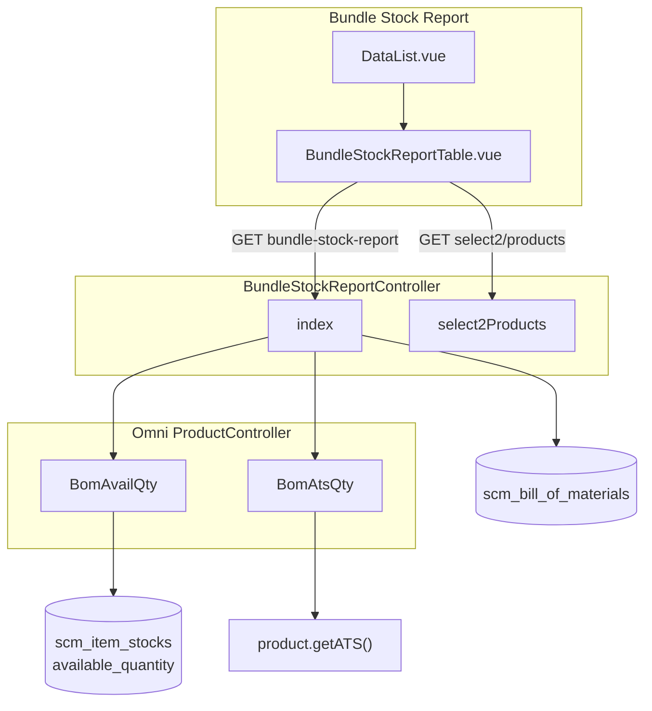

# Bundle Stock Report — Requirement Documentation

> **DRAFT** — Dokumen ini adalah draft awal hasil analisis codebase otomatis per 2026-06-19. Perlu direview PM/QA sebelum final.

## 0. Metadata & Changelog

| Version | Date | Author | Changes |
|---------|------|--------|---------|
| 1.0 | 2026-06-19 | QA - Yemima | Initial draft (AS-IS) |

## 1. Ringkasan Eksekutif

Laporan read-only menampilkan produk **BOM header** (`Product` dengan relasi `billOfMaterial` where `header_product_bom_id` null, `is_bom = 0`). Qty dihitung runtime via `ProductController::BomAvailQty` dan `BomAtsQty`, dikonversi ke unit primer produk. FE: `BundleStockReport/DataList.vue` + shared `BundleStockReportTable.vue` (`table_type=stock_monitoring`).

**Catatan:** `ScmReport` helper **tidak** dipakai menu ini.

## 2. Acceptance Criteria (AS-IS)

| ID | Kriteria | Validasi | Fitur |
|----|----------|----------|-------|
| A-01 | Datalist load bundle headers | `GET bundle-stock-report` + policy `viewAny` | Index |
| A-02 | Hanya produk punya BOM header | `whereHas billOfMaterial` filter | Scope data |
| A-03 | Filter komponen opsional | Query `product_id` → BOM detail contains product | Product filter |
| A-04 | Kolom Availability | `BomAvailQty` + `baseToPrimary` + `renderNumberStock` | Qty fisik |
| A-05 | Kolom ATS Qty | `BomAtsQty` + konversi unit | Qty jual (hidden default FE) |
| A-06 | SKU link ke product edit | HTML `product_formatted` column | Navigasi |
| A-07 | Select2 produk BOM | `GET bundle-stock-report/select2/products` | Filter dropdown |
| A-08 | Action column disabled | `editColumn action` return false | Read-only |
| A-09 | Sort default Update At desc | `initial_order [[0,"desc"]]` di FE | UX |
| A-10 | Company scope | Product model company scope via token | Multi-tenant |

## 3. Validasi & Rules

| ID | Rule | Trigger | Pesan error |
|----|------|---------|-------------|
| V-01 | `authorize viewAny BundleStockReport` | index, select2Products | 403 JSON |
| V-02 | Select2 limit 25 hasil | `select2Products` | — |
| V-03 | Select2 search min kosong = semua BOM | `whereHas billOfMaterial is_bom=0` | — |
| V-04 | BOM child avail = 0 → bundle qty 0 | `BomAvailQty` min logic | Tampil 0 |
| V-05 | Produk tanpa BOM → null qty | `BomAvailQty` return null | Render kosong |

## 4. Fitur & Behavior

| ID | Fitur | Trigger | Expected result |
|----|-------|---------|-----------------|
| F-01 | Datalist server-side | DataTablesV3 | Yajra datalist JSON |
| F-02 | Filter product_id | Watch `selected_product_id` | URL `?product_id=` |
| F-03 | Tooltip Availability | Header tooltip id=1 | Definisi qty inbound-transfer-used-reserved |
| F-04 | Tooltip ATS | Header tooltip id=2 | Definisi ATS inbound-booked |
| F-05 | Kolom Parent hidden | `visible: false` | Item group P/N S/N |
| F-06 | Kolom category hidden | `visible: false` | Item category name |
| F-07 | Warehouse selector UI | Inherited StockMonitoringTable pattern | **Tidak aktif** di bundle page (`showSelectWarehouse` false) |

## 5. Permission & Dependencies

| Item | Detail |
|------|--------|
| Menu Gate | `BundleStockReport::class`, add=1 update=1 delete=0 |
| Policy | `BundleStockReportPolicy` extends `MainPolicy` |
| Depends on | Master Product + BOM (`BillOfMaterial`), `scm_item_stocks` komponen |
| Omni dependency | `Modules\OmniChannel\Http\Controllers\ProductController` untuk BOM qty |
| Related menu | Stock Monitoring (komponen), Manage Platform Product (ATS push) |

## 6. Diagram Relasi

## 7. QA Test Notes

- Siapkan produk header bundle + minimal 2 komponen dengan stok berbeda → Availability = min(komponen/qty BOM)
- Filter komponen: pilih SKU anak → hanya header yang memuat komponen itu
- Bandingkan ATS vs Availability pada produk dengan reserved/booked
- Role tanpa view → expect 403
- Verifikasi route stale `bundle-stock-report/{item_stock}` tidak dipakai FE (controller tidak punya method show)

## 8. Known Gaps / Open Questions

| Gap | Detail |
|-----|--------|
| G-01 | Routes `show`, `certificate`, `interchange`, `select2Warehouse` terdaftar di `api.php` tetapi **tidak ada** di `BundleStockReportController` |
| G-02 | `BundleStockReportTable` masih membawa modal outbound/transfer (inheritance dari stock monitoring) — tidak dipakai di bundle page |
| G-03 | `\Log::info` di `select2Products` — seharusnya dihapus di production |
| G-04 | Tidak ada export Excel |
| G-05 | Filter warehouse di UI table tidak terhubung ke `BomAvailQty` warehouse_ids |

## Related Documents

| Doc | Path |
|-----|------|
| Knowledge Base | [knowledge-base.md](./knowledge-base.md) |
| Technical | [technical.md](./technical.md) |
