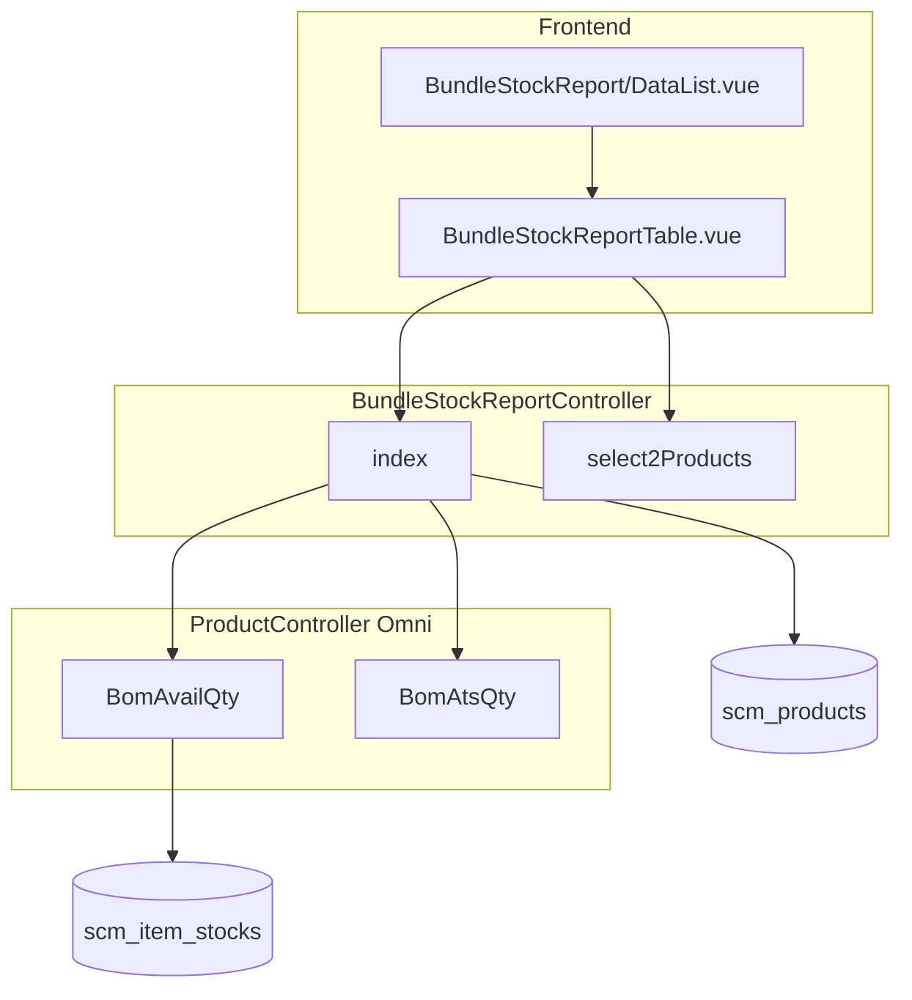
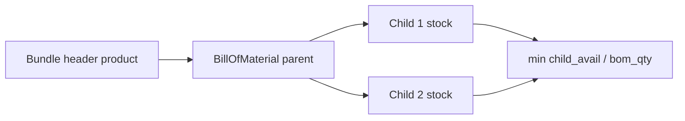

# Bundle Stock Report — Technical Documentation

> **DRAFT** — Dokumen ini adalah draft awal hasil analisis codebase otomatis per 2026-06-19. Perlu direview PM/QA sebelum final.

**UI route:** `/supplychain/bundle-stock-report`  
**API prefix:** `supplychain/bundle-stock-report`

---

## 1. Architecture Overview

---

## 2. Frontend File Map

**Root:** `olshoperp-frontend/src/pages/SCM/Report/BundleStockReport/`

| File | Role | Key API |
|------|------|---------|
| `DataList.vue` | Page shell, breadcrumb | `GET supplychain/bundle-stock-report` |
| `BundleStockReportTable.vue` | Shared DataTable component | index + select2/products |

**Router:** `supplychain_bundle-stock-report_index` → path `bundle-stock-report`

| Prop `table_type` | Mode |
|-------------------|------|
| `stock_monitoring` | Read-only, product filter, no action button |

---

## 3. Backend File Map

| File | Role |
|------|------|
| `Modules/SupplyChain/Http/Controllers/BundleStockReportController.php` | index, select2Products |
| `Modules/SupplyChain/Entities/BundleStockReport.php` | Policy model (extends `ItemStock`) |
| `Modules/SupplyChain/Policies/BundleStockReportPolicy.php` | MainPolicy |
| `Modules/OmniChannel/Http/Controllers/ProductController.php` | `BomAvailQty`, `BomAtsQty` |
| `Modules/Gate/Database/Seeders/ModuleMenu/SupplyChainMenuSeeder.php` | Menu id 206 |

---

## 4. API Routes

| Method | Path | Handler | Implemented |
|--------|------|---------|-------------|
| GET | `supplychain/bundle-stock-report` | `index` | Yes |
| GET | `supplychain/bundle-stock-report/select2/products` | `select2Products` | Yes |
| GET | `supplychain/bundle-stock-report/{item_stock}` | `show` | **No** (route only) |
| GET | `supplychain/bundle-stock-report/{item_stock}/certificate` | `certificate` | **No** |
| GET | `supplychain/bundle-stock-report/{item_stock}/certificate-download` | `CertificateDownload` | **No** |
| GET | `supplychain/bundle-stock-report/{item_stock}/interchange` | `interchange` | **No** |
| GET | `supplychain/bundle-stock-report/select2/warehouse` | `select2Warehouse` | **No** |

Middleware: `auth:sanctum`, `auth_verified`

### Query params (index)

| Param | Type | Effect |
|-------|------|--------|
| `product_id` | int | Filter headers whose BOM details include product |
| DataTables std | — | search, order, start, length |

### Datalist columns (server)

| Column | Source |
|--------|--------|
| `product_formatted` | SKU + name link HTML |
| `parent` | item_group P/N S/N |
| `alias_formatted` | productAliasName newest |
| `available_quantity_formatted` | BomAvailQty → baseToPrimary |
| `ats_quantity_formatted` | BomAtsQty → baseToPrimary |
| `unit_name_formatted` | productUnit.name |
| `updateAt` | updated_at or created_at |
| `action` | always false |

---

## 5. BOM Quantity Logic

**BomAvailQty:** `min(sum(available_quantity) / bom_child.quantity)` across children.  
**BomAtsQty:** `min(getATS(stock_in_base_unit) / bom_child.quantity)` across children.

---

## 6. Database Schema (read)

| Tabel | Role |
|-------|------|
| `scm_products` | Bundle header rows |
| `scm_bill_of_materials` | BOM tree (`parent_id`, `is_bom`, `quantity`) |
| `scm_item_stocks` | Komponen `available_quantity` |
| `scm_product_alias_names` | Alias column |

---

## 7. Jobs / Observers / Events

Tidak ada job khusus menu ini. Perhitungan **realtime** per request datalist.

---

## 8. Related docs

- [manage-platform-product/technical.md](../manage-platform-product/technical.md) — ATS / BOM di Omni
- [supplychain-stock-monitoring/technical.md](../supplychain-stock-monitoring/technical.md) — item stock granular
- `docs/api/supply_chain/routes.md` — route listing (partial stale for bundle)
