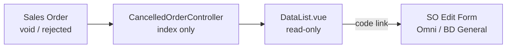
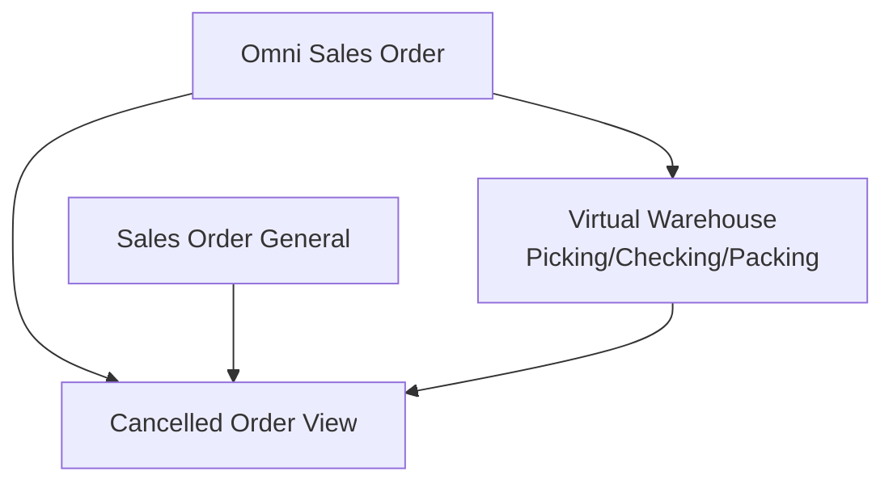

# Cancelled Order — Requirement Detail

> **DRAFT** — Dokumen ini adalah draft awal hasil analisis codebase otomatis per 2026-06-19. Perlu direview PM/QA sebelum final.

**Modul:** SupplyChain (view) + OmniChannel (data) · **Status:** AS-IS

---

## Daftar Isi

1. [Fungsi & Tujuan](#1-fungsi--tujuan)
2. [How It Works](#2-how-it-works)
3. [Validasi yang Berjalan](#3-validasi-yang-berjalan)
4. [Relasi Menu Lain](#4-relasi-menu-lain)
5. [FAQ](#5-faq)
6. [Known Gaps](#6-known-gaps)

---

## 1. Fungsi & Tujuan

### Apa itu Cancelled Order?

Read-only datalist SO dengan `transaction_status IN (rejected, void)` untuk monitoring dan investigasi order batal.

### Masalah yang diselesaikan

| Kebutuhan | Solusi |
|-----------|--------|
| Visibility order batal | Filtered datalist dari `omni_sales_orders` |
| Traceability processing | Derived processing status column |
| Investigasi cepat | Link ke SO edit + platform order number |

### Entitas

| Entitas | Tabel |
|---------|-------|
| CancelledOrder (extends SalesOrder) | `omni_sales_orders` |
| SalesOrderApproval | Audit void/reject timestamp |

---

## 2. How It Works

### Index query

- `CancelledOrder::whereIn(transaction_status, [TS_REJECTED, TS_VOID])`
- Eager load: platform, customer, store, payment types, sales_order_details
- Rich formatted columns + SearchBuilder filters

### Processing status derivation

Latest approved transfer mutation to virtual warehouses in process groups:
- Picking → Checking → Packing → Approved Order

### Void notes

- `approved_by = 0` → note `cancelled from platform`

---

## 3. Validasi yang Berjalan

| Area | Rule |
|------|------|
| API | **No write endpoints** — no validation on create/update |
| Authorization | `CancelledOrderPolicy@viewAny` only |
| Data filter | Hard filter rejected + void statuses |

---

## 4. Relasi Menu Lain

| Menu | Relasi |
|------|--------|
| Sales Order (Omni) | Source + edit navigation |
| Sales Order General | Alternate edit URL |
| Waves / Picking | Processing status source |

---

## 5. FAQ

**Q: Apakah menu ini bisa void order?**  
A: Tidak. Void/reject dilakukan di modul Sales Order.

**Q: Kenapa FE path di folder Omni?**  
A: `src/pages/Omni/Processing/CancelledOrder/` — legacy placement, SCM menu slug.

---

## 6. Known Gaps

- No CRUD API — index only.
- Vue component internal name `"Unassign Wave"` (misnamed).
- `customer_name_formatted` bug when `$row->customer` exists (shows `-` instead of customer name).
- `send_to_wave_button: true` on DataTables but no row actions.
- FE under Omni folder despite SCM manifest slug.

---

## Related Documents

| Doc | Path |
|-----|------|
| Knowledge Base | [knowledge-base.md](./knowledge-base.md) |
| Technical | [technical.md](./technical.md) |
