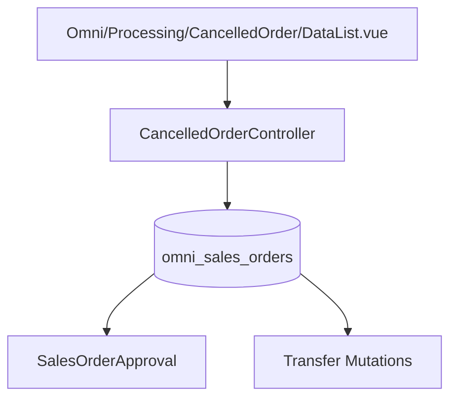

# Cancelled Order — Technical Documentation

> **DRAFT** — Dokumen ini adalah draft awal hasil analisis codebase otomatis per 2026-06-19. Perlu direview PM/QA sebelum final.

**Menu slug:** `supplychain-cancelled-order`  
**UI route:** `/supplychain/cancelled-order`  
**API:** `GET {VITE_API_URL}supplychain/cancelled-order`

---

## 1. Architecture Overview

---

## 2. Frontend File Map

**Path:** `olshoperp-frontend/src/pages/Omni/Processing/CancelledOrder/DataList.vue`

| Property | Value |
|----------|-------|
| Component name | `"Unassign Wave"` (misnamed) |
| `action_button` | `false` |
| `send_to_wave_button` | `true` |

| Route | Component |
|-------|-----------|
| `supplychain/cancelled-order` | `DataList.vue` |

No Form.vue — read-only list.

---

## 3. Controller

| Class | Path |
|-------|------|
| `CancelledOrderController` | `Modules/SupplyChain/Http/Controllers/CancelledOrderController.php` |

| Method | Route | Notes |
|--------|-------|-------|
| `index` | GET `/cancelled-order` | Only method implemented |

**Entity:** `CancelledOrder extends SalesOrder` — no separate table.

**Formatted columns (partial):** `code_formatted_so`, `platform_name_formatted`, `customer_name_formatted`, `payment_deadline_time_formatted`, processing status, void notes, created/void dates.

Uses `SearchBuilder` for advanced column filters.

---

## 4. Model / Entity

| Class | Table | Notes |
|-------|-------|-------|
| `CancelledOrder` | `omni_sales_orders` | Extends `SalesOrder` |
| `SalesOrder` | `omni_sales_orders` | Filter `TS_REJECTED`, `TS_VOID` |
| `SalesOrderApproval` | approval table | Void/reject timestamp |

---

## 5. DB Tables

| Table | Role |
|-------|------|
| `omni_sales_orders` | Primary SO data |
| `omni_sales_order_details` | Line reference |
| `scm_stock_mutations` / transfer details | Processing status lookup |
| `omni_sales_order_approvals` | Void/reject audit |

---

## 6. API Routes

| Method | URI | Controller |
|--------|-----|------------|
| GET | `cancelled-order` | `CancelledOrderController@index` |

**No** resource CRUD routes registered.

---

## 7. Policy

| Class | Abilities |
|-------|-----------|
| `CancelledOrderPolicy` | `viewAny` (only ability used) |

---

## Related Documents

| Doc | Path |
|-----|------|
| Knowledge Base | [knowledge-base.md](./knowledge-base.md) |
| Requirement | [requirement.md](./requirement.md) |
