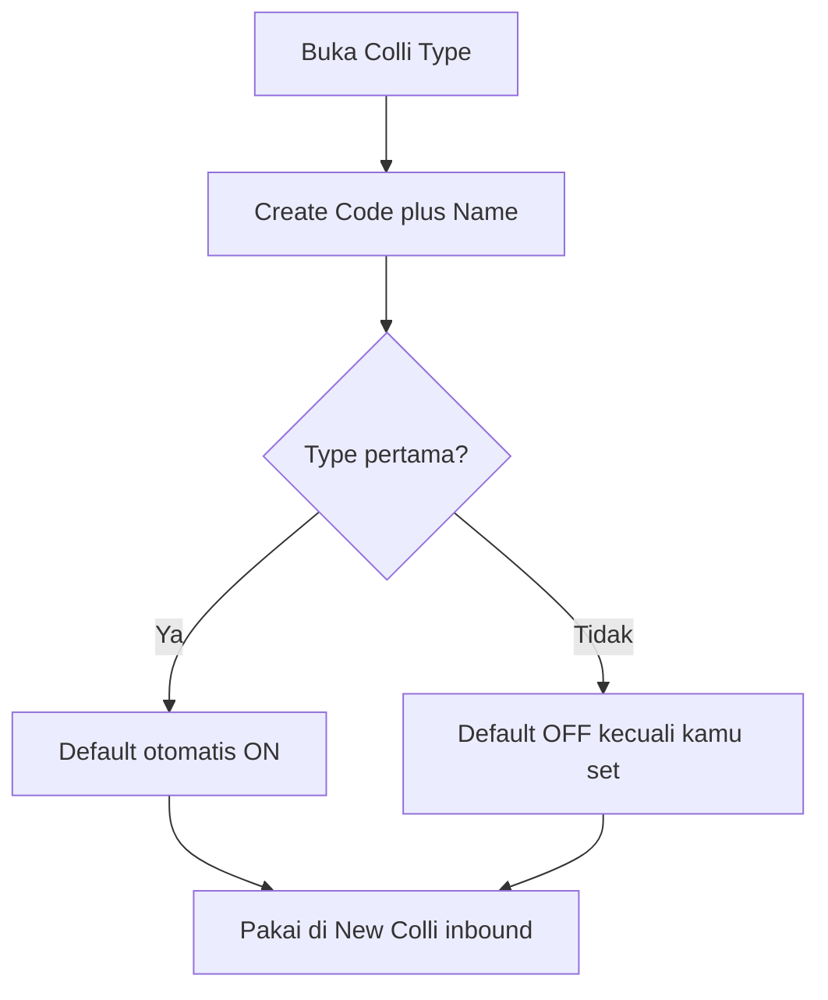

# Colli Type — Knowledge Base

> **Audience:** Warehouse / SCM ops · **Route:** `/supplychain/colli-type`

Menu master masih dalam pengembangan (CRUD UI menyusul). Isi di bawah = cara pakai yang diharapkan.

---

## 1. Apa itu?

**Colli Type** = daftar **jenis wadah** di gudang: Box, Pallet, dan sejenisnya. Bukan satuan qty (itu **Unit**) dan bukan lokasi rak (itu **Warehouse Structure**).

Saat inbound, user buat **New Colli** (kode wadah aktual). Colli Type hanya menjawab: wadah ini jenis apa?

**Colli v2:** satu colli code bisa berisi **banyak SKU** di **lokasi yang sama**. Total isi colli = jumlah qty semua SKU di dalamnya. Beda dari Colli ID lama (satu colli = satu stock id).

---

## 2. Glosarium

| Istilah | Arti awam |
|---------|-----------|
| **Colli Type** | Jenis wadah (Box, Pallet, …) |
| **Default Data** | Type yang otomatis terpilih saat New Colli |
| **Active** | Boleh / tidak dipilih di transaksi baru |
| **Show for all company** | Type dibagikan ke company internal lain |
| **Colli code** | Nomor wadah aktual di gudang (bukan master type) |
| **Digunakan** | Sudah ada Colli code yang memakai type ini |

---

## 3. Alur kerja standar

1. Buka **Colli Type** → **Create**.  
2. Isi **Code** dan **Name** (wajib). Description opsional.  
3. Type **pertama** di company otomatis **Default ON**.  
4. Type berikutnya Default OFF, kecuali kamu centang Default.  
5. **Active** default ON. **Show for all company** default OFF.  
6. Simpan. Nanti di inbound, New Colli memakai type (default terpilih otomatis).

---

## 4. Cara pakai (contoh)

| Situasi | Yang terjadi |
|---------|----------------|
| Create pertama `BOX` / Box | Tersimpan, Default ON, Active ON |
| Create kedua `PLT` / Pallet tanpa Default | Default OFF |
| Set Pallet jadi Default | Box Default jadi OFF — hanya satu Default |
| Type sudah punya Colli code, matikan Active | Ditolak — buat type baru untuk ke depan |
| Type belum dipakai, Delete | Hilang dari list aktif; muncul di Show deleted |

---

## 5. Troubleshooting

| Gejala | Penyebab | Solusi |
|--------|----------|--------|
| Tidak bisa Inactive | Sudah ada Colli code memakai type | Biarkan Active, atau buat type baru |
| Tidak bisa Delete | Sama — masih dipakai | Jangan hapus; ganti Code/Name jika perlu rename |
| Dua type Default ON | Tidak seharusnya | Set Default hanya di satu type |
| Type tidak muncul di inbound | Active OFF, atau beda company / belum share | Aktifkan; cek Show for all company |
| Create pertama Default OFF | Seharusnya ON otomatis | Laporkan ke Dev |

---

## 6. FAQ

**Q: Beda dengan Unit / Warehouse?**  
A: Unit = pcs/kg. Warehouse = lokasi. Colli Type = jenis wadah.

**Q: Boleh ganti Code setelah dipakai?**  
A: Ya. Yang dilarang: matikan Active atau hapus jika sudah ada Colli code.

**Q: Kenapa ada Default?**  
A: Supaya New Colli di inbound langsung terisi jenis wadah yang paling sering dipakai.

**Q: Colli ID lama?**  
A: Konsep lama pecah stok per colli. Yang baru: satu kode wadah berisi banyak SKU di lokasi yang sama.

---

## Related Documents

| Doc | Path |
|-----|------|
| Requirement | [requirement.md](./requirement.md) |
| Technical | [technical.md](./technical.md) |
| User Guide | [user-guide.md](./user-guide.md) |
| Purchase Inbound | [../supplychain-new-purchase-inbound/knowledge-base.md](../supplychain-new-purchase-inbound/knowledge-base.md) |
| Unit | [../supplychain-unit/knowledge-base.md](../supplychain-unit/knowledge-base.md) |
