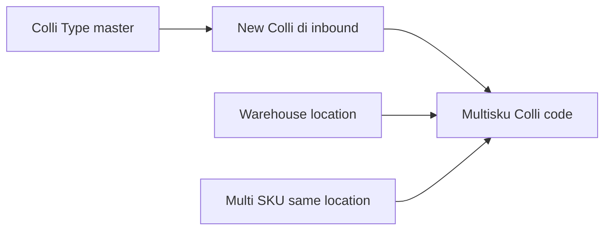
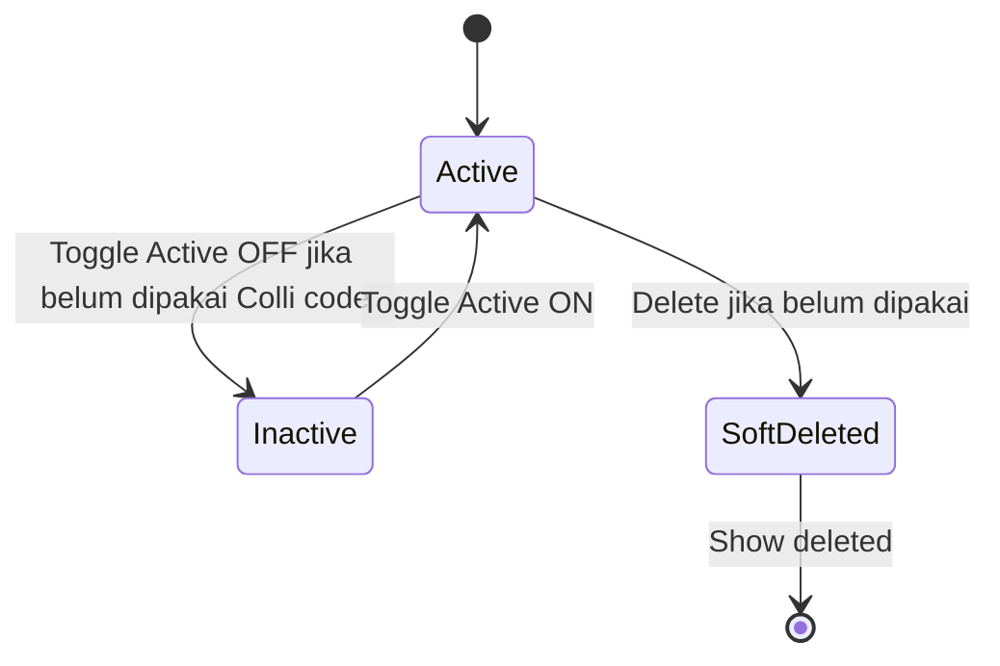

# Colli Type — Requirement Documentation

**Modul:** Supply Chain / Master  
**Audience:** PM, Warehouse, QA  
**UI route:** `/supplychain/colli-type` · create `/supplychain/colli-type/create`  
**SoT:** `_meta/sot/supplychain-colli-type-source-of-truth.md` v1.0 (14 Agustus 2026)

Konsumen (TO-BE): [Purchase Inbound](../supplychain-new-purchase-inbound/) — New Colli. Bukan pengganti [Unit](../supplychain-unit/) atau [Warehouse Structure](../supplychain-warehouse-structure/).

> Master **WIP**: entity + tabel sudah ada; Controller / Policy / routes / FE **belum** di workspace (GAP-CT-02). Docs = requirement + AS-IS schema.

---

## 0. Metadata & Changelog

| Version | Date | Author | Changes |
|---------|------|--------|---------|
| 1.0 | 2026-08-14 | QA - Yemima | Full 5-file dari SoT v1.0; Gap GAP-CT-01..07 |

---

## 1. Ringkasan Eksekutif

**Colli Type** = master nama **jenis wadah colli** (Box, Pallet, dll.). Dipakai sebagai label tipe saat user **create New Colli** di transaksi (mulai Purchase Inbound — SOT transaksi menyusul).

**Bukan** multi-unit, **bukan** warehouse, **beda** dari Colli ID v1 (1 colli = 1 stock id dengan qty isi tetap).

**Colli v2 (konteks):** colli code = **wadah multi-SKU** di **satu lokasi WH**. Availability colli = total qty semua SKU di dalam colli. Master ini hanya mendefinisikan **tipe wadah**; lokasi mengikuti Location Destination transaksi.

Audience: Warehouse / SCM ops + admin master.

---

## 2. Prasyarat

| Prasyarat | Sumber | Catatan |
|-----------|--------|---------|
| Privilege menu Colli Type | Gate | view / create / update / delete |
| Company context | Sanctum token | Scoped `owned_by` kecuali Show for all company |
| (Konsumen nanti) Purchase Inbound + WH destination | Purchase Inbound | Default type dipakai saat **New Colli** — di luar CRUD master |

Tidak wajib punya Colli code dulu untuk create type.

---

## 3. Siklus Status

Master **tanpa** approval Draft/Open/Approved. Yang relevan: Active, Default, soft-delete.

| Kondisi | Boleh? |
|---------|--------|
| Active ON | Muncul di opsi transaksi Colli v2 |
| Active OFF | Tidak muncul di opsi transaksi |
| Inactive saat sudah ada Multisku Colli memakai type | **Ditolak** + notifikasi EN (§7) |
| Soft delete saat sudah dipakai | **Ditolak** |
| Soft delete belum dipakai | Ya — Show deleted = *already deleted* |

---

## 4. Datalist

**Route:** `/supplychain/colli-type`

### 4.1 Kolom

| Kolom | Default | Catatan |
|-------|---------|---------|
| Code | Ya | |
| Name | Ya | |
| Description | Ya | Boleh kosong |
| Default Data | Ya | Flag default — kolom `is_default` **belum** di migration (GAP-CT-01) |
| Active | Ya | |
| Created by \| Created at | Ya | |
| Action | Ya | Edit / Delete (delete blok jika used) |

Updated by / Show for all company **tidak** wajib di list; boleh di form.

### 4.2 Toolbar

Global Search, Advanced Filter, Create, Show deleted, Column show/hide. **Export** out of scope (GAP-CT-06).

---

## 5. Form & Field

| Field | Required | Default create | Aturan |
|-------|----------|----------------|--------|
| Code | Ya | — | Unik per company. **Boleh diubah** meski sudah dipakai Colli code |
| Name | Ya | — | **Boleh diubah** meski sudah dipakai |
| Description | Tidak | kosong | Teks bebas |
| Set as Default Data | — | §6.1 | Max **1** ON per company; ON baru → OFF-kan default lama |
| Active | — | **ON** | OFF diblok jika sudah dipakai Colli code |
| Show for all company | — | **OFF** | ON = terlihat/bisa dipakai company internal lain |

### 5.1 Audit Log

Wajib: create (semua field), update before/after, toggle Default / Active / Show for all company, soft delete. Implementasi belum dicek (GAP-CT-05).

---

## 6. How It Works

### 6.1 Set as Default Data

| Situasi | Hasil |
|---------|--------|
| Belum ada Colli Type → create pertama | Default **ON** otomatis |
| Create ke-2 dst. tanpa set default | Default **OFF** |
| Set Default ON pada type A, B sedang ON | A = ON, B dipaksa **OFF** |
| Semua boleh OFF? | Tidak wajib selalu ada default. Jika satu-satunya default di-OFF-kan tanpa ON lain → New Colli **tanpa** preselect (GAP-CT-03) |

**Fungsi konsumen:** di Purchase Inbound, **New Colli** → dropdown Colli Type **preselect** type Default ON.

### 6.2 Active vs used

“Digunakan” = ada Multisku Colli dengan type ini.

| Aksi | Belum dipakai | Sudah dipakai |
|------|---------------|---------------|
| Edit code / name / description | Ya | Ya |
| Active OFF | Ya | **Tidak** |
| Soft delete | Ya | **Tidak** |
| Active ON / Show for all company | Ya | Ya |

### 6.3 Konteks Colli v2 (bukan scope CRUD)

Beberapa SKU ke **satu colli code** tipe Box di lokasi yang sama; availability = sum qty. Colli ID v1 tidak memenuhi case itu. Lokasi colli = Location Destination transaksi. Detail inbound → SOT Purchase Inbound / Colli v2 nanti.

### 6.4 Contoh kasus

| # | Situasi | Expected |
|---|---------|----------|
| 1 | Create pertama: Code `BOX`, Name `Box` | Tersimpan; Default **ON**; Active ON; Show all company OFF |
| 2 | Create kedua `PLT` / Pallet tanpa set default | Default **OFF** |
| 3 | Set `PLT` Default ON | `BOX` jadi OFF; `PLT` ON |
| 4 | Type sudah punya Colli code → Active OFF | Error EN (§7) |
| 5 | Type sudah dipakai → Delete | Ditolak |
| 6 | Type belum dipakai → Delete | Soft delete; Show deleted *already deleted* |
| 7 | Type sudah dipakai → ganti Code/Name | Sukses; audit tercatat |
| 8 | Active OFF → tidak muncul di New Colli inbound | Saat fitur inbound live |

---

## 7. Validasi

| Kondisi | Behavior |
|---------|----------|
| Code / Name kosong | Required — blok save |
| Code duplikat (scope company) | Reject unique (GAP-CT-04 pesan exact) |
| Active OFF padahal sudah dipakai | *This Colli Type cannot be set to Inactive because it is already used by one or more Colli codes. Keep it Active, or create a new Colli Type for future use.* |
| Delete padahal dipakai | *This Colli Type cannot be deleted because it is already used by one or more Colli codes.* |
| Set Default ON | Demote default lain di scope yang sama |

---

## 8. Relasi Menu Lain

| Menu | Relasi |
|------|--------|
| Multisku Colli (`scm_multisku_collis`) | Child `colli_type_id`; gate inactive/delete |
| [Purchase Inbound](../supplychain-new-purchase-inbound/README.md) | Konsumen Default + New Colli (TO-BE) |
| [Warehouse Structure](../supplychain-warehouse-structure/README.md) | Lokasi colli di transaksi — bukan field master type |
| [Unit](../supplychain-unit/README.md) | **Bukan** pengganti Colli Type |

---

## 9. Acceptance Criteria

| ID | Kriteria |
|----|----------|
| CT-01 | Create: Code+Name wajib; Active ON; Show all company OFF; first type Default ON |
| CT-02 | Max 1 Default ON per company; ON baru demote yang lama |
| CT-03 | Code/Name editable setelah dipakai; Active OFF / delete diblok jika dipakai |
| CT-04 | Soft delete + Show deleted jika belum dipakai |
| CT-05 | Audit log create/update/toggles/delete |
| CT-06 | Gap registry terdokumentasi (WIP FE/BE + `is_default`) |

---

## 10. FAQ

**Q: Colli Type vs Warehouse vs Unit?**  
A: Type = nama wadah. Warehouse = lokasi fisik. Unit = satuan qty.

**Q: vs Colli ID lama?**  
A: Lama = pecah stock id per colli. v2 = satu kode wadah multi-SKU; Type hanya klasifikasi wadah.

**Q: Boleh ganti Code setelah dipakai?**  
A: Ya. Yang tidak boleh: Inactive atau hapus jika sudah ada Colli code.

**Q: Kenapa Default?**  
A: Mempercepat New Colli — type default langsung terpilih.

**Q: Show for all company?**  
A: ON = type bisa dipakai company internal lain (pola master SCM).

---

## 11. Gap Registry

| ID | Deskripsi | Status |
|----|-----------|--------|
| GAP-CT-01 | Kolom Default (`is_default`) belum ada di migration / fillable | Open — Dev tambah kolom + unique-one-default |
| GAP-CT-02 | Controller, Policy, routes, Menu seeder, FE **belum** di workspace; staging create URL disebut | Open — verify setelah merge |
| GAP-CT-03 | Satu-satunya Default di-OFF tanpa ON lain → preselect New Colli kosong? | Pending Decision — Yemima (minor) |
| GAP-CT-04 | Unique `code` scope company + soft delete | Open — verify saat FormRequest ada |
| GAP-CT-05 | Audit Log per-action belum dicek | Open — ikuti AuditHandler master SCM |
| GAP-CT-06 | Export datalist | **Resolved** — out of scope kecuali FE sudah ada |
| GAP-CT-07 | Copy EN inactive/delete belum di app | Open — pakai teks §7 |

---

## Related Documents

| Doc | Path |
|-----|------|
| Knowledge Base | [knowledge-base.md](./knowledge-base.md) |
| Technical | [technical.md](./technical.md) |
| User Guide | [user-guide.md](./user-guide.md) |
| SoT | [../_meta/sot/supplychain-colli-type-source-of-truth.md](../_meta/sot/supplychain-colli-type-source-of-truth.md) |
