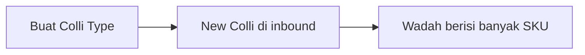

# Panduan Pengguna — Colli Type

**Siapa yang baca:** admin master / warehouse  
**Menu:** Supply Chain → Master → Colli Type  
**Route:** `/supplychain/colli-type`

Menu masih dalam pengembangan; panduan ini mengikuti perilaku yang diharapkan.

---

## 1. Apa Itu & Kenapa Penting

**Colli Type** adalah daftar jenis wadah di gudang (Box, Pallet, …). Dipakai saat kamu buat **New Colli** di inbound supaya sistem tahu wadah itu jenis apa.

Ini **bukan** satuan qty (Unit) dan **bukan** lokasi rak (Warehouse).

---

## 2. Overview Flow & Proses Bisnis

**Versi teks:**

1. Admin buat jenis wadah di Colli Type ([Create](#sf-lingo:SF-CT-01)).  
2. Di Purchase Inbound, user buat **[New Colli](#sf-lingo:SF-CT-05)** dan pilih type ([Default](#sf-lingo:SF-CT-02) terpilih otomatis).  
3. Satu kode colli bisa berisi banyak SKU di lokasi yang sama.

### Status

| Pengaturan | Arti |
|------------|------|
| Active ON | Bisa dipilih di transaksi baru |
| Active OFF | Tidak muncul di pilihan New Colli |
| Default ON | Otomatis terpilih saat New Colli |
| Sudah dipakai Colli code | Tidak boleh Inactive / hapus; Code/Name masih boleh diubah |

---

## 3. Sebelum Mulai

- Pikirkan jenis wadah yang dipakai gudang (minimal Box).  
- Type pertama akan jadi Default otomatis.  
- Tidak perlu punya colli code dulu untuk membuat type.

🎬 [Interactive demo akan ditambahkan di sini]

---

## 4. Setelah Selesai

- Type **[Active](#sf-lingo:SF-CT-03)** siap dipilih saat [New Colli](#sf-lingo:SF-CT-05) di inbound.  
- Kalau kamu set **[Default](#sf-lingo:SF-CT-02)**, inbound akan preselect type itu.  
- Kalau type sudah dipakai colli code, jangan matikan Active atau hapus — buat type baru untuk jenis wadah baru.

---

## 5. Yang Perlu Diperhatikan

- Kalau kamu kosongkan Code atau Name, simpan ditolak.  
- Kalau kamu set [Default](#sf-lingo:SF-CT-02) di type baru, Default type lama otomatis mati — hanya satu Default.  
- Kalau type sudah dipakai colli code lalu kamu matikan [Active](#sf-lingo:SF-CT-03) atau [hapus](#sf-lingo:SF-CT-04), sistem menolak.  
- Kalau type belum dipakai, Delete = soft delete (masih terlihat di Show deleted).  
- **Contoh:** Create pertama `BOX` / Box → Default ON. Create `PLT` / Pallet tanpa Default → OFF. Set Pallet Default → Box Default OFF.

---

## 6. Langkah-Langkah

1. Buka **Colli Type** → **[Create](#sf-lingo:SF-CT-01)**.  
2. Isi **Code** dan **Name**. Description opsional.  
3. Biarkan Active ON. Show for all company OFF kecuali type perlu dipakai company lain.  
4. Centang **[Default](#sf-lingo:SF-CT-02)** hanya jika ini jenis yang paling sering dipakai.  
5. **Save**.  
6. Nanti di inbound: **[New Colli](#sf-lingo:SF-CT-05)** → type default sudah terpilih.

🎬 [Interactive demo akan ditambahkan di sini]

---

## 7. Tips & Hal yang Sering Bikin Bingung

- **Bukan Unit.** Unit = pcs/kg. Colli Type = Box/Pallet.  
- **Bukan Colli ID lama.** Yang baru: satu kode wadah, banyak SKU, satu lokasi.  
- **Tidak bisa Inactive/hapus** kalau sudah ada colli code — ganti Code/Name saja jika perlu rename.  
- Type tidak muncul di inbound? Cek [Active](#sf-lingo:SF-CT-03) dan company (Show for all company).

---

## 8. Referensi

| Sumber | Untuk apa |
|--------|-----------|
| [Knowledge Base](./knowledge-base.md) | Troubleshooting |
| [Feature Map](./feature-map.md) | Indeks Lingo / sub-feature |
| [Requirement](./requirement.md) | Aturan & Gap |
| [Technical](./technical.md) | Developer |
| [Purchase Inbound](../supplychain-new-purchase-inbound/user-guide.md) | New Colli (konsumen) |
| [Unit](../supplychain-unit/user-guide.md) | Satuan qty — bukan wadah |
| [Warehouse Structure](../supplychain-warehouse-structure/) | Lokasi colli |
