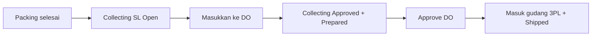

# Delivery Order — Knowledge Base

**UI:** `/supplychain/delivery-order` · **SoT:** `_meta/sot/supplychain-delivery-order-source-of-truth.md` v1.0

---

## Apa ini?

Delivery Order (DO) = daftar order yang diserahkan ke **shipper / gudang 3PL**. Dipakai untuk:

1. **Order internal** — pengiriman & tracking company sendiri  
2. **Order platform** — shipper dari marketplace  

Live: masukkan order **per transaksi order**, bukan per SKU.

---

## Kapan barang “sudah di 3PL”?

**Saat DO di-approve**, bukan saat order baru dimasukkan ke detail.

Alur singkat:

Collecting (`SL-*`) lahir dari **approve packing** (masih Open). Baru **Approved** ketika order masuk detail DO.

---

## Syarat order bisa masuk DO

- Sudah melewati pick → check → pack → **Collecting**  
- Shipper di header DO sudah terikat gudang 3PL  
- Tanggal order / Collecting tidak lebih baru dari tanggal DO  

---

## Available to Delivery Order

| Cara | Yang tampil |
|------|-------------|
| By order | Order yang punya Collecting dan masih sisa qty |
| By Transfer Internal | Dokumen Collecting **SL-*** (Open **dan** Approved) |

- Pilih SL **Open** → Collecting otomatis Approved, lalu masuk detail.  
- Pilih SL **sudah Approved** → status tidak berubah; boleh dimasukkan lagi jika masih ada sisa.

Satu DO boleh campur banyak order (internal + platform) asal **shipper sama**.

Di detail: **Trx Code** = nomor SL Collecting; **Trx Ref** = nomor order; **Status** = status SL.

---

## Ganti kurir di platform (A ke B)

- **Belum** masuk DO → biasanya aman; order ikut shipper terbaru saat dicari.  
- **Sudah** masuk detail DO, lalu kurir berubah → sistem **belum** otomatis pindah. Approve DO masih bisa mengirim ke gudang 3PL **shipper lama**. Ini **risiko bug** yang sudah diketahui — laporkan ke QA/dev, jangan anggap sudah beres.

---

## Troubleshooting

| Gejala | Cek |
|--------|-----|
| Order tidak muncul | Packing sudah complete? Ada SL? Qty sudah prepared penuh? |
| Gagal approve: shipper doesn’t have a 3PL warehouse | Binding shipper ↔ gudang 3PL |
| Tidak bisa add SO / cek Transfer Collected | Tanggal DO vs SO vs Collecting |
| Kolom Deadline di daftar | Masih ada di tabel; bisa di-hide Column show/hide |

---

## Instant Settlement

DO belum approved / order belum Shipped → settlement marketplace bisa gagal.
