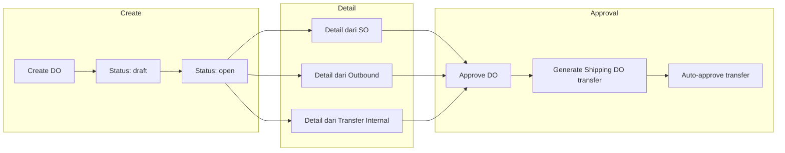
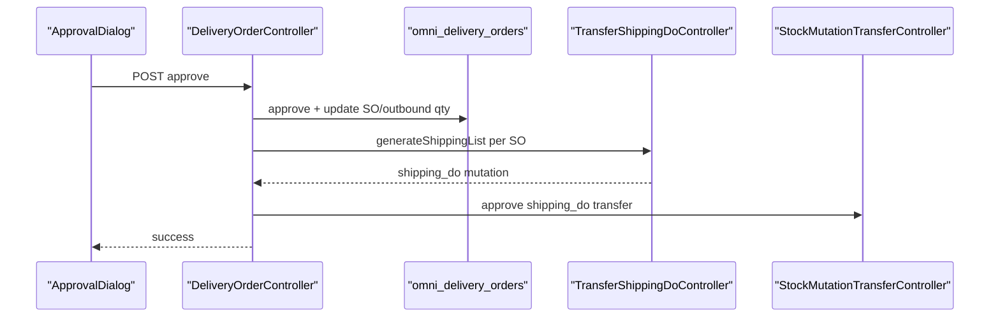
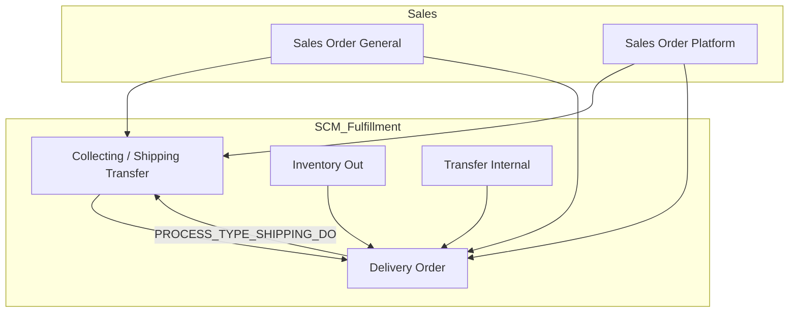

# Delivery Order — Requirement Detail

> **DRAFT** — Dokumen ini adalah draft awal hasil analisis codebase otomatis per 2026-06-19. Perlu direview PM/QA sebelum final.

**Modul:** SupplyChain + OmniChannel  
**Audience:** PM, Operations, QA, Support, Developer  
**Status:** Sesuai perilaku sistem saat ini (AS-IS)

---

## Daftar Isi

1. [Fungsi & Tujuan](#1-fungsi--tujuan)
2. [How It Works — Alur Kerja](#2-how-it-works--alur-kerja)
3. [Validasi yang Berjalan](#3-validasi-yang-berjalan)
4. [Relasi Menu Lain](#4-relasi-menu-lain)
5. [FAQ](#5-faq)

---

## 1. Fungsi & Tujuan

### Apa itu Delivery Order?

**Delivery Order (DO)** mendokumentasikan pengiriman fisik barang. Data disimpan di `omni_delivery_orders` (entity `Modules\OmniChannel\Entities\DeliveryOrder`), diakses via controller SCM `Modules\SupplyChain\Http\Controllers\DeliveryOrderController`.

DO dapat berisi detail dari:

1. **Sales Order** — `sales_order_detail_id`
2. **Inventory Out (Outbound)** — `outbound_mutation_detail_id`
3. **Transfer Internal** — referensi transfer internal group

### Masalah yang diselesaikan

| Kebutuhan Bisnis | Bagaimana DO Menjawab |
|------------------|----------------------|
| Satu dokumen pengiriman multi-SO | Header DO + banyak detail |
| Kontrol sebelum barang keluar resmi | Approval workflow |
| Integrasi fulfillment wave | Cek collecting list & generate shipping DO transfer |
| Traceability ke outbound/transfer | Link detail ke outbound atau transfer internal |

### Entitas data utama

| Entitas | Tabel |
|---------|-------|
| Header DO | `omni_delivery_orders` |
| Detail DO | `omni_delivery_order_details` |
| Approval | `omni_delivery_order_approvals` |
| Shipping transfer | `scm_stock_mutations` (`process_type = shipping_do`) |

---

## 2. How It Works — Alur Kerja

### 2.1 Siklus hidup DO

### 2.2 Create

1. `POST supplychain/delivery-order` → `DeliveryOrderController@store`.
2. Header dibuat dengan `transaction_status = draft` (meskipun request mengizinkan open/draft).
3. Field wajib: `transaction_date`, `shipper_id`.
4. Customer di header **tidak wajib** — diisi dari detail SO.

### 2.3 Tambah detail

| Endpoint | Sumber |
|----------|--------|
| `POST delivery-order-detail/{do}/create-sales-order-group` | Sales Order group |
| `POST delivery-order-detail/{do}/create-outbound-group` | Inventory Out group |
| `POST delivery-order-detail/{do}/create-transfer-internal-group` | Transfer Internal group |
| `POST delivery-order/{do}/delivery-order-detail/bulk-use-sales-order` | Bulk SO |
| `POST delivery-order/{do}/delivery-order-detail/bulk-use-transfer-internal` | Bulk transfer |

Detail menyimpan qty kirim dan referensi ke SO detail / outbound detail.

### 2.4 Approve — dampak sistem

`POST supplychain/delivery-order/{id}/approve` → `approveDeliveryOrder()`:

1. `$delivery_order->approve($request)` — set status approved + log approval.
2. Per detail SO:
   - Validasi tanggal DO ≥ tanggal SO.
   - Validasi collecting (`PROCESS_TYPE_SHIPPING`) sudah ada dan tanggal ≤ DO.
   - `processed_to_do_quantity` naik; `prepared_to_do_quantity` turun.
3. Per detail outbound (jika ada): update qty processed/prepared outbound.
4. Per SO unik: `TransferShippingDoController::generateShippingList()` → buat/isi transfer `PROCESS_TYPE_SHIPPING_DO`.
5. Auto-approve transfer shipping DO via `StockMutationTransferController::approve()`.

---

## 3. Validasi yang Berjalan

### 3.1 Header — create/update

| Field | Rule |
|-------|------|
| `transaction_date` | Required; fiscal period valid |
| `shipper_id` | Required (create); nullable (update draft/open) |
| `transaction_status` | `draft` atau `open` saat update |
| `vehicle_information`, `description` | Max 150 karakter |
| File attachment | Validasi extension |

**Edit hanya** jika status `draft` atau `open`.

### 3.2 Approval

| Rule | Detail |
|------|--------|
| Minimal detail | ≥ 1 `delivery_order_details` |
| Fiscal period | Tanggal DO valid |
| Concurrent lock | Cache lock 15 detik per DO |
| Sudah approved | Blok jika status `approved`, `processed`, `complete` |
| Tanggal SO | `sales_order.transaction_date` ≤ `delivery_order.transaction_date` |
| Collecting | Harus ada `StockMutation` `PROCESS_TYPE_SHIPPING` dengan tanggal ≤ DO |

### 3.3 Detail SO (implicit saat approve)

| Rule | Pesan error (contoh) |
|------|---------------------|
| SO date > DO date | "has an SO with a later transaction date" |
| Collecting missing / date mismatch | "can't be used in this DO. Please check the transaction date in the Transfer Collected document" |

---

## 4. Relasi Menu Lain

| Menu | Route | Peran |
|------|-------|-------|
| Sales Order General | `businessdevelopment/sales-order-general` | Sumber detail; update `processed_to_do_quantity` |
| Sales Order Platform | `omni/sales-order` | Sumber detail marketplace |
| Inventory Out | `supplychain/mutation-outbound` | Sumber detail outbound |
| Transfer Internal | `supplychain/mutation-transfer-internal` | Sumber detail transfer |
| Transfer Summary | SCM processing chain | Collecting list prasyarat SO |

## Relasi Instant Settlement

**Dampak ke menu ini:** Approve DO memicu transfer **`PROCESS_TYPE_SHIPPING_DO`** (shipping-DO) — langkah kunci menuju status SO **Shipped (WH 3PL)** yang dicek settlement (V-04). Tanpa DO approved + collecting valid, upload settlement gagal untuk order terkait.

**Prasyarat dari menu ini agar settlement lolos:** Collecting/shipping transfer (`PROCESS_TYPE_SHIPPING`) sudah ada dengan tanggal ≤ tanggal DO; SO pada DO harus match store/file settlement; tanggal DO ≥ tanggal SO.

**Independensi:** DO dan status Shipped **tetap ada** setelah delete settlement — settlement tidak revert wave/pick/pack/DO. Settlement generate outbound **terpisah** dari DO (via job setelah validasi Shipped), meskipun keduanya terhubung ke SO yang sama.

**Detail alur bulk:** [Instant Settlement](../accounting-settlement-upload/requirement.md) — § validasi V-04 Shipped, rantai fulfillment.

Diagram integrasi: [Instant Settlement §10](../accounting-settlement-upload/requirement.md#10-relasi-menu--integrasi).

---

## 5. FAQ

**Q: Kenapa DO selalu draft saat baru dibuat?**  
A: `store()` hardcode `transaction_status = draft`. User ubah ke `open` via update header.

**Q: Apakah DO OmniChannel (menu lama) sama?**  
A: Entity sama (`omni_delivery_orders`). Menu SCM memakai `SupplyChain\Http\Controllers\DeliveryOrderController`. Route OmniChannel delivery-order di frontend di-comment.

**Q: Apa yang terjadi ke stok saat approve DO?**  
A: Transfer `shipping_do` dibuat dan di-approve otomatis — memindahkan alokasi di virtual warehouse chain.

**Q: Bisakah DO tanpa Sales Order?**  
A: Ya — detail bisa dari outbound atau transfer internal saja.

**Q: Customer di header wajib?**  
A: Tidak — field customer di store saat ini di-comment; customer ter-resolve dari detail SO.
