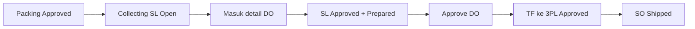

# Delivery Order — Requirement Documentation

**Modul:** SupplyChain / OmniChannel  
**UI:** `/supplychain/delivery-order`  
**SoT:** `_meta/sot/supplychain-delivery-order-source-of-truth.md` v1.0  

Related: [Packing List](../omni-packing-list/requirement.md) · [Skip Processing](../omni-skip-processing/requirement.md) §6.2

---

## 0. Changelog

| Version | Date | Author | Changes |
|---------|------|--------|---------|
| 1.0 | 2026-10-05 | QA - Yemima | E2E Collecting→prepared→3PL on approve; insert SL; GAP-DO-01 shipper A→B |

---

## 1. Ringkasan Eksekutif

DO menutup fulfillment: mengumpulkan order yang sudah **Collecting** lalu, pada **approve**, memindahkan stok ke **gudang 3PL** shipper dan menandai SO **Shipped**.

Dua flow: order **internal** vs **platform**. Live insert **by order**. Campur order OK jika **satu shipper**.

```mermaid
flowchart LR
  Pack[Packing Approved] --> SL[Collecting SL Open]
  SL --> Attach[Masuk detail DO]
  Attach --> Prep[SL Approved + Prepared]
  Prep --> DoAppr[Approve DO]
  DoAppr --> Tpl[TF ke 3PL Approved]
  Tpl --> Ship[SO Shipped]
```

---

## 2. Prasyarat

Lihat SoT §2: Collecting ada; shipper ↔ 3PL; tanggal SO/Collecting tidak lebih baru dari DO; bukan void.

---

## 3. Siklus status

| Objek | Saat attach detail | Saat approve DO |
|-------|--------------------|-----------------|
| Collecting `SL-*` | Open menjadi Approved (jika belum) | — |
| Qty SO | Prepared | Processed |
| TF ke 3PL | Belum (stok masih virtual collect) | Generate + auto-approve |
| SO processing | Shipping | Shipped |

---

## 4. Datalist

Global Search · Advanced Filter · Show deleted · Column show/hide · Export.

Kolom: Trx Code/Date · Sales Order · Platform Order/Status · Shipper/Tracking · Customer/Buyer · Warehouse · Trx Date/Deadline Time (masih di FE, planned hide) · Trx Status · Trx Ref · Created By/At · Action.

---

## 5. Insert detail (live)

| Mode | Aturan |
|------|--------|
| By order | Order punya Collecting; sisa qty |
| By Transfer Internal | List `SL-*` Open **dan** Approved. Open → auto-approve SL. Approved → tidak ubah status; re-insert sisa qty OK |
| By SKU | Ada teknis; **bukan** flow live |

Detail: Trx Code = `SL-*`; Trx Ref = order; Status = status SL.

---

## 6. Approve DO

- Prepared → Processed.  
- TF Collecting → 3PL WH dari **shipper header DO**, auto-approve.  
- Error tanpa binding: `Approval failed because the shipper doesn’t have a 3PL warehouse.`

---

## 7. Contoh kasus

| Case | Expected |
|------|----------|
| Packing approve | `SL-*` Open pack → virtual collect |
| Insert order ke DO | SL Approved; SO Prepared; **belum** ke 3PL |
| Approve DO | TF ke 3PL Approved; SO Shipped |
| SL sudah Approved, sisa qty | Boleh re-insert dari Available to DO |
| Internal + platform, shipper sama | Boleh satu DO |
| Shipper platform A→B **sebelum** insert | Filter Available to DO pakai logistic terbaru (relatif aman) |
| Shipper A→B **setelah** insert | **Tidak** di-handle — GAP-DO-01 bug candidate |

---

## 8. GAP-DO-01 (known gap)

Setelah order sudah di detail DO, perubahan shipper platform **tidak** memindahkan baris / memblok approve / mengganti destinasi 3PL. Approve tetap ke 3PL **header DO**. Belum ada TO-BE enforce (Yemima 2026-10-05).

---

## 9. Acceptance (AS-IS)

- [ ] Collecting dari packing Open; attach meng-approve SL  
- [ ] Approve DO = TF ke 3PL + Shipped  
- [ ] Insert live by order; by TF SL Open/Approved sesuai §5  
- [ ] Satu shipper per DO; campur order boleh  
- [ ] GAP-DO-01 tercatat, belum dianggap fixed  

---

## 10. Non-goals

- Menyatukan Collecting sebagai menu process terpisah di dokumen ini  
- TO-BE auto-rebind shipper setelah prepared (belum diputus)
