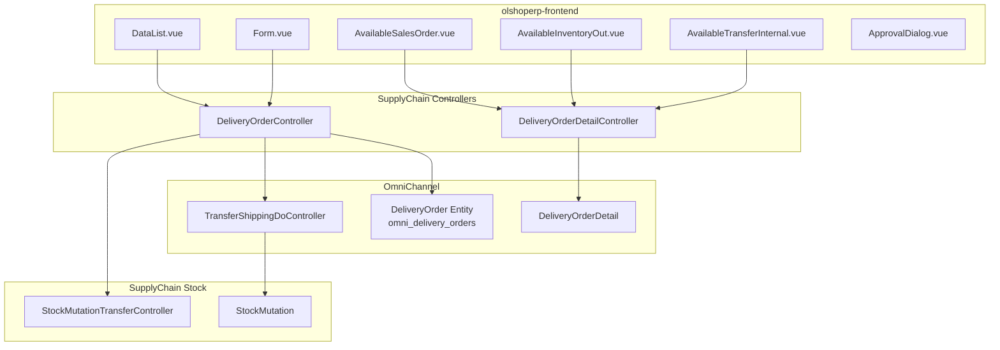

# Delivery Order — Technical Documentation

> **DRAFT** — Dokumen ini adalah draft awal hasil analisis codebase otomatis per 2026-06-19. Perlu direview PM/QA sebelum final.

**Stack:** Laravel 13 API · Vue 3 SPA  
**Primary modules:** `Modules/SupplyChain` (controller/UI) + `Modules/OmniChannel` (entity)  
**Menu slug:** `supplychain-delivery-order`  
**UI route:** `/supplychain/delivery-order`  
**API base:** `{VITE_API_URL}supplychain/delivery-order*`

---

## 1. Architecture Overview

**Catatan:** `Modules\SupplyChain\Entities\DeliveryOrder` extends `Modules\OmniChannel\Entities\DeliveryOrder` (empty subclass untuk policy/scoping SCM).

---

## 2. Frontend File Map

**Root:** `olshoperp-frontend/src/pages/SCM/DeliveryOrder/`

| File | Role | Key API |
|------|------|---------|
| `DataList.vue` | Datalist DO + export | `GET supplychain/delivery-order` |
| `Form.vue` | Create/edit header | `POST/PUT supplychain/delivery-order/{id}` |
| `HeaderBasicInformation.vue` | Tanggal, shipper, AWB, alamat | select2 shipper, customer |
| `AvailableSalesOrder.vue` | Panel SO outstanding | `outstanding-sales-order-group`, `bulk-use-sales-order` |
| `AvailableInventoryOut.vue` | Panel outbound outstanding | `outstanding-outbound-group`, `create-outbound-group` |
| `AvailableTransferInternal.vue` | Panel transfer internal | `outstanding-transfer-internal-group`, `bulk-use-transfer-internal` |
| `DatalistDetail.vue` | Grid detail DO | `delivery-order-detail` resource |
| `AvailableProductDetail.vue` | Detail produk per referensi | show inventory out detail |
| `ApprovalDialog.vue` | Submit approval | `POST delivery-order/{id}/approve` |
| `ApprovalEligibility.vue` | Eligible approvers | `delivery-order/approval-eligibility/{id}` |
| `DatalistLogApproval.vue` | Approval log | `delivery-order/{id}/log/approve` |

### Router (`src/router/index.ts`)

| Route | Component |
|-------|-----------|
| `supplychain/delivery-order` | `DataList.vue` |
| `supplychain/delivery-order/create` | `Form.vue` |
| `supplychain/delivery-order/edit/:id` | `Form.vue` |

---

## 3. Backend File Map

### 3.1 Controllers

| Class | Module | Responsibility |
|-------|--------|----------------|
| `SupplyChain\Http\Controllers\DeliveryOrderController` | SupplyChain | CRUD, approve, export, select2 — **menu SCM** |
| `SupplyChain\Http\Controllers\DeliveryOrderDetailController` | SupplyChain | Detail CRUD, bulk use SO/transfer, outbound group |
| `OmniChannel\Http\Controllers\TransferShippingDoController` | OmniChannel | `generateShippingList()` untuk shipping DO |
| `SupplyChain\Http\Controllers\StockMutationTransferController` | SupplyChain | Auto-approve transfer shipping DO |

### 3.2 Models

| Class | Table | Module |
|-------|-------|--------|
| `OmniChannel\Entities\DeliveryOrder` | `omni_delivery_orders` | Canonical entity |
| `SupplyChain\Entities\DeliveryOrder` | (same) | Subclass untuk SCM policy |
| `OmniChannel\Entities\DeliveryOrderDetail` | `omni_delivery_order_details` | Detail lines |
| `OmniChannel\Entities\DeliveryOrderApproval` | `omni_delivery_order_approvals` | Approval log |
| `SupplyChain\Policies\DeliveryOrderPolicy` | — | Authorization |

### 3.3 Key constants

| Constant | Value | Usage |
|----------|-------|-------|
| `StockMutation::PROCESS_TYPE_SHIPPING` | collecting prerequisite | Validasi sebelum approve |
| `StockMutation::PROCESS_TYPE_SHIPPING_DO` | shipping DO transfer | Dibuat saat approve |

---

## 4. API Routes

**Prefix:** `supplychain` · **File:** `Modules/SupplyChain/Routes/api.php`

| Method | Path | Controller@method |
|--------|------|-------------------|
| GET | `delivery-order` | `DeliveryOrderController@index` |
| POST | `delivery-order` | `DeliveryOrderController@store` |
| GET | `delivery-order/{id}` | `DeliveryOrderController@show` |
| PUT | `delivery-order/{id}` | `DeliveryOrderController@update` |
| DELETE | `delivery-order/{id}` | `DeliveryOrderController@destroy` |
| POST | `delivery-order/{id}/approve` | `DeliveryOrderController@approve` |
| POST | `delivery-order-detail/{do}/create-sales-order-group` | `DeliveryOrderDetailController@storeSalesOrder` |
| POST | `delivery-order-detail/{do}/create-outbound-group` | `DeliveryOrderDetailController@storeInventoryOut` |
| POST | `delivery-order-detail/{do}/create-transfer-internal-group` | `DeliveryOrderDetailController@storeTransferInternal` |
| POST | `delivery-order/{do}/delivery-order-detail/bulk-use-sales-order` | `DeliveryOrderDetailController@bulkUseStoreBySalesOrder` |

---

## 5. Database

### 5.1 `omni_delivery_orders`

| Column | Keterangan |
|--------|------------|
| `code` | Prefix `DO` |
| `transaction_status` | draft → open → approved |
| `shipper_id` | FK Company (shipper) |
| `customer_id`, `customer_type` | Polymorphic customer (dari detail SO) |
| `awb`, `buyer_name`, `vehicle_information` | Info pengiriman |

### 5.2 `omni_delivery_order_details`

| Column | Keterangan |
|--------|------------|
| `delivery_order_id` | FK header |
| `sales_order_detail_id` | Referensi SO (opsional) |
| `outbound_mutation_detail_id` | Referensi outbound (opsional) |
| `delivery_order_quantity_in_base_unit` | Qty kirim |

### 5.3 Approve side-effects

| Target | Field updated |
|--------|---------------|
| `omni_sales_order_details` | `processed_to_do_quantity`, `prepared_to_do_quantity` |
| `scm_outbound_mutation_details` | `processed_to_do_quantity`, `prepared_to_do_quantity` |
| `scm_stock_mutations` | New row `process_type = shipping_do` |

---

## 6. Approve flow (code reference)

`DeliveryOrderController::approveDeliveryOrder()`:

1. `$delivery_order->approve($request)`
2. Loop details — validate SO date & collecting
3. Increment/decrement qty counters
4. `TransferShippingDoController::generateShippingList($transfer_mutation_shipp, delivery_order: $delivery_order)`
5. `StockMutationTransferController::approve()` on `PROCESS_TYPE_SHIPPING_DO` mutation

Lock: `Cache::lock('approve_delivery_order_lock_{id}', 15)`.

---

## 7. Related OmniChannel routes

Route group `OmniChannel/Routes/api.php` juga punya `DeliveryOrderController` (modul Omni) — digunakan untuk integrasi lain. Menu SCM memakai controller SupplyChain di atas.

---

## 8. Relasi Failed Ship — Collecting & Shipped 3PL

Delivery Order adalah **titik akhir rantai fulfillment fisik** sebelum Failed Ship atau Settlement.

### 8.1 Dua TF kritis di DO

| Tahap | `process_type` | Prefix | Status | Pergerakan stok |
|-------|----------------|--------|--------|-----------------|
| **Collecting** | `shipping` | **SL** | **open** (masuk detail DO) | virtual Packing → virtual Collected |
| **Shipped DO** | `shipping do` | **TFI** | approved saat DO approve | virtual Collected → **WH 3PL** (shipper) |

Approve DO (`DeliveryOrderController::approve`):

1. Validasi collecting (`PROCESS_TYPE_SHIPPING`) ada untuk detail SO
2. `TransferShippingDoController::generateShippingList()` — buat/update TFI shipping do
3. `StockMutationTransferController::approve()` pada mutation `shipping do`
4. `DeliveryOrderProcessTrait` — set SO processing status **Shipped**

### 8.2 Kaitan ke Failed Ship

| Kondisi | Menu berikutnya |
|---------|-----------------|
| Shipped 3PL, **belum** SI & Outbound | [Failed Ship](../supplychain-failed-ship/requirement.md) |
| Shipped 3PL, sudah settlement | [Sales Return](../accounting-sales-return/README.md) |

**Outstanding FS** mencari TF `shipping do` approved dengan `warehouse_destination` = shipper FS (`FailedShipController@useSo`, `FailedShipDetailController` outstanding).

**Stok FS approve** keluar dari WH 3PL yang sama (shipper DO) — bukan undo DO/collecting.

### 8.3 Rantai menu lengkap

[Picking](../omni-picking-process/requirement.md) → [Checking](../omni-checking-process/requirement.md) → [Packing](../omni-packing-process/requirement.md) → **Collecting (SL)** → **DO + shipping do** → [Failed Ship](../supplychain-failed-ship/technical.md#11-cross-menu--pergerakan-stok--dokumen-terkait)

Audit semua TF: [Transfer Internal §8](../supplychain-mutation-transfer-internal/technical.md#8-relasi-failed-ship--rantai-fulfillment)

---
