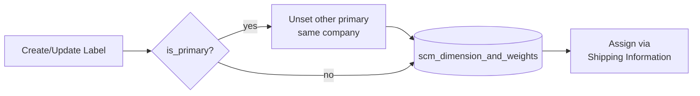
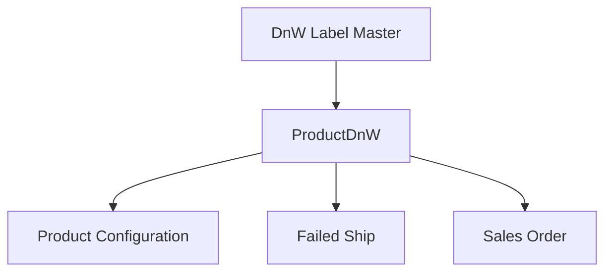

# Dimension and Weight Label — Requirement Detail

> **DRAFT** — Dokumen ini adalah draft awal hasil analisis codebase otomatis per 2026-06-19. Perlu direview PM/QA sebelum final.

**Modul:** SupplyChain  
**Status:** AS-IS

---

## Daftar Isi

1. [Fungsi & Tujuan](#1-fungsi--tujuan)
2. [How It Works](#2-how-it-works)
3. [Validasi yang Berjalan](#3-validasi-yang-berjalan)
4. [Relasi Menu Lain](#4-relasi-menu-lain)
5. [FAQ](#5-faq)
6. [Known Gaps](#6-known-gaps)

---

## 1. Fungsi & Tujuan

### Apa itu?

Master label kemasan (`scm_dimension_and_weights`) plus assignment ukuran per produk (`scm_product_dn_ws` via `ProductDnWController`).

### Masalah yang diselesaikan

| Kebutuhan | Solusi |
|-----------|--------|
| Standar profil kemasan | Master label + flag primary |
| Ukuran per SKU/unit | ProductDnW rows |
| Integrasi shipping & failed ship | Shared DnW data |

### Entitas

| Entitas | Tabel |
|---------|-------|
| DimensionAndWeight | `scm_dimension_and_weights` |
| ProductDnW | `scm_product_dn_ws` |

---

## 2. How It Works

### 2.1 Master label CRUD

### 2.2 Product assignment

1. `POST product/{id}/shipping-information` (juga via general/inventory configuration).
2. `ProductDnWController@store` — upsert rows per unit/label.
3. Auto-set cm/gr units; manage default flags; propagate ke variant children.
4. Hapus baris yang tidak lagi dikirim.

### 2.3 Primary logic

- Saat create/update dengan `is_primary = true`: semua label primary lain di-set 0.
- Delete/update primary diblokir jika masih satu-satunya primary atau masih direferensi.

---

## 3. Validasi yang Berjalan

### Master label (DimensionAndWeightController)

| Field | Rule |
|-------|------|
| `code` | Required, max 50, unique per company |
| `name` | Required, max 50 (**tidak unique**) |
| `description` | Max 150 |
| `is_primary` | Nullable string `'true'`/`'false'` |
| `status` / `is_all_company` | String boolean parsing |

### Product DnW (ProductDnWController via shipping-information)

| Field | Rule |
|-------|------|
| `dimension_and_weight_id.*` | Required |
| `length/width/height/weight.*` | Required, min 1 |
| `insurance_type` | Required (shipping controller) |
| Duplicate unit+label | Rejected di shipping controller |

---

## 4. Relasi Menu Lain

| Menu | Relasi |
|------|--------|
| Product General/Inventory Configuration | shipping-information, select2 |
| Failed Ship | Weight/dimension calculation |
| System Product | Legacy shipping routes |

---

## 5. FAQ

**Q: Kenapa UI route beda dengan API?**  
A: UI `/dimension-and-weight-label`, API resource `/dimension-and-weight`.

**Q: Apakah ProductDnW punya menu sendiri?**  
A: Tidak — hanya sub-panel di form produk.

---

## 6. Known Gaps

- UI slug ≠ API slug.
- `name` tidak unique pada master.
- `ProductDnWController` tidak exposed sebagai resource route standalone.
- Migration legacy: duplicate `product_alternative_unit_id` column definition.
- `generateTotalDimension` helper di controller — dipakai modul lain, bukan route menu ini.

---

## Related Documents

| Doc | Path |
|-----|------|
| Knowledge Base | [knowledge-base.md](./knowledge-base.md) |
| Technical | [technical.md](./technical.md) |
