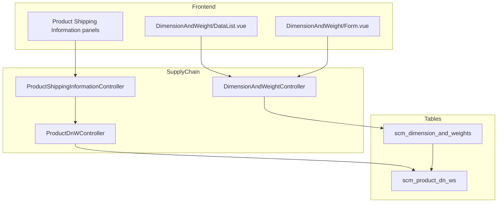

# Dimension and Weight Label — Technical Documentation

> **DRAFT** — Dokumen ini adalah draft awal hasil analisis codebase otomatis per 2026-06-19. Perlu direview PM/QA sebelum final.

**Menu slug:** `supplychain-dimension-and-weight-label`  
**UI route:** `/supplychain/dimension-and-weight-label`  
**API base:** `{VITE_API_URL}supplychain/dimension-and-weight*`

---

## 1. Architecture Overview

---

## 2. Frontend File Map

**Root:** `olshoperp-frontend/src/pages/SCM/master/DimensionAndWeight/`

| File | Role |
|------|------|
| `DataList.vue` | Master label datalist |
| `Form.vue` | Create/edit label |

Product DnW assignment: embedded in Product General/Inventory Configuration shipping panels (no standalone page).

| Route | Component |
|-------|-----------|
| `supplychain/dimension-and-weight-label` | `DataList.vue` |
| `supplychain/dimension-and-weight-label/create` | `Form.vue` |
| `supplychain/dimension-and-weight-label/edit/:id` | `Form.vue` |

---

## 3. Controllers

| Class | Path | Role |
|-------|------|------|
| `DimensionAndWeightController` | `Modules/SupplyChain/Http/Controllers/DimensionAndWeightController.php` | Master CRUD, audit, select2, primary logic |
| `ProductDnWController` | `Modules/SupplyChain/Http/Controllers/ProductDnWController.php` | Product assignment (internal) |
| `ProductShippingInformationController` | `.../ProductShippingInformationController.php` | HTTP entry for shipping-information |

---

## 4. Model / Entity

| Class | Table |
|-------|-------|
| `DimensionAndWeight` | `scm_dimension_and_weights` |
| `ProductDnW` | `scm_product_dn_ws` |

**Master columns:** `code`, `name`, `description`, `is_primary`, `status`, `is_all_company`.

**ProductDnW columns:** `product_id`, `product_alternative_unit_id`, `dimension_and_weight_id`, `length`, `width`, `height`, `weight`, unit FKs, default flags.

`DimensionAndWeight::relations()` blocks delete if `ProductDnW` exists.

---

## 5. DB Tables

| Table | Purpose |
|-------|---------|
| `scm_dimension_and_weights` | Master labels |
| `scm_product_dn_ws` | Per-product dimensions |

---

## 6. API Routes

### Master resource

| Method | URI |
|--------|-----|
| GET/POST/GET/PUT/DELETE | `dimension-and-weight` |
| GET | `dimension-and-weight/{id}/audit` |

### Select2 (proxied)

| URI | Notes |
|-----|-------|
| `product/select2-dimension-and-weight` | Active labels |
| `product-general-configuration/select2-dimension-and-weight` | |
| `product-inventory-configuration/select2-dimension-and-weight` | |

### Product assignment

| Method | URI |
|--------|-----|
| POST/GET | `product/{product}/shipping-information` |
| POST/GET | `product-general-configuration/{product}/shipping-information` |
| POST/GET | `product-inventory-configuration/{product}/shipping-information` |

---

## 7. Policy

| Class | Abilities |
|-------|-----------|
| `DimensionAndWeightPolicy` | `viewAny`, `view`, `create`, `update`, `delete` |
| Product shipping | Product update policy via shipping controller |

---

## Related Documents

| Doc | Path |
|-----|------|
| Knowledge Base | [knowledge-base.md](./knowledge-base.md) |
| Requirement | [requirement.md](./requirement.md) |
