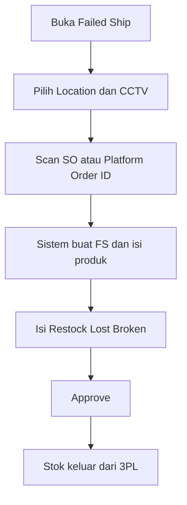

# Failed Ship — Knowledge Base

Panduan operator untuk menu **Failed Ship** — menangani paket COD gagal setelah order **Shipped** (barang sudah di gudang 3PL) tetapi **belum settlement**.

---

## 1. Kapan Pakai Failed Ship?

| Situasi | Menu |
|---------|------|
| Buyer tolak/tidak terima, order sudah Shipped, **belum** ada invoice/outbound | **Failed Ship** |
| Buyer retur setelah order **sudah settlement** | **Sales Return** |

**Jangan** proses Failed Ship jika order sudah punya **Sales Invoice** atau **Outbound** — termasuk yang masih **belum di-approve** (status open/draft). Sistem akan menolak scan dengan pesan *already been settled*. Gunakan **Sales Return** untuk order yang sudah settlement.

### Invoice / Outbound belum di-approve

Jika order punya Sales Invoice atau Outbound yang masih open:
- Order **tidak boleh** dijalankan lewat Failed Ship (scan ditolak).
- Di menu lain (mis. platform return table) referensi invoice/outbound bisa **tampil** sebagai informasi, tapi bukan berarti eligible Failed Ship.

---

## 2. Glosarium

| Istilah | Arti |
|---------|------|
| **FS** | Failed Ship — dokumen penyesuaian stok pasca gagal kirim |
| **Shipper / Shipper Name** | Gudang 3PL tempat paket terakhir (asal stok FS) |
| **Location** | Gudang Level 20 tujuan **restock** (rak tanpa sub-gudang) |
| **Restock Qty** | Barang kembali fisik → dipindah ke Location |
| **Lost Qty** | Barang hilang → Stock Deduction (Return Expense) |
| **Scrap / Defect / Broken Qty** | Barang rusak → dipindah ke gudang scrap (dari Setting Warehouse) |
| **Total FS Qty** | Restock + Lost + Scrap (tidak boleh lebih dari Product Qty) |
| **Prepared** | Qty sudah masuk FS, belum approve |
| **Processed** | Qty sudah di-approve FS |
| **Outstanding** | Order/produk Shipped yang belum masuk detail FS |

---

## 3. Alur Kerja Standar

Cara utama di produksi: scan order di halaman index, isi qty kondisi, lalu approve.

**Keterangan langkah:**

- **Location** harus Level 20 tanpa sub-gudang; pastikan sudah ada setup scrap di Warehouse Setting kalau ada qty Broken.
- Scan menggantikan field "Select Order" di dokumen requirement bisnis — fungsinya sama.
- Setelah approve: Restock ke Location, Lost jadi Stock Deduction, Broken ke gudang scrap.
- Pantangan: jangan scan order yang sudah punya invoice/outbound; jangan settlement saat FS masih Open.

### 3.2 Via Form Manual (layout V1 — jika diaktifkan)

1. **Create** → isi Basic Information (Location, Shipper Name, Transaction Date; kode boleh kosong untuk auto FS).
2. **Save & Next**.
3. Section **Shipped Sales Order** — pilih produk/order → **Use**.
4. Section **Failed Ship Detail** — edit inline Restock / Lost / Defect.
5. **Approve**.

### 3.3 Set Location (UI checking-style)

Jika form meminta lokasi CCTV:
1. Buka **Set Location** atau flow set-location.
2. Pilih lokasi processing → status draft berubah **open**.

---

## 4. Tombol & Fungsi UI

### 4.1 Halaman Index (Datalist)

| Tombol / Elemen | Fungsi |
|-----------------|--------|
| **Create** | Buat FS baru (form manual) |
| **Warehouse Location** | Pilih gudang tujuan restock sebelum scan |
| **CCTV Location** | Pilih lokasi CCTV proses |
| **Scan / input SO** | Cari order by kode internal atau platform → auto-create FS |
| **Export** (panel slider) | Download data FS — pilih **With Details** atau **Without Details** |
| **Filter** (SearchBuilder) | Filter kolom datalist |
| **FS Status** (klik pada baris) | Buka detail FS jika sudah ada dokumen |
| **Sales Platform Returns** (pill) | Tabel return API marketplace untuk order **belum outbound** — kandidat arah Failed Ship, bukan Sales Return |

> Pill ini **berbeda** dengan section Platform di menu **Sales Return**: di Sales Return hanya tampil return yang order-nya **sudah full outbound**.

### 4.2 Form — Basic Information

| Tombol | Fungsi |
|--------|--------|
| **Save & Next** | Simpan header baru, lanjut ke section berikutnya |
| **Save All** | Simpan perubahan header (draft/open) |
| **Draft / Open** | Ubah status transaksi header |

### 4.3 Section Shipped Sales Order (Outstanding)

| Tombol | Fungsi |
|--------|--------|
| **Group by Product / Group by Order** | Ganti tampilan datalist outstanding |
| **Use** (per baris) | Masukkan produk/order ke Failed Ship Detail |

### 4.4 Section Failed Ship Detail

| Tombol / Kolom | Fungsi |
|----------------|--------|
| **Restock Qty** (inline) | Qty yang akan dikembalikan ke Location |
| **Lost Items** (inline) | Qty hilang — stok berkurang (Return Expense) |
| **Defect/Broken Items** (inline) | Qty rusak — pindah ke gudang scrap |
| **Total FS Qty** | Hitung otomatis — harus tidak melebihi Product Qty |
| **Delete** (action) | Hapus baris dari detail → kembali ke outstanding |
| **Group by Product / Order** | Toggle tampilan detail |

### 4.5 Approval & Sidebar

| Tombol | Fungsi |
|--------|--------|
| **Approve** | Setujui FS — generate perpindahan stok & dokumen turunan |
| **Approval** (menu sidebar) | Lihat riwayat approval |
| **Audit Log** | Lihat log perubahan field |
| **Print Detail** | Cetak detail FS |
| **Void Doc** | Void dokumen (jika permission & status mengizinkan) |
| **Close Doc** | Tutup dokumen |
| **Pause** | Jeda proses + wajib isi alasan |
| **Resume** | Lanjutkan proses setelah pause |

---

## 5. Validasi yang Sering Ditemui

| Pesan | Penyebab | Solusi |
|-------|----------|--------|
| Already been settled | Order punya invoice/outbound (termasuk open/draft) | Pakai **Sales Return** |
| Not eligible / not Shipped | Order belum lewat checking–packing–DO–3PL | Selesaikan fulfillment dulu |
| Location has no scrap setup | WH Location belum punya scrap di Warehouse Setting | Setting → Warehouse Scrap & Void |
| Delivery order not approved | DO belum approve | Approve DO |
| FS date lebih awal dari DO | Tanggal FS lebih awal dari DO | Sesuaikan transaction date |
| Quantity cannot be greater than sales order quantity | Total FS lebih dari Product Qty | Kurangi Restock/Lost/Scrap |
| Cannot settle - failed shipment status | Upload settlement saat FS masih **open** | Approve atau hapus FS dulu |
| Shipper field required | Header belum pilih 3PL | Pilih Shipper Name |

---

## 6. Dampak ke Settlement & Sales Return

### Settlement

| Kondisi FS | Dampak |
|------------|--------|
| FS **open** (belum approve) | Upload settlement **gagal total** |
| FS **approved** | Invoice & outbound per produk pakai **qty sisa** setelah FS |

### Sales Return (setelah settled)

- Return hanya bisa jika order sudah punya **outbound**.
- Qty return **maksimal = qty outbound** per produk (bukan qty order penuh jika pernah FS).
- Contoh: order 10, FS 3, outbound 7 → max return 7.

**Tips:** Approve Failed Ship **sebelum** settlement agar qty net match kondisi fisik.

### Rantai menu sebelum Failed Ship

Stok order bergerak lewat **Picking → Checking → Packing → Collecting → Delivery Order → Shipped (3PL)**. Semua perpindahan tercatat sebagai Transfer Internal — lihat menu **Transfer Internal** dengan opsi **Show Virtual** untuk audit trail.

Setelah di 3PL, baru eligible Failed Ship. Detail: [requirement §3.6](./requirement.md#36-peta-relasi-menu-fulfillment--failed-ship--settlement).

---

## 7. Melihat Status di Sales Order

Di detail Sales Order, kolom **Failed Ship Status** menampilkan **Prepared** / **Processed** berdasarkan qty yang sudah masuk Failed Ship (belum / sudah approve) — bukan flag terpisah.

---

## 8. Export Data

1. Di index Failed Ship, buka panel **Export**.
2. Pilih:
   - **With Details** — per produk (termasuk Restock, Lost, Defect)
   - **Without Details** — per order/header saja
3. Tunggu job selesai → download dari daftar file export.

**Import:** belum tersedia. Hanya **Export** yang ada.

---

## 9. Troubleshooting

| Gejala | Penyebab | Solusi |
|--------|----------|--------|
| Order tidak muncul di index | Belum Shipped atau sudah settled | Cek processing status & status invoice/outbound di SO |
| Order tampil di index tapi scan ditolak | Multi-SKU: sebagian baris sudah settled | Proses via Sales Return untuk baris settled; known UX gap |
| Tidak bisa ubah Shipper | Sudah ada detail FS | Hapus detail atau buat FS baru |
| Export stuck | Job masih jalan / timeout | Tunggu atau cek progress export |
| Scrap tidak ter-generate saat approve | Scrap WH belum dikonfigurasi | Cek Warehouse Setting parent Location |
| Dua tampilan form berbeda | Ada 2 versi UI | UI aktif: index scan + form checking; layout section ada di V1 |

---

## 10. Do's and Don'ts

### Do

- Pilih Location yang sudah punya **scrap setup** di Warehouse Setting
- Isi Shipper untuk memudahkan filter datalist
- Cek Total FS Qty sebelum approve
- Proses FS **sebelum** settlement jika order gagal kirim

### Don't

- Jangan FS order yang sudah settled
- Jangan FS order void / belum Shipped
- Jangan upload settlement saat masih ada FS **open**
- Jangan asumsikan Lost/Scrap asalnya bukan dari 3PL — semua dari shipper

---

## Related Documents

| Doc | Path |
|-----|------|
| User Guide | [user-guide.md](./user-guide.md) |
| Requirement | [requirement.md](./requirement.md) |
| Technical | [technical.md](./technical.md) |
| Instant Settlement | [accounting-settlement-upload/knowledge-base.md](../accounting-settlement-upload/knowledge-base.md) |
